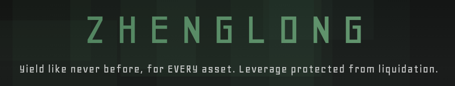

[](https://www.zhenglong.finance/)

# Build status

### bao-minter

[](https://github.com/baofinance/bao-minter/actions/workflows/test.yml)

### bao-base

[](https://github.com/baofinance/bao-base/actions/workflows/test.yml)

# Introduction

Zhenglong is a system of contracts that pegs a given token to the value of some underlying asset, e.g. USD or anything that has a price feed
These pegged tokens are minted in exchange for a capital efficient amount of collateral tokens.
In addition, there are leveraged tokens whose total value is the difference in the value of the collateral and the pegged tokens.
Pegged tokens and Leveraged tokens can be both minted and redeemed by users.
The system maintains the pegging by varying the price of the leveraged token such that the pegged value equals the underlying asset's price.
This works perfectly while the value of the collateral held doesn't drop below the value of all the minted pegged tokens.
A healthy collateral ratio is maintained through four mechanisms some of which operate throughout the collateral ratio spectrum and others kick in when collateral ratio levels are tending downward.

## Stability mechanisms

### Incentives

Fees and discounts can be set for each of minting/redeeming actions of pegged/leveraged tokens. It is expected, but not enforced, that fees increase for an action if that action tends to decrease collateral ratio and vica versa. Collateral ratio increasing actions minting leveraged tokens and redeeming pegged tokens and collateral ratio decreasing actions are redeeming leveraged tokens and minting pegged tokens.

Certain actions are incentivised and some deincentivised by a fee set-up that allows up to 8 fee levels per action.

Fees can also be negative and this is interpreted as a kind of discount where you get more in returne for what you pay for. Discounts are funded by the reserve pool and when that empties discounts no longer apply.

If fees are set to 100%, this is interpreted as "disallowed" in that if your mint/redeem would result in a collateral ratio that is "disallowed" the you get to mint/redeem only up to that level.

Fees can be queried up front by so-called dry-run view functions, answering the question: What fees/discounts will I be charged/receive if I were to carry out this action. Obviously this is only true for the instant the dry-run function is called and if someone else moves the collateral ratio enough you may not get the result in reality.

#### Withdrawal requests (StabilityPool)

- Requesting: `requestWithdrawal()` creates an account window with `start = now + WITHDRAWAL_START_DELAY` and `end = start + WITHDRAWAL_END_WINDOW` (window period).
- Withdrawing:
  - Before start: allowed, early-withdrawal fee applies.
  - During the window [start, end]: allowed, no fee.
  - After end: allowed, early-withdrawal fee applies.
- A successful withdraw clears the request immediately (both `start` and `end` set to `0`).
- Depositing during an active window cancels the request (both `start` and `end` set to `0`).
- Configuration:
  - `earlyWithdrawalFee` (scaled by 1e18, e.g., `0.025 ether` = 2.5%; must be <= 1e18)
  - `feeAddress` (recipient of early-withdrawal fees)
  - `withdrawalStartDelay` (seconds; may be 0; recommended <= 1 week)
  - `withdrawalEndWindow` (seconds; must be > 0; recommended <= 1 week; example/default: `86400` for 1 day)
  - Implementation detail: these four values are internally packed into two storage slots for gas efficiency (no ABI change).

#### Fee exemption (StabilityPool)

- Addresses granted the `EXEMPT_WITHDRAWAL_FEE_ROLE` are exempt from early-withdrawal fees when withdrawing outside the request window.
- This is intended for whitelisted contracts (e.g. treasury, ops) or EOAs as needed.
- Role management (owner-only):

```solidity
// Grant exemption
IBaoRoles(stabilityPool).grantRoles(account, StabilityPool_v1.EXEMPT_WITHDRAWAL_FEE_ROLE());

// Revoke exemption
IBaoRoles(stabilityPool).revokeRoles(account, StabilityPool_v1.EXEMPT_WITHDRAWAL_FEE_ROLE());
```

### Rebalancing

Rebalancing is when collateral ratio reaches a certain level, configurable in the StabilityPoolManager. Anyone can call the rebalance() function there and receive a bounty for doing so. If the collateral ratio of the system is not below the configured threshold, no rebalancing is performed.

When a rebalance occurs, pegged tokens that have been deposited in one of the stability pools will be converted back to collateral and that collateral is available for depositors to claim. By removing pegged tokens from the system we will increase the collateral ratio to above the threshold for rebalancing. Further rebalancing operations can be performed if the threshold is breached again.

There are currently two stability pools per pegged token / collateral token pair, one, as described above, that rebalances into collaterral tokens and the other that rebalances into leveraged tokens. Both reduce the supply of pegged tokens and so increase collateral ratio.

Rebalancing is performed on the stability pools in proportion to the amount of pegged tokens they hold.

The rebalance-to-leverage pool needs to rebalance fewer pegged tokens to reach threshold again because these tokens continue to have their own collateral backing the system.

### Pausing of certain user actions

User actions can be paused.

All contracts involved are in the system are upgradeable using the UUPS proxy pattern. This allows pausing a contract to be done by "upgrading" to a dumb contract whose ownership is help on the implementation, not the proxy, and so does not affect any of the data held by the proxy. This dumb contract responds to all calls with a message that the action is paused, with the exception of the upgradeToAndCall function which only the owner of the contract can call.

This provides a pause mechanism with out burdening the caller of each function with the gas cost of looking up whether the function is paused or not.

Unpausing becomes another "upgrade" to the original contract. Both "upgrades" are simple and cheap single transactions, on a par with calling a pause() function on the contract.

This provides a gas efficient and general pause mechanism for all UUPS upgradeable contracts.

### Reserve pool

Provides discounts for collateral ration beneficial user actions.
The reserve pool is funded by a portion of the fees collected, and can be filled by other mechanisms, e.g. simply transferring the collateral token to it.

## Pegged Tokens, or zheTokens

Pegged tokens can be any ERC20 token and can be minted by other means not just by Zhenglong. Pegged tokens can therefore be minted by some other means and redeemed in Zhenglong, or in a Zhenglong on another chain.
The Minter contract maintains a count of how many have been minted and redeemed by the Minter contract itself and ensures that no more are redeemed than are minted by the Minter contract itself.

## Leveraged Tokens, or steamedTokens

Leveraged tokens operate on a one-to-one basis with the Minter contract. Only the Minter contract can mint them and redeem them.
Leverage token's value is derived from the difference between the value of collateral and the value of the total number of pegged tokens minted by the Minter contract and not redeemed.
Because of this the value of a leveraged token changes as the value of the collateral changes - by the price of the collateral changing.
Minting or redeeming pegged or leveraged tokens makes no difference to the price of the leveraged token as each mint/redeem increases/decreases the total amount of collateral such that the value of the leveraged token is unaffected.
Leveraged tokens act as a leveraged long collateral position.
Leveraged token's value drops to zero when the value of the collateral held equals the total value of the pegged tokend minted but not redeemed by the Minter contract.

# Development

## Tooling

- Foundry installation and usage is [here](https://book.getfoundry.sh/)
- Python dependencies are managed by uv, installation and usage is [here](https://docs.astral.sh/uv/getting-started/installation/)

## Usage

This project uses both node and python dependencies

```sh
$ yarn
$ uv sync
```

Then you can either:

- activate the python virtual environment by

  ```sh
  $ source .venv/bin/activate
  ```

  and everything works as you'd expect, or

- prefix all the commands that need a vyper compiler
  ```sh
  $ uv run [commmand needing vyper]
  ```
  If you use vscode and have the microsoft python extension installed it activates in the termainal automatically

Then add a good definition of <code>MAINNET_RPC_URL</code> to your <code>.env</code> and call

```sh
$ yarn test
```

which builds and tests the code.

There are other yarn scripts for running linters, formatters, coverage, gas, contract sizes, etc: check the scripts in <code>package.json</code>

You can also run

```sh
$ yarn CI
```

which runs all the scripts. It actually runs the github actions locally under docker.

```sh
$ yarn deploy:local
```

which deploys the **Zhenglong** contracts, correctly connected up, on a local anvil instance.

Also note that config files for [wake](https://ackee.xyz/wake/docs/4.11.0/) are provided.

### Regression test artifacts

Note that some "yarn test" artifacts:

- the code-coverage report
- the contract sizes
- the gas reports
- generated graphs

are stored in git in the <code>regression</code> folder. This provides a simple, albeit crude and pedantic, mechanism to check for regressions in coverage, gas usage and model values.
