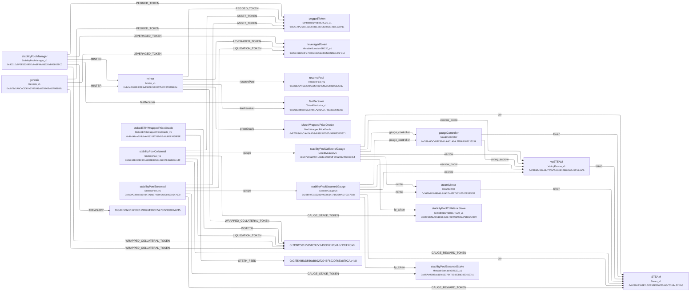

```mermaid
---
config:
  layout: elk
---
flowchart LR
    0x1c3cA001BfD389a155682122057faDC870B0Bb0c["minter<br/><small>Minter_v1<br/>0x1c3cA001BfD389a155682122057faDC870B0Bb0c</small>"]
    0x40310c9F0E822697Dd9e6F44d88528aB93b529C0["stabilityPoolManager<br/><small>StabilityPoolManager_v1<br/>0x40310c9F0E822697Dd9e6F44d88528aB93b529C0</small>"]
    0xeA778A25b818EE9346E250Eb3f81b1439E23d711["peggedToken<br/><small>MintableBurnableERC20_v1<br/>0xeA778A25b818EE9346E250Eb3f81b1439E23d711</small>"]
    0xdC14b6DB8F77ea6C4B3Cc7399fE82Db013f6F012["leveragedToken<br/><small>MintableBurnableERC20_v1<br/>0xdC14b6DB8F77ea6C4B3Cc7399fE82Db013f6F012</small>"]
    0x02990E399E2c3EB3EE526722046C031fbc5Cf0b6["STEAM<br/><small>Steam_v1<br/>0x02990E399E2c3EB3EE526722046C031fbc5Cf0b6</small>"]
    0xF518E453A48d7209C5614f61E8B400A43E3db6C9["veSTEAM<br/><small>VotingEscrow_v1<br/>0xF518E453A48d7209C5614f61E8B400A43E3db6C9</small>"]
    0x9b4A8ceE08bbA4B8183776745Ba5d6D6206f9f3F["stakedETHWrappedPriceOracle<br/><small>StakedETHWrappedPriceOracle_v1<br/>0x9b4A8ceE08bbA4B8183776745Ba5d6D6206f9f3F</small>"]
    0x331c36A45306c9A63f9A004Df82eD83665825017["reservePool<br/><small>ReservePool_v1<br/>0x331c36A45306c9A63f9A004Df82eD83665825017</small>"]
    0x921634fd898582c7e51A2e2A5F7b93328394a408["feeReceiver<br/><small>TokenDistributor_v1<br/>0x921634fd898582c7e51A2e2A5F7b93328394a408</small>"]
    0xdb71d1A0CACD62e37dB898a8E5f005a02F9B885b["genesis<br/><small>Genesis_v1<br/>0xdb71d1A0CACD62e37dB898a8E5f005a02F9B885b</small>"]
    0xE72B348bCA4DAAD3d8886342557d581B50Bf3971["MockWrappedPriceOracle<br/><small>MockWrappedPriceOracle<br/>0xE72B348bCA4DAAD3d8886342557d581B50Bf3971</small>"]
    0xf386d6DCd8FC8941d6A01A64c2f268A082C1533A["gaugeController<br/><small>GaugeController<br/>0xf386d6DCd8FC8941d6A01A64c2f268A082C1533A</small>"]
    0x5676d41849868c68A2f7cd51746317202E851EfB["steamMinter<br/><small>SteamMinter<br/>0x5676d41849868c68A2f7cd51746317202E851EfB</small>"]
    0x349688fEA9C1D3631ce7ec493B986a2ABC64A9e9["stabilityPoolCollateralStake<br/><small>MintableBurnableERC20_v1<br/>0x349688fEA9C1D3631ce7ec493B986a2ABC64A9e9</small>"]
    0xD87De02c97F1eBd372d001fF5FD280709B0c5454["stabilityPoolCollateralGauge<br/><small>LiquidityGaugeV6<br/>0xD87De02c97F1eBd372d001fF5FD280709B0c5454</small>"]
    0xd131B84Df8194Aa18BB3D5044bE976362b0Bc14F["stabilityPoolCollateral<br/><small>StabilityPool_v1<br/>0xd131B84Df8194Aa18BB3D5044bE976362b0Bc14F</small>"]
    0xdf5Ae966f5ac119c53378473E430Dd34304107c1["stabilityPoolSteamedStake<br/><small>MintableBurnableERC20_v1<br/>0xdf5Ae966f5ac119c53378473E430Dd34304107c1</small>"]
    0x23b9efEC6328249538614171626feAf27031791b["stabilityPoolSteamedGauge<br/><small>LiquidityGaugeV6<br/>0x23b9efEC6328249538614171626feAf27031791b</small>"]
    0x4cDA739ae3b19347ADa57990eE6d0eb53A547600["stabilityPoolSteamed<br/><small>StabilityPool_v1<br/>0x4cDA739ae3b19347ADa57990eE6d0eb53A547600</small>"]
    0x1c3cA001BfD389a155682122057faDC870B0Bb0c -->|LEVERAGED_TOKEN| 0xdC14b6DB8F77ea6C4B3Cc7399fE82Db013f6F012
    0x1c3cA001BfD389a155682122057faDC870B0Bb0c -->|PEGGED_TOKEN| 0xeA778A25b818EE9346E250Eb3f81b1439E23d711
    0x1c3cA001BfD389a155682122057faDC870B0Bb0c -->|WRAPPED_COLLATERAL_TOKEN| 0x7f39C581F595B53c5cb19bD0b3f8dA6c935E2Ca0
    0x1c3cA001BfD389a155682122057faDC870B0Bb0c -->|feeReceiver| 0x921634fd898582c7e51A2e2A5F7b93328394a408
    0x1c3cA001BfD389a155682122057faDC870B0Bb0c -->|priceOracle| 0xE72B348bCA4DAAD3d8886342557d581B50Bf3971
    0x1c3cA001BfD389a155682122057faDC870B0Bb0c -->|reservePool| 0x331c36A45306c9A63f9A004Df82eD83665825017
    0x40310c9F0E822697Dd9e6F44d88528aB93b529C0 -->|LEVERAGED_TOKEN| 0xdC14b6DB8F77ea6C4B3Cc7399fE82Db013f6F012
    0x40310c9F0E822697Dd9e6F44d88528aB93b529C0 -->|MINTER| 0x1c3cA001BfD389a155682122057faDC870B0Bb0c
    0x40310c9F0E822697Dd9e6F44d88528aB93b529C0 -->|PEGGED_TOKEN| 0xeA778A25b818EE9346E250Eb3f81b1439E23d711
    0x40310c9F0E822697Dd9e6F44d88528aB93b529C0 -->|TREASURY| 0x3dFc49e5112005179Da613BdE5973229082dAc35
    0x40310c9F0E822697Dd9e6F44d88528aB93b529C0 -->|WRAPPED_COLLATERAL_TOKEN| 0x7f39C581F595B53c5cb19bD0b3f8dA6c935E2Ca0
    0x40310c9F0E822697Dd9e6F44d88528aB93b529C0 -->|feeReceiver| 0x921634fd898582c7e51A2e2A5F7b93328394a408
    0xF518E453A48d7209C5614f61E8B400A43E3db6C9 -->|token| 0x02990E399E2c3EB3EE526722046C031fbc5Cf0b6
    0x9b4A8ceE08bbA4B8183776745Ba5d6D6206f9f3F -->|STETH_FEED| 0xCfE54B5cD566aB89272946F602D76Ea879CAb4a8
    0x9b4A8ceE08bbA4B8183776745Ba5d6D6206f9f3F -->|WSTETH| 0x7f39C581F595B53c5cb19bD0b3f8dA6c935E2Ca0
    0xdb71d1A0CACD62e37dB898a8E5f005a02F9B885b -->|LEVERAGED_TOKEN| 0xdC14b6DB8F77ea6C4B3Cc7399fE82Db013f6F012
    0xdb71d1A0CACD62e37dB898a8E5f005a02F9B885b -->|MINTER| 0x1c3cA001BfD389a155682122057faDC870B0Bb0c
    0xdb71d1A0CACD62e37dB898a8E5f005a02F9B885b -->|PEGGED_TOKEN| 0xeA778A25b818EE9346E250Eb3f81b1439E23d711
    0xdb71d1A0CACD62e37dB898a8E5f005a02F9B885b -->|WRAPPED_COLLATERAL_TOKEN| 0x7f39C581F595B53c5cb19bD0b3f8dA6c935E2Ca0
    0xf386d6DCd8FC8941d6A01A64c2f268A082C1533A -->|token| 0x02990E399E2c3EB3EE526722046C031fbc5Cf0b6
    0xf386d6DCd8FC8941d6A01A64c2f268A082C1533A -->|voting_escrow| 0xF518E453A48d7209C5614f61E8B400A43E3db6C9
    0x5676d41849868c68A2f7cd51746317202E851EfB -->|token| 0x02990E399E2c3EB3EE526722046C031fbc5Cf0b6
    0xD87De02c97F1eBd372d001fF5FD280709B0c5454 -->|crv| 0x02990E399E2c3EB3EE526722046C031fbc5Cf0b6
    0xD87De02c97F1eBd372d001fF5FD280709B0c5454 -->|escrow| 0xF518E453A48d7209C5614f61E8B400A43E3db6C9
    0xD87De02c97F1eBd372d001fF5FD280709B0c5454 -->|escrow_boost| 0xF518E453A48d7209C5614f61E8B400A43E3db6C9
    0xD87De02c97F1eBd372d001fF5FD280709B0c5454 -->|gauge_controller| 0xf386d6DCd8FC8941d6A01A64c2f268A082C1533A
    0xD87De02c97F1eBd372d001fF5FD280709B0c5454 -->|lp_token| 0x349688fEA9C1D3631ce7ec493B986a2ABC64A9e9
    0xD87De02c97F1eBd372d001fF5FD280709B0c5454 -->|minter| 0x5676d41849868c68A2f7cd51746317202E851EfB
    0xd131B84Df8194Aa18BB3D5044bE976362b0Bc14F -->|ASSET_TOKEN| 0xeA778A25b818EE9346E250Eb3f81b1439E23d711
    0xd131B84Df8194Aa18BB3D5044bE976362b0Bc14F -->|GAUGE_REWARD_TOKEN| 0x02990E399E2c3EB3EE526722046C031fbc5Cf0b6
    0xd131B84Df8194Aa18BB3D5044bE976362b0Bc14F -->|GAUGE_STAKE_TOKEN| 0x349688fEA9C1D3631ce7ec493B986a2ABC64A9e9
    0xd131B84Df8194Aa18BB3D5044bE976362b0Bc14F -->|LIQUIDATION_TOKEN| 0x7f39C581F595B53c5cb19bD0b3f8dA6c935E2Ca0
    0xd131B84Df8194Aa18BB3D5044bE976362b0Bc14F -->|gauge| 0xD87De02c97F1eBd372d001fF5FD280709B0c5454
    0x23b9efEC6328249538614171626feAf27031791b -->|crv| 0x02990E399E2c3EB3EE526722046C031fbc5Cf0b6
    0x23b9efEC6328249538614171626feAf27031791b -->|escrow| 0xF518E453A48d7209C5614f61E8B400A43E3db6C9
    0x23b9efEC6328249538614171626feAf27031791b -->|escrow_boost| 0xF518E453A48d7209C5614f61E8B400A43E3db6C9
    0x23b9efEC6328249538614171626feAf27031791b -->|gauge_controller| 0xf386d6DCd8FC8941d6A01A64c2f268A082C1533A
    0x23b9efEC6328249538614171626feAf27031791b -->|lp_token| 0xdf5Ae966f5ac119c53378473E430Dd34304107c1
    0x23b9efEC6328249538614171626feAf27031791b -->|minter| 0x5676d41849868c68A2f7cd51746317202E851EfB
    0x4cDA739ae3b19347ADa57990eE6d0eb53A547600 -->|ASSET_TOKEN| 0xeA778A25b818EE9346E250Eb3f81b1439E23d711
    0x4cDA739ae3b19347ADa57990eE6d0eb53A547600 -->|GAUGE_REWARD_TOKEN| 0x02990E399E2c3EB3EE526722046C031fbc5Cf0b6
    0x4cDA739ae3b19347ADa57990eE6d0eb53A547600 -->|GAUGE_STAKE_TOKEN| 0xdf5Ae966f5ac119c53378473E430Dd34304107c1
    0x4cDA739ae3b19347ADa57990eE6d0eb53A547600 -->|LIQUIDATION_TOKEN| 0xdC14b6DB8F77ea6C4B3Cc7399fE82Db013f6F012
    0x4cDA739ae3b19347ADa57990eE6d0eb53A547600 -->|gauge| 0x23b9efEC6328249538614171626feAf27031791b
```
