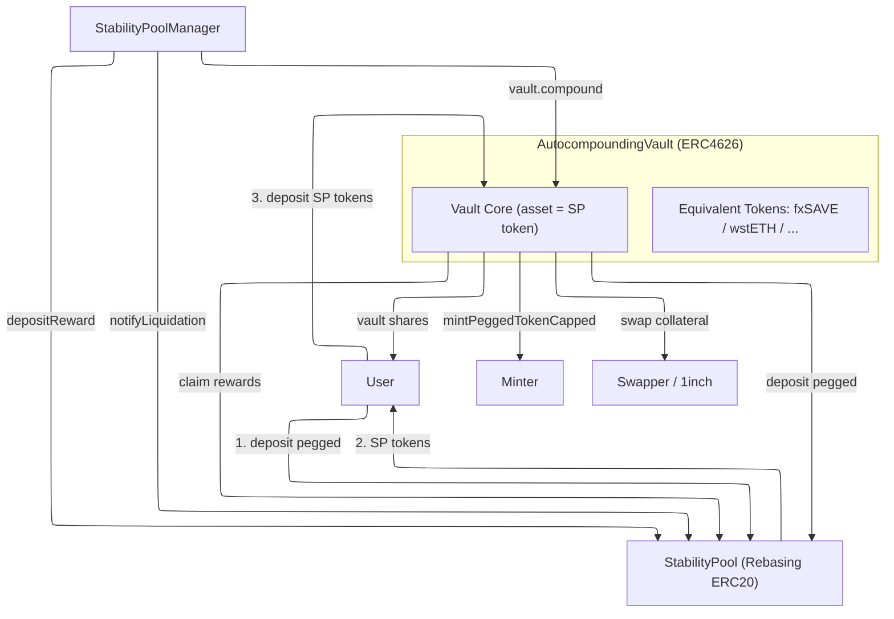
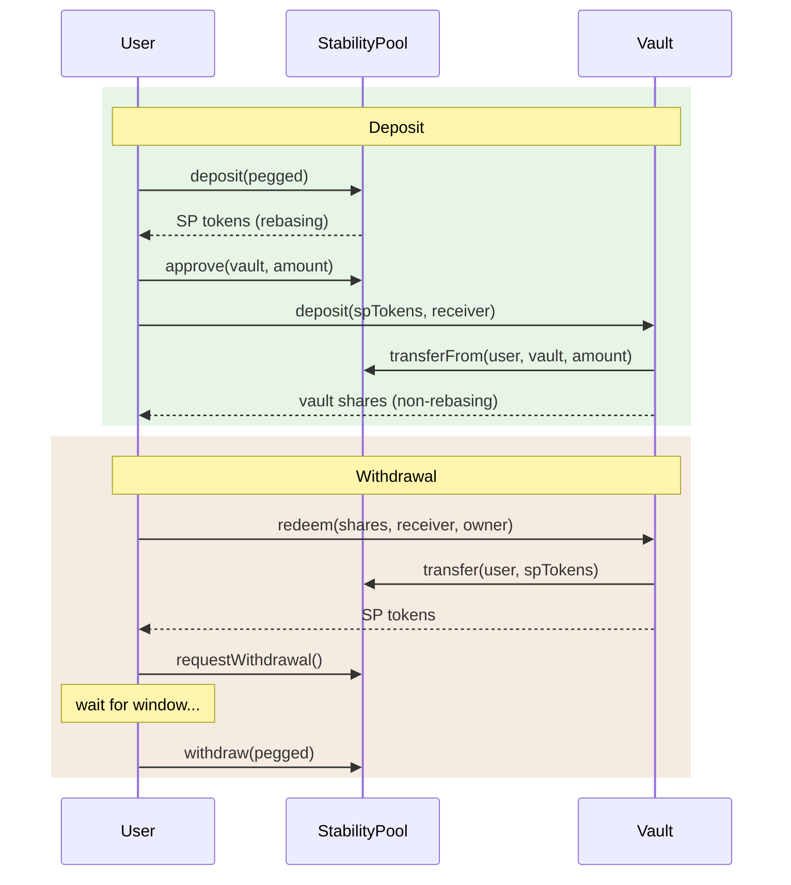
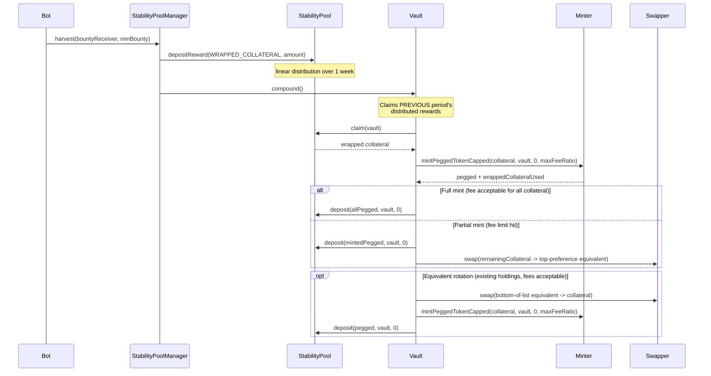
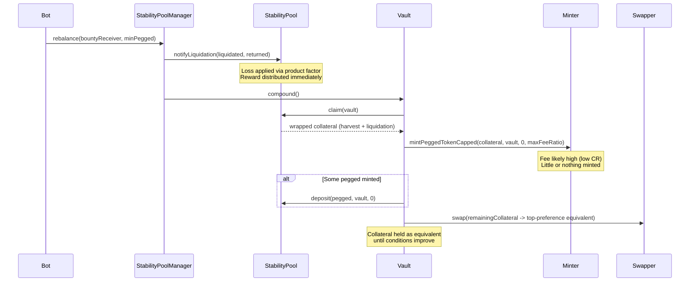
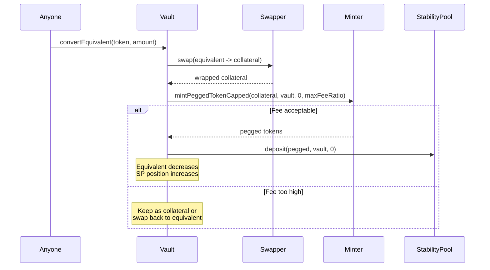

# Autocompounding Vault: Design & Requirements

## 1. Overview

An ERC4626 autocompounding vault that wraps stability pool positions. It claims rewards, converts them to pegged tokens where possible, and redeposits — delivering compound interest. When minting pegged tokens is not viable (fee ratio too high), rewards are held as interest-bearing equivalent tokens until conditions improve.

The vault provides:
- **Automated compounding** using the underlying SP reward system
- **A composable non-rebasing token** (ERC4626 shares) wrapping the rebasing SP token
- **Equivalent token management** — holding interest-bearing pegged-equivalent assets when minting is unfavorable, with a preference-ordered list for equivalent rotation

A prerequisite change to the stability pool: making the SP a rebasing ERC20 token with transferable positions.

## Architecture



## Sequence Diagrams

### User Deposit & Withdrawal



### Harvest Compound



### Rebalance Compound



### Equivalent Rotation (conditions improve)



## 2. Motivation

### Problem
SP depositors earn wrapped collateral from harvests but must manually claim and reinvest. This delivers simple interest — rewards don't earn further rewards.

### Solution
Automate claim-convert-redeposit. Long-term holders benefit proportionally more because compounded rewards generate additional rewards.

### Compound vs Simple Interest

| | Simple (SP direct) | Compound (Vault) |
|---|---|---|
| Balance after reward | `b` (unchanged) | `b + b/T * r` (grows) |
| Reward | `r * b/T` claimed as collateral | Reinvested as pegged |
| Future reward share | Proportional to `b` | Proportional to `b + compounded` |

At 10% APY: 5yr simple=1,500 vs compound=1,611 (+7.4%). 10yr: 2,000 vs 2,594 (+29.7%).

### Fairness Guarantee

`totalAssets()` includes pending claimable rewards via SP's `claimable()` view function (accurately simulates 1-week linear distribution). New depositors buy at correct price — no dilution. Compound can be lazy without affecting fairness.

## 3. Design Decisions

### 3.1 SP as Rebasing ERC20

**Decision:** `balanceOf()` returns compounded real value (= `assetBalanceOf()`). `totalSupply()` returns `totalAssetSupply()`. Both already exist. New: `transfer`, `transferFrom`, `approve`, `allowance`.

**Why rebasing:**
- Non-rebasing shares + conversion function is exactly what the vault provides. Making the SP non-rebasing would duplicate the vault's role.
- Clean two-layer architecture: SP token = raw position (rebases down on loss), vault = compounding wrapper (non-rebasing). Like stETH/wstETH.
- SP only rebases **downward** (losses), discrete events (rebalances), not continuous.
- The vault IS the non-rebasing wrapped version for DeFi protocols.

**Why not full ERC4626 on SP:** SP v2 is 20,711 bytes (~3,300 headroom). Minimal ERC20 fits; full ERC4626 is risky on size. The vault provides the ERC4626 interface.

**Transfer implementation:** Checkpoint sender and receiver (updates rewards at pre-transfer balances), then move balance.

**Approval and rebasing:** Since `balanceOf` rebases downward on liquidation, an approval may exceed the user's balance after a loss event. This is the same behavior as stETH — `transferFrom` transfers up to `min(allowance, balance)`. Accepted behavior for downward-rebasing tokens; documented in the interface.

### 3.2 Vault Valuation on SP Loss

On SP liquidation, `assetBalanceOf(vault)` drops -> `totalAssets()` drops -> share price drops. Automatic — no vault action needed. Equivalent token holdings are unaffected; only the SP position component decreases.

### 3.3 Vault Architecture — stETH/wstETH Pattern

Same pattern as stETH (rebasing) / wstETH (non-rebasing ERC4626). SP token rebases down on loss; vault share is non-rebasing, DeFi-composable. Value per vault share increases via compounding.

### 3.4 Deposit and Withdrawal Flow

**Decision:** Users deposit pegged into SP first, then transfer SP tokens to vault. Withdrawals reverse.

```
Deposit:   User -> SP.deposit(pegged) -> SP tokens -> vault.deposit(spTokens) -> vault shares
Withdraw:  User -> vault.redeem(shares) -> SP tokens -> SP.withdraw(pegged) with time lock
```

**Why:** The SP handles time lock and withdrawal fees — no duplication needed. SP-as-ERC20 makes the transfer seamless. The UI can chain both steps.

**ERC4626 asset = SP token.** `totalAssets()` = SP token value + equivalent token value.

**Additional token support:** `depositEquivalent` / `withdrawEquivalent` for equivalent tokens. EIP-7575 was considered but doesn't fit — equivalent tokens are a compound side effect requiring unified logic, not independent deposit paths.

### 3.5 Minting: Fees and maxFeeRatio

**Decision:** Use `mintPeggedToken()` with fees (not free mint). Add `mintPeggedTokenCapped` to the Minter with a `maxFeeRatio` parameter.

**Why fees:** The vault automates what users would do manually. Users pay the fee. No special Minter role needed.

**Minter change — new function alongside existing:**
```solidity
// Existing (unchanged, backward compatible)
function mintPeggedToken(uint256 wrappedIn, address receiver, uint256 minPeggedOut)
    returns (uint256 peggedOut)

// New: stops at fee threshold, returns unused collateral
function mintPeggedTokenCapped(
    uint256 wrappedIn, address receiver, uint256 minPeggedOut, int256 maxFeeRatio
) returns (uint256 peggedOut, uint256 wrappedCollateralUsed)
```

The capped version processes fee bands until `incentiveRatio > maxFeeRatio`, then stops. Returns pegged minted so far and how much collateral was used. Unused collateral stays with the caller. Backward compatible — existing function untouched.

### 3.6 Compound Flow

**Decision:** The minter's fee mechanism naturally handles harvest vs liquidation. So no need for StabilityPoolManager to get involved.

**Why:** If the fee ratio is acceptable -> mint pegged -> compound. If not -> equivalent token. This applies regardless of reward source. The CR state at compound time determines the outcome:
- After harvest (high CR, low fees) -> most/all mints to pegged
- After rebalance (low CR, high fees) -> equivalent token
- Mixed -> partial mint, remainder to equivalent

**Compound flow:**
```
vault.compound()
  1. Claim all rewards from SP
  2. Call mintPeggedTokenCapped(collateral, vault, 0, maxFeeRatio)
  3. Deposit minted pegged into SP (increases vault's SP balance)
  4. Remaining collateral (not used by mint) -> swap to top-preference equivalent token
  5. Check existing equivalent holdings -> if fee acceptable, convert bottom-of-list -> pegged -> SP
  6. Non-collateral tokens (e.g. LEVERAGED_TOKEN) -> ignore/sweep
```

Vault checks collateral balance before/after mint to confirm actual usage.

### 3.7 Compound Trigger

**Decision:** StabilityPoolManager calls `vault.compound()` during harvest and rebalance + compound is permissionless (anyone can call).

**StabilityPoolManager trigger:** One-line addition per pool in `harvest() and rebalance()`. Automates compounding with zero external infrastructure. Each compound captures previously distributed rewards (natural 1-week lag from linear distribution) and rebalance rewards.

**Permissionless:** Allows compounding between harvests. No bounty — StabilityPoolManager harvest bounty incentivizes the trigger.

### 3.8 Equivalent Token Management

**Decision:** Preference-ordered list of equivalent tokens, updatable by a keeper/bot role. Single vault holds all equivalents internally.

**Current design:**
- Ordered list of equivalent tokens (e.g. [fxSAVE, wstETH]) — top = preferred
- Keeper/bot role updates ordering based on external rate data (no on-chain rate calculation)
- On compound: unmintable collateral -> swap to top-preference equivalent
- On equivalent rotation: convert bottom-of-list equivalents -> collateral -> try mint -> SP (when fees permit)
- Old equivalents (after governance changes default) remain, gradually converted on subsequent compounds when fees are favorable

**User access:**
- `depositEquivalent(token, amount, receiver)` -> mint vault shares at equivalent's value
- `withdrawEquivalent(token, shares, receiver)` -> return equivalent tokens directly if vault holds enough

**Pricing in `totalAssets()`:** Equivalent tokens pegged to the same RWA are assumed equal value. For precision, oracle pricing could be added later.

**Open questions (deferred):**
- On-chain APY calculation for automated ordering (currently relies on off-chain bot)
- Whether equivalent rotation should account for swap costs
- Maximum number of equivalents before gas becomes prohibitive

### 3.9 Withdrawal Time Lock

**Decision:** No time lock in the vault. SP's existing time lock governs all pegged withdrawals. Shared base contracts would create contract code duplication making partial upgrades harder.

## 4. Token & Reward Flow

### Harvest (both pool types)
```
StabilityPoolManager.harvest()
  -> depositReward(WRAPPED_COLLATERAL, amount) on SP
  -> linear distribution over 1 week
  -> StabilityPoolManager calls vault.compound()
  -> vault claims rewards
  -> mintPeggedTokenCapped(collateral, vault, 0, maxFeeRatio)
  -> deposit pegged into SP
  -> remaining collateral -> top-preference equivalent token
  -> check: convert bottom-of-list equivalents if fees acceptable
```

### SP Rebalance / Liquidation (both pool types)
```
StabilityPoolManager.rebalance()
  -> SP.notifyLiquidation(liquidated, returned)
  -> vault's SP balance reduced (loss via product factor — automatic)
  -> liquidation rewards claimable on next compound()
  -> on compound: fee likely high -> collateral -> equivalent token
```

### Equivalent Rotation (conditions improve)
```
vault.compound() or vault.convertEquivalent(token, amount)
  -> swap equivalent -> collateral via swapper
  -> mintPeggedTokenCapped -> deposit pegged into SP
```

## 5. Access Control

| Role | On Contract | Purpose |
|------|------------|---------|
| `KEEPER_ROLE` | Vault | Swap execution + equivalent list ordering |
| Owner | Vault | Configure swapper, maxFeeRatio, upgrade |
| Anyone | Vault | `deposit`, `redeem`, `compound`, `convertEquivalent`, `depositEquivalent`, `withdrawEquivalent` |

## 6. Contracts

| Contract | Action | Purpose |
|----------|--------|---------|
| `AutocompoundingVault` | Create | ERC4626 vault + equivalent token management |
| `IAutocompoundingVault` | Create | Interface |
| `StabilityPool_v2` | Modify | Add ERC20 (transfer/approve/allowance) |
| `Minter_v2` | Modify | Add `mintPeggedTokenCapped` with maxFeeRatio |
| `StabilityPoolManager_v1` | Modify | Add vault.compound() calls in harvest and rebalance |

## 7. Future Directions

- **On-chain APY calculation:** For automated equivalent token ordering without off-chain bot dependency. Not to be confused with the conversion rate between a token and its wrapped form (e.g. stETH/wstETH rate) — that is available on-chain already.
