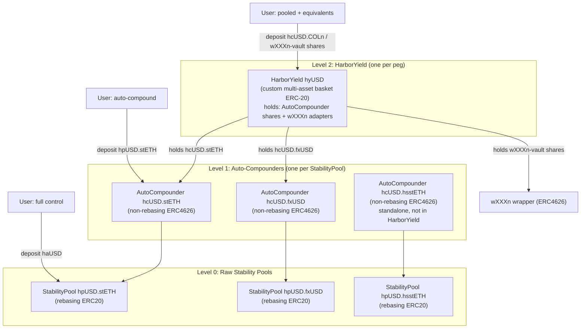
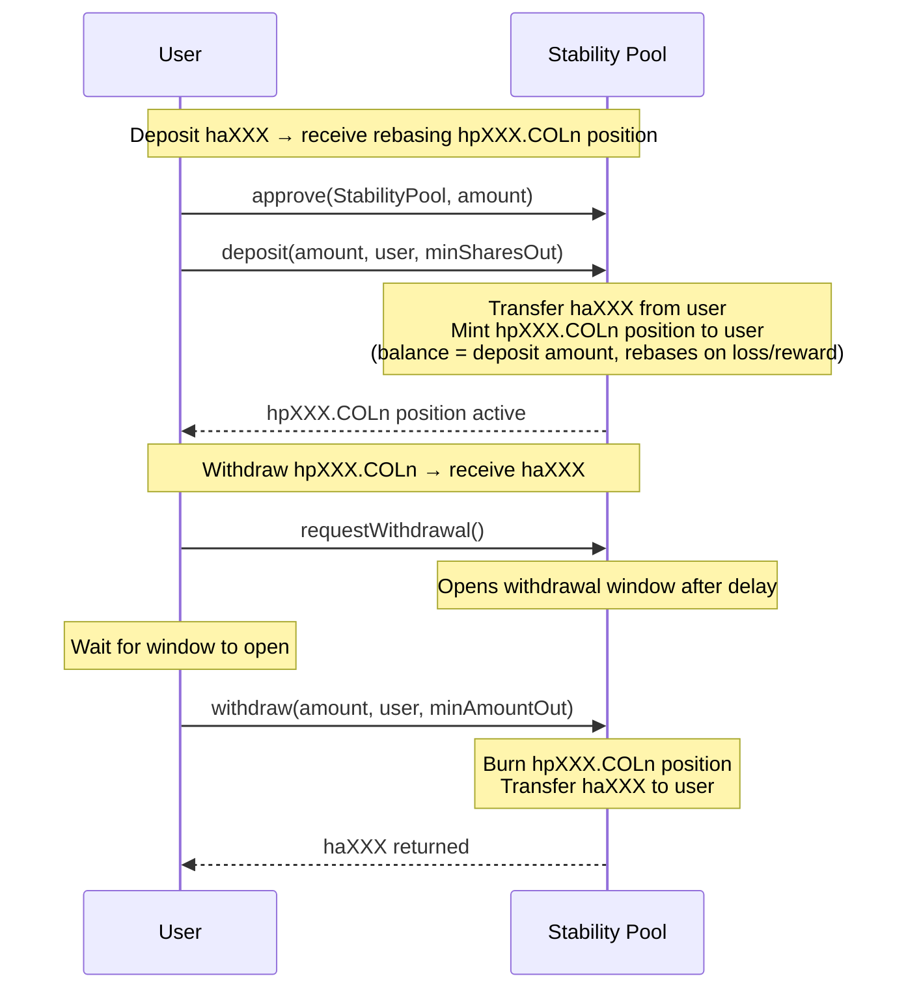
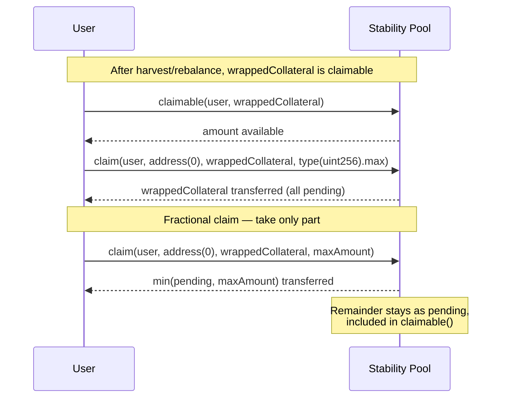
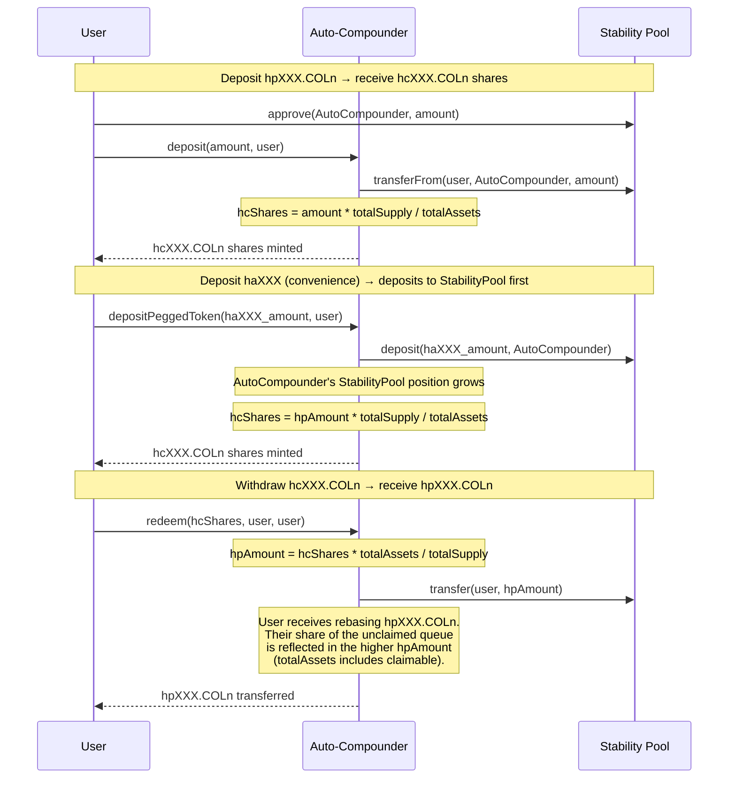
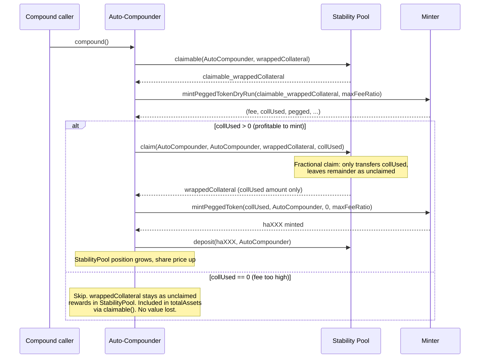
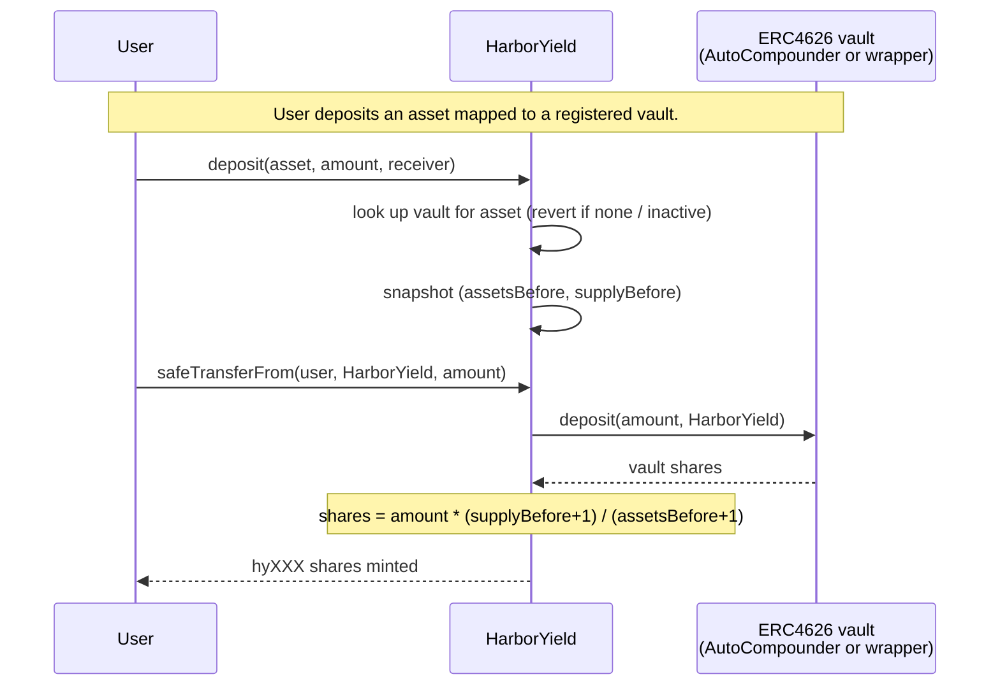
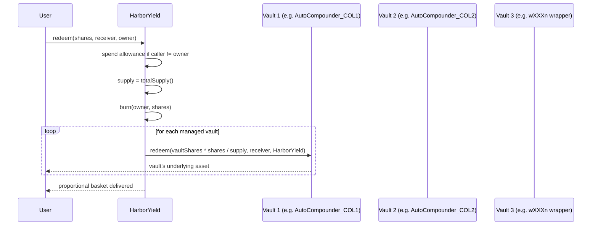
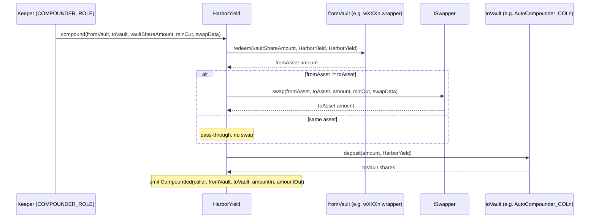
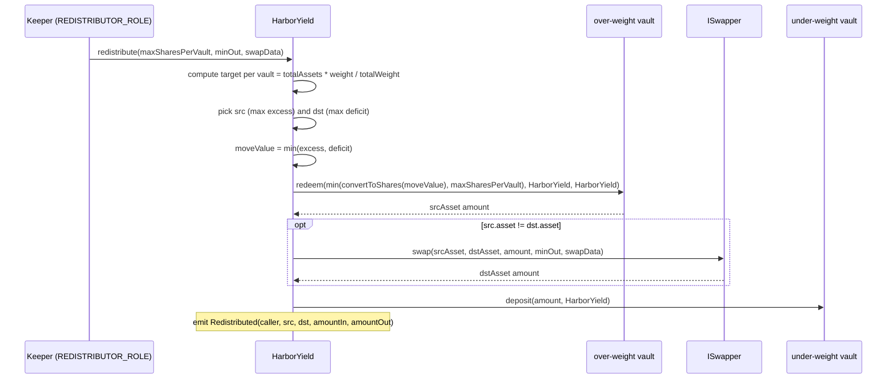

# Autocompounding Vault: Design & Requirements

## 1. Nomenclature

| Symbol | Meaning | Example (USD peg) |
|--------|---------|-------------------|
| **haXXX** | Pegged token for peg XXX | haUSD |
| **COLn** | Unwrapped collateral n | stETH (COL1), fxUSD (COL2) |
| **wrappedCollateral** | Wrapped collateral n, interest-bearing | wstETH (wraps COL1), fxSAVE (wraps COL2) |
| **hsXXX.COLn** | Leveraged (sail) token for collateral n | hsUSD.stETH |
| **hpXXX.COLn** | Rebasing StabilityPool token -- collateral pool | hpUSD.stETH |
| **hpXXX.hsCOLn** | Rebasing StabilityPool token -- leveraged pool | hpUSD.hsstETH |
| **hcXXX.COLn** | Auto-compounder share -- collateral pool | hcUSD.stETH |
| **hcXXX.hsCOLn** | Auto-compounder share -- leveraged pool | hcUSD.hsstETH |
| **hyXXX** | Peg Vault share (HarborYield) | hyUSD |
| **wXXXn** | Interest-bearing equivalent for peg XXX | fxSAVE (wUSD1) |
| **StabilityPool** | Stability Pool | |
| **AutoCompounder** | Auto-Compounder (Level 1 ERC4626) | |
| **HarborYield** | HarborYield — Peg Vault (Level 2 multi-asset ERC-20 basket) | |

## 2. Architecture Overview

Three layers offering escalating pooling. Each level gives up control in exchange for convenience:


```mermaid
graph TD
    subgraph "Level 0: Raw Stability Pools"
        StabilityPool_COL1["StabilityPool hpUSD.stETH<br/>(rebasing ERC20)"]
        StabilityPool_COL2["StabilityPool hpUSD.fxUSD<br/>(rebasing ERC20)"]
        StabilityPool_LEV1["StabilityPool hpUSD.hsstETH<br/>(rebasing ERC20)"]
    end

    subgraph "Level 1: Auto-Compounders (one per StabilityPool)"
        AutoCompounder_COL1["AutoCompounder hcUSD.stETH<br/>(non-rebasing ERC4626)"]
        AutoCompounder_COL2["AutoCompounder hcUSD.fxUSD<br/>(non-rebasing ERC4626)"]
        AutoCompounder_LEV1["AutoCompounder hcUSD.hsstETH<br/>(non-rebasing ERC4626)<br/>standalone, not in HarborYield"]
    end

    subgraph "Level 2: HarborYield (one per peg)"
        HarborYield["HarborYield hyUSD<br/>(custom multi-asset basket ERC-20)<br/>holds: AutoCompounder shares + wXXXn adapters"]
    end

    User_L0["User: full control"] -->|"deposit haUSD"| StabilityPool_COL1
    User_L1["User: auto-compound"] -->|"deposit hpUSD.stETH"| AutoCompounder_COL1
    User_L2["User: pooled + equivalents"] -->|"deposit hcUSD.COLn / wXXXn-vault shares"| HarborYield

    AutoCompounder_COL1 --> StabilityPool_COL1
    AutoCompounder_COL2 --> StabilityPool_COL2
    AutoCompounder_LEV1 --> StabilityPool_LEV1
    HarborYield -->|"holds hcUSD.stETH"| AutoCompounder_COL1
    HarborYield -->|"holds hcUSD.fxUSD"| AutoCompounder_COL2
    HarborYield -->|"holds wXXXn-vault shares"| wXXXn_pool["wXXXn wrapper (ERC4626)"]
```

**Level 0 -- Raw StabilityPool:** User chooses collateral type, manages claims manually. Rebasing ERC20. Full control.

**Level 1 -- Auto-Compounder (AutoCompounder):** User chooses collateral type, gets autocompounding. Non-rebasing ERC4626 (fixed share count, moving price -- same as stETH/wstETH). Losses and rewards within one StabilityPool only. Available for both collateral and leveraged StabilityPools.

**Level 2 -- HarborYield (HarborYield):** User gives up collateral choice. Losses socialised across all managed vaults. One HarborYield per peg. Holds one or more ERC4626 vault positions (AutoCompounders + equivalent-token wrappers). Custom multi-asset ERC-20 share (hyXXX) — *not* ERC-4626 and *not* ERC-7575 (both single-asset redeem semantics conflict with HarborYield's proportional-redeem fairness invariant). Exposes ERC-4626-style *views* priced in peg units for interop. Leveraged StabilityPools NOT included (rebalance into hsXXX.COLn which is not liquid).

## 3. Level 0: Raw Stability Pool

### Deposit / Withdraw


```mermaid
sequenceDiagram
    participant User
    participant StabilityPool as Stability Pool

    Note over User,StabilityPool: Deposit haXXX → receive rebasing hpXXX.COLn position

    User->>StabilityPool: approve(StabilityPool, amount)
    User->>StabilityPool: deposit(amount, user, minSharesOut)
    Note over StabilityPool: Transfer haXXX from user<br/>Mint hpXXX.COLn position to user<br/>(balance = deposit amount, rebases on loss/reward)
    StabilityPool-->>User: hpXXX.COLn position active

    Note over User,StabilityPool: Withdraw hpXXX.COLn → receive haXXX

    User->>StabilityPool: requestWithdrawal()
    Note over StabilityPool: Opens withdrawal window after delay
    Note over User: Wait for window to open
    User->>StabilityPool: withdraw(amount, user, minAmountOut)
    Note over StabilityPool: Burn hpXXX.COLn position<br/>Transfer haXXX to user
    StabilityPool-->>User: haXXX returned
```

### Claim


```mermaid
sequenceDiagram
    participant User
    participant StabilityPool as Stability Pool

    Note over User,StabilityPool: After harvest/rebalance, wrappedCollateral is claimable

    User->>StabilityPool: claimable(user, wrappedCollateral)
    StabilityPool-->>User: amount available
    User->>StabilityPool: claim(user, address(0), wrappedCollateral, type(uint256).max)
    StabilityPool-->>User: wrappedCollateral transferred (all pending)

    Note over User,StabilityPool: Fractional claim — take only part

    User->>StabilityPool: claim(user, address(0), wrappedCollateral, maxAmount)
    StabilityPool-->>User: min(pending, maxAmount) transferred
    Note over StabilityPool: Remainder stays as pending,<br/>included in claimable()
```

---

## 4. Level 1: Auto-Compounder

### What it does

Wraps a rebasing hpXXX.COLn into a non-rebasing hcXXX.COLn share. Non-rebasing because the ERC4626 share count is fixed on deposit -- the share *price* changes, driven by `totalAssets() / totalSupply()`.

### Deposit / Withdraw


```mermaid
sequenceDiagram
    participant User
    participant AutoCompounder as Auto-Compounder
    participant StabilityPool as Stability Pool

    Note over User,StabilityPool: Deposit hpXXX.COLn → receive hcXXX.COLn shares

    User->>StabilityPool: approve(AutoCompounder, amount)
    User->>AutoCompounder: deposit(amount, user)
    AutoCompounder->>StabilityPool: transferFrom(user, AutoCompounder, amount)
    Note over AutoCompounder: hcShares = amount * totalSupply / totalAssets
    AutoCompounder-->>User: hcXXX.COLn shares minted

    Note over User,StabilityPool: Deposit haXXX (convenience) → deposits to StabilityPool first

    User->>AutoCompounder: depositPeggedToken(haXXX_amount, user)
    AutoCompounder->>StabilityPool: deposit(haXXX_amount, AutoCompounder)
    Note over AutoCompounder: AutoCompounder's StabilityPool position grows
    Note over AutoCompounder: hcShares = hpAmount * totalSupply / totalAssets
    AutoCompounder-->>User: hcXXX.COLn shares minted

    Note over User,StabilityPool: Withdraw hcXXX.COLn → receive hpXXX.COLn

    User->>AutoCompounder: redeem(hcShares, user, user)
    Note over AutoCompounder: hpAmount = hcShares * totalAssets / totalSupply
    AutoCompounder->>StabilityPool: transfer(user, hpAmount)
    Note over AutoCompounder: User receives rebasing hpXXX.COLn.<br/>Their share of the unclaimed queue<br/>is reflected in the higher hpAmount<br/>(totalAssets includes claimable).
    AutoCompounder-->>User: hpXXX.COLn transferred
```

### Compound flow


```mermaid
sequenceDiagram
    participant Bot as Compound caller
    participant AutoCompounder as Auto-Compounder
    participant StabilityPool as Stability Pool
    participant Minter

    Bot->>AutoCompounder: compound()
    AutoCompounder->>StabilityPool: claimable(AutoCompounder, wrappedCollateral)
    StabilityPool-->>AutoCompounder: claimable_wrappedCollateral
    AutoCompounder->>Minter: mintPeggedTokenDryRun(claimable_wrappedCollateral, maxFeeRatio)
    Minter-->>AutoCompounder: (fee, collUsed, pegged, ...)

    alt collUsed > 0 (profitable to mint)
        AutoCompounder->>StabilityPool: claim(AutoCompounder, AutoCompounder, wrappedCollateral, collUsed)
        Note over StabilityPool: Fractional claim: only transfers collUsed,<br/>leaves remainder as unclaimed
        StabilityPool-->>AutoCompounder: wrappedCollateral (collUsed amount only)
        AutoCompounder->>Minter: mintPeggedToken(collUsed, AutoCompounder, 0, maxFeeRatio)
        Minter-->>AutoCompounder: haXXX minted
        AutoCompounder->>StabilityPool: deposit(haXXX, AutoCompounder)
        Note over AutoCompounder: StabilityPool position grows, share price up
    else collUsed == 0 (fee too high)
        Note over AutoCompounder: Skip. wrappedCollateral stays as unclaimed<br/>rewards in StabilityPool. Included in totalAssets<br/>via claimable(). No value lost.
    end
```

### Share accounting

```
totalAssets() =
    StabilityPool.balanceOf(AutoCompounder)                                        // StabilityPool position (haXXX terms, rebasing)
  + StabilityPool.claimable(AutoCompounder, wrappedCollateral) * price * rate / 1e36          // unclaimed wrappedCollateral valued in haXXX
```

Price and rate obtained from `IMinter_v3(minter).mintPeggedTokenDryRun(claimable, type(uint256).max)` -- always in sync with the Minter, no direct oracle dependency.

### Rebalance impact

**Collateral StabilityPool rebalance:** haXXX burned, wrappedCollateral received via `_accumulateReward`. wrappedCollateral is liquid and valued in totalAssets via claimable. AutoCompounder share price holds through rebalance -- lost haXXX position is offset by gained claimable wrappedCollateral. The AutoCompounder auto-compounds this back to haXXX when fees are acceptable.

**Leveraged StabilityPool rebalance:** haXXX burned, hsXXX.COLn received. hsXXX.COLn is NOT liquid. The AutoCompounder's totalAssets() only values wrapped collateral (harvest rewards), not leveraged token rewards. This means AutoCompounder share price drops on rebalance -- the lost haXXX position is not offset because leveraged tokens are not valued. The AutoCompounder can only compound the harvest wrappedCollateral; leveraged token rewards queue in the StabilityPool until manually claimed via sweep or direct claim.

### Fractional claim

`claim(account, receiver, token, maxAmount)` on StabilityPool_v3 -- claims up to maxAmount, leaves the rest as pending. Enables the AutoCompounder to claim only what can be profitably minted. Remainder stays in StabilityPool reward accounting, included in `totalAssets()` via `claimable()`.

### Fairness

Standard ERC4626. `totalAssets()` includes all value (StabilityPool position + unclaimed queue at oracle price). Deposits buy at current `totalAssets/totalShares`. No dilution, no cross-subsidy regardless of queue size.

### No equivalents at AutoCompounder level

The AutoCompounder does NOT convert wrappedCollateral to wXXXn. It either mints haXXX from wrappedCollateral or leaves it unclaimed in the StabilityPool. No value transfers out of the AutoCompounder. wXXXn equivalents exist only at the HarborYield level (from direct user deposits of the wXXXn wrapper). This resolves the fairness concern from the earlier options analysis -- no cross-subsidy between layers.

### Deposit convenience

Core asset is hpXXX.COLn. Also accepts haXXX via `depositPeggedToken(amount, receiver)` which atomically deposits to StabilityPool then mints AutoCompounder shares. Supports `type(uint256).max` for full balance.

## 5. Level 2: HarborYield (Peg Vault)

### What it does

One HarborYield per peg (e.g., hyUSD). Manages multiple ERC4626 vaults — one per asset — that share the same peg. Typical managed vaults for a single peg:

- `hcXXX.stETH` (AutoCompounder for stETH collateral StabilityPool)
- `hcXXX.fxUSD` (AutoCompounder for fxUSD collateral StabilityPool)
- `wXXXn` via a thin ERC4626 wrapper (e.g., fxSAVE adapter)

Users deposit the *vault's asset* (e.g., hpXXX.stETH, hpXXX.fxUSD, or the wXXXn wrapper's asset), mint hyXXX shares at the current exchange rate, and later redeem for a proportional mix of every managed vault's holdings. Losses and rewards are socialised across all hyXXX holders.

### Architecture invariants

- **One vault per asset** (enforced by an internal asset→vault index). Deposit routing is deterministic from the asset address.
- **Every managed vault is ERC-4626.** Non-ERC4626 yield sources are wrapped in thin 4626 adapters before being added.
- **No internal balance tracking.** HarborYield reads `IERC20(vault).balanceOf(HarborYield)` and `IERC4626(vault).convertToAssets(...)` each time; the vault is the source of truth.
- **Valuation is per vault, never a blanket 1:1 assumption.** `ValuationLib._fairRateInPegUnits` branches on the vault kind: an AutoCompounder is valued at its Minter's `peggedTokenPrice()`, so it stays fair under a haXXX depeg; an equivalent vault is valued at the `IWrappedPriceOracle` registered for it by `addEquivalentVault`, whose mid-rate is drift-checked against `1e18` at registration. HarborYield therefore takes no *global* oracle dependency — there is no single price feed the whole vault trusts — but it is not oracle-free either. `ISwapper` and `IMinter_v3.mintPeggedTokenDryRun` remain the valuation primitives on the swap and mint paths.
- **Proportional redemption.** hyXXX redeem pays out a pro-rata slice of *every* managed vault — no single-asset redeem path. This is the central fairness invariant; it's why HarborYield is not ERC-7575 (7575 per-asset redeem would let a user drain the best-performing component).
- **Upgradeable via UUPS**, HarborOwnableRoles, share-token name/symbol stored as constructor immutables via `StringPacking_v1`.

### Deposit flow


```mermaid
sequenceDiagram
    participant User
    participant HarborYield as HarborYield
    participant Vault as ERC4626 vault<br/>(AutoCompounder or wrapper)

    Note over User,Vault: User deposits an asset mapped to a registered vault.

    User->>HarborYield: deposit(asset, amount, receiver)
    HarborYield->>HarborYield: look up vault for asset (revert if none / inactive)
    HarborYield->>HarborYield: snapshot (assetsBefore, supplyBefore)
    User->>HarborYield: safeTransferFrom(user, HarborYield, amount)
    HarborYield->>Vault: deposit(amount, HarborYield)
    Vault-->>HarborYield: vault shares
    Note over HarborYield: shares = amount * (supplyBefore+1) / (assetsBefore+1)
    HarborYield-->>User: hyXXX shares minted
```

Convenience paths like "mint from haXXX" or "mint from wrappedCollateral" are **not** exposed on HarborYield. Users who want to enter from a raw asset call the Minter → StabilityPool → AutoCompounder path off-chain (or via a router contract), then deposit the resulting AutoCompounder shares' underlying asset (hpXXX.COLn) into HarborYield.

### Redeem flow


```mermaid
sequenceDiagram
    participant User
    participant HarborYield as HarborYield
    participant V1 as Vault 1 (e.g. AutoCompounder_COL1)
    participant V2 as Vault 2 (e.g. AutoCompounder_COL2)
    participant V3 as Vault 3 (e.g. wXXXn wrapper)

    User->>HarborYield: redeem(shares, receiver, owner)
    HarborYield->>HarborYield: spend allowance if caller != owner
    HarborYield->>HarborYield: supply = totalSupply()
    HarborYield->>HarborYield: burn(owner, shares)

    loop for each managed vault
        HarborYield->>V1: redeem(vaultShares * shares / supply, receiver, HarborYield)
        V1-->>User: vault's underlying asset
    end
    HarborYield-->>User: proportional basket delivered
```

### Compound (equivalent → AutoCompounder via swapper)

HarborYield's `compound()` is *not* a "compound each AutoCompounder" loop — the AutoCompounders compound themselves (permissionless `AutoCompounder.compound()`, also triggered by StabilityPoolManager harvest/rebalance). HarborYield's `compound()` is a narrower operation: convert holdings from one managed vault into another, typically to route equivalent-token yield into the AutoCompounder layer.


```mermaid
sequenceDiagram
    participant Keeper as Keeper (COMPOUNDER_ROLE)
    participant HarborYield as HarborYield
    participant Src as fromVault (e.g. wXXXn wrapper)
    participant Swap as ISwapper
    participant Dst as toVault (e.g. AutoCompounder_COLn)

    Keeper->>HarborYield: compound(fromVault, toVault, vaultShareAmount, minOut, swapData)
    HarborYield->>Src: redeem(vaultShareAmount, HarborYield, HarborYield)
    Src-->>HarborYield: fromAsset amount
    alt fromAsset != toAsset
        HarborYield->>Swap: swap(fromAsset, toAsset, amount, minOut, swapData)
        Swap-->>HarborYield: toAsset amount
    else same asset
        Note over HarborYield: pass-through, no swap
    end
    HarborYield->>Dst: deposit(amount, HarborYield)
    Dst-->>HarborYield: toVault shares
    Note over HarborYield: emit Compounded(caller, fromVault, toVault, amountIn, amountOut)
```

### Redistribute (rebalance toward target weights)

Each managed vault has an arbitrary-unit `weight`. HarborYield caches `totalWeight = SUM(weight)`. `redistribute()` finds the most over-weight vault (largest `currentValue − targetValue`) and the most under-weight vault, then moves `min(excess, deficit)` from source to target.


```mermaid
sequenceDiagram
    participant Keeper as Keeper (REDISTRIBUTOR_ROLE)
    participant HarborYield as HarborYield
    participant Src as over-weight vault
    participant Swap as ISwapper
    participant Dst as under-weight vault

    Keeper->>HarborYield: redistribute(maxSharesPerVault, minOut, swapData)
    HarborYield->>HarborYield: compute target per vault = totalAssets * weight / totalWeight
    HarborYield->>HarborYield: pick src (max excess) and dst (max deficit)
    HarborYield->>HarborYield: moveValue = min(excess, deficit)
    HarborYield->>Src: redeem(min(convertToShares(moveValue), maxSharesPerVault), HarborYield, HarborYield)
    Src-->>HarborYield: srcAsset amount
    opt src.asset != dst.asset
        HarborYield->>Swap: swap(srcAsset, dstAsset, amount, minOut, swapData)
        Swap-->>HarborYield: dstAsset amount
    end
    HarborYield->>Dst: deposit(amount, HarborYield)
    Note over HarborYield: emit Redistributed(caller, src, dst, amountIn, amountOut)
```

Reverts with `NothingToRedistribute` when `totalAssets == 0`, `totalWeight == 0`, or the basket is already exactly on target.

### Share accounting

```
totalAssets() =
    SUM over managed vaults of IERC4626(vault).convertToAssets(IERC20(vault).balanceOf(HarborYield))
```

No global oracle: each vault is valued on its own terms — an AutoCompounder at its Minter's `peggedTokenPrice()`, an equivalent at the oracle registered for it — so a component that drifts is priced at its drift rather than assumed to be at par. See §6.13 (Peg Verification) for the registration-time drift check that bounds what may be registered in the first place.

### Fairness

- **Proportional redeem** prevents single-asset cherry-picking.
- **Weight-driven rebalance** keeps the basket close to governance targets without ad-hoc moves.
- **No dilution on deposit:** shares are priced at the *pre-deposit* exchange rate (`shares = amount * (supply+1) / (totalAssets+1)`), so new depositors can't claim a slice of existing pending yield.
- **Collateral StabilityPool rebalances are absorbed at the AutoCompounder layer** (wrappedCollateral offsets lost haXXX). HarborYield sees a roughly unchanged per-vault value through a rebalance.

### ERC-4626 compatibility (planned — view shim)

HarborYield will expose ERC-4626-style *views* priced in peg units — `asset()` returning the peg token (haXXX), plus `totalAssets`, `convertToShares/Assets`, `previewDeposit/Redeem` — to give aggregators and portfolio tools enough to value hyXXX. The mutation surface remains HarborYield's own (`deposit(asset,…)`, `redeem`, `compound`, `redistribute`). See plan §B.4.2.

## 6. Design Decisions

### 6.1 StabilityPool as Rebasing ERC20

`balanceOf()` returns compounded real value. `totalSupply()` returns `totalAssetSupply()`. Transfer/approve/allowance added in v3. Like stETH.

### 6.2 Non-rebasing AutoCompounder shares

The AutoCompounder is the non-rebasing wrapped version. Like wstETH wraps stETH. Share count fixed, price moves.

### 6.3 Collateral StabilityPool rebalance holds value

Unlike leveraged StabilityPools, collateral StabilityPool rebalance returns liquid wrappedCollateral. The AutoCompounder's totalAssets stays roughly constant (lost haXXX offset by gained claimable wrappedCollateral). The AutoCompounder auto-compounds back to haXXX when fees are acceptable.

### 6.4 Leveraged StabilityPools standalone

Leveraged StabilityPools rebalance into hsXXX.COLn which is not liquid. Leveraged AutoCompounder only compounds harvest wrappedCollateral. Not included in HarborYield (different risk profile).

### 6.5 Minting: maxFeeRatio

`mintPeggedToken(wrappedCollateral, receiver, minPeggedOut, maxFeeRatio)` on Minter_v3. Stops when cumulative fee exceeds maxFeeRatio * collateralIn. Returns (0, 0) gracefully if fee too high.

### 6.6 Unified Claim with Fractional Support

`claim(account, receiver, token, maxAmount)` on StabilityPool_v3 (via `IMultipleRewardAccumulator_v3`). Claims up to maxAmount from the token, leaves rest as pending. `token == address(0)` claims all active tokens. Array overload `claim(account, receiver, tokens[], maxAmount)` for batch/historical claims.

### 6.7 Oracle Coupling

AutoCompounder reads price and rate from `IMinter_v3(minter).mintPeggedTokenDryRun()` — always in sync with the Minter, no direct oracle dependency. HarborYield takes no *global* oracle dependency — no single feed prices the whole vault — but it does read a per-vault oracle for each registered equivalent, via `ValuationLib.oracleRatePegUnits`, when computing `totalAssets`. AutoCompounder-backed vaults need none, since the AutoCompounder's own Minter price serves (see §5 share accounting and §6.13 peg verification).

### 6.8 Equivalent Token Management

Equivalent yield sources (wXXXn) are held at the HarborYield level only — never inside an AutoCompounder (see §6.9). Each equivalent is registered as a managed ERC4626 vault; non-ERC4626 tokens are wrapped in a thin 4626 adapter first. There is no preference list and no internal bookkeeping: holdings are whatever `balanceOf(HarborYield)` returns, and weights drive the rebalance target. Value can be routed back into AutoCompounder positions via `HarborYield.compound(fromVault, toVault, …)` which calls `ISwapper` to cross assets and deposits into the destination ERC4626.

### 6.9 No Equivalents in AutoCompounder

The AutoCompounder does NOT hold wXXXn. Unprofitable wrappedCollateral stays as unclaimed rewards in the StabilityPool, valued in `totalAssets` via `claimable()`. This avoids the cross-subsidy fairness issue identified in the options analysis.

### 6.10 Compound Trigger

Two distinct "compound" operations live at different layers:

- **AutoCompounder.compound()** — permissionless. Claims profitable wrappedCollateral, mints haXXX via the Minter, redeposits to the StabilityPool. Also triggered by the StabilityPoolManager at the end of every `harvest()` and `rebalance()`, for each registered yield vault; a vault that fails to compound is recorded and skipped rather than failing the enclosing call.
- **HarborYield.compound(fromVault, toVault, vaultShares, minOut, swapData)** — role-gated (`COMPOUNDER_ROLE | owner`). Redeems from one managed vault, swaps via `ISwapper`, deposits into another managed vault. Used to route equivalent-token yield into the AutoCompounder layer when profitable.

### 6.11 Withdrawal

The AutoCompounder holds `EXEMPT_WITHDRAWAL_FEE_ROLE`, and `StabilityPool_v3` uses the request/wait withdrawal window. AutoCompounder withdrawals route through the AutoCompounder contract and so bypass both the fee and the window.

**Possible future upgrade — not implemented and not scheduled:** replace the withdrawal window with a CR-based dynamic fee derived from the Minter's incentive ratios (`fee = mintPeggedRatio - redeemPeggedRatio`, clamped to `[0, MAX_WITHDRAWAL_FEE]`). Naturally zero at healthy CR, and it would enable an atomic ERC4626 `withdraw()`. See [rebalance-fairness.md](ideas/rebalance-fairness.md), "CR-Based Dynamic Withdrawal Fee", for the full design.

### 6.12 HarborYield is not ERC-4626 / ERC-7575

HarborYield's mutation surface is intentionally non-standard:

- **ERC-4626** is single-asset (`asset()` returns one address, `deposit`/`redeem` transact in that asset). HarborYield holds multiple assets by design.
- **ERC-7575** (multi-asset vaults with one share token) uses per-asset redeem semantics — each asset has its own ERC-4626 entry contract. That directly breaks HarborYield's proportional-redeem fairness invariant: a user could redeem entirely through the highest-yielding component and leave the rest of hyXXX holders with a worse basket.

HarborYield instead exposes ERC-4626-style *views* priced in peg units (`asset()`, `totalAssets`, `convertTo*`, `preview*`) for interoperability with aggregators, indexers and price feeds. The mutation API stays HarborYield-specific (`deposit(asset, amount, receiver)`, `redeem(shares, receiver, owner)`, `compound`, `redistribute`).

### 6.13 Peg Verification

HarborYield assumes every managed vault's asset is pegged to the same RWA. Two failure modes:

1. **Config error** — admin registers a vault whose asset is pegged to the wrong RWA (or not pegged at all). Catastrophic valuation error.
2. **Market depeg** — a component trades below peg transiently. New depositors are diluted and redeemers get a worse mix than market value would suggest.

The design uses two `addVault` variants and a single `maxPegDriftBps` tunable applied at both registration and runtime swap time:

- **`addAutoCompounderVault(vault, weight)`** — verifies `IAutoCompounder(vault).PEGGED_TOKEN() == _PEG_TOKEN` via direct introspection. No oracle parameter needed; the AutoCompounder's own immutable proves which peg it serves. Reverts with `WrongPegToken(expected, actual)` on mismatch.

- **`addEquivalentVault(vault, weight, valuationOracle)`** — takes an `IWrappedPriceOracle` address and verifies the oracle's mid-rate is within `maxPegDriftBps` of `1e18` at registration. Stores the oracle in a sparse `vaultValuationOracle` mapping for runtime use. Reverts with `ExcessivePegDrift(expected, actual)` on mismatch.

- **Depeg-aware `totalAssets`** — `_fairRateInPegUnits(vault)` branches on the sparse mapping: AutoCompounder vaults read `IMinter(AutoCompounder.MINTER()).peggedTokenPrice()` (fair valuation under haXXX depegs), equivalent vaults read their registered oracle. Each vault's `convertToAssets(balance)` is multiplied by its fair rate before being summed.

- **Oracle-bounded runtime swap floor** — `compound`/`redistribute` compute `_effectiveMinOut(from, to, amountIn, keeperMinOut)` = max of the keeper's `minOut` and `amountIn × fromRate / toRate × (1 - maxPegDriftBps/10_000)`. A compromised keeper passing `minAmountOut = 0` still gets HarborYield's own oracle-derived floor. During a real market depeg, the oracle reflects the depeg and the floor drops with the market — no spurious blocks.

- **Watchtower + deactivateVault** — owner freezes new deposits to a vault during sustained depegs (off-chain governance). Proportional redeems still work.

`maxPegDriftBps` is owner-settable via `setMaxPegDriftBps`. The unified parameter is operational simplicity; it can be split into separate registration and runtime tunables later if needed.

`ISwapper.previewSwap` was deliberately removed from the interface — production swap adapters (1inch, etc.) don't have on-chain quoting, and any consumer that called `previewSwap` for security purposes was a trap. The oracle-bounded floor supersedes it.

### 6.14 ERC-20 Permit (EIP-2612)

All harbor-side ERC-20 contracts in this work support `permit(owner, spender, value, deadline, v, r, s)` for approve-and-act in a single transaction:

- `HarborYield_v1` — Solady ERC20 with built-in EIP-2612.
- `AutoCompounder_v1` — Solady ERC4626 (which inherits Solady ERC20) with built-in EIP-2612.
- `StabilityPool_v3` — Solady ERC20 with built-in EIP-2612. Custom rebasing balance/total-supply accounting overrides Solady's `balanceOf` / `totalSupply`; allowance / nonces / permit / DOMAIN_SEPARATOR are inherited from Solady unchanged. Allowances are nominal (do NOT scale with rebases — same semantic as stETH).
- `PeggedToken` / `LeveragedToken` — already use `PermittableERC20_v1` / `MintableBurnableERC20_v1` from bao-base; both have permit. Both inherit the new shared `PermitTestBase` test suite.

**Solady is used rather than OpenZeppelin** because Solady's ERC20 / ERC4626 are trivially compatible with UUPS proxies: ERC20 uses hand-picked magic storage slots that cannot collide with ERC-7201, ERC4626 has zero storage of its own, and both expose the abstract / virtual hooks needed to wire in upgradeable name/symbol/asset via constructor immutables. Against the OpenZeppelin equivalents the bytecode trade is favourable overall — roughly 478 bytes smaller on the AutoCompounder, roughly 694 bytes larger on `StabilityPool_v3`, which the size budget accommodates, and permit comes built in rather than bolted on. All five permit-bearing contracts share the `bao-base/test/helpers/PermitTestBase.t.sol` test suite — five canonical permit tests via a single `_permitTarget()` override.

## 7. Access Control

| Role | On Contract | Purpose |
|------|------------|---------|
| Owner | HarborYield, AutoCompounder | Add/weight/deactivate vaults; configure `maxFeeRatio`; UUPS upgrade; sweep |
| `COMPOUNDER_ROLE` | HarborYield | Call `HarborYield.compound(fromVault, toVault, …)` |
| `REDISTRIBUTOR_ROLE` | HarborYield | Call `HarborYield.redistribute(…)` |
| `EXEMPT_WITHDRAWAL_FEE_ROLE` | StabilityPool | AutoCompounder withdraws without fee/delay |
| Anyone | StabilityPool, AutoCompounder, HarborYield (deposit/redeem), `AutoCompounder.compound()` | Public entrypoints |

## 8. Contracts

| Contract | Status | Purpose |
|----------|--------|---------|
| StabilityPool_v3 | Done | Rebasing ERC20 (Solady + EIP-2612 permit), unified claim, fractional claim, StringPacking_v1 |
| Minter_v3 | Done | `mintPeggedToken(maxFeeRatio)`, `mintPeggedTokenDryRun`, private→internal |
| AutoCompounder_v1 | Done | Non-rebasing ERC4626 wrapper per StabilityPool (Level 1), Solady ERC4626 + EIP-2612 permit |
| HarborYield_v1 | Done (core) | Multi-asset ERC-20 basket per peg (Level 2), Solady ERC20 + EIP-2612 permit. Two `addVault` variants (AutoCompounder introspection vs equivalent + oracle); depeg-aware `totalAssets`; oracle-bounded swap floor; `compound`/`redistribute` role-gated |
| ISwapper / MockSwapper | Done | Generic swap interface; mock for tests. (`previewSwap` deliberately removed — see §6.13.) |
| StabilityPoolManager_v2 | Done | Registers yield vaults and triggers `AutoCompounder.compound()` on each at the end of every `harvest()` and `rebalance()`; a failing vault is recorded and skipped, never fatal |
| StabilityPool_v3 — CR-based withdrawal fee | Not implemented, not scheduled | Would replace the withdrawal window with `fee = mintPeggedRatio - redeemPeggedRatio` clamped to `[0, MAX_WITHDRAWAL_FEE]`, enabling an atomic ERC4626 `withdraw()`. See [rebalance-fairness.md](ideas/rebalance-fairness.md). |
| StabilityPool_v3 — accumulator cleanup | Not implemented | Drop v1/v2 legacy accumulator storage fallback; one-shot migration via separate `ForceMigrateAccumulator_v1` |

## 9. References

- [Functional specification](functional-spec.md) -- what the protocol achieves: user stories, flows, invariants, attack vectors
- [Aladdin fxSAVE analysis](aladdin/fxSAVE.md) -- ERC4626 wrapping stability pool, proven pattern
- [Rebalance fairness](ideas/rebalance-fairness.md) -- worked examples, plus two unimplemented proposals: a CR-based withdrawal fee and an effective-share boost
- [Harbor deployment design](harbor-deployment.md) -- pre-flight, seed deposits, deployHarborYield/deployPeg switches
