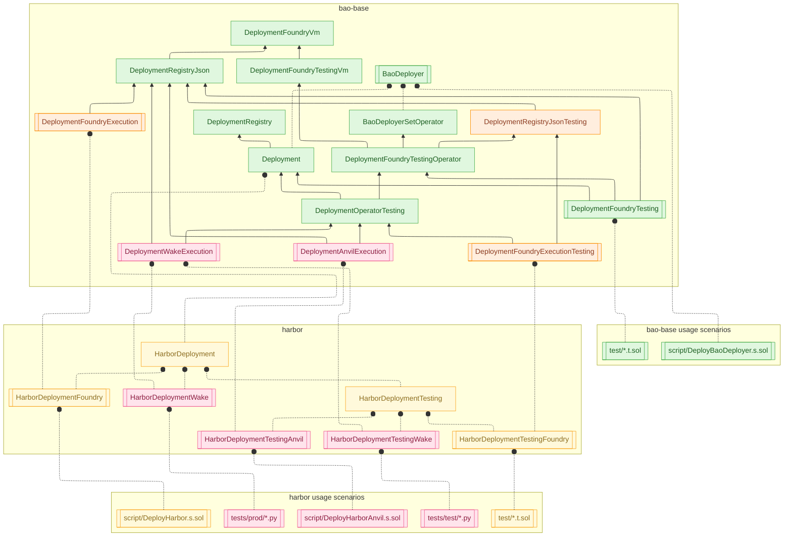

# Deployment Architecture Overview

This diagram maps the current layering between the generic bao-base deployment framework, the Harbor-specific deployment contracts, and the real scripts/tests that exercise them. It captures the relationships as they exist today so gaps and tight couplings are easy to spot.



## Layer Breakdown

### bao-base • Generic Contracts

- `lib/bao-base/script/deployment/DeploymentRegistry.sol`: pure storage and metadata management shared by every harness.
- `lib/bao-base/script/deployment/DeploymentPersistenceJson.sol`: Foundry-oriented mixin that persists registry state to JSON on disk.
- `lib/bao-base/script/deployment/Deployment.sol`: deployment operations (CREATE3, registry mutations, BaoDeployer checks).
- `lib/bao-base/script/deployment/DeploymentFoundry.sol`: production-focused Foundry helper that combines `Deployment` with JSON persistence and trace labeling.
- `lib/bao-base/script/deployment/DeploymentFoundry.sol` (`DeploymentFoundryTesting`): test-only variant that impersonates BaoDeployer and redirects output into `results/`.
- `lib/bao-base/script/deployment/BaoDeployerSetOperator.sol`: mixin that configures the caller as the BaoDeployer operator when running on an anvil-style chain.

### Harbor • Deployment Contracts

- `lib/harbor/script/deployment/HarborDeployment.sol`: Harbor-specific orchestration layered on top of `Deployment`.
- `lib/harbor/test/deployment/HarborAutoDeployment.sol` (`HarborAutoDeployment`): framework-agnostic helper that supplies lazy defaults and mocking for Harbor tests.
- `script/deployment/HarborDeploymentFoundry.sol`: production harness that currently mixes `HarborDeployment` with `DeploymentPersistenceJson` for Foundry scripts.
- `script/deployment/HarborDeploymentFoundry.sol` (`HarborDeploymentFoundryTesting`): adds BaoDeployer impersonation for local anvil usage.
- `test/deployment/HarborAutoDeployment.sol` (`HarborAutoDeploymentFoundry`, `HarborAutoDeploymentFoundryTesting`, `HarborAutoDeploymentAnvil`): Foundry test harnesses that mix Harbor defaults with persistence and optional operator setup.

### Harbor • Usage Scenarios

- `script/DeployHarbor.s.sol`: mainnet/testnet broadcast script that instantiates `HarborDeploymentFoundry`.
- `test/deployment/HarborAutoDeployment.sol` (`HarborAutoDeploymentAnvil`): contract meant to be run against an anvil network with on-the-fly BaoDeployer/operator setup.
- `test/deployment/*.t.sol`: Foundry test suites (e.g., `DeploymentSmokeTest.t.sol`, `HarborDeployment.t.sol`) that create `HarborAutoDeploymentFoundry` instances inside `setUp()`.
- `tests/harbor_deployment_wake.py`: Wake harness that deploys the compiled `HarborAutoDeployment` artifact and runs the system on internal Anvil.

## Observations

- Harbor Foundry harnesses currently inherit `DeploymentPersistenceJson` directly instead of the higher-level `DeploymentFoundry`, making persistence and Foundry helpers tightly coupled.
- Foundry tests and scripts both rely on `HarborAutoDeploymentFoundry`, so filesystem persistence is pulled into scenarios that only need in-memory JSON.
- Wake relies on the same `HarborAutoDeployment` contract artifact as Foundry tests but has to supply all library deployments manually in Python.
- Splitting JSON encoding (`DeploymentRegistryJson`) from persistence would let pure tests avoid filesystem dependencies while keeping Foundry scripts unchanged.

## Configuration Architecture Evolution

### Current State (Phase 1 - Bash-Driven)

Currently, bash scripts control what gets deployed by reading JSON config files:

```
deployments/harbor_v1::BTC::fxUSD.json
├─ prefix: "harbor_v1"
├─ peggedTicker: "BTC"
├─ networks: { mainnet: { collateral: 0x..., wrappedCollateral: 0x... } }
└─ owner, treasury, priceOracle, minter params, SP params...
```

**Flow:** Bash → JSON → .s.sol script → Deployment

**Issues:**

- Network-specific addresses stored in JSON, not in Solidity
- .s.sol script is generic and dumb - just deploys what bash tells it
- Config validation happens at deployment time, not compile time
- JSON structure duplicates information across similar markets

### Target State (Phase 2 - Solidity-Driven)

Solidity config contracts define everything needed for deployment:

```solidity
// Config_Market_BTC_fxUSD knows everything
contract Config_Market_BTC_fxUSD is
  Config_Chain_Mainnet, // Network-specific infrastructure addresses
  Config_Peg_BTC, // peg() = "BTC", minDeposit, minTotalSupply
  Config_Collateral_fxUSD, // collateral() = "fxUSD", token addresses per network
  Config_PriceVolatility_130 // Minter and SP configuration parameters
{}
```

**Flow:** .s.sol imports config → `new Config_Market_BTC_fxUSD()` → Deployment

**Bash script reduced to:**

- `--network mainnet|local` - selects which chain to target
- `--verify` - whether to verify on Etherscan
- `--private-key $KEY` - signing
- `--broadcast` - execute vs dry-run

**Benefits:**

- Type safety: Config errors caught at compile time
- Single source of truth: All market params in one place
- Network overrides: Inherit from different Config_Chain_* for different networks
- No JSON parsing or bash manipulation
- Testable: Can unit test configs before deployment

### Implementation Complete (Phase 2)

**What Changed:**
- ❌ Deleted `ConfigRegistry` library (broken per-contract storage)
- ✅ Moved all token addresses to `Config_Chain_Mainnet` (network-specific)
- ✅ Token constant naming matches actual symbols: `fxUSD`, `fxSAVE`, `stETH`, `wstETH`
- ✅ Collateral configs inherit chain config and reference constants
- ✅ Fixed naming consistency: `wrappedCollateralToken()` (was `wrappedCollateral()`)
- ❌ Deleted `ConfigBootstrap` - deployment script controls the loop
- ✅ Libraries only provide `salt()` computation (no `register()`)
- ✅ Tests demonstrate deployment script pattern

**How to Deploy Markets:**
```solidity
// In DeployHarbor.s.sol - the script controls what gets deployed
function run() external {
    // Deployment script explicitly lists markets to deploy
    Config_MinterMarket[] memory markets = new Config_MinterMarket[](2);
    markets[0] = new Config_Market_ETH_fxUSD();
    markets[1] = new Config_Market_BTC_fxUSD();
    
    // Loop and deploy each
    for (uint256 i = 0; i < markets.length; i++) {
        Config_Market_ETH_fxUSD config = Config_Market_ETH_fxUSD(address(markets[i]));
        string memory marketSalt = MinterMarketConfigLib.salt(markets[i]);
        address collateral = config.collateralToken();
        address wrappedCollateral = config.wrappedCollateralToken();
        // ... deployMinter(config, marketSalt);
    }
}
```

**How to Add a New Network:**
1. Create `script/config/chains/Config_Chain_Sepolia.sol` with Sepolia token addresses
2. Protocol addresses (`TREASURY`, `OWNER`, `BAO_FACTORY`) are the same across all networks
3. Market configs automatically get network-specific token addresses when they inherit the chain config
4. No JSON files, no bash manipulation, all in Solidity

**Next Steps:**
- Update `DeployHarbor.s.sol` to use config contracts instead of JSON
- Simplify bash scripts to only pass `--network`, `--verify`, `--broadcast`
- Remove JSON parsing logic from deployment code

