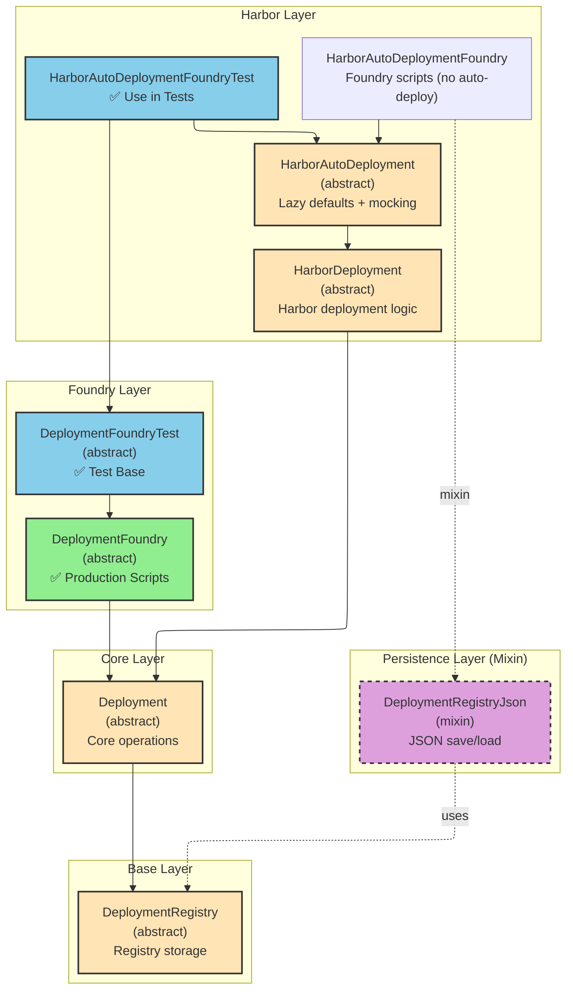

# Deployment Framework Inheritance

This document shows the inheritance structure of the deployment framework and when to use each class.



## Class Descriptions

### Base Layer

**`DeploymentRegistry`** (abstract)

- **Purpose**: Registry storage for deployment metadata, runs, contracts, parameters
- **Use**: Never use directly - extend with framework-specific features
- **Key Features**: Network-agnostic, framework-agnostic storage

**`DeploymentRegistryJson`** (mixin)

- **Purpose**: JSON persistence for deployment state
- **Use**: Mixed into Foundry-based classes for filesystem save/load
- **Key Features**: `toJsonFile()`, `fromJsonFile()` methods

### Core Layer

**`Deployment`** (abstract)

- **Purpose**: Core deployment operations (CREATE3 proxies, libraries, BaoDeployer)
- **Use**: Never use directly - requires specialization for production or test
- **Key Features**: `deployProxy()`, `deployLibrary()`, `_ensureBaoDeployerOperator()`

### Foundry Production Layer

**`DeploymentFoundry`** (abstract)

- **Purpose**: Production deployment for mainnet/testnet scripts
- **Use**: ✅ **USE** as base for production deployment scripts
- **Key Features**:
  - `Vm VM` - Foundry cheat codes
  - `labelAddress()` - Makes traces readable
  - Writes to `deployments/` directory
  - Manual BaoDeployer deployment required

**`DeploymentFoundryTest`** (abstract)

- **Purpose**: Test harness with auto-deploy infrastructure
- **Use**: ✅ **USE** as base for deployment tests
- **Key Features**:
  - Auto-deploys BaoDeployer (overrides `_ensureBaoDeployerOperator()`)
  - Writes to `results/` directory (overrides `_getBaseDirPrefix()`)
  - Sets BaoDeployer operator to test contract

### Harbor Layer

**`HarborDeployment`** (abstract)

- **Purpose**: Harbor-specific deployment logic
- **Use**: Never use directly - extend for Harbor deployments
- **Key Features**:
  - `start(jsonConfig)` - Config-driven deployment start
  - `resume(jsonConfig)` - Resume with version validation
  - `deployMinter()`, `deployStabilityPool()`, etc.

**`HarborAutoDeployment`** (abstract)

- **Purpose**: Lazy defaults and auto-mocking for tests
- **Use**: Never use directly - framework-agnostic base
- **Key Features**:
  - Lazy parameter defaults (`getPeggedName()` returns "BaoUSD" if not set)
  - `mockMinter()` helper
  - No Foundry dependency (works with Wake, etc.)

**`HarborAutoDeploymentFoundry`**

- **Purpose**: Foundry deployment WITHOUT test infrastructure
- **Use**: For scripts that need VM but not auto-deploy
- **Key Features**:
  - Has `Vm VM` access
  - Writes to `deployments/` (production)
  - Does NOT auto-deploy BaoDeployer

**`HarborAutoDeploymentFoundryTest`**

- **Purpose**: Foundry test deployment WITH auto-deploy infrastructure
- **Use**: ✅ **USE** in forge test files
- **Key Features**:
  - Inherits from `DeploymentFoundryTest` (auto-deploys BaoDeployer)
  - Inherits from `HarborAutoDeployment` (lazy defaults + mocking)
  - Writes to `results/` directory
  - Perfect for Harbor tests

## Usage Guide### For Production Scripts (Mainnet/Testnet)

**Base**: `DeploymentFoundry` (from bao-base)
**Harbor**: Create `HarborDeploymentScript extends HarborDeployment, DeploymentFoundry`

```solidity
// script/deployment/HarborDeployScript.sol
contract HarborDeployScript is HarborDeployment, DeploymentFoundry {
  function run() external {
    string memory config = vm.readFile("config/mainnet.json");
    start(config);
    // ... deploy contracts ...
    finish();
  }
}
```

### For Foundry Tests

**Base**: `DeploymentFoundryTest` (from bao-base)
**Harbor**: `HarborAutoDeploymentFoundryTest`

```solidity
// test/MyHarborTest.t.sol
import { BaoDeploymentTest } from "@bao-test/deployment/BaoDeploymentTest.sol";
import { HarborAutoDeploymentFoundryTest } from "@harbor-test/deployment/HarborAutoDeployment.sol";

contract MyHarborTest is BaoDeploymentTest {
  HarborAutoDeploymentFoundryTest harbor;

  function setUp() public override {
    super.setUp(); // Sets up BaoDeployer via BaoDeploymentTest
    harbor = new HarborAutoDeploymentFoundryTest();
  }

  function test_something() public {
    // Harbor auto-deploys dependencies, provides defaults
    address minter = harbor.getMinter();
    // ...
  }
}
```

### For Wake Tests

**Base**: `Deployment` (framework-agnostic)
**Harbor**: `HarborAutoDeployment` (framework-agnostic)

```python
# tests/test_harbor.py
from wake.testing import *

@chain.connect()
def test_harbor():
    # Wake doesn't use the Foundry-specific classes
    # Use HarborAutoDeployment directly (no VM dependency)
    pass
```

## Key Principles

1. **Framework-Agnostic**: `Deployment`, `HarborDeployment`, `HarborAutoDeployment` have no `Vm` dependency
2. **Foundry-Specific**: `DeploymentFoundry`, `DeploymentFoundryTest` add Foundry VM support
3. **Test Infrastructure**: `*Test` classes auto-deploy infrastructure (BaoDeployer) and write to `results/`
4. **Production Scripts**: Use `DeploymentFoundry` base (no auto-deploy, writes to `deployments/`)
5. **Mixin Pattern**: `DeploymentRegistryJson` mixed into Foundry classes for JSON persistence
6. **Specialization**: Harbor extends base framework with domain-specific deployment logic

## Decision Tree

```
Need to deploy Harbor contracts?
├─ In a test?
│  ├─ Using Foundry?
│  │  └─ Use HarborAutoDeploymentFoundryTest
│  └─ Using Wake?
│     └─ Use HarborAutoDeployment (no Foundry dependency)
│
└─ In a script?
   └─ Mainnet/Testnet deployment?
      └─ Create HarborDeployScript extends HarborDeployment, DeploymentFoundry
```
