# Harbor — Functional Specification

**Status:** in progress. Sections 1–5 complete; sections 6–11 to follow.

This document describes **what the Harbor protocol achieves** — the outcomes it delivers, for whom,
and under what conditions. It is distilled from the code, its comments, and the existing
documentation; it does not precede the implementation.

It deliberately avoids naming contracts, libraries and functions except where a name is itself part
of the external surface (an ERC-20 token, a role, a public entry point a keeper must call). A
**follow-up design document** maps every function described here onto the contracts and libraries
that provide it.

---

## 1. Purpose and scope

### 1.1 What Harbor achieves

Harbor turns a single yield-bearing collateral asset into **two tokens with opposite risk
profiles**, and keeps them both honest without an external liquidator, an auction, or a
counterparty.

From a deposit of one collateral asset the protocol issues:

- an **anchor token** (an *ha* token, e.g. `haETH`, `haBTC`, `haUSD`), which tracks the value of a
  chosen underlying — a currency, a commodity, an index, anything with a price feed; and
- a **sail token** (an *hs* token, e.g. `hsfxUSD`), which absorbs everything the anchor token does
  not: a leveraged long position on the collateral.

The two are complementary by construction. Every unit of collateral value in the system is claimed
by exactly one of them. The anchor token holder gets stability; the sail token holder gets the
leverage, and pays for the anchor holder's stability by taking the price risk.

The protocol's job is to keep that split solvent — to ensure the collateral it holds is always
worth at least as much as the anchor tokens it has issued — using four mechanisms that operate at
different points of stress, described in §7 and §5.

### 1.2 What "solvent" means here

Harbor measures its own health with a single number, the **collateral ratio**: the value of the
collateral it holds, divided by the value of the anchor tokens it has issued. At a collateral ratio
above 1, every anchor token is fully backed and the surplus belongs to the sail tokens. At exactly
1, the sail tokens are worthless and the anchor tokens are exactly covered. Below 1 the anchor token
has *depegged* — it can no longer be redeemed for its face value, only for its pro-rata share of
what collateral remains.

Everything the protocol does — pricing, fees, discounts, rebalancing — is aimed at keeping the
collateral ratio comfortably above 1, and at making the *approach* to 1 progressively more
expensive, so that it is arrested by ordinary self-interested behaviour rather than by intervention.

### 1.3 Scope of this document

**In scope: the Harbor core protocol** — the minting and redeeming of anchor and sail tokens, the
stability pools that backstop them, the genesis bootstrap, the reserve pool that funds discounts,
the reward distribution to stability-pool depositors, and the keeper-driven background processes
(rebalancing, harvesting, compounding).

**Referenced but not specified here:** Harbor depends on, and is depended on by, three sibling
systems. They define functionality the core must provide or consume, so they appear wherever they
touch a flow, but their internals are outside this document:

| System | Relationship to the core | Where it appears |
|---|---|---|
| **Price aggregators** | Supplies the validated price of the collateral in terms of the anchor token's underlying, and the wrapped-to-underlying conversion rate. Every mint, redeem and rebalance is priced from it. | §2.5, §5 (all pricing steps) |
| **Swap routing** | Converts between assets on external venues (Uniswap, Curve, Balancer, and DEX aggregators). The core protocol does not swap; the yield layer above it does. | §5.9 |
| **Yield layer** | Sits *on top of* the stability pools. Deposits anchor tokens into a stability pool on a user's behalf and automatically reinvests the rewards. The core protocol knows it only as a set of registered vaults it pokes after each rebalance and harvest. | §5.9 |

**Out of scope entirely:** deployment mechanics, upgrade procedures, off-chain indexing, and the
front-end application.

### 1.4 One protocol, many markets

Harbor is deployed once per **market** — a (collateral asset, anchor underlying) pair. Each market
is an independent instance with its own tokens, its own stability pools, its own collateral ratio
and its own solvency. A stress event in one market has no mechanical effect on another. Currently
configured markets pair collateral such as wstETH, fxSAVE and sUSDe against underlyings including
ETH, BTC, EUR, gold, silver and a market-capitalisation index.

Throughout this document "the system" means one such market.

---

## 2. Domain model

### 2.1 The three assets

| Asset | What it is | Who holds it |
|---|---|---|
| **Wrapped collateral token** | The yield-bearing asset the protocol actually holds — e.g. wstETH, fxSAVE, sUSDe. Its value in terms of its own *underlying* asset rises over time as the underlying protocol accrues yield. | The protocol (backing both issued tokens) |
| **Anchor token** (*ha*) | An ERC-20 whose value tracks a chosen underlying — a currency, commodity or index. Redeemable from the protocol for collateral. | Users, stability pools, the yield layer |
| **Sail token** (*hs*) | An ERC-20 whose value is the *residual*: the collateral value left over after every anchor token is covered. A leveraged long on the collateral. | Users, the leveraged stability pool |

Two properties of the anchor token matter for the design:

- It is an **ordinary ERC-20** and may be minted by means other than this protocol — including by a
  Harbor deployment on another chain. The protocol therefore tracks how many anchor tokens *it*
  issued and will never redeem more than that, so tokens minted elsewhere cannot drain this
  market's collateral.
- The sail token, by contrast, is **exclusive to the protocol**: only Harbor mints and burns it, and
  its total supply is exactly what Harbor has issued.

### 2.2 The accounting identity

The whole model rests on one identity. Writing $C$ for the value of the collateral held, $P$ for the
value of the anchor tokens issued, and $L$ for the value of the sail tokens:

$$C = P + L$$

All three are measured in the same unit: the anchor token's underlying. The sail token's total value
is defined as the residual $L = C - P$, so the identity holds by construction rather than by
enforcement.

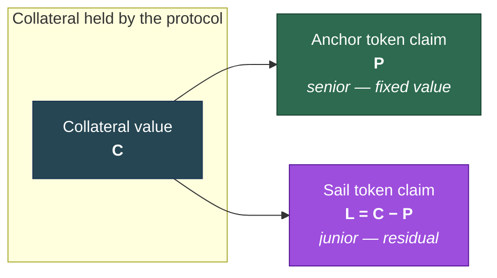

The anchor claim is **senior** — it is satisfied first, at face value. The sail claim is **junior** —
it takes whatever is left. That seniority is the entire source of the anchor token's stability and
the sail token's leverage.

### 2.3 The two health metrics

**Collateral ratio** — how well covered the anchor tokens are:

$$\text{collateral ratio} = \frac{C}{P}$$

**Leverage ratio** — how leveraged the sail token is:

$$\text{leverage ratio} = \frac{C}{C - P} = \frac{\text{collateral ratio}}{\text{collateral ratio} - 1}$$

The two move together, and the relationship explains the system's behaviour under stress: as the
collateral ratio falls toward 1, the leverage ratio rises without bound. The sail token becomes more
leveraged precisely when the system is least healthy — which is exactly when the protocol most
wants someone to buy it. That is not a coincidence to be corrected; it is a natural incentive the
fee design leans on (§7).

| Collateral ratio | Leverage ratio | System state |
|---|---|---|
| 3.0× | 1.5× | Very healthy — sail token barely leveraged |
| 2.0× | 2.0× | Healthy |
| 1.5× | 3.0× | Comfortable |
| 1.3× | 4.3× | Rebalancing typically begins around here |
| 1.1× | 11× | Stressed |
| 1.01× | 101× | Critical |
| 1.0× | ∞ | Sail token worthless; anchor exactly covered |
| < 1.0× | — | **Depegged** — anchor token under-covered |

### 2.4 Token prices

**Anchor token price** is normally exactly 1 unit of its underlying. It departs from 1 only when the
system is depegged, at which point it becomes the token's pro-rata share of the remaining
collateral:

$$\text{anchor price} = \min\left(1,\ \frac{C}{\text{anchor supply}}\right)$$

**Sail token price** is the residual value spread over the sail supply:

$$\text{sail price} = \frac{C - P}{\text{sail supply}}$$

A property that matters for user trust: **minting or redeeming either token does not move the sail
token's price.** Every mint adds collateral and issued-token claims in the same proportion; every
redeem removes them in the same proportion. The sail price moves only when the *collateral price*
moves — which is what a leveraged long is supposed to do. Users are therefore not diluted by other
users' activity, only by their own fees.

### 2.5 Pricing, and why there are two prices

The protocol never takes a single price. Its price source supplies **four** numbers on every read:

- a **minimum** and a **maximum** price of the collateral's underlying asset, and
- a **minimum** and a **maximum** conversion rate from the wrapped collateral to that underlying.

The protocol then chooses, per operation, whichever end of the band is **least favourable to the
caller and most favourable to the system's solvency**. Minting an anchor token values the incoming
collateral at the low end; redeeming values the outgoing collateral at a conservative end.
Liquidation during a rebalance uses the *maximum* price, which is the end most favourable to the
stability-pool depositors who are absorbing the loss.

This band, rather than a point estimate, is the protocol's primary defence against price
manipulation and stale feeds: an attacker must move *both* ends of the band to profit, and a feed
that has gone stale or invalid causes a revert rather than a mispriced trade.

The wrapped-to-underlying **rate** is separate from the **price** for a specific reason. The
collateral is yield-bearing: one unit of it is worth progressively more of its underlying over time.
The protocol backs anchor tokens with the *underlying* amount, so the growth in the wrapped asset's
rate accrues as a surplus that belongs to nobody in the accounting identity. That surplus is the
**harvestable yield**, and distributing it to stability-pool depositors is what §5.7 does.

### 2.6 The stability pools

Each market has **two stability pools**. Both accept deposits of the **anchor token**, and both
exist to be drawn down when the system needs to raise its collateral ratio. They differ only in what
a depositor receives when that happens:

| Pool | Deposits | Pays out on liquidation | Effect on the system |
|---|---|---|---|
| **Collateral pool** | Anchor tokens | Wrapped collateral | Anchor supply falls; collateral leaves the system |
| **Leveraged pool** | Anchor tokens | Sail tokens | Anchor supply falls; collateral *stays* in the system |

Both raise the collateral ratio by reducing $P$ (the anchor supply). The leveraged pool is the more
efficient of the two: because the collateral backing the redeemed anchor tokens stays in the system
as sail-token backing, a smaller liquidation achieves the same ratio improvement.

A stability-pool deposit is a **rebasing balance**: it shrinks proportionally when the pool absorbs
a liquidation, and the depositor receives the payout token in exchange. The pool's shares are
themselves a transferable ERC-20.

Two structural bounds govern each pool, and both are **numerical-precision parameters, not risk
limits**:

- a **floor** — once seeded, the pool's total deposits may never be driven below it. A liquidation
  is capped at the headroom above the floor, so every depositor keeps a share of the minimum, and
  the loss arithmetic can never round a near-total liquidation into a total one.
- a **ceiling**, derived from the floor, above which deposits are refused for the same arithmetic
  reason.

Both are set per market at deployment, sized so that in normal operation neither is approached — the
configured markets sit four to fourteen orders of magnitude below the ceiling.

### 2.7 Reward accrual

Stability-pool depositors receive value from two distinct sources, which behave differently:

| Source | Arrives | Distribution |
|---|---|---|
| **Liquidation proceeds** (from a rebalance) | In one step, immediately | Credited at once, proportional to holdings |
| **Harvested yield** (from collateral appreciation) | Streamed | Vests linearly over a fixed reward period (7 days) |

Both are credited proportionally to a depositor's share of the pool at the time of accrual, and both
accumulate until claimed. A depositor's accrued-but-unclaimed rewards are not capped.

### 2.8 The reserve pool

A separate pool of collateral funds **discounts** — negative fees, where a user receives *more* than
the arithmetic exchange rate for performing an action that improves the system's health. It is
funded by a share of collected fees and by direct transfers.

The reserve pool is a **best-effort** facility. When it empties, discounts silently stop applying
and actions simply proceed at zero fee; no operation fails because a discount could not be paid.
Users are told the actual discount available, not the configured one, by the forecast functions
(§4, §5.3).

### 2.9 Glossary of the core terms

| Term | Meaning |
|---|---|
| **Anchor token** (*ha*) | The stable, senior token tracking an underlying's value |
| **Sail token** (*hs*) | The leveraged, junior token holding the residual claim |
| **Wrapped collateral** | The yield-bearing asset the protocol holds |
| **Underlying** | The asset the anchor token tracks (ETH, BTC, EUR, gold, …) |
| **Collateral ratio** | Collateral value ÷ anchor token value — the health metric |
| **Leverage ratio** | Collateral value ÷ sail token value |
| **Depeg** | Collateral ratio below 1 — anchor tokens no longer fully covered |
| **Rebalance** | Drawing down a stability pool to raise the collateral ratio |
| **Harvest** | Distributing the collateral's accrued yield to stability pools |
| **Incentive ratio** | A single signed number: positive is a fee, negative a discount, 100% means disallowed |
| **Forecast function** | A read-only call reporting exactly what an action would yield right now |

---

## 3. Actors

Nine parties interact with the system. Six are users or economic participants; three are
operational.

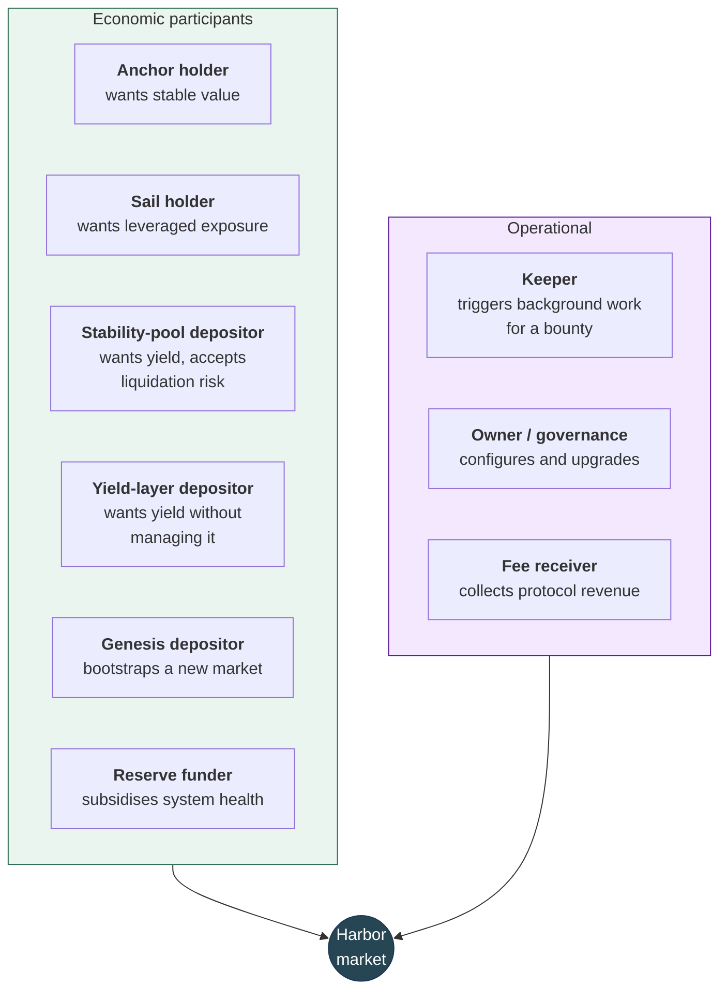

### 3.1 Economic participants

**Anchor holder.** Wants to hold value that tracks an underlying asset without holding the asset
itself. Cares that the token is redeemable near face value, that redemption is available when
needed, and that fees are predictable. Has no obligation to the system and can exit at any time
(subject to fees).

**Sail holder.** Wants leveraged long exposure to the collateral without borrowing, without a
liquidation price, and without a funding rate. Accepts that the position's leverage *varies* with
the system's collateral ratio rather than being fixed, and that the position can be diluted to zero
if the collateral ratio reaches 1. Cares that mint and redeem are available and that other users'
activity does not move the price against them.

**Stability-pool depositor.** Deposits anchor tokens to earn yield, accepting that some or all of
the deposit may be converted — at a favourable rate — into collateral or sail tokens when the system
needs to rebalance. This is the protocol's backstop and its most complex role: the depositor is
being paid to stand ready to absorb a loss that is usually profitable and occasionally is not.

**Yield-layer depositor.** Wants the stability-pool return without operating the position — without
minting anchor tokens, choosing a pool, or reinvesting rewards. Interacts with a vault above the
core protocol; the core sees only the vault.

**Genesis depositor.** Supplies collateral before a market has any, when there is no price to mint
against and no ratio to defend. Receives a proportional claim on both tokens once the market opens.
Bears the risk that the market opens on unfavourable terms, in exchange for founding allocation.

**Reserve funder.** Supplies collateral to the reserve pool so that health-improving actions can be
subsidised. Typically the protocol treasury; may be anyone, since the pool accepts direct transfers.
Receives nothing directly — this is a subsidy, not an investment.

### 3.2 Operational participants

**Keeper.** Any address. Triggers the background processes the protocol cannot trigger itself —
rebalancing, harvesting, compounding — and is paid a **bounty** in the proceeds for doing so. The
protocol depends on keepers being profitable; §6 covers what happens when they are not. Keepers are
permissionless and unprivileged: they choose *when* to call, never *what* the call does.

**Owner / governance.** A multisig. Sets the fee and discount schedule, the rebalance threshold, the
bounty and cut ratios, the price source, and the fee and reserve destinations. Holds upgrade
authority over every contract, and thereby the pause mechanism. This is the system's principal trust
assumption and is enumerated as such in §9.

**Fee receiver.** The destination for mint and redeem fees, the harvest cut, and early-withdrawal
fees. A passive recipient; holds no authority.

### 3.3 Trust relationships

| Actor | Must trust | Need not trust |
|---|---|---|
| Anchor holder | Owner (upgrade), price source | Other users, keepers |
| Sail holder | Owner (upgrade), price source | Other users, keepers |
| Stability-pool depositor | Owner (upgrade), price source, rebalance sizing | Individual keepers — anyone may rebalance |
| Yield-layer depositor | All of the above, plus the vault and its swap routing | — |
| Genesis depositor | Owner (to end genesis on fair terms) | — |
| Keeper | Nothing — a keeper risks only gas | — |

---

## 4. User stories

Each story states an outcome an actor needs, and the **acceptance criteria** the implementation must
satisfy for that outcome to be real. The criteria are drawn from behaviour the code actually
guarantees.

### 4.1 Anchor holder

---

**US-1 — Acquire stable exposure**

> *As an anchor holder, I want to exchange collateral for a token tracking my chosen underlying, so
> that I hold stable value without holding the underlying asset.*

Acceptance criteria:
1. Supplying wrapped collateral mints anchor tokens priced from the validated price band.
2. A fee, determined by the current collateral ratio, is deducted and sent to the fee receiver.
3. The caller may specify a **minimum acceptable output**; the operation reverts rather than
   delivering less.
4. The caller may nominate a **receiver** other than themselves.
5. The caller may supply `type(uint256).max` to mean "all of my balance", without querying it first.
6. Minting is **refused entirely** below a configured floor. In every deployed schedule that floor
   sits just *above* the market's rebalance threshold, not at a ratio of 1 — so new anchor claims
   stop being issued before the system enters rebalance territory, rather than once it is already
   under-covered.

---

**US-2 — Know the cost before committing**

> *As an anchor holder, I want to know exactly what a mint or redeem will cost me before I send it,
> so that I am not surprised by a fee that depends on system state I cannot see.*

Acceptance criteria:
1. A read-only **forecast function** exists for each of the four operations, returning the effective
   incentive ratio, the fee, any discount, the exact input consumed, the exact output produced, and
   the price and rate used.
2. The forecast is exact for the state at the moment of the call — it is a computation of the same
   path, not an estimate.
3. The forecast accounts for **partial fills**: where configuration disallows part of an operation,
   it reports the amount that would actually transact, not the amount requested.
4. The forecast reports the **available** discount, reduced if the reserve pool cannot fund the
   configured one.

*Note: the forecast binds only to the state at the time of the call. Another user's transaction
landing first can move the collateral ratio into a different fee band. Criterion US-1.3's minimum-out
check is the protection against that, not the forecast.*

---

**US-3 — Cap the fee I pay**

> *As an anchor holder minting into a stressed system, I want to mint only as much as I can at an
> acceptable fee, so that a large order does not drag me into progressively worse fee bands.*

Acceptance criteria:
1. A mint variant accepts a **maximum fee ratio**, expressed against the collateral actually used.
2. The protocol takes only as much of the offered collateral as can be minted within that cap, and
   returns the amount actually consumed.
3. Offering more collateral does **not** buy a larger fee budget to spend at a steeper rate — the cap
   is a rate, not a total.
4. If even the cheapest available band exceeds the cap, the operation returns zero rather than
   reverting — unless a minimum output was also specified, which zero cannot satisfy, in which case
   it reverts.

---

**US-4 — Exit to collateral**

> *As an anchor holder, I want to redeem my anchor tokens for collateral, so that I can leave the
> position.*

Acceptance criteria:
1. Redeeming burns anchor tokens and returns wrapped collateral at the validated price.
2. When the system is unhealthy the redemption attracts a **discount** rather than a fee — the holder
   receives more than the arithmetic rate, funded by the reserve pool, because the redemption
   improves the collateral ratio.
3. If the reserve pool cannot fund the full discount, the redemption still completes with whatever
   discount is available.
4. Redemption is **never disallowed by fee configuration** — the configuration is validated to
   prohibit a 100% fee on this action, so an anchor holder always has an exit.
5. The protocol will not redeem more anchor tokens than it issued, regardless of how many exist.

---

**US-5 — Understand what depeg means for me**

> *As an anchor holder, I want a depegged system to treat me predictably, so that I know what my
> token is worth when the backing is short.*

Acceptance criteria:
1. Below a collateral ratio of 1, the anchor token's reported price is its pro-rata share of the
   remaining collateral, not 1.
2. Redemption remains available and is priced from that share.
3. Redemption at a depeg is **discounted, not penalised** — the fee schedule pays holders to redeem,
   because each redemption raises the ratio.

### 4.2 Sail holder

---

**US-6 — Acquire leveraged exposure without a liquidation price**

> *As a sail holder, I want leveraged long exposure to the collateral that cannot be liquidated
> against me, so that I am not forced out by a temporary price move.*

Acceptance criteria:
1. Supplying collateral mints sail tokens valued at the residual claim.
2. There is **no per-position liquidation price, no margin call, and no borrowing cost** — the
   position's leverage varies with the system's collateral ratio instead.
3. The position dilutes toward zero only if the collateral ratio reaches 1; it is never seized.
4. Minting attracts a **discount** when the system is unhealthy, because minting sail tokens adds
   collateral without adding anchor claims and so raises the ratio.

---

**US-7 — Not be diluted by other users**

> *As a sail holder, I want other users' minting and redeeming not to move my token's price, so that
> my return reflects the collateral price alone.*

Acceptance criteria:
1. Any mint or redeem of either token leaves the sail token's price unchanged, because collateral and
   claims move in the same proportion.
2. The sail token's price changes only in response to the collateral price and to harvested yield.

---

**US-8 — Exit the leveraged position**

> *As a sail holder, I want to redeem sail tokens for collateral, so that I can realise my position.*

Acceptance criteria:
1. Redeeming burns sail tokens and returns wrapped collateral, less a fee.
2. The fee rises as the system becomes less healthy, because the redemption lowers the collateral
   ratio.
3. Redemption is **disallowed entirely** below a collateral ratio of 1 — the sail token has no
   residual value to claim there, and permitting the exit would take collateral from anchor holders.
4. Where configuration disallows the action at the current ratio, the operation may **partially
   fill** up to the boundary rather than reverting outright.

### 4.3 Stability-pool depositor

---

**US-9 — Earn yield for standing ready**

> *As a stability-pool depositor, I want to earn the protocol's yield in exchange for backstopping
> it, so that my anchor tokens are productive.*

Acceptance criteria:
1. Depositing anchor tokens credits a rebasing balance and begins accruing rewards proportional to
   the share held.
2. Harvested collateral yield is streamed to the pool and vests linearly over the reward period.
3. Liquidation proceeds are credited immediately, not streamed.
4. Rewards can be claimed at any time; unclaimed rewards continue to accrue without cap.
5. The pool's shares are transferable, so the position can be moved or used elsewhere without
   withdrawing.

---

**US-10 — Choose which risk I take**

> *As a stability-pool depositor, I want to choose what I receive when a liquidation happens, so
> that my backstop position matches my view.*

Acceptance criteria:
1. Two pools are available: one paying out wrapped collateral, one paying out sail tokens.
2. Both accept the same deposit asset (anchor tokens) and both reduce anchor supply when drawn.
3. The choice is made by which pool is deposited into; no further configuration is needed.

---

**US-11 — Be paid fairly when liquidated**

> *As a stability-pool depositor, I want a liquidation to be priced in my favour, so that being
> drawn upon is compensation rather than confiscation.*

Acceptance criteria:
1. Liquidation redeems at **zero fee**, unlike an ordinary redemption.
2. Liquidation is priced at the **maximum** of the price band — the end most favourable to the
   depositor.
3. Proceeds, less the keeper's bounty, are credited to the pool's depositors in proportion to
   holdings.
4. A liquidation may reduce the pool only to its floor, never below — every depositor retains a share
   of the minimum.
5. Where a pool's proportional share of a rebalance exceeds what it can absorb, the shortfall moves
   to the other pool rather than being forced onto it.

*The compensating risk, stated plainly: when the system is depegged, the anchor tokens drawn from
the pool are redeemed at their depressed share of collateral. A depositor can receive back less
value than was deposited. This is the risk the yield pays for.*

---

**US-12 — Withdraw on notice, without a lock-up**

> *As a stability-pool depositor, I want a predictable, fee-free way out, without my funds ever being
> frozen.*

Acceptance criteria:
1. Requesting a withdrawal opens a **fee-free window**, beginning after a configured delay and
   lasting a configured duration.
2. Withdrawal during that window incurs no early-withdrawal fee.
3. Withdrawal is **always permitted** — before the window, after it, or with no request at all — but
   incurs the early-withdrawal fee outside the window. Funds are never locked.
4. A successful withdrawal clears the request immediately.
5. Depositing during an open window cancels the request, so a window cannot be held open
   indefinitely while topping up.
6. Designated addresses may be exempted from the early-withdrawal fee, so protocol-internal exits
   (the yield layer's) are not penalised.
7. A minimum acceptable amount may be specified, protecting against a fee change landing first.

### 4.4 Genesis depositor

---

**US-13 — Bootstrap a market**

> *As a genesis depositor, I want to supply collateral to a market that has no price history and no
> liquidity, and receive a fair share of both tokens when it opens.*

Acceptance criteria:
1. Collateral may be deposited while genesis is open, crediting a proportional share.
2. Deposited collateral may be **withdrawn in full at any time before genesis ends** — the commitment
   is revocable until the market opens.
3. Ending genesis mints both tokens from the entire pooled collateral, splitting it evenly by value,
   at zero fee.
4. After genesis ends, each depositor may claim their proportional share of **both** tokens, at zero
   fee.
5. Withdrawal of collateral is no longer possible once genesis has ended — the claim is on tokens
   from that point.

### 4.5 Keeper

---

**US-14 — Be paid to keep the system healthy**

> *As a keeper, I want a reliable, permissionless bounty for triggering the work the protocol cannot
> trigger itself, so that operating a bot is profitable.*

Acceptance criteria:
1. Rebalancing and harvesting are **callable by anyone**, with no allowlist.
2. Each pays a configurable bounty, taken as a ratio of the value the call moves.
3. The keeper nominates the bounty recipient, so bots can separate the calling address from the
   receiving one.
4. A minimum acceptable bounty may be specified, so a call that would be unprofitable reverts rather
   than burning gas for nothing.
5. Read-only checks report whether each action is currently available and how much it would move, so
   a bot can decide without simulating.
6. A rebalance attempted when the collateral ratio is not below the threshold reverts with a specific
   error rather than silently doing nothing.

### 4.6 Owner / governance

---

**US-15 — Tune incentives without redeploying**

> *As the owner, I want to adjust the fee and discount schedule as market conditions change, so that
> the incentives stay calibrated.*

Acceptance criteria:
1. The full four-way schedule (mint and redeem, for each token) is settable in one operation.
2. The configuration is **validated on submission** against the rules in §7 — band bounds strictly
   increasing, disallow values only where they are permitted, discounts only where they are
   permitted — and rejected with a specific error naming the offending entry.
3. Validation makes it impossible to configure a schedule that blocks anchor redemption or sail
   minting, so the health-restoring paths cannot be closed.

---

**US-16 — Respond to a collateral slashing event**

> *As the owner, I want to correct the protocol's record of its own backing after the collateral
> asset suffers a loss, so that the system's health metric reflects reality.*

Acceptance criteria:
1. An owner-only operation resets the recorded underlying backing to match the value actually held.
2. Without it, a slashed wrapped-collateral asset would leave the system reporting more backing than
   exists, which would prevent a rebalance from being triggered when one is needed.

---

**US-17 — Halt activity in an emergency**

> *As the owner, I want to stop user actions on any contract quickly, so that a discovered fault
> cannot be exploited while it is fixed.*

Acceptance criteria:
1. Every contract can be halted, and resumed, by the owner in a single transaction.
2. Halting preserves all stored state — no balance, deposit or accrual is lost.
3. The halt mechanism imposes **no gas cost on ordinary operation** when not in use.

### 4.7 Yield-layer depositor

---

**US-18 — Earn the stability-pool return without operating it**

> *As a yield-layer depositor, I want a single deposit to give me the stability-pool return with
> rewards reinvested automatically, so that I need not mint, choose a pool, or claim.*

Acceptance criteria:
1. The core protocol exposes the seams the yield layer needs: zero-fee-exempt withdrawal for
   protocol-internal exits, and a forecast of what a deposit would credit.
2. Registered vaults are **poked automatically** after every rebalance and harvest, so compounding
   tracks reward arrival without a separate keeper schedule.
3. A vault that fails to compound does **not** cause the rebalance or harvest to fail; the failure is
   recorded for off-chain monitoring.

---

## 5. Core flows

Each flow states its trigger, its preconditions, the sequence, and its outcome.

### 5.1 Market bootstrap (genesis)

**Trigger:** market launch. **Precondition:** the market has no collateral and no issued tokens.

A new market cannot mint on demand — with no collateral there is no meaningful collateral ratio and
no fee band to price against. Genesis solves this by pooling collateral first and minting once.

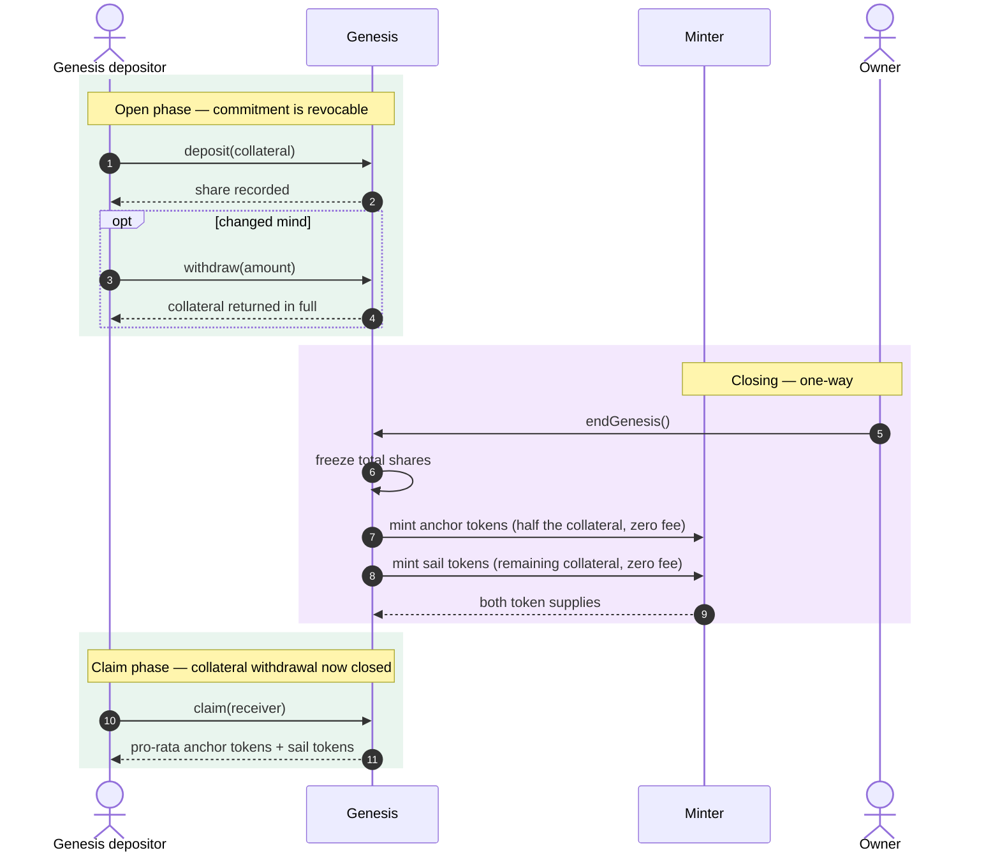

**Outcome.** The market opens at a collateral ratio of approximately 2× — collateral split evenly by
value between the two claims — with both tokens distributed proportionally to founding depositors and
no fee charged on either side.

**Notable properties.**
- Withdrawal before `endGenesis` returns collateral **in full**, with no fee. The commitment is
  genuinely revocable.
- The even split is by *collateral value*, using the entire pooled balance including any rounding
  remainder, so no collateral is stranded.
- Additional collateral transferred directly to the genesis contract before closing raises every
  depositor's claim — a deliberate seam for offering a founding bonus.
- `endGenesis` is **owner-only and irreversible**. Depositors trust the owner to close on fair terms;
  this is noted as a trust assumption in §3.3.

### 5.2 Minting anchor tokens

**Trigger:** user action. **Precondition:** the collateral ratio is above the schedule's disallow
floor — in deployed markets, just above the rebalance threshold.

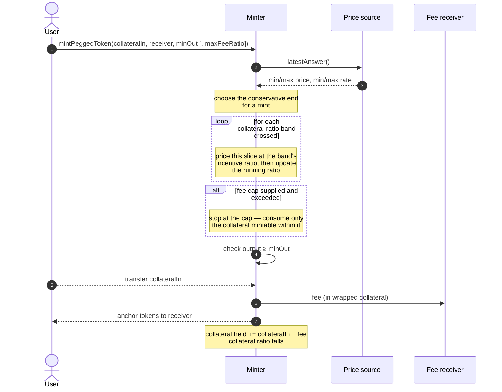

**Outcome.** The user holds anchor tokens; the protocol holds more collateral and has more anchor
claims against it. The collateral ratio **falls** — this action consumes system health, which is why
its fee rises as health worsens.

**Notable properties.**
- A large mint **traverses several fee bands**, each slice priced at its own rate against the ratio
  as it moves. It is not priced wholesale at the starting band.
- Where a band is configured as disallowed, the mint **fills up to that boundary** and stops, rather
  than reverting — the user gets what was available.
- Rounding is always in the protocol's favour, so a mint never issues more than the exact formula.

### 5.3 Redeeming anchor tokens

**Trigger:** user action. **Precondition:** the protocol has issued at least the amount being
redeemed.

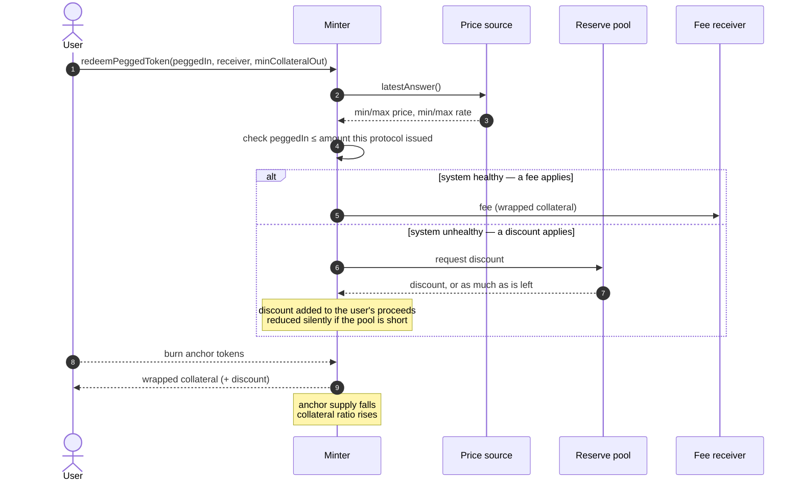

**Outcome.** The user holds collateral; the system has fewer anchor claims. The collateral ratio
**rises** — this action restores health, which is why it is discounted when health is poor.

**Notable properties.**
- Configuration **cannot** disallow this action; the validation rules reject a 100% fee here. An
  anchor holder always has an exit.
- The discount is best-effort. An exhausted reserve pool reduces it to whatever remains — possibly
  zero — without failing the redemption.
- The protocol tracks its own issuance and refuses to redeem beyond it, so anchor tokens minted by
  another chain's deployment cannot drain this market.

### 5.4 Minting and redeeming sail tokens

These mirror §5.2 and §5.3 with the incentives inverted.

| | Effect on collateral ratio | Incentive when unhealthy | Can configuration disallow it? |
|---|---|---|---|
| **Mint sail** | Rises | **Discount** (funded by reserve pool) | Not as such — but see §7.5: below a ratio of 1 the residual claim has no price, so deployed schedules set a near-100% fee that blocks it in effect |
| **Redeem sail** | Falls | **Fee**, rising | **Yes** — blocked below a ratio of 1 |

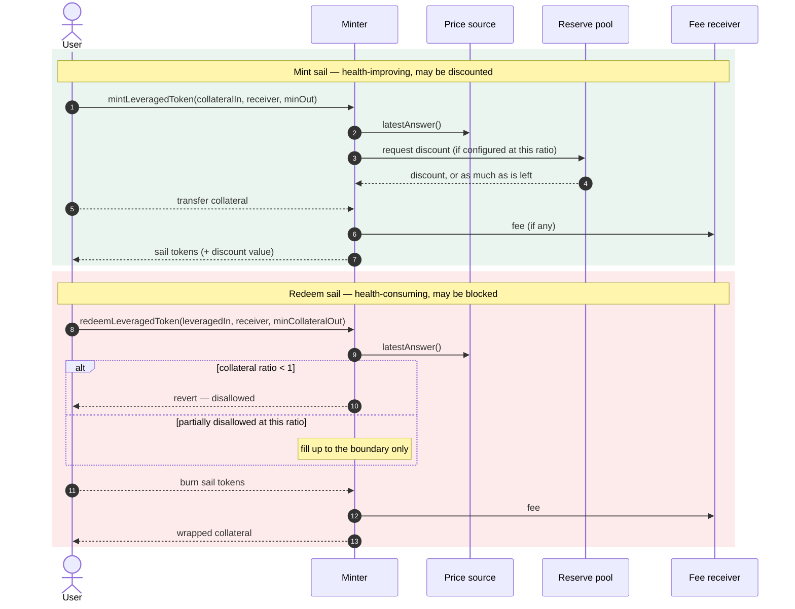

**Why the asymmetry.** Redeeming sail tokens takes collateral out while leaving every anchor claim
in place — the most direct way to damage the system's solvency. Below a ratio of 1 the sail token
has no residual value to claim at all, so permitting the exit would pay sail holders out of anchor
holders' backing. Blocking it is the protection.

### 5.5 Stability-pool deposit and withdrawal

**Trigger:** user action. **Preconditions:** deposits must leave the pool's total at zero or above
its floor, and at or below its ceiling.

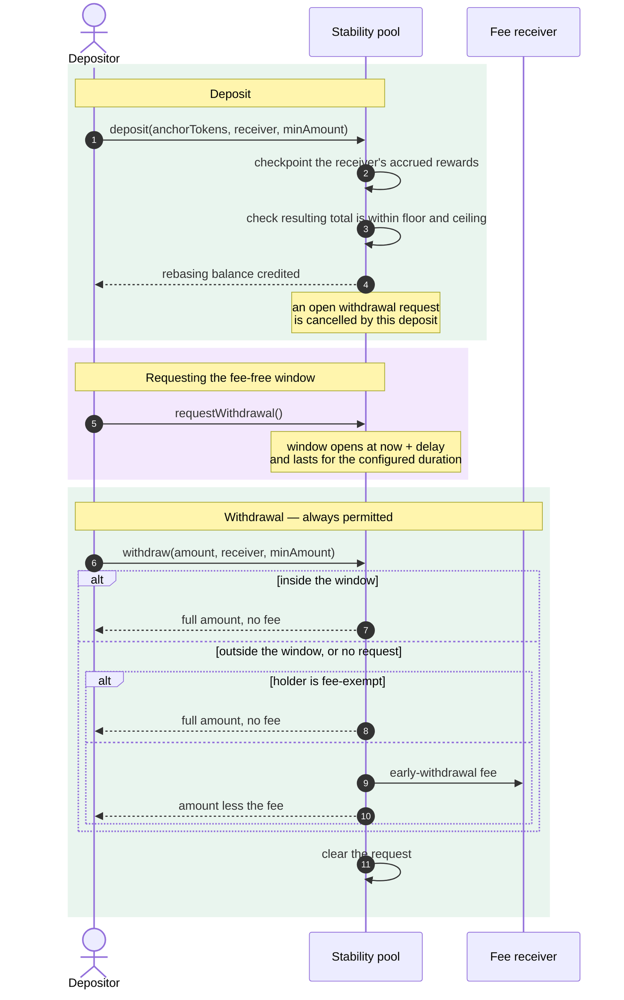

**Outcome.** The depositor's anchor tokens are held by the pool, accruing rewards and standing ready
to absorb a liquidation.

**Notable properties.**
- **Funds are never locked.** The window governs whether a *fee* applies, not whether withdrawal is
  possible. A depositor who never requests a window can still leave at any time, paying the fee.
- Depositing during an open window **cancels** it — a window cannot be kept open while adding funds.
- The floor is enforced on the *resulting total*, symmetrically for deposit and withdraw.
- Balances rebase on liquidation; **allowances do not**. An approval granted before a rebase
  represents a larger fraction of the reduced balance afterwards. Granting an unlimited approval is
  the way to express proportional authority. (This matches the behaviour of other rebasing tokens
  such as stETH.)

### 5.6 Rebalancing

**Trigger:** any keeper, at any time. **Precondition:** the collateral ratio is **below** the
configured rebalance threshold — otherwise the call reverts with a specific error.

This is the protocol's principal defence. It converts anchor tokens held in the stability pools back
into collateral or sail tokens, reducing the anchor supply and raising the collateral ratio, and
pays the pools' depositors for absorbing it.

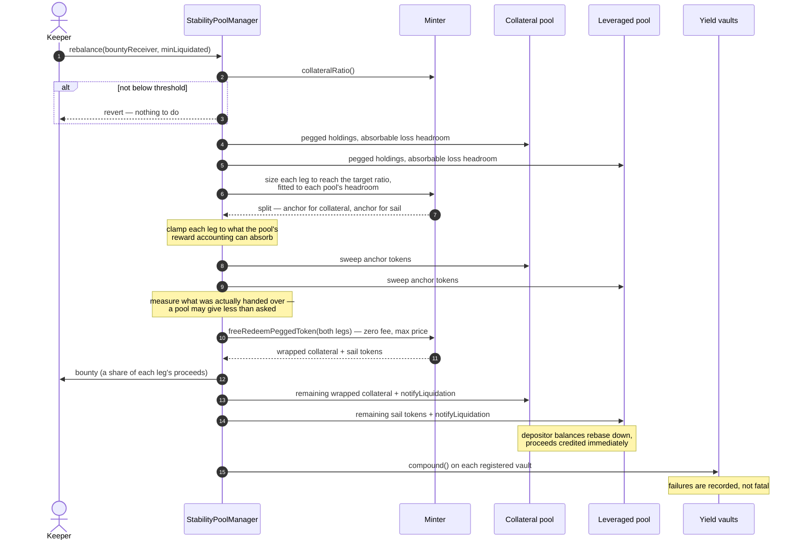

**Outcome.** Anchor supply falls; the collateral ratio rises to the threshold, or as close as the
pools' combined capacity allows. Depositors' balances shrink and they receive the proceeds. The
keeper is paid.

**Notable properties.**
- **The split is fitted, not merely proportional.** Each leg starts proportional to the pools'
  anchor holdings, but a pool whose share exceeds its capacity is capped there and the shortfall
  *slides into the other pool's leg*. One call therefore reaches the threshold wherever the combined
  capacity allows it; where it does not, the call liquidates the combined capacity and a later call
  continues.
- **Proceeds are measured, not assumed.** The manager measures what each pool actually handed over
  and drives the redemption and crediting from those actuals — a pool is never left backing supply it
  no longer holds.
- **Liquidation is priced favourably to depositors:** zero fee, maximum of the price band.
- **Two capacity bounds apply per leg** — how much loss the pool may absorb before reaching its floor,
  and how much reward its accounting can credit at once. Excess is deferred to a later call rather
  than overflowing.
- Compounding the yield layer is a **best-effort tail step**: a failing vault is recorded and
  skipped, never allowed to block the rebalance.

### 5.7 Harvesting

**Trigger:** any keeper, at any time. **Precondition:** there is fairly distributable yield.

The collateral is yield-bearing, so the value it is worth in underlying terms grows. Since anchor
tokens are backed by the *underlying* amount, that growth is a surplus belonging to no claim in the
accounting identity. Harvesting moves it to the stability-pool depositors.

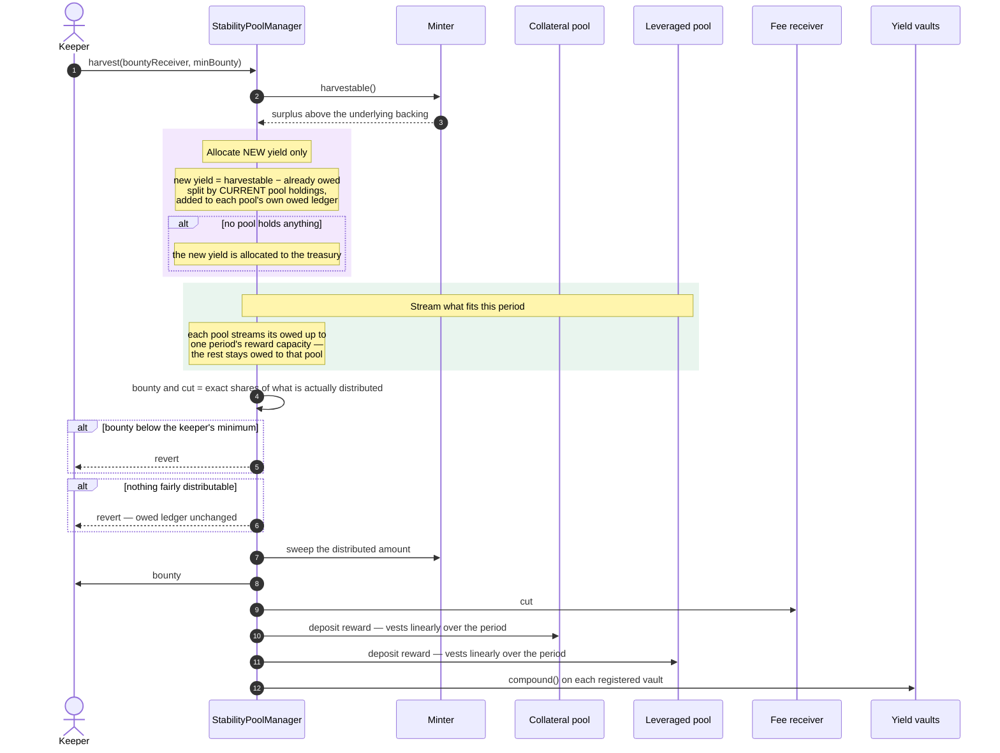

**Outcome.** The collateral's accrued yield reaches stability-pool depositors, vesting linearly over
the reward period. The keeper and the fee receiver take their configured shares of what actually
moved.

**Notable properties.**
- **Each pool has its own owed ledger.** Yield deferred past one period's capacity stays with the
  pool that earned it and is never re-split. A pool that held nothing when a backlog accrued never
  receives any of it.
- **Only genuinely new yield is allocated by current holdings** — so joining a pool does not
  retroactively earn a share of a backlog.
- **Bounty and cut are taken on value actually distributed**, not on the owed backlog. A keeper's
  reward always matches the yield its call consumed.
- **Every party takes its own floored share.** No party is handed another's rounding shortfall; the
  remainder stays un-owed and is reconsidered on the next call.
- If the surplus *shrinks* — a fall in the wrapped asset's rate — each pool's owed is written down
  proportionally, so the ledger never claims more than the protocol holds.
- Harvesting deliberately defers rather than failing when capacity binds. Waiting, not harvesting
  more often, is the recovery.

### 5.8 Claiming rewards

**Trigger:** user action, at any time.

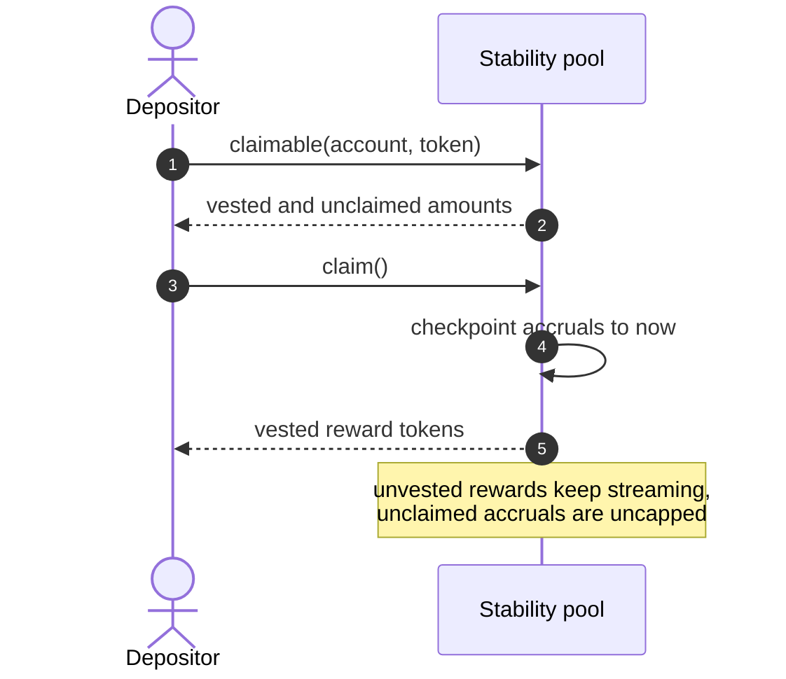

**Outcome.** The depositor holds their vested rewards. Claiming is optional and never required to
preserve accrual — a depositor who never claims loses nothing.

### 5.9 Interaction with the layers above

The core protocol connects to the yield layer at exactly two seams, both narrow by design.

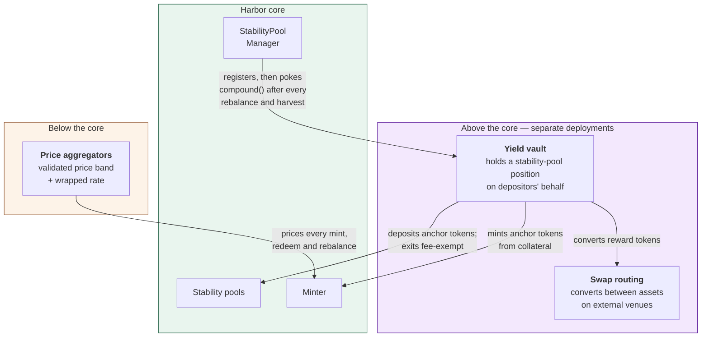

**What the core provides to the layer above:**
1. A **registry of yield vaults**, each poked to compound after every rebalance and harvest, so
   reinvestment tracks reward arrival without a separate keeper schedule. Failures are recorded and
   skipped.
2. A **fee exemption role** on stability-pool withdrawal, so protocol-internal exits are not charged
   the early-withdrawal fee.
3. A **deposit forecast**, so a vault pricing a deposit never has to assume the credit equals the
   input.

**What the core requires from below:** a price source returning a validated *band* — minimum and
maximum underlying price, minimum and maximum wrapped-to-underlying rate — with invalid, zero or
stale readings causing a revert rather than a mispriced trade.

The core protocol performs **no swaps**. All conversion between assets happens in the layer above.

---

## 6. Background processes

Harbor has no scheduler. Nothing in it runs on a timer, and no privileged operator is required to
keep it healthy. Everything that must happen without a user asking for it falls into one of three
categories:

- **Keeper-triggered** — the protocol pays anyone to call it. Rebalancing, harvesting, compounding.
- **Passive** — happens with the passage of time, needing no transaction at all. Reward vesting,
  withdrawal windows.
- **External** — happens outside the protocol entirely. Collateral yield accrual, price feed updates.

This section states, for each, what triggers it, who may run it, what it pays, and — the question
most easily overlooked — **what degrades if it never runs**.

### 6.1 The keeper loop

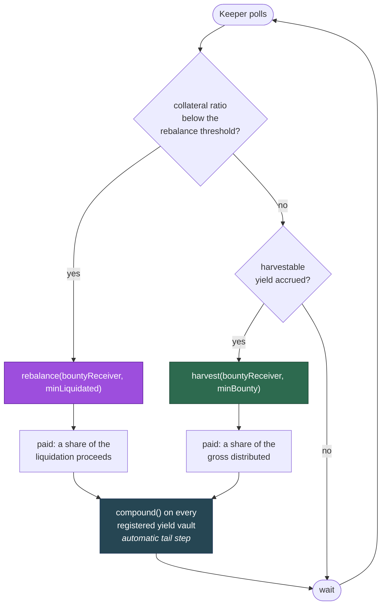

Both keeper entry points are **permissionless, unprivileged and self-guarding**. A keeper chooses
only *when* to call, never what the call does: the amounts, the split and the bounty are all
computed by the protocol from its own state. A keeper that calls at the wrong moment wastes gas and
nothing else.

Both also let the caller protect itself. Each accepts a **minimum** — minimum pegged liquidated,
minimum bounty — so a call that would be unprofitable reverts rather than executing at a loss. And
each exposes a read-only check (`rebalanceable()`, `harvestable()`) so a bot can decide without
simulating.

### 6.2 Rebalancing

| | |
|---|---|
| **Trigger** | Collateral ratio strictly below the configured rebalance threshold |
| **Who may call** | Anyone |
| **Pays** | A configured ratio of each leg's liquidation proceeds, to a nominated receiver |
| **Refuses** | Reverts with a specific error if the ratio is *not* below the threshold — never silently no-ops |
| **Cadence** | Event-driven: whenever the collateral price falls far enough |

**If it never runs.** The collateral ratio stays below the threshold and the system does not
self-heal through the stability pools. It is not immediately insolvent — the fee and discount
schedule keeps pushing users toward the restoring actions (§7), and those alone may recover the
ratio. But the pools are the protocol's *only* mechanism that raises the ratio without needing a
user to volunteer, so with rebalancing stalled the system depends entirely on market participants
finding the discounts attractive. If the collateral price keeps falling, the ratio can reach 1 and
the anchor token depegs.

**Why this is unlikely to stall.** The bounty is paid in the same assets the rebalance releases, and
rebalancing is most profitable exactly when it is most needed. The failure mode that matters is not
"no keeper is interested" but "no keeper can transact" — a network-wide congestion or censorship
event — which no in-protocol mechanism can fix.

**Partial progress is normal, not a failure.** Where the pools' combined capacity cannot reach the
threshold in one call, the rebalance liquidates what capacity there is and a later call continues.
A keeper seeing the ratio still below threshold after a successful rebalance should call again.

### 6.3 Harvesting

| | |
|---|---|
| **Trigger** | Distributable yield has accrued in the Minter |
| **Who may call** | Anyone |
| **Pays** | A configured ratio of the gross **actually distributed** by that call |
| **Refuses** | Reverts if nothing is fairly distributable, or if the bounty would be below the caller's minimum |
| **Cadence** | Discretionary — the yield accrues continuously and keeps |

**If it never runs.** Stability-pool depositors receive no yield. **Nothing is lost**: the yield
remains in the protocol as a real surplus of wrapped collateral, and a later harvest sweeps it.

Two consequences are worth stating precisely, because they are counter-intuitive:

1. **Uncollected yield does not inflate the collateral ratio.** The ratio is computed from the
   *tracked underlying backing*, not from the wrapped balance actually held. The surplus sits
   outside that measure. So a system with a large unharvested backlog **understates its own health**
   by exactly that amount — it is more solvent than it reports, never less. This is deliberately
   conservative: it means an unharvested backlog can never mask a genuine solvency problem, and it
   means a rebalance triggered while a backlog exists is triggered on honest numbers.
2. **A backlog drains slowly, by design.** Each call streams at most one reward period's capacity per
   pool; the rest stays owed. Recovery from a large backlog is by **waiting** across periods, not by
   harvesting more often. Calling repeatedly within a period achieves nothing.

**The keeper's incentive weakens as the backlog grows**, because the bounty is a share of what a
call actually distributes, not of the backlog. This is the correct behaviour — it prevents a keeper
being overpaid for one call that happens to follow a long quiet period — but it means harvesting is
a steady-drip activity rather than an opportunistic one.

### 6.4 Yield-vault compounding

| | |
|---|---|
| **Trigger** | Automatic tail step of **every** rebalance and harvest; also callable directly |
| **Who may call** | Anyone, directly on a vault; the manager calls registered vaults automatically |
| **Pays** | Nothing at the core-protocol level |
| **Refuses** | Never fatally — a failing vault is recorded and skipped |
| **Cadence** | Tracks reward arrival, because rewards only arrive via rebalance or harvest |

Coupling compounding to reward arrival is the point: rewards can only appear through a rebalance or
a harvest, so poking the vaults at the end of each means compounding needs **no separate keeper
schedule and no timer**. It cannot lag behind reward arrival, because it is triggered by it.

**Isolation is deliberate.** A vault that reverts — for any reason, including having nothing to
compound — must not be able to block a rebalance. Rebalancing is a solvency operation and cannot be
held hostage by a layer above. Failures are therefore caught and emitted as an event for off-chain
monitoring rather than propagated.

**If it never runs.** The vault's rewards sit unclaimed in the stability pool, so the vault's share
price stops growing. Depositors are not harmed beyond the lost compounding, and anyone can call the
vault directly to catch up.

### 6.5 Reward vesting (passive)

| | |
|---|---|
| **Trigger** | The passage of time |
| **Who may call** | Nobody — no transaction exists |
| **Cadence** | Continuous over the 1-week reward period |

Harvested rewards do not arrive claimable; they stream linearly over a fixed one-week period.
Liquidation proceeds, by contrast, are credited in one step.

Vesting cannot stall, and a depositor need do nothing to keep accruing. **Claiming is never required
to preserve accrual** — a depositor who never claims loses nothing, and unclaimed accruals are
uncapped.

The one behaviour worth knowing: a reward smaller than the period length streams at a rate that
rounds to zero, so a dust-sized harvest deposit would distribute nothing. The harvest therefore
declines to make such a deposit and leaves the value owed instead.

### 6.6 Withdrawal windows (passive)

| | |
|---|---|
| **Trigger** | A depositor's request, then the passage of time |
| **Who may call** | The depositor, for their own request |
| **Cadence** | Per depositor |

Requesting a withdrawal opens a fee-free window that begins after a configured delay and lasts a
configured duration; both are fixed at deployment, must be non-zero, and are capped at one year.

The window governs **whether a fee applies, never whether withdrawal is possible**. There is no
lock-up: a depositor with no request, or one whose window has passed, may still withdraw at any
time by paying the early-withdrawal fee. Missing a window costs a fee, never access.

Two rules stop the window being gamed: a successful withdrawal clears the request immediately, and
a deposit made during an open window cancels it — so a window cannot be held open while topping up.

### 6.7 Collateral yield accrual (external)

| | |
|---|---|
| **Trigger** | The collateral protocol's own mechanics |
| **Who may call** | Nobody within Harbor |
| **Cadence** | Continuous |

The wrapped collateral is worth progressively more of its underlying over time. Harbor observes this
only as a rising conversion rate reported by its price source, and the resulting surplus is what
harvesting distributes.

**The rate can also fall** — through a slashing event, or a change in the collateral protocol. Two
mechanisms respond:

- The harvest's owed ledger is **written down proportionally** if the surplus shrinks below what is
  already owed, so it never claims more than the protocol holds.
- If the wrapped asset itself is impaired, the owner must **reset** the recorded backing to match
  what is actually held (US-16). Without it the system would report more backing than exists, and —
  critically — a rebalance that *should* trigger would not, because the ratio would read too high.

### 6.8 Price feed maintenance (external)

| | |
|---|---|
| **Trigger** | The feed operator's own schedule |
| **Who may call** | Nobody within Harbor |
| **Cadence** | Per feed |

Harbor reads a validated band rather than a point (§2.5). The validation is strict, and every
failure mode **reverts** rather than returning a substitute:

| Condition | Response |
|---|---|
| Price zero or negative | Revert |
| Price older than the staleness threshold | Revert |
| Abnormal deviation between rounds | Revert |
| Feed call fails | Revert |
| Wrapped-to-underlying rate zero | Revert — a zero rate is a unit conversion, not an economic state, so it can only mean a faulty oracle |

**If the feed stops.** Everything priced from it stops: minting, redeeming and rebalancing all
revert. This is fail-safe rather than fail-open — the protocol refuses to transact at an unknown
price rather than transacting at a wrong one — but it is a genuine **liveness** cost, and it is the
one background dependency whose failure halts the market. It is carried into §9 as an availability
risk rather than a solvency one.

Note that stability-pool deposits, withdrawals and reward claims **do not read the oracle**, so
depositors retain access to their positions even while the market is halted.

### 6.9 Reserve pool replenishment (passive)

| | |
|---|---|
| **Trigger** | A share of collected fees, or a direct transfer |
| **Who may call** | Anyone may fund it; only the owner may withdraw |
| **Cadence** | Discretionary |

The reserve pool funds discounts and is **best-effort by design**: it hands out what is asked for,
or as much as it has, and never reverts for being short.

**If it empties.** Discounts silently stop applying and the health-improving actions proceed at zero
fee instead. No operation fails. The forecast functions report the *available* discount rather than
the configured one, so a user is never quoted a subsidy that will not be paid.

The consequence is a **weakening, not a breaking**, of the incentive design: the actions that restore
health remain free and remain permitted, they simply stop being paid for. §7 explains why free-and-
permitted is the load-bearing part and the subsidy is the accelerator.

---

## 7. Economic and incentive design

### 7.1 The single lever

Every fee and every discount in the minting system is expressed as one signed number, the
**incentive ratio**, scaled so that 1.0 means 100%:

| Value | Meaning |
|---|---|
| `+1.0` | **Disallowed** — a 100% fee is the encoding for "this action may not happen here" |
| `> 0` | A **fee**: the user receives less than the arithmetic exchange rate |
| `0` | Free — the exact arithmetic rate |
| `< 0` | A **discount**: the user receives *more* than the arithmetic rate, funded by the reserve pool |
| `-1.0` | Excluded — a 100% discount is not representable |

Encoding "disallowed" as a fee of 100%, rather than as a separate flag, means the same lookup, the
same validation and the same arithmetic path handle permission and pricing together. There is no
second code path for the blocked case, and therefore no way for the two to disagree.

### 7.2 Bands, and how a large order is priced

Each of the four actions has its own schedule: a list of collateral-ratio **bands**, each with one
incentive ratio. Up to 8 bands per action.

The critical property is that a large order is **not** priced wholesale at the band it starts in.
Every mint and redeem *moves* the collateral ratio, so a large order walks across bands, and each
slice is priced at the band it actually occupies as the ratio moves through it.

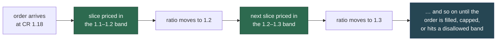

Three consequences:

- **Size is self-limiting.** An order large enough to damage the system's health pays progressively
  more for the damage it does. No separate size cap is needed.
- **Hitting a disallowed band fills partially rather than reverting.** The order transacts up to the
  boundary and stops. The user gets what was permitted instead of nothing.
- **A fee cap is a rate, not a budget.** The capped-mint variant (US-3) stops when the *rate* exceeds
  the cap. Offering more collateral does not buy a larger fee budget to spend at a steeper rate —
  otherwise a large order could cross into bands the cap was meant to exclude.

Rounding on every slice favours the protocol, so an order never issues more than the exact formula
would give.

### 7.3 The four schedules and their directions

Two actions consume system health and two restore it. The schedule for each is shaped accordingly:

| Action | Effect on collateral ratio | Priced to be… | May be discounted? | May be disallowed? |
|---|---|---|---|---|
| **Mint anchor** | Falls | Expensive when unhealthy | **No** | **Yes** |
| **Redeem anchor** | Rises | Rewarding when unhealthy | **Yes** | **No** |
| **Mint sail** | Rises | Rewarding when unhealthy | **Yes** | **No** |
| **Redeem sail** | Falls | Expensive when unhealthy | **No** | **Yes** |

The final two columns are not conventions — they are **enforced by validation** and are the most
important structural property of the whole design. See §7.5.

**Schedules are per market, not per protocol.** Each market picks a **volatility class** sized to its
underlying's expected price behaviour — currently classes for rebalance thresholds of 1.05, 1.15,
1.25 and 1.30, each with a `_stable` variant. The class supplies both the fee schedule *and* the
rebalance threshold that goes with it, so the two are always consistent. A market on a volatile
underlying is configured very differently from one on a stable peg.

One deployed class, the 1.30 threshold, to show the real shape:

| Collateral ratio | Mint anchor | Redeem anchor | Mint sail | Redeem sail |
|---|---|---|---|---|
| **< 1.00×** (depegged) | **disallowed** | −1% | **99.9999%** (see below) | **disallowed** |
| 1.00 – 1.10× | **disallowed** | −0.75% | −2.5% | 4% |
| 1.10 – 1.29× | **disallowed** | −0.3% | −1% | 4% |
| 1.29 – 1.31× | **disallowed** | 0% | 0% | 2.5% |
| 1.31 – 1.40× | 2% | 0% | 0% | 2.5% |
| 1.40 – 1.50× | 1% | 0.25% | 0% | 2% |
| 1.50 – 1.80× | 0.75 → 0.33% | 0.33 → 0.5% | 0% | 1.5 → 1.25% |
| **> 1.80×** | 0.25% | 0.5% | 0.25 → 1% | 1% |

Read across any row and the pattern holds: **the two actions that help are cheap or paid; the two
that hurt are expensive or shut off**, and the gap widens as health worsens. Two features of the
real schedule are worth drawing out, because both are sharper than the principle suggests:

- **Anchor minting is shut off well before a depeg.** The disallow band ends just *above* the
  rebalance threshold — 1.31 for a 1.30-threshold market — and every deployed class follows the same
  `threshold + 0.01` rule. The system stops issuing new anchor claims **before** it enters rebalance
  territory, rather than waiting until it is already under-covered.
- **Magnitudes are single-digit.** The steepest fee in this class is 4%. The schedule works by
  *shutting off* the damaging action at the boundary, not by pricing it punitively — the disallow
  does the heavy lifting, and the percentages handle the healthy range.

### 7.4 The self-correcting loop

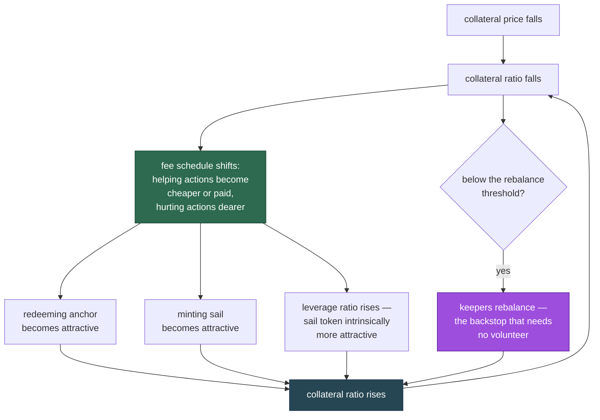

Note the third arm, which costs the protocol nothing: as the collateral ratio falls the **leverage
ratio rises**, so the sail token becomes a more leveraged instrument exactly when the protocol most
wants someone to buy it. The fee schedule reinforces an incentive the mathematics already supplies.

The distinction that matters under stress is between the **market arms** (the first three, which
need someone to volunteer) and the **backstop** (rebalancing, which needs only a keeper acting for a
bounty). The market arms are faster and cheaper when they work; the backstop is what makes the
system safe when they do not.

### 7.5 What the validation makes impossible

Configuration is validated when submitted, and rejected with an error naming the offending entry.
Some rules are arithmetic hygiene; two are structural guarantees.

**Arithmetic hygiene:**

| Rule | Rejected because |
|---|---|
| Band bounds strictly increasing | Overlapping bands have no defined price |
| First bound ≥ 1.0, later bounds > 1.0 | Bands below the depeg boundary are meaningless |
| Ratios array exactly one longer than bounds | Every band needs a price, including the open-ended top one |
| At most 8 bands | Fixed storage layout |
| Values not more precise than storage | A value that would silently truncate is refused rather than rounded |
| First band must either end exactly at 1.0 or be a disallow | Keeps depegged pricing in a band of its own, so the different arithmetic never straddles a boundary |

**The two structural guarantees**, which are the ones users depend on:

1. **Anchor redemption and sail minting can never be disallowed.** Their permitted range is the open
   interval (−1, +1), which *excludes* +1. Since +1 is the only encoding for "disallowed", these two
   actions are unblockable by construction — there is no configuration, valid or invalid, that
   closes them.

   **This guarantee is load-bearing for anchor redemption and largely nominal for sail minting.**
   The interval is open, so a fee of 99.9999% is representable and is economically a block. The
   deployed schedules use exactly that for sail minting in the depegged band — and for a sound
   reason rather than to evade the rule: below a collateral ratio of 1 the residual claim is zero or
   negative, so there is no meaningful price at which to issue sail tokens, and the mint must not
   proceed. The rule's real effect is therefore to force such a block to be expressed as a priced
   fee that the arithmetic still handles, rather than as a hard gate. For **anchor redemption**,
   where a genuine exit must always exist and no arithmetic obstacle arises, no deployed schedule
   goes near the boundary and the guarantee bites as intended.
2. **Anchor minting and sail redemption can never be discounted.** Their permitted range is [0, +1],
   which excludes negatives. The protocol cannot be configured to *pay* users to damage its own
   health.

Together these mean **the exits that restore solvency are always open, and the actions that consume
it are never subsidised.** An anchor holder always has a redemption path; the reserve pool can never
be drained to fund the wrong direction.

**The precise scope of this guarantee:** it constrains *configuration*, not *upgrade*. No owner
transaction against the deployed schedule can close an exit, whether by mistake, under pressure or
deliberately. An owner who replaces the implementation is not bound by it, because the validation
lives in the code being replaced. Upgrade authority remains the system's root trust assumption and
is treated as such in §9.10 — the validation narrows what can go wrong by accident to nothing, and
leaves what can go wrong by intent to governance.

A further restriction: a disallow, where permitted at all, may only appear in the **first** band —
the depegged one. Blocking can therefore only ever apply at the bottom of the range, never carved
into the middle of an otherwise healthy schedule.

### 7.6 Discounts and the reserve pool

A discount pays the user more than the arithmetic rate, and the difference comes from the reserve
pool. This makes it the only incentive with an **external funding requirement**, and therefore the
only one that can fail to be delivered.

The design handles that by making the shortfall harmless:

- The reserve pool hands over what is requested, or its whole balance if that is less. It never
  reverts for being short.
- A partly-funded or unfunded discount reduces to a smaller discount, or to zero — the action still
  completes.
- The forecast functions report the **available** discount, so a user is never quoted a subsidy that
  will not be paid.

The relationship to §7.5 is what makes this safe: because the health-restoring actions can never be
*disallowed*, an empty reserve pool degrades the incentive from "paid" to "free", never to
"blocked". The subsidy is an accelerator; permission is the load-bearing part, and permission needs
no funding.

### 7.7 Keeper compensation

Keeper pay is structured differently from user fees — it is a share of value the keeper's own call
released, never a charge on a third party.

| | Rebalance bounty | Harvest bounty | Harvest cut |
|---|---|---|---|
| **Paid to** | Whoever triggers it (nominated receiver) | Whoever triggers it (nominated receiver) | The fee receiver |
| **Taken from** | Each leg's liquidation proceeds | The gross actually distributed | The gross actually distributed |
| **Paid in** | Wrapped collateral and sail tokens | Wrapped collateral | Wrapped collateral |
| **Bound** | ≤ 100% | Bounty + cut ≤ 100%, **validated as a pair** | as bounty |
| **Default** | 0 | 0 | 0 |

Three properties are worth drawing out:

- **The bounty is taken on value actually moved, never on a backlog.** A keeper's reward always
  matches the yield its call consumed, so a long quiet period does not create an oversized payout
  for the first caller afterwards.
- **The harvest bounty and cut are set as a pair, and can only be set as a pair.** What a stability
  pool receives is the residual the two leave, so a pair summing above 100% describes a split that
  does not exist. Setting them one at a time could only reject such a pair after the fact; setting
  them together makes it unrepresentable, and lets any valid pair be reached in one call from any
  other.
- **Every party takes its own floored share.** The bounty, the cut, each pool's net and the
  treasury's residual are each floored independently. Nobody is handed another party's rounding
  remainder; what is left over stays undistributed and is reconsidered on the next call.

### 7.8 The early-withdrawal fee

The stability pools carry one further incentive, aimed at a different problem: a backstop is only
useful if it is still there when needed, so depositors are encouraged to leave **predictably**
rather than suddenly.

- Requesting a withdrawal opens a fee-free window after a delay.
- Withdrawing inside the window is free; outside it, or with no request at all, costs the fee.
- The fee goes to the fee receiver, and is capped at 100% by validation.
- Designated addresses are **exempt** — protocol-internal exits, such as the yield layer's, are not
  penalised for routing through the pool.

The deliberate choice here is that this is a **fee, not a lock**. Funds are never frozen; the
protocol buys advance notice by pricing it, not by denying access. A depositor who needs to leave
immediately always can.

---

## 8. Invariants

These are the properties the system must never violate. They are stated so that each is
**checkable** — as a test assertion, a monitoring alarm, or an auditor's question — rather than as
prose about intent. Where a property is guaranteed *by construction* (it cannot be expressed
falsely) rather than *by check* (it is verified at runtime), that is stated, because the two carry
very different assurance.

### 8.1 Accounting

| # | Invariant | Assurance |
|---|---|---|
| **A1** | Collateral value = anchor claim + sail claim. The sail claim is *defined* as the residual. | By construction — no code path can break an identity nothing computes independently |
| **A2** | **Wrapped collateral is exactly conserved** across every mint and redeem: the change in the user's balance, the protocol's, the fee receiver's and the reserve pool's sums to zero, **to the wei**. Holds through depeg. | By check — asserted exactly across the tested envelope |
| **A3** | The protocol never redeems more anchor tokens than **it** issued. | By check — issuance is tracked independently of token supply |
| **A4** | Sail token supply equals exactly what the protocol issued. | By construction — the protocol is the only minter and burner |
| **A5** | Rounding always favours the protocol: a mint never issues more than the exact formula, a redeem never returns more. | By check — verified per band slice, not merely in aggregate |

**A2 is the strongest claim in the document** and deserves emphasis: this is exact conservation, not
conservation within a tolerance. Every unit of wrapped collateral that leaves one party arrives at
another. There is no rounding sink, and no path that quietly creates or destroys collateral.

**A3 is what makes the anchor token safely multi-chain.** Anchor tokens are ordinary ERC-20s and may
exist from other sources — another chain's deployment, or another issuer. Because the protocol
redeems only against its own issuance count rather than against token supply, foreign tokens cannot
reach this market's collateral.

### 8.2 Pricing

| # | Invariant | Assurance |
|---|---|---|
| **P1** | Every priced operation reads a **validated band**, never a single point. | By construction |
| **P2** | An invalid, zero, stale or abnormally-deviant reading **reverts**. No operation proceeds on a substitute, a cached, or a default price. | By check |
| **P3** | A zero wrapped-to-underlying rate reverts — a rate of zero is a unit conversion, not an economic state, so it can only mean a faulty oracle. | By check |
| **P4** | The end of the band used is always the one conservative for solvency, chosen per operation and per direction. | By construction |
| **P5** | Liquidation prices at the band's **maximum** — the end most favourable to the depositors absorbing the loss. | By construction |

### 8.3 Stability pool

| # | Invariant | Assurance |
|---|---|---|
| **S1** | Once seeded, `floor ≤ total supply ≤ ceiling`. Enforced on the **resulting total**, symmetrically for deposit and withdraw. | By check |
| **S2** | The loss factor is **always strictly positive** — a liquidation can never round to a total loss and brick every balance read. | By construction, *given* S1: the ceiling is precisely the largest supply at which the floor-capped loss keeps the factor non-zero |
| **S3** | A liquidation never takes the pool below its floor; every depositor retains a share of the minimum. | By check — capped at the manager *and* re-enforced inside the pool as a backstop |
| **S4** | The reward divisor is held **at or above** the summed depositor balances, so credited shares sum to no more than the reward. | By construction — rewards conserve, they are not merely close |
| **S5** | Deposits credit **one-for-one from an explicit ledger**. No balance, and no supply figure, is ever derived from the contract's token balance. | By construction |
| **S6** | Withdrawal is always permitted. The window governs whether a *fee* applies, never whether access exists. | By construction — there is no code path that refuses a withdrawal for timing |
| **S7** | A value too large for its storage field **reverts**; it is never truncated. | By check — checked narrowing casts throughout |

**S2 is the reason the floor and ceiling exist**, and it is worth stating plainly because both are
easily mistaken for risk limits. They are neither risk nor policy parameters: they are the bounds
within which the liquidation arithmetic remains exact. The ceiling is *derived* from the floor for
exactly this reason.

**S5 is a structural immunity, not a mitigation.** Because no accounting quantity is read from the
contract's token balance, transferring tokens directly to a pool changes nothing — no balance, no
supply, no share price. The donation and first-depositor inflation attacks that afflict
balance-derived vault accounting have **no expression here**: there is no share price to inflate.

**S7 closes a real historical defect.** The failure mode it prevents is the dangerous one — value
accepted, then silently truncated in storage, so the system's records and its holdings disagree
without anything failing. The guarantee is now "no known silent failures": a value the system cannot
handle is refused loudly, never mis-recorded.

### 8.4 Harvest distribution

| # | Invariant | Assurance |
|---|---|---|
| **H1** | The sum of what the pools are owed never exceeds what the protocol actually holds as surplus. If the surplus shrinks, each pool's owed is written down proportionally. | By check |
| **H2** | A pool's owed is **its own**. Value deferred past one period's capacity is never re-split to the other pool. | By construction |
| **H3** | Only genuinely new yield is allocated by current holdings, so joining a pool never earns a share of an existing backlog. | By construction |
| **H4** | Bounty and cut are taken on the gross **actually distributed**, never on the deferred backlog. | By construction |
| **H5** | `bounty + cut ≤ 100%`, validated as a pair. | By check |
| **H6** | Every party takes its own floored share; no party receives another's rounding remainder. The remainder stays undistributed and is reconsidered next call. | By construction |
| **H7** | A call with nothing fairly distributable **reverts**, rolling back any ledger mutation, rather than emitting a zero harvest. | By check |

### 8.5 Configuration

| # | Invariant | Assurance |
|---|---|---|
| **C1** | Anchor redemption and sail minting can never be disallowed. | By construction — the permitted range excludes the disallow encoding |
| **C2** | Anchor minting and sail redemption can never be discounted. | By construction — the permitted range excludes negatives |
| **C3** | A disallow may appear only in the first (depegged) band. | By check |
| **C4** | Band bounds are strictly increasing, and the first band covers the depeg boundary. | By check |
| **C5** | A value too precise for its storage schema is **rejected**, never silently rounded. | By check |

C1 and C2 are scoped to configuration, not upgrade — see §7.5 and §9.10.

### 8.6 What these invariants do *not* promise

Stating the boundary honestly matters as much as stating the guarantees:

- **They do not promise the anchor token holds its peg.** They promise the accounting is exact, the
  incentives point the right way, and the backstop is available. If the collateral falls far and
  fast enough, the collateral ratio can reach 1 and the anchor token depegs — and the system will
  report that truthfully rather than conceal it.
- **They do not promise a stability-pool depositor profits.** A depositor liquidated during a depeg
  can receive back less value than they deposited (§4, US-11). That is the risk the yield pays for.
- **They do not promise availability.** A failed price feed halts pricing (§6.8). Solvency is
  preserved; liveness is not.
- **They do not bind an upgrade.** Every invariant above describes the deployed code. Replacing that
  code replaces its guarantees (§9.10).

---

## 9. Attack vectors

Each vector is stated as **what an attacker would try**, **why it does not work** (or how far it
gets), and **what residual risk remains**. Where the defence is structural — the attack has no
expression in the design rather than being blocked by a check — that is called out, since it needs
no ongoing vigilance.

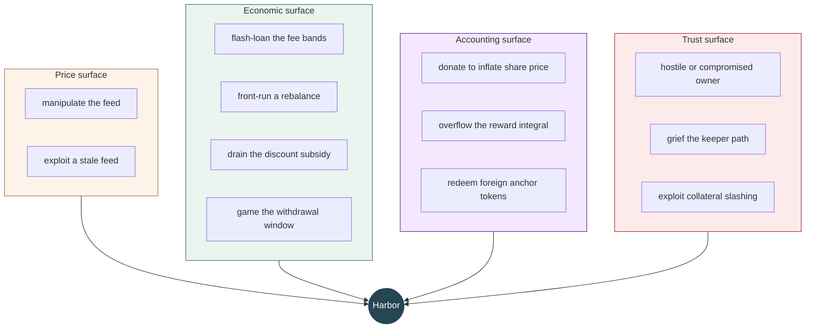

### 9.1 Price feed manipulation

**The attempt.** Move the reported collateral price to mint or redeem at a favourable rate — for
example, inflate the price, mint anchor tokens against overvalued collateral, then let the price
correct.

**Why it is hard.** The protocol reads a **band**, not a point, and picks the end conservative for
solvency in the direction of the operation. An attacker must therefore move *both* ends far enough
that the conservative end is still profitable — a strictly harder problem than moving a single
number. The feed additionally rejects abnormal round-to-round deviation, so a sharp move is refused
rather than consumed, and rejects stale data, so an old favourable reading cannot be replayed.

**Residual risk.** A sustained, genuine mispricing across the whole band — a compromised or
systemically wrong feed rather than a momentary spike — is not defended against by these checks and
would propagate into pricing. Feed integrity is a trust assumption, narrowed but not eliminated.

### 9.2 Stale-feed exploitation

**The attempt.** Wait for the feed to go stale and transact at the last good price.

**Why it fails.** Staleness beyond the configured threshold **reverts**. The protocol is fail-safe,
not fail-open: it refuses to transact at an unknown price rather than transacting at a wrong one.

**Residual risk.** This converts a correctness risk into an **availability** risk, and that trade is
deliberate. A dead feed halts minting, redeeming and rebalancing. Note the important limit on the
blast radius: stability-pool deposits, withdrawals and reward claims do **not** read the oracle, so
depositors keep access to their positions while the market is halted (§6.8).

The genuinely dangerous case is a feed that halts *while the collateral ratio is falling*: rebalancing
is priced and so also halts, and the system cannot backstop itself until the feed returns.

### 9.3 Flash-loaned fee-band traversal

**The attempt.** Borrow a large amount, move the collateral ratio far within one transaction, and
capture a favourable band — for instance push the ratio down into discount territory, redeem at the
discount, and repay.

**Why it fails, and the reason is stronger than pricing.** The two ways to push the ratio down are
minting anchor tokens and redeeming sail tokens, and the deployed schedules **shut both off** before
the ratio reaches the discount region:

- Anchor minting is **disallowed below the schedule's floor**, which sits just above the rebalance
  threshold (§7.3). An attacker cannot mint the ratio down into stressed territory at all.
- Sail redemption is **disallowed below a ratio of 1**.

So the attack is not merely made expensive — the lever is removed. Where it is still available the
fee schedule is additionally **slice-priced across bands** (§7.2), so any ratio movement pays every
band's fee on the way, and the discounts on the far side are small (around 1% in the deployed class
shown in §7.3) and bounded by the reserve pool's balance.

**Residual risk.** The defence rests on the disallow floor being configured above the region where
discounts begin. That relationship is a **calibration property, not a validated one**: the rules
enforce signs and disallow placement (§8.5), not that the floor sits above the discount bands. A
schedule that permitted minting into discount territory, with discounts exceeding the fees paid to
reach them, would open this. Every deployed class satisfies the relationship by following the
`threshold + 0.01` rule, but nothing in the contract requires it.

### 9.4 Timing the rebalance

Two mirror-image attempts, and they have different answers.

#### 9.4a Depositing just before, to capture the liquidation terms

**The attempt.** Deposit into a stability pool immediately before a rebalance to capture the
favourable liquidation terms — maximum price, zero fee — then leave.

**How far it gets.** This partly works, and is bounded rather than blocked. Liquidation *is*
favourable relative to redeeming directly whenever the redeem fee is positive, so near the rebalance
threshold there is a real edge. Four things bound it:

- The depositor is liquidated only **pro-rata**, so a late entrant dilutes their own capture.
- Exiting afterwards costs the **early-withdrawal fee** unless a window was opened in advance —
  which requires committing before the opportunity was visible.
- Deeper into stress the alternative improves: **direct redemption is discounted** (−5%, −10%),
  which can beat zero-fee liquidation outright.
- The deposit must satisfy the pool's minimum.

**Why this is tolerable, and arguably desirable.** The behaviour recapitalises the stability pool at
precisely the moment the protocol needs depth in it. An attacker "exploiting" this is supplying the
backstop on the eve of its use. The cost falls on incumbent depositors as dilution of the
liquidation reward, not on the protocol's solvency.

**Residual risk.** Dilution of existing depositors' liquidation proceeds by opportunistic late
entrants. Real, small, and structurally bounded by the four limits above.

#### 9.4b Withdrawing just before, to dodge the liquidation

**The attempt.** A depositor who anticipates a rebalance — by watching the collateral ratio, or the
mempool — withdraws beforehand and re-deposits afterwards. They avoid the liquidation entirely and
re-enter a now-smaller pool, so their share of every future harvest is larger.

**What it costs them today.** The rebalance itself is value-neutral, so the dodge yields **nothing at
the moment of the rebalance** — both the stayer and the dodger hold the same value immediately
afterwards. The gain is entirely in *future harvest share*: the stayer's balance has rebased down
while the dodger's has not.

Two mechanisms work against it:

- **The withdrawal window.** Leaving on short notice, outside an open window, costs the
  early-withdrawal fee. Opening a window requires committing before the opportunity was visible, and
  a deposit during an open window cancels it (§6.6). This is what the window is *for* — it prices
  exactly this manoeuvre.
- **Compounding restores the stayer.** For the collateral pool, the stayer's liquidation proceeds are
  wrapped collateral, which the yield layer can convert back into anchor tokens and redeposit —
  rebuilding the balance and closing the harvest-share gap. This is automatic, since compounding is
  triggered after every rebalance and harvest (§6.4).

**Residual risk, and it is asymmetric between the two pools:**

- **Collateral pool:** the gap is transient. It lasts from the rebalance until compounding can run at
  an acceptable mint fee, and the proceeds also earn their own yield in the meantime.
- **Leveraged pool:** the gap is **permanent**. The stayer's proceeds are sail tokens, which cannot
  be minted back into anchor tokens and are not yield-bearing, so nothing restores the balance. The
  stayer's harvest share stays permanently below the dodger's.

This is an accepted trade-off of choosing the leveraged pool rather than a defect, but it is real and
it is the sharpest unfairness in the design.

**A future upgrade addresses this.** [doc/ideas/rebalance-fairness.md](ideas/rebalance-fairness.md)
analyses the manoeuvre in depth and proposes replacing the fixed withdrawal window with a
**collateral-ratio-derived withdrawal fee** — computed from the Minter's own incentive ratios, so it
is naturally zero when the system is healthy and rises automatically under stress — together with an
**effective-share** mechanism that would let a stayer's unclaimed proceeds count toward their harvest
share, closing the leveraged-pool gap. **Neither is implemented, and neither is scheduled at this
stage.** Everything described in §5.5, §6.6 and US-12 is the current withdrawal-window behaviour.

### 9.5 Rebalance griefing

**The attempt.** Call `rebalance()` repeatedly to extract bounties without doing useful work, or to
disrupt.

**Why it fails.** A rebalance requires the collateral ratio to be **strictly below** the threshold,
and a successful rebalance moves it *to* the threshold. The immediate next call therefore reverts.
The only case where a second call succeeds is when the first was capacity-bound and could not reach
the target — in which case the second call performs genuine, needed work.

The bounty is a share of proceeds actually released, so there is no way to be paid for a call that
moves nothing.

### 9.6 Draining the discount subsidy

**The attempt.** Round-trip the discounted actions to extract the reserve pool — mint sail tokens at
a discount, redeem them back, repeat.

**Why it fails.** The two legs are priced against each other. Minting sail is discounted exactly
where redeeming sail is expensive, and below a ratio of 1 redeeming sail is **blocked outright**.
The round trip is loss-making in every band. The reserve is additionally best-effort: it pays what
it has, so the extractable amount is bounded by its balance regardless of the strategy.

**Residual risk.** The reserve pool can be **exhausted** by legitimate use — many users genuinely
redeeming anchor tokens during stress. That is the subsidy working as intended, not an attack, but
it means the discount cannot be relied on to be available when most wanted. §7.6 explains why this
degrades the incentive without breaking it: permission is load-bearing and needs no funding; the
subsidy only accelerates.

### 9.7 Withdrawal-window gaming

**The attempt.** Maintain a permanent fee-free exit option, defeating the notice the window is meant
to buy.

**How far it gets.** A diligent depositor can re-request as each window lapses and be eligible much
of the time. Two rules limit rather than prevent this: a withdrawal **clears** the request, so
another full delay must elapse before the next fee-free exit; and a deposit during an open window
**cancels** it, so a window cannot be held open while topping up.

**Residual risk.** Accepted by design. The fee is avoidable by an attentive depositor, and that is
the intended shape: the mechanism buys *notice*, not lock-up, and it prices sudden exit rather than
denying it (§7.8). A depositor who plans ahead is exactly the depositor the mechanism wants.

### 9.8 Donation and first-depositor inflation

**The attempt.** Transfer tokens directly to a stability pool to manipulate the ratio between shares
and assets — the classic ERC-4626 first-depositor attack.

**Why it has no expression here.** Pool accounting is an **explicit ledger**: deposits credit
one-for-one and no balance or supply figure is ever derived from the contract's token balance (S5).
A direct transfer changes no depositor's balance and no supply figure — the tokens are simply
stranded. **There is no share price to inflate.**

This is a structural immunity rather than a mitigation: it requires no minimum-liquidity seeding, no
virtual shares and no dead-share offset, and nothing about it can be tuned wrong.

### 9.9 Reward-integral overflow

**The attempt.** Force a reward so large relative to the pool that the per-share accumulator
overflows, bricking accounting.

**Why it fails.** Both reward paths are capped up front against the pool's remaining capacity, and
the excess is **deferred rather than truncated or reverted**:

- Streamed harvest rewards are capped at one period's capacity; the rest stays owed and drains over
  later periods.
- Immediately-credited liquidation proceeds are capped by scaling the leg *before* the redemption,
  so the sweep, the redeem and the crediting all agree.

The pool's floor underwrites this by bounding the divisor: a zero floor would admit a vanishing
share and an unbounded integral, which is why a zero floor is rejected at deployment.

**Residual risk.** Reaching either cap requires an extreme corner far outside normal operation, and
the consequence is deferral, not loss. The relevant operational note is the one in §6.3: recovery
from a large backlog is by waiting across periods, not by harvesting more often.

### 9.10 Hostile or compromised governance

**The attempt.** Use owner authority to extract value or trap users.

**What configuration cannot do.** The validation rules make the dangerous *configurations*
unrepresentable, not merely rejected: anchor redemption and sail minting cannot be disallowed, and
the health-consuming actions cannot be subsidised (C1, C2). No owner transaction against the
deployed schedule closes a user's exit.

**What upgrade can do.** Everything. Every contract is UUPS-upgradeable with the owner as the
upgrade authority, so an owner who replaces an implementation is not bound by any invariant in §8 —
the validation lives in the code being replaced. Three specific powers are worth naming:

| Power | Effect |
|---|---|
| Replace any implementation | Unbounded — supersedes every guarantee in this document |
| `reset()` the recorded backing | Intended for slashing (writing backing **down**), but bidirectional: called while a harvest surplus exists it writes backing **up** and absorbs the surplus, converting yield owed to depositors into collateral backing |
| Register a yield vault | Adds a contract that is called after every rebalance and harvest |

**Residual risk. This is the system's root trust assumption, and it is not reducible by design** —
only by the owner being a multisig with appropriate signers and process. Every other defence in this
section is conditional on it. Users should read §8's guarantees as "true of the deployed code",
never as "true regardless of governance".

### 9.11 Griefing through a registered yield vault

**The attempt.** Get a malicious contract registered as a yield vault, then have it revert or
consume gas to block rebalancing — holding a solvency operation hostage.

**Why it largely fails.** Vault compounding is isolated: failures are caught and recorded as an
event, never propagated, so a reverting vault cannot fail a rebalance or a harvest (§6.4).

**Residual risk.** Isolation catches reverts, not unbounded gas consumption — a vault that burns all
forwarded gas can still make the enclosing call expensive. The primary defence is therefore that
**registration is owner-gated**, which places this vector inside §9.10 rather than outside it.

### 9.12 Exploiting a collateral slashing event

**The attempt.** Transact in the window between the collateral asset being impaired and the protocol
recognising it — for example redeeming at a stale, too-favourable backing figure.

**Why it is limited.** The recorded backing is corrected by `reset()`, and the harvest's owed ledger
independently writes down proportionally if the surplus shrinks (H1).

**Residual risk, and it is real.** `reset()` is an **owner action, not an automatic one**. Between
the impairment and the owner's transaction the system reports more backing than exists, the
collateral ratio reads too high, and — most importantly — **a rebalance that should trigger will
not**, because the threshold check is made against the inflated ratio. This is a genuine timing
exposure requiring operational monitoring, not a self-correcting property.

### 9.13 Rebasing-balance approval semantics

**The attempt.** Exploit a stale approval across a rebase.

**The behaviour to understand.** Stability-pool balances rebase down on liquidation; **allowances do
not**. An approval granted before a rebase therefore represents a *larger fraction* of the reduced
balance afterwards. This matches other rebasing tokens such as stETH, but it surprises integrators
who assume a fixed-fraction authorisation.

**Mitigation.** Granting an unlimited approval is the way to express proportional authority.
Integrators holding a fixed-amount approval across a liquidation should re-evaluate it.

### 9.14 Keeper absence

**The attempt.** Not an attack so much as a failure mode: no keeper calls the background processes.

**Consequences,** covered in §6.2 and §6.3: rebalancing stalls, so the system loses its
volunteer-free backstop and must rely on the fee schedule attracting market participants; harvesting
stalls, so depositors earn nothing, though nothing is lost and the collateral ratio is *understated*
rather than overstated in the meantime.

**Residual risk.** Rebalancing is the one that matters. Its bounty is denominated in the assets it
releases and is most attractive exactly when most needed, so economic stall is unlikely; the real
scenario is an inability to transact at all — network congestion or censorship — which no
in-protocol mechanism addresses.

### 9.15 Summary

| Vector | Defence | Residual risk |
|---|---|---|
| Feed manipulation | Band, deviation and staleness checks | Sustained genuine mispricing |
| Stale feed | Reverts (fail-safe) | **Availability** — market halts, pool access survives |
| Flash-loan band traversal | Both ratio-lowering actions disallowed before the discount region; slice pricing | Floor-above-discounts is calibration, not validated |
| Rebalance timing — deposit before | Pro-rata dilution, exit fee, discounts compete | Dilution of incumbent depositors — small, bounded |
| Rebalance timing — withdraw before | Withdrawal window prices the exit; compounding restores the stayer | **Permanent harvest-share gap in the leveraged pool** |
| Rebalance griefing | Threshold check; bounty only on real proceeds | None material |
| Discount draining | Legs priced against each other; reserve best-effort | Reserve exhaustion under legitimate use |
| Window gaming | Withdraw clears request; deposit cancels window | Accepted by design — a fee, not a lock |
| Donation / first depositor | **Structurally absent** — explicit ledger, no share price | None |
| Reward-integral overflow | Capped and deferred, floor bounds the divisor | Deferral latency only |
| Hostile governance | Config validation; **upgrade unbounded** | **Root trust assumption** |
| Vault griefing | Failures isolated; registration owner-gated | Gas exhaustion; folds into governance trust |
| Collateral slashing | `reset()` plus proportional owed write-down | **Timing gap — reset is manual; rebalance may not trigger** |
| Rebase vs allowance | Documented semantics | Integrator error |
| Keeper absence | Bounties denominated in released assets | Inability to transact at all |

The two rows in bold type are the ones that cannot be engineered away and must be carried
operationally: **upgrade authority**, and the **manual reset after a slashing event**.

---

*Sections 10–11 (operational states, glossary) follow.*
