# Harbor — Functional Specification

**Status:** complete — sections 1–11.

This document describes **what the Harbor protocol achieves** — the outcomes it delivers, for whom,
and under what conditions. It is distilled from the code, its comments, and the existing
documentation; it does not precede the implementation.

It deliberately avoids naming contracts, libraries and functions except where a name is itself part
of the external surface (an ERC-20 token, a role, a public entry point a keeper must call). A
**follow-up design document** maps every function described here onto the contracts and libraries
that provide it.

---

## 1. Purpose and scope

### 1.1 What Harbor achieves

Harbor turns a single yield-bearing collateral asset into **two tokens with opposite risk
profiles**, and keeps them both honest without a liquidator, an auction, or a counterparty. **No
user's position is ever seized**: there is no liquidation price, no margin call, and nothing is sold
off at a discount to cover someone else's debt.

From a deposit of one collateral asset the protocol mints:

- an **anchor token** (an *ha* token, e.g. `haETH`, `haBTC`, `haUSD`), which tracks the value of a
  chosen underlying — a currency, a commodity, an index, anything with a price feed; and
- a **sail token** (an *hs* token, e.g. `hsfxUSD`), which absorbs everything the anchor token does
  not: a leveraged long position on the collateral.

The two are complementary by construction. Every unit of collateral value in the system is claimed
by exactly one of them. The anchor token holder gets stability; the sail token holder gets the
leverage, and pays for the anchor holder's stability by taking the price risk.

The protocol's job is to keep that split solvent — to ensure the collateral it holds is always
worth at least as much as the anchor tokens it has minted — using four mechanisms that operate at
different points of stress, described in §7 and §5.

### 1.2 What "solvent" means here

Harbor measures its own health with a single number, the **collateral ratio**: the value of the
collateral backing it, divided by the value of the anchor tokens it has minted. At a collateral ratio
above 1, every anchor token is fully backed and the surplus belongs to the sail tokens. At exactly
1, the sail tokens are worthless and the anchor tokens are exactly covered. Below 1 the anchor token
has *depegged* — it can no longer be redeemed for its face value, only for its pro-rata share of
what collateral remains.

Everything the protocol does — pricing, fees, subsidies, rebalancing — is aimed at keeping the
collateral ratio comfortably above 1, and at making the *approach* to 1 progressively more
expensive, so that it is arrested by ordinary self-interested behaviour rather than by intervention.

### 1.3 Scope of this document

**In scope: the Harbor core protocol** — the minting and redeeming of anchor and sail tokens, the
stability pools that backstop them, the genesis bootstrap, the reserve pool that funds subsidies,
the reward distribution to stability-pool depositors, and the keeper-driven background processes
(rebalancing, harvesting, compounding).

**Referenced but not specified here:**

- **Price aggregators** — a hard dependency. Every mint, redeem and rebalance is priced from a
  validated price; an invalid or stale reading stops the market (§2.5, §6.8).
- **The yield layer** — sits on the stability pools, holding a pool position on depositors' behalf.
  The relationship is asymmetric: Harbor makes one call into it (`compound()`), while it uses a small
  surface of Harbor built for it, notably fee-capped minting (§5.9).

Harbor performs no swaps; conversion between assets happens in the layer above.

**Out of scope entirely:** deployment mechanics, upgrade procedures, off-chain indexing, and the
front-end application.

### 1.4 One protocol, many markets

Harbor is deployed once per **market** — a (collateral asset, anchor underlying) pair. Each market
is an independent instance with its own tokens, its own stability pools, its own collateral ratio
and its own solvency. A stress event in one market has no mechanical effect on another. Currently
configured markets pair collateral such as wstETH, fxSAVE and sUSDe against underlyings including
ETH, BTC, EUR, gold, silver and a market-capitalisation index.

Throughout this document "the system" means one such market.

---

## 2. Domain model

### 2.1 The three assets

| Asset | What it is | Who holds it |
|---|---|---|
| **Collateral** | The asset backing the market, in two forms: the **collateral token** it is accounted in — stETH, fxUSD, USDe — and the yield-bearing **wrapped collateral token** actually held, wstETH, fxSAVE, sUSDe. The wrapper is worth progressively more collateral token over time. | The protocol (backing both tokens it has minted) |
| **Anchor token** (*ha*) | An ERC-20 whose value tracks a chosen underlying — a currency, commodity or index. Redeemable from the protocol for collateral. | Users, stability pools, the yield layer |
| **Sail token** (*hs*) | An ERC-20 whose value is the *residual*: the collateral value left over after every anchor token is covered. A leveraged long on the collateral. | Users, the leveraged stability pool |

Two properties of the anchor token matter for the design:

- It is an **ordinary ERC-20** and may be minted by means other than this protocol — including by a
  Harbor deployment on another chain. The protocol therefore tracks how many anchor tokens *it*
  minted and will never redeem more than that, so tokens minted elsewhere cannot drain this
  market's collateral.
- The sail token, by contrast, is **exclusive to the protocol**: only Harbor mints and burns it, and
  its total supply is exactly what Harbor has minted.

Both tokens accept a **signed approval** (EIP-2612 `permit`), so a holder can approve and act in one
transaction rather than sending a separate `approve` first. They are built on bao-base's
`PermittableERC20_v1` / `MintableBurnableERC20_v1`, and are exercised by the same shared
`PermitTestBase` suite as the protocol's other permit-bearing tokens, so all of them are held to one
definition of correct permit behaviour.

#### Held versus accounted

**Harbor holds the wrapped token but records the backing in collateral tokens** — and that recorded
quantity, not the wrapped balance, is what every health calculation uses. The two diverge, because a
fixed wrapped holding is worth steadily more collateral token. The difference is the **harvestable
surplus**: real, held, and belonging to no claim until harvested.

The holding can also be worth *less* than the record, when the collateral itself is impaired and the
conversion rate falls. Harbor does not decide by itself that such a fall is a loss — a rate can dip
and recover — so every price, ratio and fee band goes on reporting the **record**, and every
operation that would update it is **refused** while the record exceeds what the holding converts to
at the low edge of the oracle's rate band. That covers every mint and redeem, fee-paying and free,
and so the rebalance; each reverts `UnrecognisedImpairment(recorded, held)`. The market is **halted,
not repriced**, so nothing can act on cover it does not have. The halt lifts by itself if the rate
recovers, or when the owner calls `recogniseImpairment()`, which writes the record down to the
holding (§6.7, US-16). `impairment()` reports the two figures, so anyone can tell a halted market
before sending a transaction. In normal operation the record is the lower of the two and none of
this binds.

The unit of account is doing deliberate work here. Were the backing measured in wrapped tokens, the
collateral's yield would inflate it automatically; the anchor claim being fixed, all of that growth
would fall to the sail token. Recording it in collateral tokens quarantines the yield instead, so
harvesting can direct it to the stability-pool depositors backstopping the system (§5.7).

Hence: while the record is covered the collateral ratio understates health by the unharvested
surplus; while it is not, the ratio reports the record and nothing can act on it (§6.3); a harvest is
ratio-neutral; and correcting the backing after the collateral is impaired is a deliberate act, not
an automatic one (§6.7, §9.12).

### 2.2 The accounting identity

The model rests on one identity. Writing $C$ for the value of the collateral **accounted**, $P$ for
the value of the anchor tokens minted, and $L$ for the value of the sail tokens:

$$C = P + L$$

All three are measured in the same unit: the anchor token's underlying. The sail token's total value
is defined as the residual $L = C - P$, so the identity holds by construction rather than by
enforcement. The harvestable surplus sits outside the identity, which is what leaves it free to be
given away.

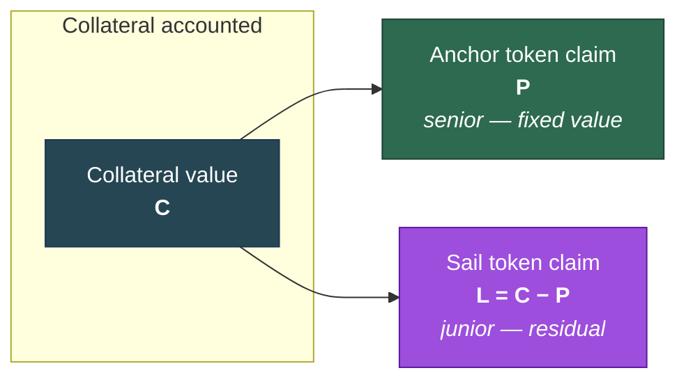

The anchor claim is **senior** — it is satisfied first, at face value. The sail claim is **junior** —
it takes whatever is left. That seniority is the entire source of the anchor token's stability and
the sail token's leverage.

It holds for **any** fall in collateral value, whatever the cause. A price fall and an impairment of
the collateral asset itself — a slashing, say — are the same event to this accounting: the residual
absorbs it, sail holders bear it, and the anchor claim is untouched until the residual is exhausted.
Nothing redirects value from elsewhere in the protocol to restore the junior claim.

### 2.3 The two health metrics

**Collateral ratio** — how well covered the anchor tokens are:

$$\text{collateral ratio} = \frac{C}{P}$$

**Leverage ratio** — how leveraged the sail token is:

$$\text{leverage ratio} = \frac{C}{C - P} = \frac{\text{collateral ratio}}{\text{collateral ratio} - 1}$$

The two move together, and the relationship explains the system's behaviour under stress: as the
collateral ratio falls toward 1, the leverage ratio climbs steeply. The sail token becomes more
leveraged precisely when the system is least healthy — which is exactly when the protocol most
wants someone to buy it. That is not a coincidence to be corrected; it is a natural incentive the
fee design leans on (§7).

The formula diverges at a ratio of 1, and near it the sail token's price approaches zero, so minting
sail there would hand out an unbounded number of tokens for a unit of value. **The protocol therefore
caps the leverage it will MINT**, at `MAX_LEVERAGE_RATIO` $K$ — 20 today, expected to be raised.
Leverage $K$ is a collateral ratio of $K/(K-1)$, so the cap is a floor on the ratio, the **leverage
floor** `MINIMUM_COLLATERAL_RATIO`: about 1.0526 for a cap of 20, 1.0101 for 100, 1.0020 for 500.
Below the leverage floor no route mints sail (§5.4, §5.6).

**Only minting is capped.** The *reported* leverage ratio is the true figure, however high: a price
fall can take holders' leverage past the cap, and they carry it; the cap only stops anyone buying in
at that leverage. Where the residual is gone the report is `type(uint256).max`, a claim on nothing.
**Redeeming sail is never capped** — a holder can always leave, at any leverage, subject only to the
redeem fee schedule and to there being a residual to pay out. See
[leverage cap](leverage-cap.md), and [what was wrong before](leverage-cap-before.md).

The leverage floor must sit well below the rebalance threshold, or a market spends its whole rebalance
range unable to mint sail. With a cap of 20, a 1.05-threshold market's leverage floor is *above* its
threshold, which is why the cap is to be raised.

| Collateral ratio | Leverage ratio | System state, with a cap of 20 |
|---|---|---|
| 3.0× | 1.5× | Very healthy — sail token barely leveraged |
| 2.0× | 2.0× | Healthy |
| 1.5× | 3.0× | Comfortable |
| 1.3× | 4.3× | Rebalancing typically begins around here |
| 1.1× | 11× | Stressed |
| 1.053× | 20× | The leverage floor — below it no sail is minted |
| 1.02× | 51× | Holders carry 51×; nobody can buy in |
| 1.0× | a claim on nothing | Sail token worthless; anchor exactly covered |
| < 1.0× | — | **Depegged** — anchor token under-covered |

### 2.4 Token prices

**Anchor token price** is normally exactly 1 unit of its underlying. It departs from 1 only when the
system is depegged, at which point it becomes the token's pro-rata share of the remaining
collateral:

$$\text{anchor price} = \min\left(1,\ \frac{C}{\text{anchor supply}}\right)$$

**Sail token price** is the residual value spread over the sail supply:

$$\text{sail price} = \frac{C - P}{\text{sail supply}}$$

A property that matters for user trust: **minting or redeeming either token does not move the sail
token's price.** Every mint adds collateral and minted-token claims in the same proportion; every
redeem removes them in the same proportion. The sail price moves only when the *collateral price*
moves — which is what a leveraged long is supposed to do. Users are therefore not diluted by other
users' activity, only by their own fees.

#### The anchor price can be exactly zero

`Minter_v3.peggedTokenPrice()` **can return exactly 0**, and callers must treat 0 as a real answer
rather than an impossible one. It is not a revert, so a consumer that sums it into a total —
notably a yield vault valuing a stability-pool holding — silently values that holding at nothing.

The reported price is, exactly:

$$\text{anchor price} = \min\left(1,\ \text{collateral ratio}\right)$$

Both getters read the same three inputs (the recorded backing, the mid price, the anchor supply)
and floor the same way, so this is an identity, not an approximation. **The anchor price is zero
precisely when the reported collateral ratio is zero** — when the ratio underflows 18 decimal
places. In contract units, with backing $B$ and anchor supply $Q$ both in wei and price $p$ scaled
by $10^{18}$:

$$B \times p < Q \quad\Longleftrightarrow\quad \text{anchor price} = 0$$

**This is not merely "the market is undercollateralised".** Any ratio below 1 takes the anchor price
below 1 and gives a fractional price, which is correct and intended: at a ratio of 0.98 the anchor reports
0.98. Zero requires the ratio to fall below $10^{-18}$ — the collateral must be worth *essentially
nothing at all* against the outstanding claim, not merely less than it.

For a representative market — 200,000 anchor tokens outstanding, collateral price 2000, rate 1.0,
backed by 140 wrapped collateral tokens — the boundary is at **99 wei of wrapped collateral**:

| Wrapped collateral held | Backing, once recognised | Collateral ratio | Anchor price |
|---|---|---|---|
| 140 × 1018 (healthy) | 140 × 1018 | 1.4 | 1.0 |
| 100 wei | 100 wei | 1 wei (10-18) | 1 wei (10-18) |
| 99 wei | 99 wei | **0** | **0** |
| 0 | 0 | **0** | **0** |

The whole market's collateral must be worth under $2 \times 10^{-13}$ of one anchor token for the
price to floor to zero. No price crash reaches that; it is annihilation, not a drawdown.

**Three routes reach it.** Only the third does not require the collateral to be genuinely gone:

1. **The Minter's wrapped balance is zero or dust while anchor tokens are outstanding.** Until the
   loss is recognised the market is halted and reports the record; recognised, the record is
   written down to what is held, so a zero *holding* forces the backing to zero however healthy the
   *record* was. This is the state `test_noBacking_freeAnchorMintIsRefusedByName` builds in
   `test/Minter_impairedBacking.t.sol`.
2. **A wound-down market left holding dust on both sides** — a handful of wei of wrapped collateral
   against leftover anchor dust. The rounding is the same; the economic stake is negligible.
3. **A dust collateral price with the backing fully intact.** The Minter takes the price the oracle
   reports without judging it (§2.5), so a reading of a few wei is priced like any other. With the
   140-collateral market untouched, a reported price at or below 1428 wei — against a nominal
   $2 \times 10^{21}$ — makes $B \times p < Q$ and the anchor price reads zero while every token is
   still fully backed. Whether a feed can actually deliver such a reading is governed by the
   aggregator's deviation and staleness checks (§6.8), which sit outside the Minter.

**The Minter does not judge the oracle's readings.** A conforming oracle reverts when it cannot
price (§6.8), so a zero it returns is the price, and `peggedTokenPrice()` reports what that price
makes the holding worth. The zero above is a *floor* of the Minter's own arithmetic, not an oracle
fault.

**Recognising an impairment moves the price; a fall in the rate alone does not.** Until
`recogniseImpairment()` is called the anchor price reports the record — at a 70% rate cut on the
140-collateral market it still reads 1.0 — and the market is halted. Recognition writes the record
down to what is held, and the price moves with it, to 0.42 in the same case. So `Minter_v3` reports
what `Minter_v2` would until the owner recognises the loss; where it differs is in refusing to trade
against the overstated record in the meantime.

**Two resolutions, one floor.** The price the operations work from,
`MinterValuationLib.peggedTokenPriceE36`, carries 18 more decimal places than the public getter. Where the
getter has floored to zero the operations still hold a real price — at 99 wei held it is
$9.9 \times 10^{-19}$ — so the two could disagree about whether the anchor is worth anything.

They are not allowed to. **No operation may price the anchor below what the protocol can report.**
The threshold is `MinterValuationLib.MIN_REPORTABLE_PEGGED_PRICE_E36` ($10^{18}$ in E36 terms, one wei of
the reported price), and both anchor mints refuse below it. This is a floor on *reportability*, not
on solvency: a depegged anchor well above the floor is still minted at its depressed price by the
zero-fee mint, which is deliberate — at a ratio of 0.98 the price is $0.98 \times 10^{36}$, eighteen
orders of magnitude clear of it. The retail mint never gets that far: it reverts at or below the
leverage floor (§5.4), and reaches this check only under a price band wide enough to put the low
price it reads below the reportable floor while the middle price stays above the leverage floor.

The floor matters because the mint *divides* by the price: it mints $10^{36} / p$ anchor per unit
of collateral value, which grows without bound as $p$ falls. Left unfloored, a mint at
$p = 10^{-18}$ multiplies the anchor supply by $10^{18}$ while every reported price reads zero.

**What each entry point does at a reported price of zero**, for the market above:

| Entry point | Backing 0 | Backing 99 wei |
|---|---|---|
| `mintPeggedToken` | `BelowMinimumCollateralRatio` | `BelowMinimumCollateralRatio` |
| `freeMintPeggedToken` | `ZeroPeggedTokenPrice` | `ZeroPeggedTokenPrice` |
| `redeemPeggedToken` | `ReturnZeroAmount` | `ReturnZeroAmount` |
| `freeRedeemPeggedToken` | `ReturnZeroAmount` | `ReturnZeroAmount` |
| `mintLeveragedToken` | `BelowMinimumCollateralRatio` | `BelowMinimumCollateralRatio` |
| `redeemLeveragedToken` | `ReturnZeroAmount` | `ReturnZeroAmount` |
| `freeRedeemLeveragedToken` | `ReturnZeroAmount` | `ReturnZeroAmount` |

Every path now refuses, and each refuses by name. Three properties hold across the table, and each
is worth stating separately because each was once false:

1. **The refusal does not depend on configuration.** The fee band table may disallow anchor minting
   below some ratio, and every production config does — but that is market policy, and a market
   whose bands permitted it used to reach a division by zero. The floor is enforced in the
   arithmetic, and the retail anchor mint stops at the leverage floor in code (§5.4), so the band
   table's correctness is not load-bearing for safety.
2. **Nothing is burned for nothing.** A redeem that would return no collateral refuses rather than
   taking the anchor or the sail against it. On the zero-fee path this is the rebalance: without the
   guard a rebalance consumed the stability pool's deposit and returned it nothing.
3. **Both sail paths refuse long before the anchor price approaches zero.** The mint is refused by
   the leverage cap anywhere below the leverage floor (§2.3); each redeem, retail and zero-fee, tests
   `collateralValue <= peggedValue` and reverts, paying nothing, for *any* undercollateralisation.

One bound remains open. The reportable floor caps the per-mint supply multiplier at $10^{18}$ rather
than at 1, so the anchor supply can still grow far faster than the collateral behind it. Choosing a
tighter floor is a policy question — how far below par may the anchor be minted at all. For the
retail mint it is settled: not below the leverage floor (§5.4). For the zero-fee mint, a trusted
route a genesis uses, it is not settled here.

**The invariant a test could assert.** For any market with anchor tokens outstanding:

> `peggedTokenPrice() == min(1e18, collateralRatio())`, and it is zero if and only if
> `recognisedBacking * price < peggedTokenBalance`.

A consumer that must not silently value a holding at nothing should assert the second clause, or
treat a zero price as a halt condition rather than a valuation.

#### The sail price can be exactly zero

`Minter_v3.leveragedTokenPrice()` **can return exactly 0**, and this one needs no extreme at all.
The anchor claim is capped at the collateral value, so the residual behind the sail token is never
negative — and is exactly zero as soon as the claim reaches the collateral value:

$$\text{sail price} = \frac{\max(0,\ C - P)}{\text{sail supply}}$$

That makes the sail price zero at **any collateral ratio at or below 1**, and still zero just above
1 while the residual per sail token is under a wei. An ordinary depeg is enough. Where the anchor
reports 0.98 at a ratio of 0.98, the sail already reports nothing.

The two zeros therefore carry different meanings, and a consumer treating them alike will misread
one of them:

| | anchor price is zero | sail price is zero |
|---|---|---|
| what it takes | ratio below $10^{-18}$ — the backing worth essentially nothing | ratio at or below 1 |
| how often | annihilation only | whenever the market is undercollateralised |
| what it means | the senior claim has lost its cover | the junior claim has no residual, as designed |

Both are real answers rather than reverts. The guarantee that an oracle which cannot price reverts
rather than answers is the oracle's to keep, since `latestAnswer()` returns four numbers and no
staleness metadata for the Minter to check; the Minter passes on what it is given.
**Zero is worth nothing; unavailable is a revert** — a consumer can rely on the two being
distinguishable, provided the oracle conforms.

With no sail tokens outstanding the price is 1 by definition, keyed off the sail supply rather than
the collateral, the same convention the anchor uses.

### 2.5 Price and rate

A price read returns **four** numbers: a minimum and maximum price for the collateral token, and a
minimum and maximum wrapped-to-collateral rate. The Minter reads them once per operation. Whoever
chooses to trade pays the width of the bands, so every mint and redeem uses the ends that pay its
caller less — minting values incoming collateral at the low end, redeeming anchor pays out at the
high end. The rebalance is the exception: the stability pool trades there as the backstop, not by
choice, so it is paid at the middle of both bands — the same middle the market's own measures (the
collateral ratio, the token prices, the leverage cap and the rebalance sizing) are read at. The
backing is always valued at the minimum rate.

Pricing is protected by the oracle's **validation**: a reading that is negative, stale or too far
from the previous round — or a zero that cannot be the price — reverts in the oracle rather than
being priced (§6.8). The Minter takes the reading as given.

**Rate** and **price** are separate because they convert between different things: the rate turns
wrapped collateral into collateral tokens, the price values a collateral token in the anchor's
underlying. Only the rate moves with the collateral's yield, and since the backing is recorded in
collateral tokens (§2.1) that movement becomes the **harvestable surplus** rather than extra backing.

### 2.6 The stability pools

Each market has **two stability pools**. Both accept deposits of the **anchor token**, and both exist
to raise the collateral ratio when it falls too far. They do it in a **rebalance**: anchor tokens
held by the pool are exchanged for another asset — which one is what distinguishes the two pools.

| Pool | Deposits | Anchor tokens exchanged for | Effect on the system |
|---|---|---|---|
| **Collateral pool** | Anchor tokens | Wrapped collateral | Anchor supply falls; collateral leaves the system |
| **Leveraged pool** | Anchor tokens | Sail tokens where the market mints sail; wrapped collateral below the leverage floor | Anchor supply falls; collateral *stays* in the system when paid in sail |

Both raise the ratio by reducing $P$, the anchor supply. Paid in sail, the leveraged pool is the more
efficient of the two: the collateral backing the exchanged anchor tokens stays in the system as
sail-token backing, so a smaller exchange achieves the same ratio improvement.

A deposit is a **rebasing balance**: it shrinks by the anchor tokens taken, and the depositor receives
the exchanged asset in return. Pool shares are themselves a transferable ERC-20.

The code calls the pool's side of this a *liquidation* and this document follows it, but the word
carries none of its lending-protocol meaning: nothing is seized to cover a debt, and the exchange is
**fair** — at the middle of the price band, no fee (§5.6), anchor exchanged at par and sail minted at
its own price. What changes is *what the depositor holds*.

**Where the leveraged pool is paid depends on the ratio.** Sail is the residual claim, so its price
falls toward zero near the peg, and below the leverage floor (§2.3) the protocol mints none. There the
leveraged pool gives up anchor by the collateral route alongside the collateral pool, pro rata to what
each holds, and is paid in wrapped collateral, until the ratio reaches the leverage floor; from the
floor it is paid in sail. **At or below the peg there is no rebalance at all**: an anchor token
redeemed there takes its share of the backing with it, so no amount redeemed moves the ratio, and the
pools keep their anchor for when the price recovers.

Two structural bounds govern each pool, and both are **numerical-precision parameters, not risk
limits**:

- a **floor** — once seeded, the pool's total deposits may never be driven below it. A liquidation
  is capped at the headroom above the floor, so every depositor keeps a share of the minimum, and
  the loss arithmetic can never round a near-total liquidation into a total one.
- a **ceiling**, derived from the floor, above which deposits are refused for the same arithmetic
  reason.

Both are set per market at deployment, sized so that in normal operation neither is approached — the
configured markets sit four to fourteen orders of magnitude below the ceiling.

### 2.7 Reward accrual

Stability-pool depositors receive value from two distinct sources, which behave differently:

| Source | Arrives | Distribution |
|---|---|---|
| **Liquidation proceeds** (from a rebalance) | In one step, immediately | Credited at once, proportional to holdings |
| **Harvested yield** (from collateral appreciation) | Streamed | Vests linearly over a fixed reward period (7 days) |

Both are credited proportionally to a depositor's share of the pool at the time of accrual, and both
accumulate until claimed. A depositor's accrued-but-unclaimed rewards are not capped.

### 2.8 The reserve pool

A separate pool of collateral funds **subsidies** — negative fees, where a user receives *more* than
the arithmetic exchange rate for performing an action that improves the system's health. It is
funded by a share of collected fees and by direct transfers.

The reserve pool is a **best-effort** facility. When it empties, subsidies silently stop applying
and actions simply proceed at zero fee; no operation fails because a subsidy could not be paid.
Users are told the actual subsidy available, not the configured one, by the dry-run functions
(§4, §5.3).

### 2.9 Terminology

The terms introduced above — anchor and sail token, wrapped collateral, underlying, collateral and
leverage ratio, depeg — are defined where they first appear and collected, with everything else this
document uses, in the **glossary at §11**.

---

## 3. Actors

Nine parties interact with the system. Six are users or economic participants; three are
operational.

### 3.1 Economic participants

**Anchor holder.** Wants to hold value that tracks an underlying asset without holding the asset
itself. Cares that the token is redeemable near face value, that redemption is available when
needed, and that fees are predictable. Has no obligation to the system and can exit at any time
(subject to fees).

**Sail holder.** Wants leveraged long exposure to the collateral without borrowing, without a
liquidation price, and without a funding rate. Accepts that the position's leverage *varies* with
the system's collateral ratio rather than being fixed, and that the position can be diluted to zero
if the collateral ratio reaches 1. Cares that mint and redeem are available and that other users'
activity does not move the price against them.

**Stability-pool depositor.** Deposits anchor tokens to earn yield, accepting that some or all of
the deposit may be converted — at a favourable rate — into collateral or sail tokens when the system
needs to rebalance. This is the protocol's backstop and its most complex role: the depositor is
being paid to stand ready to absorb a loss that is usually profitable and occasionally is not.

**Yield vault.** The one participant that is a contract rather than a person. Mints anchor tokens,
holds a stability-pool position, claims and reinvests rewards — all on behalf of its own depositors,
whom the core never sees and cannot distinguish. Several of the core's capabilities exist for it and
have no other consumer (§5.9), and it is called back to compound after every rebalance and harvest.

**Genesis depositor.** Supplies collateral before a market has any, when there is no price to mint
against and no ratio to defend. Receives a proportional claim on both tokens once the market opens.
Bears the risk that the market opens on unfavourable terms, in exchange for founding allocation.

**Contributor.** Gives value to the protocol and takes no claim in return — typically the treasury,
but anyone, since both routes accept direct transfers. The choice of route decides who benefits:
collateral sent to the reserve pool funds subsidies for users restoring the ratio, while wrapped
collateral sent to the Minter becomes yield for stability-pool depositors. Neither is an investment
and neither is recoverable (§4.8).

### 3.2 Operational participants

**Keeper.** Any address. Triggers the background processes the protocol cannot trigger itself —
rebalancing, harvesting, compounding — and is paid a **bounty** in the proceeds for doing so. The
protocol depends on keepers being profitable; §6 covers what happens when they are not. Keepers are
permissionless and unprivileged: they choose *when* to call, never *what* the call does.

**Owner / governance.** A multisig. Sets the fee and subsidy schedule, the rebalance threshold, the
bounty and cut ratios, the price source, and the fee and reserve destinations. Holds upgrade
authority over every contract, and thereby the pause mechanism. This is the system's principal trust
assumption and is enumerated as such in §9.

**Fee receiver.** The destination for mint and redeem fees, the harvest cut, and early-withdrawal
fees. A passive recipient; holds no authority.

### 3.3 Trust relationships

| Actor | Must trust | Need not trust |
|---|---|---|
| Anchor holder | Owner (upgrade), price source | Other users, keepers |
| Sail holder | Owner (upgrade), price source | Other users, keepers |
| Stability-pool depositor | Owner (upgrade), price source, rebalance sizing | Individual keepers — anyone may rebalance |
| Genesis depositor | Owner (to end genesis on fair terms) | — |
| Keeper | Nothing — a keeper risks only gas | — |

Anyone reaching the protocol through a yield vault inherits every assumption above, plus the vault's
own — including its swap routing, which the core has none of.

---

## 4. User stories

Each story states an outcome an actor needs, and the **acceptance criteria** the implementation must
satisfy for that outcome to be real. The criteria are drawn from behaviour the code actually
guarantees.

### 4.1 Anchor holder

---

**US-1 — Acquire stable exposure**

> *As an anchor holder, I want to exchange collateral for a token tracking my chosen underlying, so
> that I hold stable value without holding the underlying asset.*

Acceptance criteria:
1. Supplying wrapped collateral mints anchor tokens priced from the validated price.
2. A fee, determined by the current collateral ratio, is deducted and sent to the fee receiver.
3. The caller may specify a **minimum acceptable output**; the operation reverts rather than
   delivering less.
4. The caller may nominate a **receiver** other than themselves.
5. The caller may supply `type(uint256).max` to mean "all of my balance", without querying it first.
6. Minting is **refused entirely** below a configured floor. In every deployed schedule that floor
   sits just *above* the market's rebalance threshold, not at a ratio of 1 — so new anchor claims
   stop being minted before the system enters rebalance territory, rather than once it is already
   under-covered.

---

**US-2 — Know the cost before committing**

> *As an anchor holder, I want to know exactly what a mint or redeem will cost me before I send it,
> so that I am not surprised by a fee that depends on system state I cannot see.*

Acceptance criteria:
1. A read-only **dry-run function** exists for each of the four operations, returning the effective
   incentive ratio, the fee, any subsidy, the exact input consumed, the exact output produced, and
   the price and rate used.
2. The dry-run is exact for the state at the moment of the call — it is a computation of the same
   path, not an estimate.
3. The dry-run accounts for **partial fills**: where configuration disallows part of an operation,
   it reports the amount that would actually transact, not the amount requested.
4. The dry-run reports the **available** subsidy, reduced if the reserve pool cannot fund the
   configured one.
5. Where the operation would be **refused** outright — a sail mint below the leverage floor (§2.3) —
   the dry-run reports that nothing would transact: every amount zero, with the incentive ratio of
   the band the market is in.

*Note: the dry-run binds only to the state at the time of the call. Another user's transaction
landing first can move the collateral ratio into a different fee band. Criterion US-1.3's minimum-out
check is the protection against that, not the dry-run.*

---

**US-3 — Cap the fee I pay**

> *As an anchor holder minting into a stressed system, I want to mint only as much as I can at an
> acceptable fee, so that a large order does not drag me into progressively worse fee bands.*

Acceptance criteria:
1. A mint variant accepts a **maximum fee ratio**, expressed against the collateral actually used.
2. The protocol takes only as much of the offered collateral as can be minted within that cap, and
   returns the amount actually consumed.
3. Offering more collateral does **not** buy a larger fee budget to spend at a steeper rate — the cap
   is a rate, not a total.
4. If even the cheapest available band exceeds the cap, the operation returns zero rather than
   reverting — unless a minimum output was also specified, which zero cannot satisfy, in which case
   it reverts.

---

**US-4 — Exit to collateral**

> *As an anchor holder, I want to redeem my anchor tokens for collateral, so that I can leave the
> position.*

Acceptance criteria:
1. Redeeming burns anchor tokens and returns wrapped collateral at the validated price.
2. When the system is unhealthy the redemption attracts a **subsidy** rather than a fee — the holder
   receives more than the arithmetic rate, funded by the reserve pool, because the redemption
   improves the collateral ratio.
3. If the reserve pool cannot fund the full subsidy, the redemption still completes with whatever
   subsidy is available.
4. **Redemption is always permitted.** No configuration can disallow it, at any collateral ratio, so
   an anchor holder always has an exit (§7.5).
5. The protocol will not redeem more anchor tokens than it minted, regardless of how many exist.

---

**US-5 — Understand what depeg means for me**

> *As an anchor holder, I want a depegged system to treat me predictably, so that I know what my
> token is worth when the backing is short.*

Acceptance criteria:
1. Below a collateral ratio of 1, the anchor token's reported price is its pro-rata share of the
   remaining collateral, not 1.
2. Redemption remains available and is priced from that share.
3. Redemption at a depeg is **subsidised, not penalised** — every deployed incentive config pays anchor
   holders 1% to redeem below the peg, from the reserve pool as far as it holds. That is how the
   deployed configs are calibrated, not a rule the code enforces: the config loader would accept one
   that charged there. A redemption at the pro-rata share leaves the ratio unchanged, so the subsidy
   does not buy health; it keeps the exit worth taking.

### 4.2 Sail holder

---

**US-6 — Acquire leveraged exposure without a liquidation price**

> *As a sail holder, I want leveraged long exposure to the collateral that cannot be liquidated
> against me, so that I am not forced out by a temporary price move.*

Acceptance criteria:
1. Supplying collateral mints sail tokens valued at the residual claim.
2. There is **no per-position liquidation price, no margin call, and no borrowing cost** — the
   position's leverage varies with the system's collateral ratio instead.
3. The position dilutes toward zero only if the collateral ratio reaches 1; it is never seized.
4. Minting attracts a **subsidy** when the system is unhealthy, because minting sail tokens adds
   collateral without adding anchor claims and so raises the ratio.
5. Minting is **refused below the leverage floor** (§2.3), with `BelowMinimumCollateralRatio`, so nobody buys in
   at a leverage above the cap. `leveragedMintable()` reports whether a mint would be served, and
   the mint's dry run reports nothing minted wherever it would not (US-2.5).

---

**US-7 — Not be diluted by other users**

> *As a sail holder, I want other users' minting and redeeming not to move my token's price, so that
> my return reflects the collateral price alone.*

Acceptance criteria:
1. Any mint or redeem of either token leaves the sail token's price unchanged, because collateral and
   claims move in the same proportion.
2. The sail token's price changes only in response to the collateral price and to harvested yield.

---

**US-8 — Exit the leveraged position**

> *As a sail holder, I want to redeem sail tokens for collateral, so that I can realise my position.*

Acceptance criteria:
1. Redeeming burns sail tokens and returns wrapped collateral, less a fee.
2. The fee rises as the system becomes less healthy, because the redemption lowers the collateral
   ratio.
3. Redemption is **disallowed entirely** below a collateral ratio of 1 — the sail token has no
   residual value to claim there, and permitting the exit would take collateral from anchor holders.
4. Where configuration disallows the action at the current ratio, the operation may **partially
   fill** up to the boundary rather than reverting outright.
5. The **leverage cap never applies to redemption.** Above a ratio of 1 a holder can always leave, at
   any leverage.

### 4.3 Stability-pool depositor

---

**US-9 — Earn yield for standing ready**

> *As a stability-pool depositor, I want to earn the protocol's yield in exchange for backstopping
> it, so that my anchor tokens are productive.*

Acceptance criteria:
1. Depositing anchor tokens credits a rebasing balance and begins accruing rewards proportional to
   the share held.
2. Harvested collateral yield is streamed to the pool and vests linearly over the reward period.
3. Liquidation proceeds are credited immediately, not streamed.
4. Rewards can be claimed at any time; unclaimed rewards continue to accrue without cap.
5. The pool's shares are transferable, so the position can be moved or used elsewhere without
   withdrawing.

---

**US-10 — Know what a rebalance does to my deposit**

> *As a stability-pool depositor, I want to know exactly what happens to my position when a rebalance
> draws on my pool, so that I can judge the backstop I am providing.*

Acceptance criteria:
1. A rebalance may fire **at any time, triggered by any keeper**. A depositor cannot opt out, defer
   it, or influence its timing.
2. The anchor balance falls **in proportion to the depositor's share** of the pool. No depositor is
   singled out, and none is spared.
3. In exchange the depositor receives the pool's payout asset, credited **immediately** rather than
   vested. The collateral pool always pays wrapped collateral. The leveraged pool pays sail tokens
   where the market mints sail, and wrapped collateral below the leverage floor (§2.6).
4. A rebalance draws at most the **headroom above the pool's floor**, so a depositor always retains a
   share of the minimum and the pool is never emptied.
5. What remains stays deposited and keeps accruing. Successive rebalances may draw on it again, and
   the terms of each depend on conditions at the time (§2.6).
6. **No rebalance draws on the pool at or below the peg**, where it could not move the collateral
   ratio; the deposit waits for the price to recover.

---

**US-11 — Be paid fairly when rebalanced**

> *As a stability-pool depositor, I want a rebalance to be priced in my favour, so that being drawn
> upon is compensation rather than confiscation.*

Acceptance criteria:
1. The exchange is at **zero fee**, unlike an ordinary redemption.
2. It is priced at the **middle** of the price band: the pool is the backstop, forced to trade, so it
   is not charged the spread a user who chooses to trade pays. Anchor is exchanged at par, and sail
   is minted at its own price.
3. Proceeds, less the keeper's bounty, are credited to the pool's depositors in proportion to
   holdings.
4. A rebalance may reduce the pool only to its floor, never below — every depositor retains a share
   of the minimum.
5. Where a pool's proportional share of a rebalance exceeds what it can absorb, the shortfall moves
   to the other pool rather than being forced onto it.

*The compensating risk, stated plainly. The exchange itself is fair, but it changes what the
depositor holds: wrapped collateral, or sail tokens, both of which fall with the collateral price
after the rebalance where anchor would not have. A leveraged-pool depositor paid in sail holds the
most leveraged position the market allows. Either way a depositor can end up with less value than
was deposited. This is the risk the yield pays for.*

---

**US-12 — Withdraw on notice, without a lock-up**

> *As a stability-pool depositor, I want a predictable, fee-free way out, without my funds ever being
> frozen.*

Acceptance criteria:
1. Requesting a withdrawal opens a **fee-free window**, beginning after a configured delay and
   lasting a configured duration.
2. Withdrawal during that window incurs no early-withdrawal fee.
3. Withdrawal is **always permitted** — before the window, after it, or with no request at all — but
   incurs the early-withdrawal fee outside the window. Funds are never locked.
4. A successful withdrawal clears the request immediately.
5. Depositing during an open window cancels the request, so a window cannot be held open
   indefinitely while topping up.
6. Designated addresses may be exempted from the early-withdrawal fee, so protocol-internal exits
   (the yield layer's) are not penalised.
7. A minimum acceptable amount may be specified, protecting against a fee change landing first.

### 4.4 Genesis depositor

---

**US-13 — Bootstrap a market**

> *As a genesis depositor, I want to supply collateral to a market that has no price history and no
> liquidity, and receive a fair share of both tokens when it opens.*

Acceptance criteria:
1. Collateral may be deposited while genesis is open, crediting a proportional share.
2. Deposited collateral may be **withdrawn in full at any time before genesis ends** — the commitment
   is revocable until the market opens.
3. Ending genesis mints both tokens from the entire pooled collateral, splitting it evenly by value,
   at zero fee.
4. After genesis ends, each depositor may claim their proportional share of **both** tokens, at zero
   fee.
5. Withdrawal of collateral is no longer possible once genesis has ended — the claim is on tokens
   from that point.

### 4.5 Keeper

---

**US-14 — Be paid to keep the system healthy**

> *As a keeper, I want a reliable, permissionless bounty for triggering the work the protocol cannot
> trigger itself, so that operating a bot is profitable.*

Acceptance criteria:
1. Rebalancing and harvesting are **callable by anyone**, with no allowlist.
2. Each pays a configurable bounty, taken as a ratio of the value the call moves.
3. The keeper nominates the bounty recipient, so bots can separate the calling address from the
   receiving one.
4. A minimum acceptable bounty may be specified, so a call that would be unprofitable reverts rather
   than burning gas for nothing.
5. Read-only checks report whether each action is currently available and how much it would move, so
   a bot can decide without simulating.
6. A rebalance attempted when the collateral ratio is not below the threshold, or is at or below the
   peg, reverts with a specific error rather than silently doing nothing.

### 4.6 Owner / governance

---

**US-15 — Tune incentives without redeploying**

> *As the owner, I want to adjust the fee and subsidy schedule as market conditions change, so that
> the incentives stay calibrated.*

Acceptance criteria:
1. The full four-way schedule (mint and redeem, for each token) is settable in one operation.
2. The configuration is **validated on submission** against the rules in §7 — band bounds strictly
   increasing, disallow values only where they are permitted, subsidies only where they are
   permitted — and rejected with a specific error naming the offending entry.
3. Validation makes it impossible to configure a schedule that blocks anchor redemption or sail
   minting, so the health-restoring paths cannot be closed by configuration. Sail minting is closed
   below the leverage floor by the cap itself, independent of configuration (§7.5).

---

**US-16 — Recognise a collateral impairment as permanent**

> *As the owner, I want to write the protocol's record of its own backing down to what is actually
> held, so that a market halted by an impairment trades again, priced on what it holds.*

Acceptance criteria:
1. While the recorded backing exceeds what the holding converts to at the low edge of the oracle's
   rate band, the market is **halted**: every mint and redeem, fee-paying and free, and so every
   rebalance, reverts `UnrecognisedImpairment(recorded, held)`. Views and dry runs keep answering
   from the record. `impairment()` reports the two figures (§2.1).
2. The halt lifts by itself if the rate recovers, with nothing written down and no loss taken.
3. An owner-only operation lowers the recorded backing to what is held (§2.1), and the halt lifts.
   It can only ever **lower** the record; no path raises it without collateral arriving to justify
   it (US-21). It succeeds exactly when the market is halted, and reverts `NothingToRecognise`
   otherwise.
4. Recognition moves the prices: from then on every price, ratio and fee band reads the written-down
   record. It also resumes the harvest. While the record is overstated `harvestable` is zero, so the
   collateral's yield rebuilds the holding instead of reaching depositors; afterwards it is
   distributable again (§6.3).
5. Calling it is a judgement that the loss is **permanent**. No reading distinguishes a permanent loss
   from a fall that will reverse, so the protocol never makes that judgement for itself (§6.7).
6. A donation (US-21) never widens the shortfall. It credits the record with its value at the low
   edge of the rate band, rounded down, while the holding gains that same value as part of the whole,
   also rounded down — the credit or a wei more. So the shortfall narrows by at most a wei, and a
   donation lifts the halt only where the whole shortfall was that wei.

---

**US-17 — Halt activity in an emergency**

> *As the owner, I want to stop user actions on any contract quickly, so that a discovered fault
> cannot be exploited while it is fixed.*

Acceptance criteria:
1. Every contract can be halted, and resumed, by the owner in a single transaction.
2. Halting preserves all stored state — no balance, deposit or accrual is lost.
3. The halt mechanism imposes **no gas cost on ordinary operation** when not in use.

### 4.7 Yield vault

---

**US-18 — Operate a stability-pool position on depositors' behalf**

> *As a yield vault, I need to mint, deposit, price and exit without penalty or guesswork, so that I
> can hold a pool position for my own depositors and reinvest what it earns.*

Acceptance criteria:
1. Minting anchor tokens can be **capped by fee ratio**, so compounding never mints at a punitive
   rate (US-3).
2. A **dry run of a deposit** reports what it would credit, so a vault pricing a deposit need not
   assume the credit equals the input.
3. Withdrawal can be **exempted from the early-withdrawal fee**, so a protocol-internal exit is not
   penalised.
4. The anchor token's price is reported **depeg-aware**, so a pool position can be valued correctly
   when the anchor is under-covered.
5. Rewards can be claimed **selectively and partially**, rather than all tokens at once.
6. Registered vaults are **poked automatically** after every rebalance and harvest, so compounding
   tracks reward arrival without a separate keeper schedule.
7. A vault that fails to compound does **not** cause the rebalance or harvest to fail; the failure is
   recorded for off-chain monitoring.

### 4.8 Contributor

Three routes exist, with **different beneficiaries**. Choosing between them is the contributor's only
decision, and it is not reversible.

---

**US-19 — Subsidise the actions that restore health**

> *As a contributor, I want to fund the subsidies that pay users for restoring the collateral ratio,
> so that the incentive works when it is most needed.*

Acceptance criteria:
1. The reserve pool accepts collateral by **direct transfer** — no call, no permission, no
   registration.
2. What it holds funds subsidies on anchor redemption and sail minting, paid automatically as those
   actions occur (§7.6).
3. The contributor receives nothing and retains no claim. Only the owner may withdraw.
4. An empty pool degrades subsidies to zero without failing any operation, so a contribution changes
   how much is paid, never whether an action is permitted.

---

**US-20 — Contribute yield to the stability pools**

> *As a contributor, I want to add to what the stability pools earn, so that backstop depositors are
> rewarded without my taking a claim.*

Acceptance criteria:
1. Wrapped collateral transferred directly to the Minter becomes **harvestable surplus**.
2. It reaches stability-pool depositors on the next harvest, on the same terms as collateral yield —
   proportional to deposits, vesting over the reward period.
3. It does **not** raise the collateral ratio and does **not** move either token's price. The
   recorded backing is unchanged, so the contribution is yield, not coverage.
4. The contributor receives nothing and retains no claim.

---

**US-21 — Contribute as backing, repairing coverage**

> *As a contributor, I want the collateral I supply to count as backing rather than as yield, so that
> the collateral ratio and the sail price recover.*

Acceptance criteria:
1. A call by the owner, the zero-fee role or the donor role takes a **stated amount** of wrapped
   collateral and credits it to the recorded backing, atomically with the transfer. Anyone else
   reverts: a contribution moves the collateral ratio — an empty market's from one, where it is
   closed to retail, to infinity — so it is not open to strangers.
2. The collateral ratio rises and the sail price rises with it; anchor coverage improves.
3. `harvestable` is **unchanged**. Only the amount supplied in the same call is credited, so a
   contribution can never absorb surplus that was already there and owed to depositors.
4. The contributor receives nothing and retains no claim.

---

**The three differ only in who benefits**: the reserve pool pays users who restore health, a direct
transfer pays stability-pool depositors, and a credited contribution repairs coverage for anchor and
sail holders. None returns a claim. A treasury wanting a claim in return must mint sail tokens, which
is a different act with different consequences for every existing holder.

---

## 5. Core flows

Each flow states its trigger, its preconditions, the sequence, and its outcome.

### 5.1 Market bootstrap (genesis)

**Trigger:** market launch. **Precondition:** the market has no collateral and no tokens minted.

A new market cannot mint on demand. With no collateral and no anchor its collateral ratio reads
exactly one, below the leverage floor, where every retail mint reverts (§5.4), and only the owner,
the zero-fee role and the donor role can add collateral to it. Genesis opens it by pooling collateral
first and minting once, through the zero-fee mints.

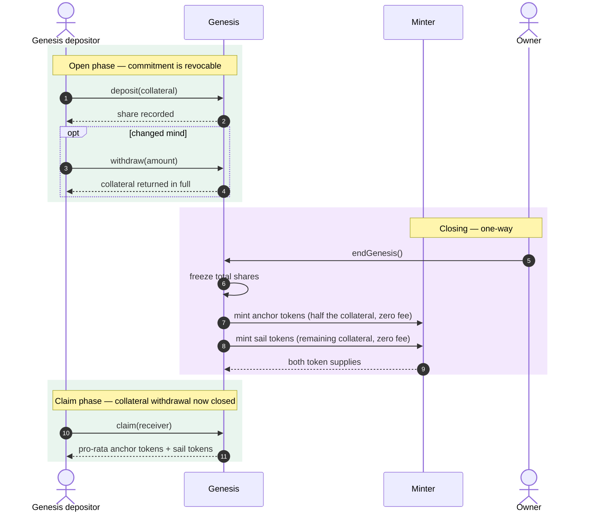

**Outcome.** The market opens at a collateral ratio of approximately 2× — collateral split evenly by
value between the two claims — with both tokens distributed proportionally to founding depositors and
no fee charged on either side.

**Notable properties.**
- Withdrawal before `endGenesis` returns collateral **in full**, with no fee. The commitment is
  genuinely revocable.
- The even split is by *collateral value*, using the entire pooled balance including any rounding
  remainder, so no collateral is stranded.
- Additional collateral transferred directly to the genesis contract before closing raises every
  depositor's claim — a deliberate seam for offering a founding bonus.
- `endGenesis` is **owner-only and irreversible**. Depositors trust the owner to close on fair terms;
  this is noted as a trust assumption in §3.3.

### 5.2 Minting anchor tokens

**Trigger:** user action. **Precondition:** the collateral ratio is above the schedule's disallow
floor — in deployed markets, just above the rebalance threshold.

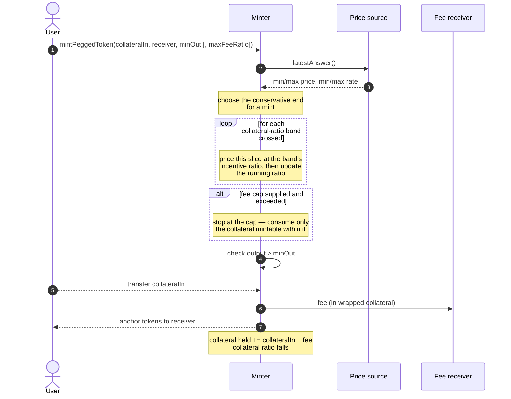

**Outcome.** The user holds anchor tokens; the protocol holds more collateral and has more anchor
claims against it. The collateral ratio **falls** — this action consumes system health, which is why
its fee rises as health worsens.

**Notable properties.**
- A large mint **traverses several fee bands**, each slice priced at its own rate against the ratio
  as it moves. It is not priced wholesale at the starting band.
- Where a band is configured as disallowed, the mint **fills up to that boundary** and stops, rather
  than reverting — the user gets what was available.
- Rounding is always in the protocol's favour, so a mint never mints more than the exact formula.

### 5.3 Redeeming anchor tokens

**Trigger:** user action. **Precondition:** the protocol has minted at least the amount being
redeemed.

**Outcome.** The user holds collateral; the system has fewer anchor claims. The collateral ratio
**rises** — this action restores health, which is why it is subsidised when health is poor.

**Notable properties.**
- Configuration **cannot** disallow this action; the validation rules reject a 100% fee here. An
  anchor holder always has an exit.
- The subsidy is best-effort. An exhausted reserve pool reduces it to whatever remains — possibly
  zero — without failing the redemption.
- The protocol tracks what it has minted and refuses to redeem beyond it, so anchor tokens minted by
  another chain's deployment cannot drain this market.

### 5.4 Minting and redeeming sail tokens

These mirror §5.2 and §5.3 with the incentives inverted.

| | Effect on collateral ratio | Incentive when unhealthy | Can configuration disallow it? |
|---|---|---|---|
| **Mint sail** | Rises | **Subsidy** (funded by reserve pool) | No — but the **leverage cap refuses it below the leverage floor** (§2.3), whatever the configuration says |
| **Redeem sail** | Falls | **Fee**, rising | **Yes** — blocked below a ratio of 1. **Never limited by the leverage cap** |

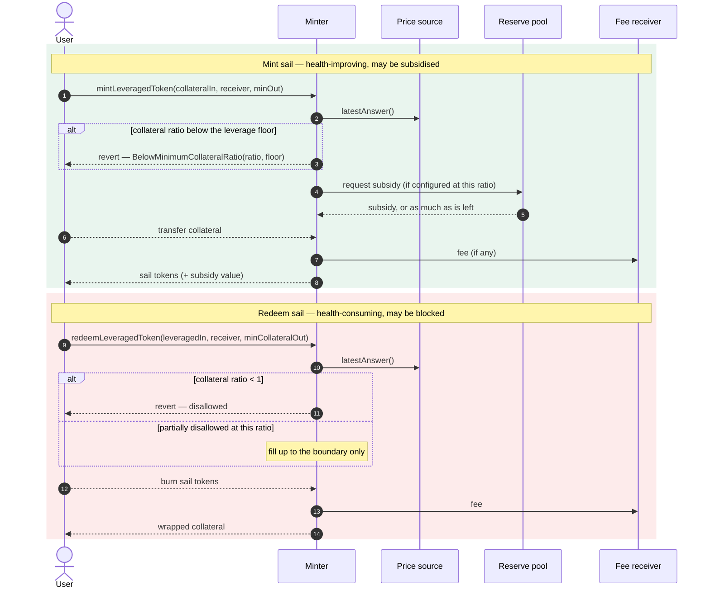

**Why the asymmetry.** Redeeming sail tokens takes collateral out while leaving every anchor claim
in place — the most direct way to damage the system's solvency. Below a ratio of 1 the sail token
has no residual value to claim at all, so permitting the exit would pay sail holders out of anchor
holders' backing. Blocking it is the protection.

**Why the cap applies only to minting.** Below the leverage floor a sail token carries more leverage
than the cap, so minting one would sell that leverage; the cap refuses the sale, at the middle of the
price band, judged on the state before the trade: on the fee-paying mint, on a rebalance's
conversion, and on the zero-fee mint wherever sail tokens exist. The state before the trade is the
one the sail is priced at, and below the floor that price is too sensitive to the collateral price to
sell at; a mint only raises the ratio, so judging it on the state it leaves would guard nothing. One
mint is judged on the state it leaves instead: the zero-fee mint of a market's first sail tokens,
where no sail holder exists to be diluted. So a genesis, whose own anchor mint leaves a new market
exactly at the peg, is served where its sail mint lifts the market to the leverage floor, and reverts
where it would not; a later genesis into a market that has sail tokens and stands below the leverage
floor reverts, and waits for the market to stand there. Redeeming sells nothing — it lets a holder
leave — so the cap never applies to it. Minting reopens by itself once the ratio is back above the
leverage floor. Through the fee-paying mint or the conversion the first sail token of a market is
judged like every other.

**Anchor mints stop at the leverage floor too.** A retail anchor mint lowers the ratio, pushing every
sail holder's leverage up. From at or below the leverage floor it reverts
`BelowMinimumCollateralRatio`, and one that would cross the floor is cut where the ratio reaches it,
the rest of the offer left with the caller — in code, whatever the configuration allows. The
fee-capped mint reports nothing taken there instead of reverting. The zero-fee anchor mint is not
judged.

**How many sail tokens a mint gives.** Into a market that already has sail tokens, a mint buys its
share of the residual: the collateral it adds, valued at the high price, as a fraction of the
residual, times the sail supply. The collateral counted is what the backing record is credited with
— the wrapped amount at the low rate, rounded down, after any fee or subsidy — and the result is
rounded down too, so a mint never takes more of the residual than it brings and the value behind
each sail token already held never falls. The fee-paying and the zero-fee mint share this one
definition: with no incentive in force they are the same trade. The first sail tokens of a market
(§5.1) take the whole residual the backing holds after their deposit — its collateral at the high
price, less the whole anchor claim — so from at or below the peg the deposit first makes the anchor
holders whole.

### 5.5 Stability-pool deposit and withdrawal

**Trigger:** user action. **Preconditions:** deposits must leave the pool's total at zero or above
its floor, and at or below its ceiling.

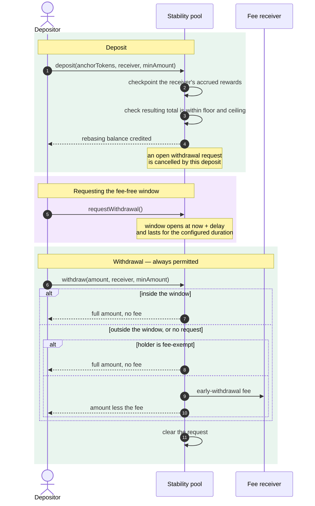

**Outcome.** The depositor's anchor tokens are held by the pool, accruing rewards and standing ready
to absorb a liquidation.

**Notable properties.**
- **Funds are never locked.** The window governs whether a *fee* applies, not whether withdrawal is
  possible. A depositor who never requests a window can still leave at any time, paying the fee.
- Depositing during an open window **cancels** it — a window cannot be kept open while adding funds.
- The floor is enforced on the *resulting total*, symmetrically for deposit and withdraw.
- Balances rebase on liquidation; **allowances do not**. An approval granted before a rebase
  represents a larger fraction of the reduced balance afterwards. Granting an unlimited approval is
  the way to express proportional authority. (This matches the behaviour of other rebasing tokens
  such as stETH.)

### 5.6 Rebalancing

**Trigger:** any keeper, at any time. **Precondition:** the collateral ratio is **above the peg and
below** the configured rebalance threshold — otherwise the call reverts with a specific error:
`CollateralRatioNotBelowRebalanceThreshold` at or above the threshold, `CollateralRatioNotAbovePeg`
at or below the peg.

This is the protocol's principal defence. It converts anchor tokens held in the stability pools back
into collateral or sail tokens, reducing the anchor supply and raising the collateral ratio, and
pays the pools' depositors for absorbing it.

**At or below the peg there is nothing to repair.** An anchor token redeemed there is priced at its
pro-rata share of the backing, so it takes that share with it and the ratio does not move, whatever
the amount. The rebalance is refused, and the pools keep their anchor for when the price brings the
market back above the peg, where it can repair something.

**Above the peg, up to two steps in one call:**

| Where the ratio starts | Step 1 — to the leverage floor, or the threshold if lower | Step 2 — from the leverage floor to the threshold |
|---|---|---|
| Between the peg and the leverage floor | Both pools give up anchor by the **collateral route**, pro rata to their deposits; **both are paid in collateral** | Collateral pool paid in collateral; leveraged pool's anchor converted into **sail** |
| At or above the leverage floor | — | As above |

Step 1 exists because below the leverage floor the protocol mints no sail (§2.3), so the leveraged
pool cannot be paid in it. It stops exactly at the floor, and step 2 runs in the same call, the
conversion now permitted. Where the threshold is at or below the leverage floor, step 1 goes all the
way to the threshold and there is no step 2.

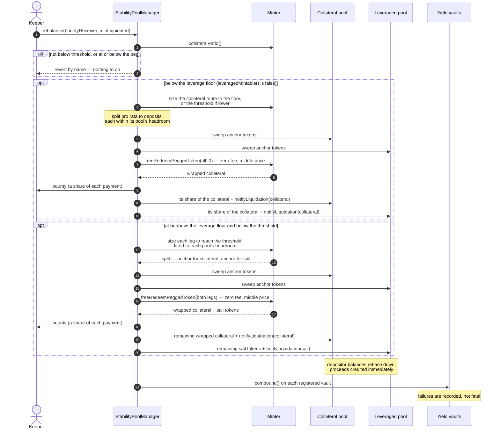

**Outcome.** Anchor supply falls; the collateral ratio rises to the threshold, or as close as the
pools' combined capacity allows. Depositors' balances shrink and they receive the proceeds. The
keeper is paid.

**Notable properties.**
- **The split is fitted, not merely proportional.** Each leg starts proportional to the pools'
  anchor deposits, but a pool whose share exceeds its capacity is capped there and the shortfall
  *slides to the other pool*. One call therefore reaches the threshold wherever the combined
  capacity allows it; where it does not, the call liquidates the combined capacity and a later call
  continues.
- **Proceeds are measured, not assumed.** The manager measures what each pool actually handed over
  and drives the redemption and crediting from those actuals — a pool is never left backing supply it
  no longer holds.
- **Each payment names its token.** A pool is told which token it is paid in, one it distributes,
  and credits that token to its depositors at once, at the balances before the loss.
- **Liquidation is fair to depositors:** zero fee, the middle of the price band, anchor exchanged at
  par and sail minted at its own price.
- **It lands on its target.** Step 1 is sized at the price the ratio is reported at, rounded up and
  allowing one wei of backing, so it cannot stop a hair short of the leverage floor and strand step 2.
- **The keeper's bounty and minimum cover both steps**: the bounty is its ratio of every payment, in
  that payment's token, and `minLiquidated` is judged against the anchor taken in both steps together.
- **Two capacity bounds apply per leg** — how much loss the pool may absorb before reaching its floor,
  and how much reward its accounting can credit at once. Excess is deferred to a later call rather
  than overflowing.
- Compounding the yield layer is a **best-effort tail step**: a failing vault is recorded and
  skipped, never allowed to block the rebalance.

### 5.7 Harvesting

**Trigger:** any keeper, at any time. **Precondition:** there is fairly distributable yield.

The collateral is yield-bearing, so the value it is worth in underlying terms grows. Since anchor
tokens are backed by the *underlying* amount, that growth is a surplus belonging to no claim in the
accounting identity. Harvesting moves it to the stability-pool depositors.

**Outcome.** The collateral's accrued yield reaches stability-pool depositors, vesting linearly over
the reward period. The keeper and the fee receiver take their configured shares of what actually
moved.

**Notable properties.**
- **Each pool has its own owed ledger.** Yield deferred past one period's capacity stays with the
  pool that earned it and is never re-split. A pool that had no deposit when a backlog accrued never
  receives any of it.
- **Only genuinely new yield is allocated by current deposits** — so joining a pool does not
  retroactively earn a share of a backlog.
- **Bounty and cut are taken on value actually distributed**, not on the owed backlog. A keeper's
  reward always matches the yield its call consumed.
- **Every party takes its own floored share.** No party is handed another's rounding shortfall; the
  remainder stays un-owed and is reconsidered on the next call.
- If the surplus *shrinks* — a fall in the wrapped asset's rate — each pool's owed is written down
  proportionally, so the ledger never claims more than the protocol holds.
- Harvesting deliberately defers rather than failing when capacity binds. Waiting, not harvesting
  more often, is the recovery.

### 5.8 Claiming rewards

**Trigger:** user action, at any time.

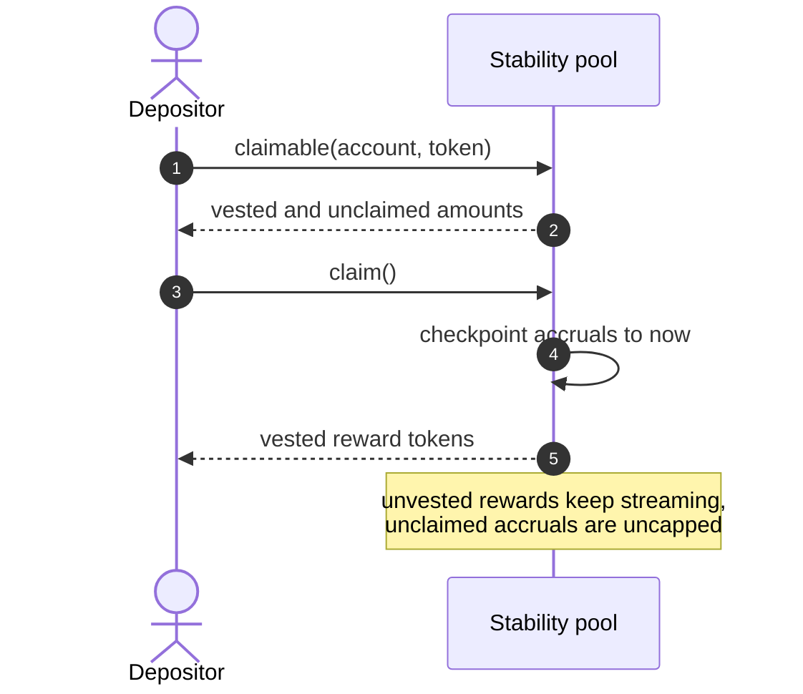

**Outcome.** The depositor holds their vested rewards. Claiming is optional and never required to
preserve accrual — a depositor who never claims loses nothing.

### 5.9 Interaction with the layers above

The core connects upward to the yield layer and downward to its price source. The upward connection
is **asymmetric**: one call out, a small purpose-built surface in.

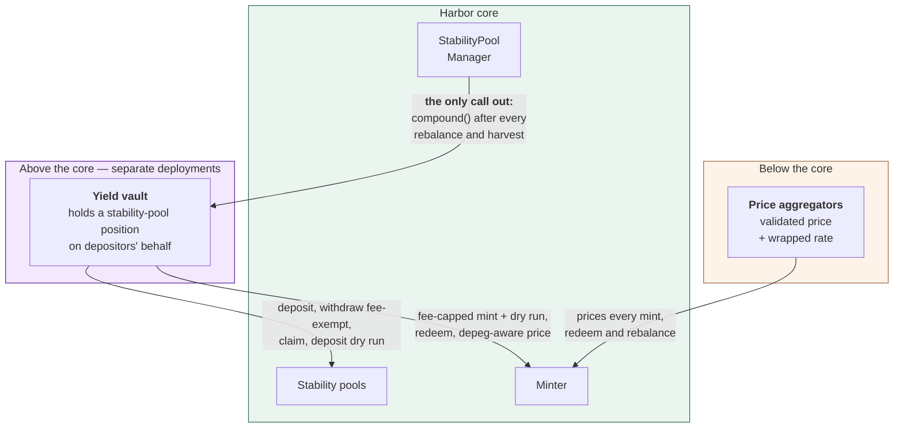

**Outward** the core asks one thing: a `compound()` on each registered vault, called after every
rebalance and harvest so reinvestment tracks reward arrival without a separate keeper schedule
(§6.4). A vault that fails is recorded and skipped, never fatal.

**Inward** it exposes a small surface, most of it built for this consumer and no other:

| Capability | Why it exists |
|---|---|
| Fee-capped minting, and its dry run | A vault compounding collateral into anchor tokens must not mint at a punitive fee (US-3) |
| Deposit dry run on a stability pool | So a vault pricing a deposit never assumes the credit equals the input |
| Fee exemption on stability-pool withdrawal | So a protocol-internal exit is not charged the early-withdrawal fee |
| Depeg-aware anchor price | So a vault values its pool position correctly when the anchor is under-covered |
| Selective and partial reward claiming | So a vault can take one reward token, or part of one |

**Downward** it requires a validated price — an invalid, zero or stale reading reverts rather
than mispricing a trade. Unlike the yield layer this is a hard dependency: without it the market
cannot transact (§6.8).

The core holds and transfers tokens but never exchanges one for another on a market.

---

## 6. Background processes

Harbor has no scheduler. Nothing in it runs on a timer, and no privileged operator is required to
keep it healthy. Everything that must happen without a user asking for it falls into one of three
categories:

- **Keeper-triggered** — the protocol pays anyone to call it. Rebalancing, harvesting, compounding.
- **Passive** — happens with the passage of time, needing no transaction at all. Reward vesting,
  withdrawal windows.
- **External** — happens outside the protocol entirely. Collateral yield accrual, price feed updates.

This section states, for each, what triggers it, who may run it, what it pays, and — the question
most easily overlooked — **what degrades if it never runs**.

### 6.1 The keeper loop

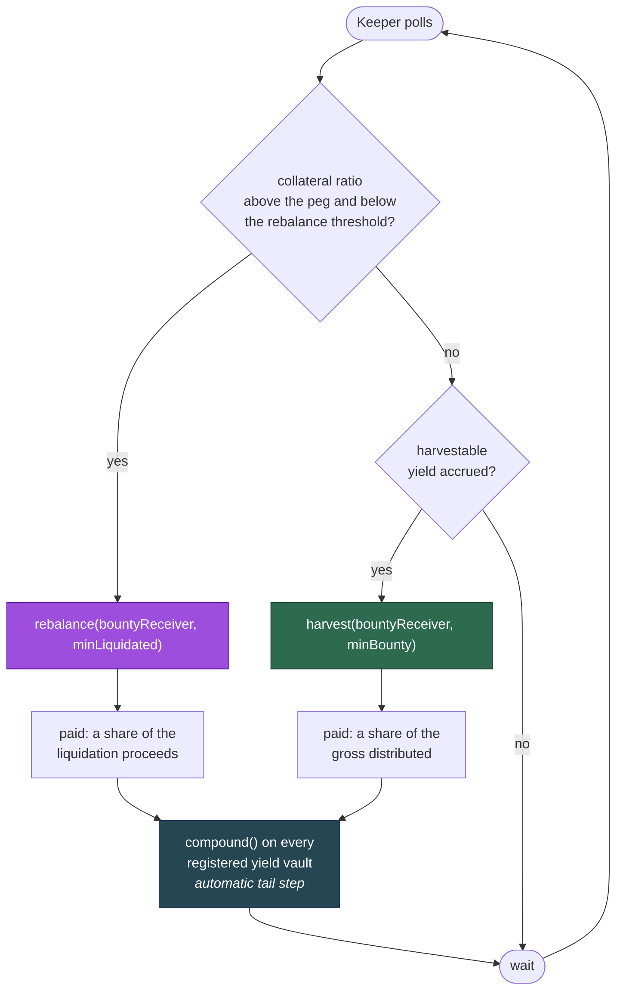

Both keeper entry points are **permissionless, unprivileged and self-guarding**. A keeper chooses
only *when* to call, never what the call does: the amounts, the split and the bounty are all
computed by the protocol from its own state. A keeper that calls at the wrong moment wastes gas and
nothing else.

Both also let the caller protect itself. Each accepts a **minimum** — minimum pegged liquidated,
minimum bounty — so a call that would be unprofitable reverts rather than executing at a loss. And
each exposes a read-only check (`rebalanceable()`, `harvestable()`) so a bot can decide without
simulating.

### 6.2 Rebalancing

| | |
|---|---|
| **Trigger** | Collateral ratio above the peg and strictly below the configured rebalance threshold |
| **Who may call** | Anyone |
| **Pays** | A configured ratio of every payment the rebalance makes, in that payment's token, to a nominated receiver |
| **Refuses** | Reverts with a specific error if the ratio is *not* below the threshold, or is at or below the peg — never silently no-ops |
| **Cadence** | Event-driven: whenever the collateral price falls far enough |

**If it never runs.** The collateral ratio stays below the threshold and the system does not
self-heal through the stability pools. It is not immediately insolvent — the fee and subsidy
schedule keeps pushing users toward the restoring actions (§7), and those alone may recover the
ratio. But the pools are the protocol's *only* mechanism that raises the ratio without needing a
user to volunteer, so with rebalancing stalled the system depends entirely on market participants
finding the subsidies attractive. If the collateral price keeps falling, the ratio can reach 1 and
the anchor token depegs — and at or below the peg no rebalance can help, so a stalled keeper costs
the market the window in which the pools could have acted.

**Why this is unlikely to stall.** The bounty is paid in the same assets the rebalance releases, and
rebalancing is most profitable exactly when it is most needed. The failure mode that matters is not
"no keeper is interested" but "no keeper can transact" — a network-wide congestion or censorship
event — which no in-protocol mechanism can fix.

**Partial progress is normal, not a failure.** Where the pools' combined capacity cannot reach the
threshold in one call, the rebalance liquidates what capacity there is and a later call continues.
A keeper seeing the ratio still below threshold after a successful rebalance should call again.

### 6.3 Harvesting

| | |
|---|---|
| **Trigger** | Distributable yield has accrued in the Minter |
| **Who may call** | Anyone |
| **Pays** | A configured ratio of the gross **actually distributed** by that call |
| **Refuses** | Reverts if nothing is fairly distributable, or if the bounty would be below the caller's minimum |
| **Cadence** | Discretionary — the yield accrues continuously and keeps |

**If it never runs.** Stability-pool depositors receive no yield. **Nothing is lost**: the yield
remains in the protocol as a real surplus of wrapped collateral, and a later harvest sweeps it.

Two consequences are worth stating precisely, because they are counter-intuitive:

1. **Uncollected yield does not inflate the collateral ratio.** The ratio is computed from the
   *tracked underlying backing*, not from the wrapped balance actually held. The surplus sits
   outside that measure. So a system with a large unharvested backlog **understates its own health**
   by exactly that amount — it is more solvent than it reports, never less. This is deliberately
   conservative: it means an unharvested backlog can never mask a genuine solvency problem, and it
   means a rebalance triggered while a backlog exists is triggered on honest numbers.
2. **A backlog drains slowly, by design.** Each call streams at most one reward period's capacity per
   pool; the rest stays owed. Recovery from a large backlog is by **waiting** across periods, not by
   harvesting more often. Calling repeatedly within a period achieves nothing.
3. **An impaired collateral suspends harvesting entirely.** The surplus is the excess of the holding
   over the record, and once the collateral is impaired the holding is below the record, so
   `harvestable` is zero by construction — the mirror of `impairment()`, and never non-zero at the
   same time. Yield accruing meanwhile closes the gap back up to the record, lifting the market's
   halt rather than paying depositors. Harvesting resumes when the holding exceeds the record again:
   through that recovery, or once the owner writes the record down (§6.7, US-16).

   Only an impairment can do this. The record moves by the collateral that actually moved (A6), so
   trading — however much of it, and however finely divided — leaves no shortfall of its own for
   later yield to make good before any of it reaches the pools.

**The keeper's incentive weakens as the backlog grows**, because the bounty is a share of what a
call actually distributes, not of the backlog. This is the correct behaviour — it prevents a keeper
being overpaid for one call that happens to follow a long quiet period — but it means harvesting is
a steady-drip activity rather than an opportunistic one.

### 6.4 Yield-vault compounding

| | |
|---|---|
| **Trigger** | Automatic tail step of **every** rebalance and harvest; also callable directly |
| **Who may call** | Anyone, directly on a vault; the manager calls registered vaults automatically |
| **Pays** | Nothing at the core-protocol level |
| **Refuses** | Never fatally — a failing vault is recorded and skipped |
| **Cadence** | Tracks reward arrival, because rewards only arrive via rebalance or harvest |

Coupling compounding to reward arrival is the point: rewards can only appear through a rebalance or
a harvest, so poking the vaults at the end of each means compounding needs **no separate keeper
schedule and no timer**. It cannot lag behind reward arrival, because it is triggered by it.

**Isolation is deliberate.** A vault that reverts — for any reason, including having nothing to
compound — must not be able to block a rebalance. Rebalancing is a solvency operation and cannot be
held hostage by a layer above. Failures are therefore caught and emitted as an event for off-chain
monitoring rather than propagated.

**If it never runs.** The vault's rewards sit unclaimed in the stability pool, so the vault's share
price stops growing. Depositors are not harmed beyond the lost compounding, and anyone can call the
vault directly to catch up.

### 6.5 Reward vesting (passive)

| | |
|---|---|
| **Trigger** | The passage of time |
| **Who may call** | Nobody — no transaction exists |
| **Cadence** | Continuous over the 1-week reward period |

Harvested rewards do not arrive claimable; they stream linearly over a fixed one-week period.
Liquidation proceeds, by contrast, are credited in one step.

Vesting cannot stall, and a depositor need do nothing to keep accruing. **Claiming is never required
to preserve accrual** — a depositor who never claims loses nothing, and unclaimed accruals are
uncapped.

The one behaviour worth knowing: a reward smaller than the period length streams at a rate that
rounds to zero, so a dust-sized harvest deposit would distribute nothing. The harvest therefore
declines to make such a deposit and leaves the value owed instead.

### 6.6 Withdrawal windows (passive)

| | |
|---|---|
| **Trigger** | A depositor's request, then the passage of time |
| **Who may call** | The depositor, for their own request |
| **Cadence** | Per depositor |

Requesting a withdrawal opens a fee-free window that begins after a configured delay and lasts a
configured duration; both are fixed at deployment, must be non-zero, and are capped at one year.
Neither has a setter, and nor do the fee or its recipient — changing any of them requires an
upgrade, so **the terms a depositor joined under cannot shift beneath them** by ordinary governance
action.

The window governs **whether a fee applies, never whether withdrawal is possible**. There is no
lock-up: a depositor with no request, or one whose window has passed, may still withdraw at any
time by paying the early-withdrawal fee. Missing a window costs a fee, never access.

Two rules stop the window being gamed: a successful withdrawal clears the request immediately, and
a deposit made during an open window cancels it — so a window cannot be held open while topping up.

### 6.7 Collateral yield accrual (external)

| | |
|---|---|
| **Trigger** | The collateral protocol's own mechanics |
| **Who may call** | Nobody within Harbor |
| **Cadence** | Continuous |

The wrapped collateral is worth progressively more of its underlying over time. Harbor observes this
only as a rising conversion rate reported by its price source, and the resulting surplus is what
harvesting distributes.

**The rate can also fall** — through a slashing event, a loss in the collateral protocol, or simply
because the collateral is itself a volatile claim. Three mechanisms respond, and they are deliberately
separated:

- **The market halts immediately.** Once the holding no longer covers the record, every update —
  every mint and redeem, and so the rebalance — reverts `UnrecognisedImpairment` on the next call, with
  nothing done and nobody called (§2.1). Prices, ratios and fee bands go on reporting the record, and
  `impairment()` and the manager's `rebalanceable()` say the market is halted. The halt lifts by itself
  if the rate recovers.
- The harvest's owed ledger is **written down proportionally** if the surplus shrinks below what is
  already owed, so it never claims more than the protocol holds.
- **The record itself is corrected only by the owner** (US-16), and only downwards. That ends the halt,
  and from then on the market is priced on what it holds.

The last is deliberate, and the reason is that a falling rate does not mean the same thing for every
collateral. A vault share price that only rises makes a fall strong evidence of a real loss; but a
market may equally be collateralised by another market's sail token, whose price falls and recovers
with leverage as ordinary behaviour. Writing the record down automatically would make every such fall
permanent, transferring value from sail holders to depositors on movements that reverse. Since no
reading distinguishes the two cases, the judgement is left to the owner and the protocol carries the
cost of waiting: a halted market, visible in `impairment()`, with harvesting suspended alongside.

The halt is the price of not guessing. Letting the market trade on the overstated record would pay
departing users out of cover that is not there, and the stability pools, which cannot decline a
rebalance, would absorb an impairment nobody had recognised. Marking the record down on every read
would make the owner's judgement silently, and permanently for anyone who traded in between. Halting
decides nothing, and fails visibly until either the rate or the owner settles it.

### 6.8 Price feed maintenance (external)

| | |
|---|---|
| **Trigger** | The feed operator's own schedule |
| **Who may call** | Nobody within Harbor |
| **Cadence** | Per feed |

Every price read is validated by the oracle (§2.5), and every failure mode **reverts** rather than
returning a substitute:

| Condition | Response |
|---|---|
| Price negative, or zero where zero cannot be the price | Revert |
| Price older than the staleness threshold | Revert |
| Abnormal deviation between rounds | Revert |
| Feed call fails | Revert |
| Wrapped-to-underlying rate zero | Revert — a zero rate is a unit conversion, not an economic state, so it can only mean a faulty oracle |

**If the feed stops.** Everything priced from it stops: minting, redeeming and rebalancing all
revert. This is fail-safe rather than fail-open — the protocol refuses to transact at an unknown
price rather than transacting at a wrong one — but it is a genuine **liveness** cost, and it is the
one background dependency whose failure halts the market. It is carried into §9 as an availability
risk rather than a solvency one.

Note that stability-pool deposits, withdrawals and reward claims **do not read the oracle**, so
depositors retain access to their positions even while the market is halted.

### 6.9 Reserve pool replenishment (passive)

| | |
|---|---|
| **Trigger** | A share of collected fees, or a direct transfer |
| **Who may call** | Anyone may fund it; only the owner may withdraw |
| **Cadence** | Discretionary |

The reserve pool funds subsidies and is **best-effort by design**: it hands out what is asked for,
or as much as it has, and never reverts for being short.

**If it empties.** Subsidies silently stop applying and the health-improving actions proceed at zero
fee instead. No operation fails. The dry-run functions report the *available* subsidy rather than
the configured one, so a user is never quoted a subsidy that will not be paid.

The consequence is a **weakening, not a breaking**, of the incentive design: the actions that restore
health remain free and remain permitted, they simply stop being paid for. §7 explains why free-and-
permitted is the load-bearing part and the subsidy is the accelerator.

---

## 7. Economic and incentive design

### 7.1 The single lever

Every fee and every subsidy in the minting system is expressed as one signed number, the
**incentive ratio**, scaled so that 1.0 means 100%:

| Value | Meaning |
|---|---|
| `+1.0` | **Disallowed** — a 100% fee is the encoding for "this action may not happen here" |
| `> 0` | A **fee**: the user receives less than the arithmetic exchange rate |
| `0` | Free — the exact arithmetic rate |
| `< 0` | A **subsidy**: the user receives *more* than the arithmetic rate, funded by the reserve pool |
| `-1.0` | Excluded — a 100% subsidy is not representable |

Encoding "disallowed" as a fee of 100%, rather than as a separate flag, means the same lookup, the
same validation and the same arithmetic path handle permission and pricing together. There is no
second code path for the blocked case, and therefore no way for the two to disagree.

### 7.2 Bands, and how a large order is priced

Each of the four actions has its own schedule: a list of collateral-ratio **bands**, each with one
incentive ratio. Up to 8 bands per action.

The critical property is that a large order is **not** priced wholesale at the band it starts in.
Every mint and redeem *moves* the collateral ratio, so a large order walks across bands, and each
slice is priced at the band it actually occupies as the ratio moves through it.

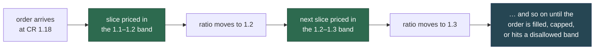

Three consequences:

- **Size is self-limiting.** An order large enough to damage the system's health pays progressively
  more for the damage it does. No separate size cap is needed.
- **Hitting a disallowed band fills partially rather than reverting.** The order transacts up to the
  boundary and stops. The user gets what was permitted instead of nothing.
- **A fee cap is a rate, not a budget.** The capped-mint variant (US-3) stops when the *rate* exceeds
  the cap. Offering more collateral does not buy a larger fee budget to spend at a steeper rate —
  otherwise a large order could cross into bands the cap was meant to exclude.

Rounding on every slice favours the protocol, so an order never mints more than the exact formula
would give.

### 7.3 The four schedules and their directions

Two actions consume system health and two restore it. The schedule for each is shaped accordingly:

| Action | Effect on collateral ratio | Priced to be… | May be subsidised? | May be disallowed? |
|---|---|---|---|---|
| **Mint anchor** | Falls | Expensive when unhealthy | **No** | **Yes** |
| **Redeem anchor** | Rises | Rewarding when unhealthy | **Yes** | **No** |
| **Mint sail** | Rises | Rewarding when unhealthy | **Yes** | **No** |
| **Redeem sail** | Falls | Expensive when unhealthy | **No** | **Yes** |

The final two columns are not conventions — they are **enforced by validation** and are the most
important structural property of the whole design. See §7.5.

**Schedules are per market, not per protocol.** Each market picks a **volatility class** sized to its
underlying's expected price behaviour — currently classes for rebalance thresholds of 1.05, 1.15,
1.25 and 1.30, each with a `_stable` variant. The class supplies both the fee schedule *and* the
rebalance threshold that goes with it, so the two are always consistent. A market on a volatile
underlying is configured very differently from one on a stable peg.

One deployed class, the 1.30 threshold, to show the real shape:

| Collateral ratio | Mint anchor | Redeem anchor | Mint sail | Redeem sail |
|---|---|---|---|---|
| **< 1.00×** (depegged) | **disallowed** | −1% | **99.9999%** (see below) | **disallowed** |
| 1.00 – 1.10× | **disallowed** | −0.75% | −2.5% | 4% |
| 1.10 – 1.29× | **disallowed** | −0.3% | −1% | 4% |
| 1.29 – 1.31× | **disallowed** | 0% | 0% | 2.5% |
| 1.31 – 1.40× | 2% | 0% | 0% | 2.5% |
| 1.40 – 1.50× | 1% | 0.25% | 0% | 2% |
| 1.50 – 1.80× | 0.75 → 0.33% | 0.33 → 0.5% | 0% | 1.5 → 1.25% |
| **> 1.80×** | 0.25% | 0.5% | 0.25 → 1% | 1% |

Read across any row and the pattern holds: **the two actions that help are cheap or paid; the two
that hurt are expensive or shut off**, and the gap widens as health worsens. Two features of the
real schedule are worth drawing out, because both are sharper than the principle suggests:

- **Anchor minting is shut off well before a depeg.** The disallow band ends just *above* the
  rebalance threshold — 1.31 for a 1.30-threshold market — and every deployed class follows the same
  `threshold + 0.01` rule. The system stops minting new anchor claims **before** it enters rebalance
  territory, rather than waiting until it is already under-covered.
- **Magnitudes are single-digit.** The steepest fee in this class is 4%. The schedule works by
  *shutting off* the damaging action at the boundary, not by pricing it punitively — the disallow
  does the heavy lifting, and the percentages handle the healthy range.
- **The sail-mint column is overridden near the peg.** Below the leverage floor (§2.3) — about 1.053
  for a cap of 20 — the leverage cap refuses sail minting whatever the schedule says, so the subsidy
  in the 1.00–1.10 band is paid only on the part of the band above the floor.

### 7.4 The self-correcting loop

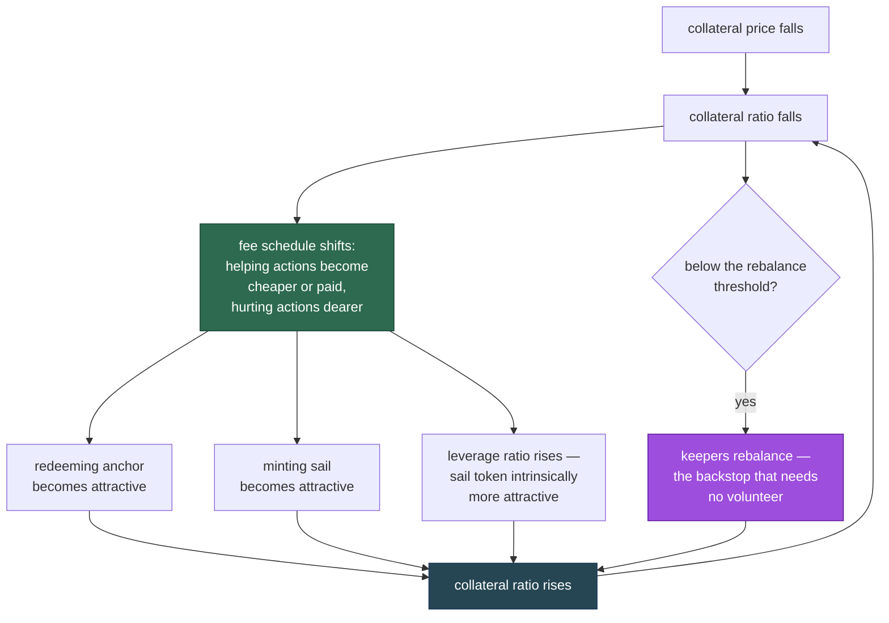

Note the third arm, which costs the protocol nothing: as the collateral ratio falls the **leverage
ratio rises**, so the sail token becomes a more leveraged instrument exactly when the protocol most
wants someone to buy it. The fee schedule reinforces an incentive the mathematics already supplies —
down to the leverage floor, below which the cap stops sail being minted at all (§2.3). That is the
reason for raising the cap: the lower the leverage floor, the more of the stressed range this arm
covers.

The distinction that matters under stress is between the **market arms** (the first three, which
need someone to volunteer) and the **backstop** (rebalancing, which needs only a keeper acting for a
bounty). The market arms are faster and cheaper when they work; the backstop is what makes the
system safe when they do not.

### 7.5 What the validation makes impossible

Configuration is validated when submitted, and rejected with an error naming the offending entry.
Some rules are arithmetic hygiene; two are structural guarantees.

**Arithmetic hygiene:**

| Rule | Rejected because |
|---|---|
| Band bounds strictly increasing | Overlapping bands have no defined price |
| First bound ≥ 1.0, later bounds > 1.0 | Bands below the depeg boundary are meaningless |
| Ratios array exactly one longer than bounds | Every band needs a price, including the open-ended top one |
| At most 8 bands | Fixed storage layout |
| Values not more precise than storage | A value that would silently truncate is refused rather than rounded |
| First band must either end exactly at 1.0 or be a disallow | Keeps depegged pricing in a band of its own, so the different arithmetic never straddles a boundary |

**The two structural guarantees**, which are the ones users depend on:

1. **Configuration can never disallow anchor redemption or sail minting.** Their permitted range is
   the open interval (−1, +1), which *excludes* +1. Since +1 is the only encoding for "disallowed",
   no configuration, valid or invalid, closes them.

   **This guarantee is load-bearing for anchor redemption and nominal for sail minting.** For
   **anchor redemption**, where a genuine exit must always exist, no deployed schedule goes near the
   boundary and the guarantee bites as intended. **Sail minting is closed below the leverage floor
   by the protocol itself** (§2.3), not by configuration: minting there would sell leverage above the
   cap, and at a ratio of 1 or below the residual claim is zero or negative, with no meaningful price
   at which to mint. The guarantee therefore says only that the *schedule* cannot close sail minting
   where the cap allows it. The deployed schedules still carry a 99.9999% fee in the depegged band,
   now redundant behind the cap.
2. **Anchor minting and sail redemption can never be subsidised.** Their permitted range is [0, +1],
   which excludes negatives. The protocol cannot be configured to *pay* users to damage its own
   health.

Together these mean **the anchor exit is always open, sail minting is open wherever the leverage cap
allows it, and the actions that consume solvency are never subsidised.** An anchor holder always has a redemption path; the reserve pool can never
be drained to fund the wrong direction.

**The precise scope of this guarantee:** it constrains *configuration*, not *upgrade*. No owner
transaction against the deployed schedule can close an exit, whether by mistake, under pressure or
deliberately. An owner who replaces the implementation is not bound by it, because the validation
lives in the code being replaced. Upgrade authority remains the system's root trust assumption and
is treated as such in §9.10 — the validation narrows what can go wrong by accident to nothing, and
leaves what can go wrong by intent to governance.

A further restriction: a disallow, where permitted at all, may only appear in the **first** band —
the depegged one. Blocking can therefore only ever apply at the bottom of the range, never carved
into the middle of an otherwise healthy schedule.

### 7.6 Subsidies and the reserve pool

A subsidy pays the user more than the arithmetic rate, and the difference comes from the reserve
pool. This makes it the only incentive with an **external funding requirement**, and therefore the
only one that can fail to be delivered.

The design handles that by making the shortfall harmless:

- The reserve pool hands over what is requested, or its whole balance if that is less. It never
  reverts for being short.
- A partly-funded or unfunded subsidy reduces to a smaller subsidy, or to zero — the action still
  completes.
- The dry-run functions report the **available** subsidy, so a user is never quoted a subsidy that
  will not be paid.

The relationship to §7.5 is what makes this safe: because the health-restoring actions can never be
*disallowed*, an empty reserve pool degrades the incentive from "paid" to "free", never to
"blocked". The subsidy is an accelerator; permission is the load-bearing part, and permission needs
no funding.

### 7.7 Keeper compensation

Keeper pay is structured differently from user fees — it is a share of value the keeper's own call
released, never a charge on a third party.

| | Rebalance bounty | Harvest bounty | Harvest cut |
|---|---|---|---|
| **Paid to** | Whoever triggers it (nominated receiver) | Whoever triggers it (nominated receiver) | The fee receiver |
| **Taken from** | Each leg's liquidation proceeds | The gross actually distributed | The gross actually distributed |
| **Paid in** | Wrapped collateral and sail tokens | Wrapped collateral | Wrapped collateral |
| **Bound** | ≤ 100% | Bounty + cut ≤ 100%, **validated as a pair** | as bounty |
| **Default** | 0 | 0 | 0 |

Three properties are worth drawing out:

- **The bounty is taken on value actually moved, never on a backlog.** A keeper's reward always
  matches the yield its call consumed, so a long quiet period does not create an oversized payout
  for the first caller afterwards.
- **The harvest bounty and cut are set as a pair, and can only be set as a pair.** What a stability
  pool receives is the residual the two leave, so a pair summing above 100% describes a split that
  does not exist. Setting them one at a time could only reject such a pair after the fact; setting
  them together makes it unrepresentable, and lets any valid pair be reached in one call from any
  other.
- **Every party takes its own floored share.** The bounty, the cut, each pool's net and the
  treasury's residual are each floored independently. Nobody is handed another party's rounding
  remainder; what is left over stays undistributed and is reconsidered on the next call.

### 7.8 The early-withdrawal fee

The stability pools carry one further incentive, aimed at a different problem: a backstop is only
useful if it is still there when needed, so depositors are encouraged to leave **predictably**
rather than suddenly.

- Requesting a withdrawal opens a fee-free window after a delay.
- Withdrawing inside the window is free; outside it, or with no request at all, costs the fee.
- The fee goes to the fee receiver, and is kept below 100% by validation: at 100% a withdrawal outside
  the window would leave its receiver nothing and be refused, which would make the window a lock.
- Designated addresses are **exempt** — protocol-internal exits, such as the yield layer's, are not
  penalised for routing through the pool.

The deliberate choice here is that this is a **fee, not a lock**. Funds are never frozen; the
protocol buys advance notice by pricing it, not by denying access. A depositor who needs to leave
immediately always can.

---

## 8. Invariants

These are the properties the system must never violate. They are stated so that each is
**checkable** — as a test assertion, a monitoring alarm, or an auditor's question — rather than as
prose about intent. Where a property is guaranteed *by construction* (it cannot be expressed
falsely) rather than *by check* (it is verified at runtime), that is stated, because the two carry
very different assurance.

### 8.1 Accounting

| # | Invariant | Assurance |
|---|---|---|
| **A1** | Collateral value = anchor claim + sail claim. The sail claim is *defined* as the residual. | By construction — no code path can break an identity nothing computes independently |
| **A2** | **Wrapped collateral is exactly conserved** across every mint and redeem: the change in the user's balance, the protocol's, the fee receiver's and the reserve pool's sums to zero, **to the wei**. Holds through depeg. | By check — asserted exactly across the tested envelope |
| **A3** | The protocol never redeems more anchor tokens than **it** minted. | By check — what it mints is tracked independently of token supply |
| **A4** | Sail token supply equals exactly what the protocol minted. | By construction — the protocol is the only minter and burner |
| **A5** | Rounding always favours the protocol: a mint never mints more than the exact formula, a redeem never returns more. | By check — verified per band slice, not merely in aggregate |
| **A7** | No sail is minted into a market that stands below the leverage floor `MINIMUM_COLLATERAL_RATIO` and has sail tokens, on any route; no retail anchor mint is served at or below it, and one that would cross it is cut at it; and the zero-fee mint of a market's first sail tokens does not leave the market below it. The zero-fee anchor mint is not judged. | By check — at the middle price, on the state before the trade: the retail mints, the conversion, and the zero-fee sail mint where sail tokens exist; on the state it leaves: the zero-fee mint of a market's first sail tokens; each reverts `BelowMinimumCollateralRatio` |
| **A6** | No operation **creates** a shortfall of the holding under the **recorded** backing, and none **acts** on one. Trading never takes the record above the collateral held; a fall in the rate can, and while it does every updating operation reverts `UnrecognisedImpairment`, until the rate recovers or the owner recognises the loss. | By check — every mint credits the record with the collateral that arrived, and every redeem debits it with the collateral that left, through the same conversion the holding is valued by; and every updater compares the record with the holding at the low edge of the rate band before acting |

**A2 is the strongest claim in the document** and deserves emphasis: this is exact conservation, not
conservation within a tolerance. Every unit of wrapped collateral that leaves one party arrives at
another. There is no rounding sink, and no path that quietly creates or destroys collateral.

**A3 is what makes the anchor token safely multi-chain.** Anchor tokens are ordinary ERC-20s and may
exist from other sources — another chain's deployment, or another minter. Because the protocol
redeems only against its own count of what it minted rather than against token supply, foreign tokens cannot
reach this market's collateral.

### 8.2 Pricing

| # | Invariant | Assurance |
|---|---|---|
| **P1** | Every priced operation reads a **validated** price; nothing is priced from an unvalidated source. | By construction |
| **P2** | An invalid, stale or abnormally-deviant reading, or a zero that cannot be the price, **reverts**. No operation proceeds on a substitute, a cached, or a default price. | By the oracle's check |
| **P3** | A zero wrapped-to-collateral rate reverts — a rate of zero is a unit conversion, not an economic state, so it can only mean a faulty oracle. | By the oracle's check |
| **P4** | Where a minimum and maximum differ, every mint and redeem uses the end that pays its caller less, chosen per operation and direction; the market's measures read the middle. Each operation reads the oracle once. | By construction |
| **P5** | The rebalance prices at the band's **middle** — the stability pool is the backstop, not charged the spread, and the sizing and the payout read the same price. | By construction |
| **P6** | A sail mint into a market with sail outstanding buys the **credited** collateral's share of the residual, rounded down, by one definition on the fee-paying and the zero-fee route: the value behind each sail token already held never falls, and with no incentive in force the two mints are the same trade (§5.4). | By construction; fuzz-tested |

### 8.3 Stability pool

| # | Invariant | Assurance |
|---|---|---|
| **S1** | Once seeded, `floor ≤ total supply ≤ ceiling`. Enforced on the **resulting total**, symmetrically for deposit and withdraw. | By check |
| **S2** | The loss factor is **always strictly positive** — a liquidation can never round to a total loss and brick every balance read. | By construction, *given* S1: the ceiling is precisely the largest supply at which the floor-capped loss keeps the factor non-zero |
| **S3** | A liquidation never takes the pool below its floor; every depositor retains a share of the minimum. | By check — capped at the manager *and* re-enforced inside the pool as a backstop |
| **S4** | The reward divisor is held **at or above** the summed depositor balances, so credited shares sum to no more than the reward. | By construction — rewards conserve, they are not merely close |
| **S5** | Deposits credit **one-for-one from an explicit ledger**. No balance, and no supply figure, is ever derived from the contract's token balance — nor either pool's share of a harvest or a rebalance, which follows its supply. | By construction |
| **S6** | Withdrawal is always permitted. The window governs whether a *fee* applies, never whether access exists. | By construction — there is no code path that refuses a withdrawal for timing |
| **S7** | A value too large for its storage field **reverts**; it is never truncated. | By check — checked narrowing casts throughout |

**S2 is the reason the floor and ceiling exist**, and it is worth stating plainly because both are
easily mistaken for risk limits. They are neither risk nor policy parameters: they are the bounds
within which the liquidation arithmetic remains exact. The ceiling is *derived* from the floor for
exactly this reason.

**S5 is a structural immunity, not a mitigation.** Because no accounting quantity is read from the
contract's token balance, transferring tokens directly to a pool changes nothing — no balance, no
supply, no share price, and no pool's share of a harvest or a rebalance, which the manager splits by
the pools' supplies. The donation and first-depositor inflation attacks that afflict
balance-derived vault accounting have **no expression here**: there is no share price to inflate.

**S7 closes a real historical defect.** The failure mode it prevents is the dangerous one — value
accepted, then silently truncated in storage, so the system's records and its holdings disagree
without anything failing. The guarantee is now "no known silent failures": a value the system cannot
handle is refused loudly, never mis-recorded.

### 8.4 Harvest distribution

| # | Invariant | Assurance |
|---|---|---|
| **H1** | The sum of what the pools are owed never exceeds what the protocol actually holds as surplus. If the surplus shrinks, each pool's owed is written down proportionally. | By check |
| **H2** | A pool's owed is **its own**. Value deferred past one period's capacity is never re-split to the other pool. | By construction |
| **H3** | Only genuinely new yield is allocated by current deposits, so joining a pool never earns a share of an existing backlog. | By construction |
| **H4** | Bounty and cut are taken on the gross **actually distributed**, never on the deferred backlog. | By construction |
| **H5** | `bounty + cut ≤ 100%`, validated as a pair. | By check |
| **H6** | Every party takes its own floored share; no party receives another's rounding remainder. The remainder stays undistributed and is reconsidered next call. | By construction |
| **H7** | A call with nothing fairly distributable **reverts**, rolling back any ledger mutation, rather than emitting a zero harvest. | By check |

### 8.5 Configuration

| # | Invariant | Assurance |
|---|---|---|
| **C1** | Configuration can never disallow anchor redemption or sail minting. Sail minting is closed below the leverage floor by the cap, not by configuration (A7). | By construction — the permitted range excludes the disallow encoding |
| **C2** | Anchor minting and sail redemption can never be subsidised. | By construction — the permitted range excludes negatives |
| **C3** | A disallow may appear only in the first (depegged) band. | By check |
| **C4** | Band bounds are strictly increasing, and the first band covers the depeg boundary. | By check |
| **C5** | A value too precise for its storage schema is **rejected**, never silently rounded. | By check |

C1 and C2 are scoped to configuration, not upgrade — see §7.5 and §9.10.

### 8.6 What these invariants do *not* promise

Stating the boundary honestly matters as much as stating the guarantees:

- **They do not promise the anchor token holds its peg.** They promise the accounting is exact, the
  incentives point the right way, and the backstop is available. If the collateral falls far and
  fast enough, the collateral ratio can reach 1 and the anchor token depegs — and the system will
  report that truthfully rather than conceal it.
- **They do not promise a stability-pool depositor profits.** A rebalance pays a depositor fairly, but
  in collateral or sail tokens, whose value then moves with the collateral price; a depositor can end
  up with less value than they deposited (§4, US-11). That is the risk the yield pays for.
- **They do not promise availability.** A failed price feed halts pricing (§6.8). Solvency is
  preserved; liveness is not.
- **They do not bind an upgrade.** Every invariant above describes the deployed code. Replacing that
  code replaces its guarantees (§9.10).

---

## 9. Attack vectors

Each vector is stated as **what an attacker would try**, **why it does not work** (or how far it
gets), and **what residual risk remains**. Where the defence is structural — the attack has no
expression in the design rather than being blocked by a check — that is called out, since it needs
no ongoing vigilance.

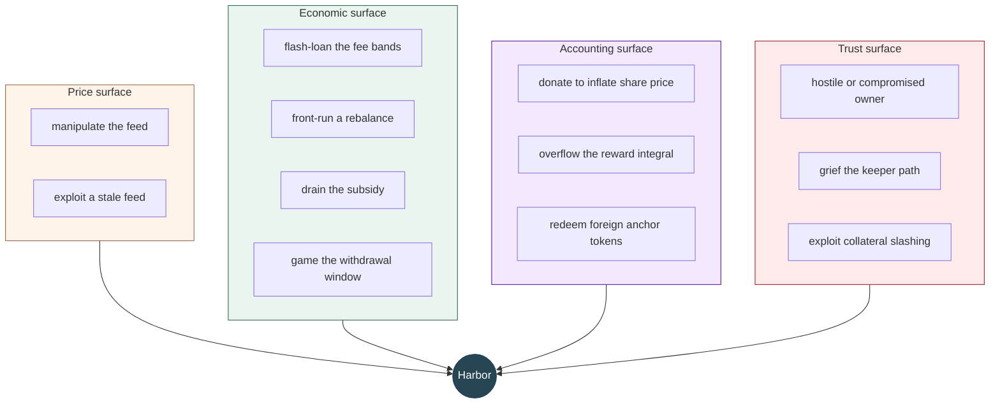

### 9.1 Price feed manipulation

**The attempt.** Move the reported collateral price to mint or redeem at a favourable rate — for
example, inflate the price, mint anchor tokens against overvalued collateral, then let the price
correct.

**Why it is hard.** The feed rejects abnormal round-to-round deviation, so a sharp move is refused
rather than consumed, and rejects stale data, so an old favourable reading cannot be replayed. A
manipulation must therefore be small enough per round to pass the deviation check, which bounds how
far it can move price before the operation reverts.

**Residual risk.** A move slow enough to stay inside the deviation bound each round, or a compromised
or systemically wrong feed, is not caught by these checks and propagates into pricing. **Feed
integrity is a trust assumption**, narrowed by the validation but not eliminated by it.

### 9.2 Stale-feed exploitation

**The attempt.** Wait for the feed to go stale and transact at the last good price.

**Why it fails.** Staleness beyond the configured threshold **reverts**. The protocol is fail-safe,
not fail-open: it refuses to transact at an unknown price rather than transacting at a wrong one.

**Residual risk.** This converts a correctness risk into an **availability** risk, and that trade is
deliberate. A dead feed halts minting, redeeming and rebalancing. Note the important limit on the
blast radius: stability-pool deposits, withdrawals and reward claims do **not** read the oracle, so
depositors keep access to their positions while the market is halted (§6.8).

The genuinely dangerous case is a feed that halts *while the collateral ratio is falling*: rebalancing
is priced and so also halts, and the system cannot backstop itself until the feed returns.

### 9.3 Flash-loaned fee-band traversal

**The attempt.** Borrow a large amount, move the collateral ratio far within one transaction, and
capture a favourable band — for instance push the ratio down into subsidy territory, redeem with the
subsidy, and repay.

**Why it fails, and the reason is stronger than pricing.** The two ways to push the ratio down are
minting anchor tokens and redeeming sail tokens, and the deployed schedules **shut both off** before
the ratio reaches the subsidy region:

- Anchor minting is **disallowed below the schedule's floor**, which sits just above the rebalance
  threshold (§7.3). An attacker cannot mint the ratio down into stressed territory at all.
- Sail redemption is **disallowed below a ratio of 1**.

So the attack is not merely made expensive — the lever is removed. Where it is still available the
fee schedule is additionally **slice-priced across bands** (§7.2), so any ratio movement pays every
band's fee on the way, and the subsidies on the far side are small (around 1% in the deployed class
shown in §7.3) and bounded by the reserve pool's balance.

**Residual risk.** The defence rests on the disallow floor being configured above the region where
subsidies begin. That relationship is a **calibration property, not a validated one**: the rules
enforce signs and disallow placement (§8.5), not that the floor sits above the subsidy bands. A
schedule that permitted minting into subsidy territory, with subsidies exceeding the fees paid to
reach them, would open this. Every deployed class satisfies the relationship by following the
`threshold + 0.01` rule, but nothing in the contract requires it.

### 9.4 Timing the rebalance

Two mirror-image attempts, and they have different answers.

#### 9.4a Depositing just before, to capture the liquidation terms

**The attempt.** Deposit into a stability pool immediately before a rebalance to capture the
favourable liquidation terms — the middle price, zero fee — then leave.

**How far it gets.** This partly works, and is bounded rather than blocked. Liquidation *is*
favourable relative to redeeming directly whenever the redeem fee is positive or the price band has
any width, since a direct redeem pays out at the band's high end, so near the rebalance threshold
there is a real edge. Four things bound it:

- The depositor is liquidated only **pro-rata**, so a late entrant dilutes their own capture.
- Exiting afterwards costs the **early-withdrawal fee** unless a window was opened in advance —
  which requires committing before the opportunity was visible.
- Deeper into stress the alternative improves: **direct redemption is subsidised** (−5%, −10%),
  which can beat zero-fee liquidation outright.
- The deposit must satisfy the pool's minimum.

**Why this is tolerable, and arguably desirable.** The behaviour recapitalises the stability pool at
precisely the moment the protocol needs depth in it. An attacker "exploiting" this is supplying the
backstop on the eve of its use. The cost falls on incumbent depositors as dilution of the
liquidation reward, not on the protocol's solvency.

**Residual risk.** Dilution of existing depositors' liquidation proceeds by opportunistic late
entrants. Real, small, and structurally bounded by the four limits above.

#### 9.4b Withdrawing just before, to dodge the liquidation

**The attempt.** A depositor who anticipates a rebalance — by watching the collateral ratio, or the
mempool — withdraws beforehand and re-deposits afterwards. They avoid the liquidation entirely and
re-enter a now-smaller pool, so their share of every future harvest is larger.

**What it costs them today.** The rebalance itself is value-neutral, so the dodge yields **nothing at
the moment of the rebalance** — both the stayer and the dodger hold the same value immediately
afterwards. The gain is entirely in *future harvest share*: the stayer's balance has rebased down
while the dodger's has not.

Two mechanisms work against it:

- **The withdrawal window.** Leaving on short notice, outside an open window, costs the
  early-withdrawal fee. Opening a window requires committing before the opportunity was visible, and
  a deposit during an open window cancels it (§6.6). This is what the window is *for* — it prices
  exactly this manoeuvre.
- **Compounding restores the stayer.** For the collateral pool, the stayer's liquidation proceeds are
  wrapped collateral, which the yield layer can convert back into anchor tokens and redeposit —
  rebuilding the balance and closing the harvest-share gap. This is automatic, since compounding is
  triggered after every rebalance and harvest (§6.4).

**Residual risk, and it is asymmetric between the two pools:**

- **Collateral pool:** the gap is transient. It lasts from the rebalance until compounding can run at
  an acceptable mint fee, and the proceeds also earn their own yield in the meantime.
- **Leveraged pool:** where it is paid in sail, the gap is **permanent**. Sail tokens cannot be
  minted back into anchor tokens and are not yield-bearing, so nothing restores the balance, and the
  stayer's harvest share stays permanently below the dodger's. Below the leverage floor it is paid in
  wrapped collateral, and the gap is transient as for the collateral pool.

This is an accepted trade-off of choosing the leveraged pool rather than a defect, but it is real and
it is the sharpest unfairness in the design.

**A future upgrade addresses this.** [doc/ideas/rebalance-fairness.md](ideas/rebalance-fairness.md)
analyses the manoeuvre in depth and proposes replacing the fixed withdrawal window with a
**collateral-ratio-derived withdrawal fee** — computed from the Minter's own incentive ratios, so it
is naturally zero when the system is healthy and rises automatically under stress — together with an
**effective-share** mechanism that would let a stayer's unclaimed proceeds count toward their harvest
share, closing the leveraged-pool gap. **Neither is implemented, and neither is scheduled at this
stage.** Everything described in §5.5, §6.6 and US-12 is the current withdrawal-window behaviour.

### 9.5 Rebalance griefing

**The attempt.** Call `rebalance()` repeatedly to extract bounties without doing useful work, or to
disrupt.

**Why it fails.** A rebalance requires the collateral ratio to be **strictly below** the threshold,
and a successful rebalance moves it *to* the threshold. The immediate next call therefore reverts.
The only case where a second call succeeds is when the first was capacity-bound and could not reach
the target — in which case the second call performs genuine, needed work.

The bounty is a share of proceeds actually released, so there is no way to be paid for a call that
moves nothing.

### 9.6 Draining the subsidy

**The attempt.** Round-trip the subsidised actions to extract the reserve pool — mint sail tokens with
a subsidy, redeem them back, repeat.

**Why it fails.** The two legs are priced against each other. Minting sail is subsidised exactly
where redeeming sail is expensive, and below a ratio of 1 redeeming sail is **blocked outright**.
The round trip is loss-making in every band. The reserve is additionally best-effort: it pays what
it has, so the extractable amount is bounded by its balance regardless of the strategy.

**Residual risk.** The reserve pool can be **exhausted** by legitimate use — many users genuinely
redeeming anchor tokens during stress. That is the subsidy working as intended, not an attack, but
it means the subsidy cannot be relied on to be available when most wanted. §7.6 explains why this
degrades the incentive without breaking it: permission is load-bearing and needs no funding; the
subsidy only accelerates.

### 9.7 Withdrawal-window gaming

**The attempt.** Maintain a permanent fee-free exit option, defeating the notice the window is meant
to buy.

**How far it gets.** A diligent depositor can re-request as each window lapses and be eligible much
of the time. Two rules limit rather than prevent this: a withdrawal **clears** the request, so
another full delay must elapse before the next fee-free exit; and a deposit during an open window
**cancels** it, so a window cannot be held open while topping up.

**Residual risk.** Accepted by design. The fee is avoidable by an attentive depositor, and that is
the intended shape: the mechanism buys *notice*, not lock-up, and it prices sudden exit rather than
denying it (§7.8). A depositor who plans ahead is exactly the depositor the mechanism wants.

### 9.8 Donation and first-depositor inflation

**The attempt.** Transfer tokens directly to a stability pool to manipulate the ratio between shares
and assets — the classic ERC-4626 first-depositor attack.

**Why it has no expression here.** Pool accounting is an **explicit ledger**: deposits credit
one-for-one and no balance or supply figure is ever derived from the contract's token balance (S5).
A direct transfer changes no depositor's balance and no supply figure — the tokens are simply
stranded. **There is no share price to inflate.**

This is a structural immunity rather than a mitigation: it requires no minimum-liquidity seeding, no
virtual shares and no dead-share offset, and nothing about it can be tuned wrong.

### 9.9 Reward-integral overflow

**The attempt.** Force a reward so large relative to the pool that the per-share accumulator
overflows, bricking accounting.

**Why it fails.** Both reward paths are capped up front against the pool's remaining capacity, and
the excess is **deferred rather than truncated or reverted**:

- Streamed harvest rewards are capped at one period's capacity; the rest stays owed and drains over
  later periods.
- Immediately-credited liquidation proceeds are capped by scaling the leg *before* the redemption,
  so the sweep, the redeem and the crediting all agree.

The pool's floor underwrites this by bounding the divisor: a zero floor would admit a vanishing
share and an unbounded integral, which is why a zero floor is rejected at deployment.

**Residual risk.** Reaching either cap requires an extreme corner far outside normal operation, and
the consequence is deferral, not loss. The relevant operational note is the one in §6.3: recovery
from a large backlog is by waiting across periods, not by harvesting more often.

### 9.10 Hostile or compromised governance

**The attempt.** Use owner authority to extract value or trap users.

**What configuration cannot do.** The validation rules make the dangerous *configurations*
unrepresentable, not merely rejected: anchor redemption and sail minting cannot be disallowed, and
the health-consuming actions cannot be subsidised (C1, C2). No owner transaction against the
deployed schedule closes a user's exit.

**What upgrade can do.** Everything. Every contract is UUPS-upgradeable with the owner as the
upgrade authority, so an owner who replaces an implementation is not bound by any invariant in §8 —
the validation lives in the code being replaced. Three specific powers are worth naming:

| Power | Effect |
|---|---|
| Replace any implementation | Unbounded — supersedes every guarantee in this document |
| `recogniseImpairment()` the recorded backing | One-directional — it can only write backing **down**, to what is held, and no owner path writes it up. What the owner controls is the *timing*: until the call the market is halted, and the collateral's yield closes the shortfall; after it, the market trades at prices that include the loss and later yield pays depositors. Delay costs availability, not value, and is visible in `impairment()` |
| Register a yield vault | Adds a contract that is called after every rebalance and harvest |

**Residual risk. This is the system's root trust assumption, and it is not reducible by design** —
only by the owner being a multisig with appropriate signers and process. Every other defence in this
section is conditional on it. Users should read §8's guarantees as "true of the deployed code",
never as "true regardless of governance".

### 9.11 Griefing through a registered yield vault

**The attempt.** Get a malicious contract registered as a yield vault, then have it revert or
consume gas to block rebalancing — holding a solvency operation hostage.

**Why it largely fails.** Vault compounding is isolated: failures are caught and recorded as an
event, never propagated, so a reverting vault cannot fail a rebalance or a harvest (§6.4).

**Residual risk.** Isolation catches reverts, not unbounded gas consumption — a vault that burns all
forwarded gas can still make the enclosing call expensive. The primary defence is therefore that
**registration is owner-gated**, which places this vector inside §9.10 rather than outside it.

### 9.12 Exploiting a collateral slashing event

**The attempt.** Transact in the window between the collateral being impaired and the protocol
recognising it, while the recorded backing still overstates what is held.

**Why there is no window.** The window exists — the prices overstate throughout it — but nothing can
trade in it. From the first call after the rate falls, every operation that would act on the
overstated record reverts `UnrecognisedImpairment(recorded, held)`: every anchor and sail mint and
redeem, fee-paying and free, and so every rebalance (§2.1, A6). No transaction, keeper or governance
action has to stand between the impairment and the halt. An anchor redemption cannot be paid par on
short backing, a sail redemption cannot escape the disallow band the true ratio would put it in, and
the stability pools cannot be made to rebalance at the wrong price.

The comparison uses the **low edge** of the oracle's rate band, the same edge recognition uses. So the
market is halted exactly when recognition would succeed, and a wide band alone never halts a covered
market.

**What the views say meanwhile.** Prices, ratios and fee bands report the record, deliberately: marking
them down would decide that the fall is a loss, which is the owner's judgement. They cannot be traded
against, and `impairment()` reports the recorded and held figures, so a front end, an aggregator or a
keeper can see that the market is halted. The manager's `rebalanceable()` reads it and reports false.

**How it ends.** Either the rate recovers, and the halt lifts with nothing written down and no loss
taken; or the owner calls `recogniseImpairment()` (§6.7, US-16), the record is written down to what is
held, and the market trades again at prices that now include the loss.

**What is not affected.** The wrapped-to-collateral conversion stays correct — a fallen rate means a
redeemer receives more wrapped tokens per unit of value, which is right.

**Residual risk — availability, not extraction.** While halted, nobody can mint, redeem or rebalance,
and `harvestable` is zero, so the collateral's yield closes the shortfall instead of reaching the
stability pools. What is at stake is how long the owner takes to judge; nothing can be extracted,
because nothing can trade against the overstated figures. The condition is externally observable in
`impairment()`.

All of this assumes the impairment shows up in the reported wrapped-to-collateral rate. A collateral
that socialised a loss without moving that rate would not be detectable on-chain at all.

### 9.13 Rebasing-balance approval semantics

**The attempt.** Exploit a stale approval across a rebase.

**The behaviour to understand.** Stability-pool balances rebase down on liquidation; **allowances do
not**. An approval granted before a rebase therefore represents a *larger fraction* of the reduced
balance afterwards. This matches other rebasing tokens such as stETH, but it surprises integrators
who assume a fixed-fraction authorisation.

**Mitigation.** Granting an unlimited approval is the way to express proportional authority.
Integrators holding a fixed-amount approval across a liquidation should re-evaluate it.

### 9.14 Keeper absence

**The attempt.** Not an attack so much as a failure mode: no keeper calls the background processes.

**Consequences,** covered in §6.2 and §6.3: rebalancing stalls, so the system loses its
volunteer-free backstop and must rely on the fee schedule attracting market participants; harvesting
stalls, so depositors earn nothing, though nothing is lost and the collateral ratio is *understated*
rather than overstated in the meantime.

**Residual risk.** Rebalancing is the one that matters. Its bounty is denominated in the assets it
releases and is most attractive exactly when most needed, so economic stall is unlikely; the real
scenario is an inability to transact at all — network congestion or censorship — which no
in-protocol mechanism addresses.

### 9.15 Summary

| Vector | Defence | Residual risk |
|---|---|---|
| Feed manipulation | Band, deviation and staleness checks | Sustained genuine mispricing |
| Stale feed | Reverts (fail-safe) | **Availability** — market halts, pool access survives |
| Flash-loan band traversal | Both ratio-lowering actions disallowed before the subsidy region; slice pricing | Floor-above-subsidies is calibration, not validated |
| Rebalance timing — deposit before | Pro-rata dilution, exit fee, subsidies compete | Dilution of incumbent depositors — small, bounded |
| Rebalance timing — withdraw before | Withdrawal window prices the exit; compounding restores the stayer | **Permanent harvest-share gap in the leveraged pool** |
| Rebalance griefing | Threshold check; bounty only on real proceeds | None material |
| Subsidy draining | Legs priced against each other; reserve best-effort | Reserve exhaustion under legitimate use |
| Window gaming | Withdraw clears request; deposit cancels window | Accepted by design — a fee, not a lock |
| Donation / first depositor | **Structurally absent** — explicit ledger, no share price | None |
| Reward-integral overflow | Capped and deferred, floor bounds the divisor | Deferral latency only |
| Hostile governance | Config validation; **upgrade unbounded** | **Root trust assumption** |
| Vault griefing | Failures isolated; registration owner-gated | Gas exhaustion; folds into governance trust |
| Collateral slashing | Halt — every mint, redeem and rebalance reverts `UnrecognisedImpairment` while the record exceeds the holding; plus proportional owed write-down | **Availability** — the market is halted, and harvesting suspended, until the rate recovers or the owner writes the record down; not extractable value |
| Rebase vs allowance | Documented semantics | Integrator error |
| Keeper absence | Bounties denominated in released assets | Inability to transact at all |

The single row in bold type is the one carried operationally rather than by the design. **Upgrade
authority** cannot be engineered away; every other defence here is conditional on it.

One residual is worth distinguishing from the rest, because it reads like an open vector and is not.
After a collateral impairment, the market is halted and harvesting suspended until the rate recovers
or the owner recognises the loss. That withholds income from stability-pool depositors and stops
every user trading for as long as it lasts — but it is visible in `impairment()`, and no party can
trade against the overstated figures, because nothing trades at all. Recognition is deliberately not
automated: no on-chain reading distinguishes a permanent loss from a fall that will reverse, and a
market may be collateralised by an asset whose price does exactly that as a matter of course (§6.7).

---

## 10. Operational states

A market's behaviour at any moment is fixed by **two independent axes**. Conflating them is the
commonest way to misread the system, so they are kept apart here:

- **Health** — where the collateral ratio sits relative to the market's configured boundaries. This
  axis moves continuously with the collateral price and with user activity, and nobody controls it
  directly.
- **Availability** — whether the market can transact at all. This axis moves in discrete steps, and
  is driven by the price feed, by an unrecognised impairment of the collateral, or by governance, not
  by the collateral ratio.

A market is always in exactly one health state and, independently, either available, halted or
paused. "Depegged **and** halted" is a real and particularly awkward combination (§10.8).

### 10.1 The health axis

Boundaries are per market, taken from its volatility class (§7.3). The concrete figures below are
the 1.30-threshold class; a 1.05-threshold market has the same structure with different numbers.

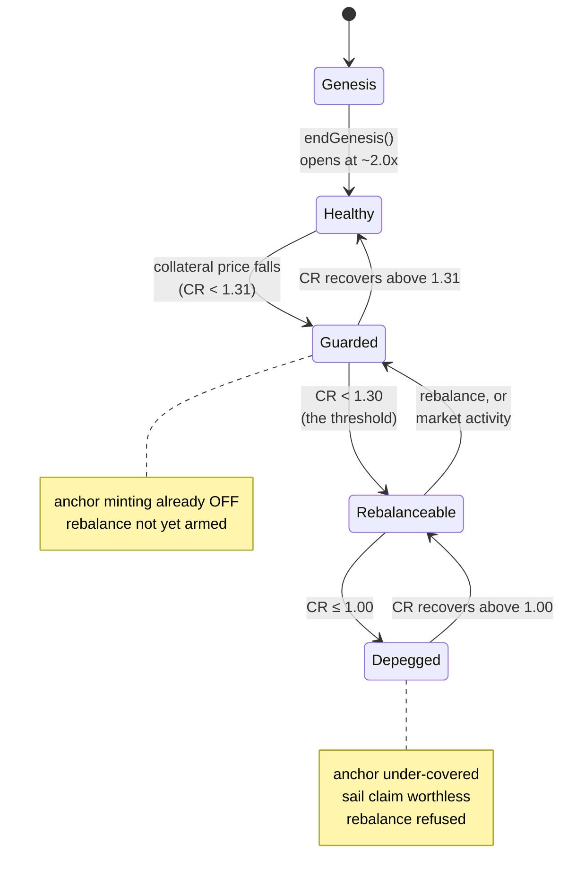

Note the ordering, which is the design's main safety property on this axis: **anchor minting shuts
off before rebalancing arms**, and rebalancing arms long before a depeg. Each defence engages while
the previous one still has room.

| State | Entry condition (1.30 class) | Anchor mint | Anchor redeem | Sail mint | Sail redeem | Rebalance |
|---|---|---|---|---|---|---|
| **Genesis** | market not yet opened | — | — | — | — | — |
| **Healthy** | CR ≥ 1.31 | ✅ 0.25–2% | ✅ 0–0.5% | ✅ 0–1% | ✅ 1–2.5% | ❌ not armed |
| **Guarded** | 1.30 ≤ CR < 1.31 | ⛔ **disallowed** | ✅ free | ✅ free | ✅ 2.5% | ❌ not armed |
| **Rebalanceable**, above the leverage floor | 1.053 ≤ CR < 1.30 | ⛔ disallowed | ✅ **paid** 0.3–0.75% | ✅ **paid** 1–2.5% | ✅ 4% | ✅ **armed**, both legs |
| **Rebalanceable**, below the leverage floor | 1.00 < CR < 1.053 | ⛔ disallowed | ✅ **paid** 0.75% | ⛔ **refused by the cap** | ✅ 4% | ✅ **armed**, collateral route to the floor first |
| **Depegged** | CR ≤ 1.00 | ⛔ disallowed | ✅ **paid** 0.75–1% | ⛔ refused by the cap | ⛔ **disallowed** below 1 | ⛔ **refused** |

The leverage floor shown is for a cap of 20 (§2.3); a higher cap moves it toward 1.00 and shrinks the
second row.

"Paid" means a subsidy — the user receives more than the arithmetic rate, funded by the reserve
pool while it lasts (§7.6).

### 10.2 Genesis

The market has no collateral, no tokens minted and therefore no meaningful collateral ratio.

Only the genesis contract is live: collateral may be deposited, and **withdrawn in full at any
time** until the owner closes the phase. No minting, redeeming or stability-pool activity exists
yet. Closing is a one-way owner action that mints both tokens from the pooled collateral and opens
the market at roughly 2.0× (§5.1).

### 10.3 Healthy

The ordinary operating state. All four actions are available, fees are mild — a fraction of a
percent to a few percent — and no subsidy applies in either direction because the system needs
nothing from anyone.

Harvesting runs on its keeper cadence; rebalancing is unavailable and reverts if attempted.

### 10.4 Guarded

A narrow band — one percentage point of collateral ratio in every deployed class — between the point
where anchor minting stops and the point where rebalancing begins.

Its purpose is to stop the system walking into rebalance territory while still minting new anchor
claims. **Anchor minting is already disallowed here, but no rebalance is armed yet**: the market has
one band's worth of room in which the restoring actions (redeeming anchor, minting sail) are free
and the damaging one is shut off, before the backstop is needed at all.

The band is deliberately thin. It is a boundary condition, not a place a market is expected to sit.

### 10.5 Rebalanceable

The collateral ratio is below the threshold, so a keeper may rebalance at any time and is paid to.

Subsidies are now live: redeeming anchor tokens and minting sail tokens both pay the user, funded by
the reserve pool. Sail redemption carries its steepest permitted fee. This is the state in which the
economic mechanism and the backstop both work at once — the fee schedule recruits volunteers while
rebalancing stands ready regardless of whether any appear.

Repeated rebalances are normal here rather than a sign of malfunction: each call moves the ratio to
the threshold, or as far as the pools' combined capacity allows, and a partially-satisfied rebalance
should simply be called again (§6.2).

**Below the leverage floor** (§2.3) the state changes character. Sail minting is refused by the cap,
so the market arm that buys leverage is closed, and a rebalance first takes both pools' anchor by the
collateral route to the floor, paying both pools in collateral, before converting from the floor to
the threshold (§5.6). The higher the cap, the thinner this part of the state.

### 10.6 Depegged

The collateral no longer covers the anchor tokens. Three things change qualitatively:

1. **The anchor token stops being worth 1.** Its reported price becomes its pro-rata share of the
   remaining collateral, and redemption is priced from that share. The system reports this plainly
   rather than concealing it.
2. **The sail claim is worthless.** `C − P` is zero or negative, so sail tokens have no residual
   value. Sail redemption is disallowed outright — allowing it would pay sail holders out of anchor
   holders' backing — and sail minting is refused by the leverage cap, the ratio being below the
   leverage floor (§2.3).
3. **Redeeming anchor tokens stays open and is paid.** Each redemption takes the holder's pro-rata
   share of the backing, so it leaves the ratio where it is rather than raising it, but it is the one
   exit and it remains permanently available (C1).
4. **No rebalance.** For the same reason a rebalance could not move the ratio, so it is refused, and
   the stability pools keep their anchor. Depositors hold anchor worth its depressed share, as every
   anchor holder does.

**Exit** is by the collateral price recovering. Once the ratio is back above the peg the pools'
anchor can repair it again — by the collateral route up to the leverage floor, then by both legs —
which is why the pools are not spent while the market is depegged.

### 10.7 Halted — the price feed has failed

Not a health state. The feed has returned an invalid, zero, stale or abnormally-deviant reading, so
every operation that must be priced **reverts** (§6.8, P2).

| | |
|---|---|
| **Unavailable** | Minting and redeeming either token; rebalancing |
| **Still available** | Stability-pool deposit, withdrawal, reward claim — **none of these reads the oracle** |
| **Controlled by** | Nobody. It clears when the feed recovers |

Depositors therefore keep access to their positions throughout. Solvency is untouched — refusing to
transact at an unknown price is what preserves it — but liveness is lost, and the loss includes
rebalancing.

#### Halted by an unrecognised impairment

The Minter halts itself for a second reason: the wrapped-to-collateral rate has fallen far enough
that the holding, valued at the low edge of the rate band, no longer covers the recorded backing
(§2.1, §9.12). Every operation that would update the record reverts `UnrecognisedImpairment(recorded,
held)`.

| | |
|---|---|
| **Unavailable** | Minting and redeeming either token, fee-paying or free; rebalancing; harvesting yields nothing |
| **Still available** | Every view and dry run, answering from the record; donation; stability-pool deposit, withdrawal, reward claim |
| **Seen in** | `impairment()` reports `recorded > held`; the manager's `rebalanceable()` reports false |
| **Clears** | By itself if the rate recovers; or when the owner calls `recogniseImpairment()`, writing the record down to the holding |

It overlaps with the health axis the way a failed feed does: the collateral ratio goes on reporting
the record, so a market can read Rebalanceable while no rebalance can run.

### 10.8 The dangerous overlap

**Halted while the collateral ratio is falling** is the combination that deserves naming. Rebalancing
is priced, so it halts with everything else, and the system cannot backstop itself until the feed
returns. It can enter Depegged with no mechanism able to act.

Nothing in the protocol resolves this — it is an operational monitoring requirement, and it is why
feed liveness matters as much as feed correctness.

### 10.9 Paused — governance has stopped a contract

Any contract can be halted by **upgrading its proxy to a stub implementation** whose only behaviour
is to reject everything. There is no pause flag anywhere in the system.

| | |
|---|---|
| **Effect** | Every call, including plain ether transfers, reverts with a "paused" error |
| **State** | Entirely preserved — the proxy's storage is untouched, so no balance, deposit or accrual is lost |
| **Cost when unused** | **Zero.** Ordinary operation pays no gas for a pause check that isn't there |
| **Scope** | Per contract. Pausing the Minter does not pause the stability pools |
| **Exit** | Upgrade back to a working implementation |

Two properties of this approach are worth stating because they are unusual:

- **Pausing and unpausing are ordinary upgrades**, each a single transaction of about the cost of
  calling a `pause()` function — so the mechanism is as cheap to operate as a flag while costing
  nothing at all in the common case.
- **Pausing can move who controls the contract.** The stub's own owner is a **hardcoded multisig**,
  fixed in its bytecode, and it is that owner — not the paused contract's previous one — who can
  upgrade back. This is deliberate: it doubles as recovery from a compromised owner. The stub cannot
  be installed unless the existing owner authorises the upgrade, so it is not a takeover path, but it
  does mean **pausing is not always reversible by the party who initiated it**.

---

## 11. Glossary

Terms are grouped by what they describe. Where a term has a precise definition elsewhere in this
document, the section is given.

### Tokens and assets

| Term | Meaning |
|---|---|
| **Anchor token** (*ha*) | The stable, senior token, tracking the value of a chosen underlying. Redeemable from the protocol for collateral. An ordinary ERC-20 that may also exist from other sources (§2.1) |
| **Sail token** (*hs*) | The leveraged, junior token, holding the residual claim `C − P`. Minted and burned only by the protocol (§2.1) |
| **Wrapped collateral** | The yield-bearing asset the protocol actually holds — wstETH, fxSAVE, sUSDe. Worth progressively more of its underlying over time |
| **Underlying** | The asset an anchor token tracks — ETH, BTC, EUR, gold |
| **Stability-pool share** | A depositor's claim on a stability pool. A transferable, rebasing ERC-20 (§2.6) |

### Health and pricing

| Term | Meaning |
|---|---|
| **Collateral ratio** | Collateral value ÷ anchor token value. The system's health metric, computed from the *recognised* backing rather than the balance held (§2.3, §6.3) |
| **Unrecognised impairment** | The recorded backing exceeding what the wrapped holding converts to at the low edge of the rate band, after the rate has fallen. Every price, ratio and fee band goes on reporting the record, and every updating operation reverts `UnrecognisedImpairment` until the rate recovers or the owner recognises the loss. Reported by `impairment()` (§2.1, A6, §10.7) |
| **Leverage ratio** | Collateral value ÷ sail token value. Rises without bound as the collateral ratio approaches 1, and is reported uncapped (§2.3) |
| **Leverage cap** | `MAX_LEVERAGE_RATIO`: the most leverage the protocol will mint sail at. Caps minting only — never redeeming, never the reported ratio (§2.3) |
| **Leverage floor** | `MINIMUM_COLLATERAL_RATIO`, `K/(K−1)` for a cap `K`: the collateral ratio below which no sail is minted and a rebalance pays both pools in collateral (§2.3, §5.6) |
| **Depeg** | Collateral ratio below 1 — anchor tokens no longer fully covered (§10.6) |
| **Rebalance threshold** | The collateral ratio below which rebalancing becomes available. Set per market by its volatility class (§7.3) |
| **Disallow floor** | The collateral ratio below which anchor minting is refused. Sits one point *above* the rebalance threshold in every deployed class (§7.3) |
| **Price band** | The minimum and maximum the price source reports. Each mint and redeem picks the end that pays its caller less; the market's measures and the rebalance use the middle (§2.5) |
| **Rate** | The wrapped-to-collateral conversion. Its growth over time is the source of harvestable yield (§2.5) |

### Value flows

| Term | Meaning |
|---|---|
| **Incentive ratio** | One signed number carrying fee, subsidy and permission: positive is a fee, negative a subsidy, `+1.0` means disallowed (§7.1) |
| **Subsidy** | A negative fee — the user receives more than the arithmetic rate, funded by the reserve pool. Best-effort: it shrinks silently if the pool is short (§7.6) |
| **Band** | A collateral-ratio interval with one incentive ratio. A large order is priced slice-by-slice across the bands it moves through (§7.2) |
| **Volatility class** | The per-market configuration supplying both the fee schedule and its matching rebalance threshold (§7.3) |
| **Harvestable yield** | The surplus of wrapped collateral held over the tracked backing. Belongs to no claim in the accounting identity until harvested (§2.5) |
| **Owed ledger** | Per-pool record of harvested yield allocated but not yet streamed. Never re-split between pools (§5.7, H2) |
| **Bounty** | A keeper's share of the value its own call released (§7.7) |
| **Cut** | The fee receiver's share of a harvest (§7.7) |
| **Early-withdrawal fee** | Charged on a stability-pool withdrawal outside an open window. A fee, never a lock (§7.8) |

### Operations

| Term | Meaning |
|---|---|
| **Rebalance** | Drawing anchor tokens from the stability pools and redeeming them, to raise the collateral ratio. Keeper-triggered, permissionless; refused at or below the peg (§5.6) |
| **Harvest** | Distributing accrued collateral yield to the stability pools. Keeper-triggered, permissionless (§5.7) |
| **Compound** | Reinvesting a yield vault's rewards. Runs automatically after every rebalance and harvest (§6.4) |
| **Liquidation** | The pool's side of a rebalance: anchor tokens are exchanged for the payout asset the manager names, at the middle of the price band and zero fee, and the proceeds credited immediately. Not a seizure — see §2.6 (§2.7) |
| **Sweep** | Moving tokens out of a contract that is holding them on another's behalf — how the manager takes anchor tokens from a pool, and harvested yield from the Minter |
| **Genesis** | The bootstrap phase before a market opens (§5.1, §10.2) |
| **Recognise an impairment** | Writing the recorded backing down to what is held, after a collateral impairment. Owner-only, one-directional, and deliberately not automated. It ends the halt, moves every price to what is held, and resumes the harvest (§6.7, US-16) |
| **Dry run** | A read-only call reporting exactly what an action would yield in the current state, including partial fills and the actually-available subsidy (US-2) |

### Structural

| Term | Meaning |
|---|---|
| **Market** | One deployed instance: a (collateral, underlying) pair with its own tokens, pools and solvency. Independent of every other market (§1.4) |
| **Floor / ceiling** | The stability pool's supply bounds. **Precision parameters, not risk limits** — they exist to keep the liquidation loss factor positive (§2.6, S2) |
| **Reward divisor** | The denominator each reward accrual divides by. Held at or above the summed depositor balances so rewards conserve by construction (S4) |
| **Reserve pool** | Collateral funding subsidies. Best-effort — it never reverts for being short (§2.8) |
| **Pause** | Halting a contract by upgrading its proxy to a stub that rejects everything. No pause flag exists (§10.9) |
| **By construction / by check** | Whether an invariant cannot be expressed falsely, or is verified at runtime. The distinction carries very different assurance (§8) |

---

*End of specification. Sections 1–11 complete.*
