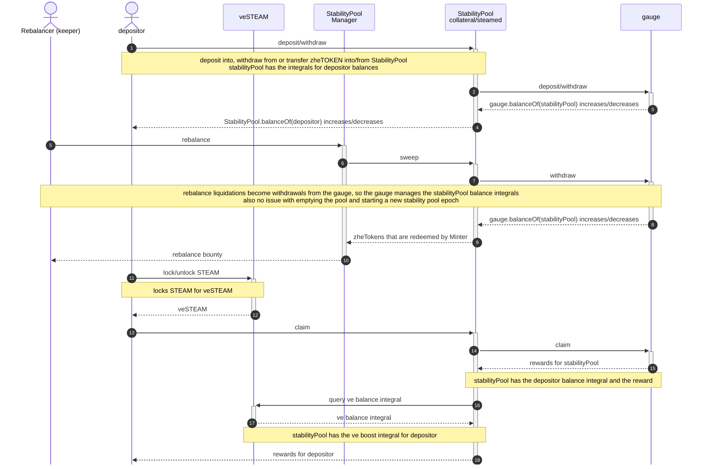

<!-- # Gauge Claim Flow

This diagram illustrates the sequence of operations during a gauge claim in the rebalance pool system. -->

<!-- ## Overview

The gauge claim process involves several contracts working together to:

1. Calculate eligible rewards
2. Mint new tokens through the TokenMinter
3. Distribute these tokens to various rebalance pools according to their weights
4. Make rewards claimable by users who have staked in these pools

The VotingEscrow system provides boosting mechanics that can increase rewards for users who have locked tokens. -->
