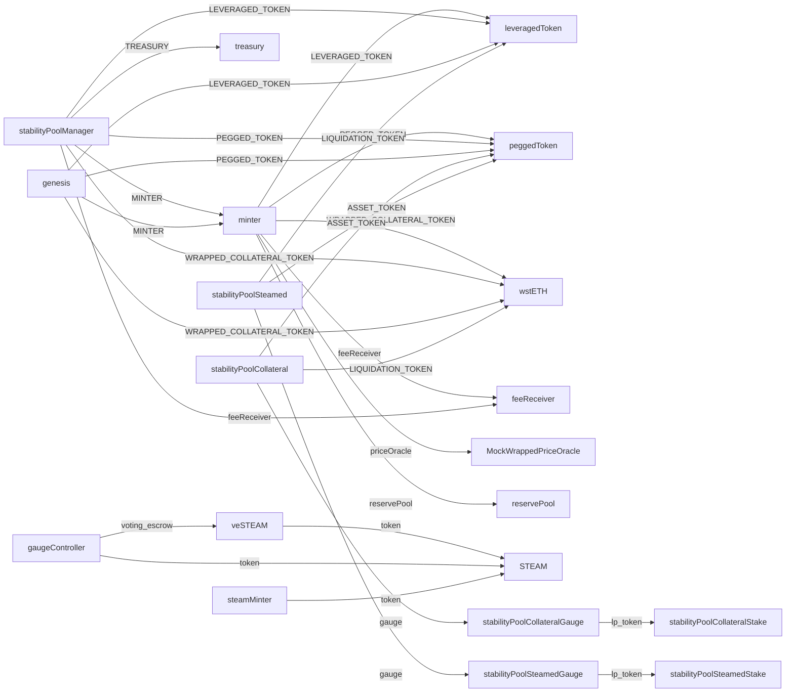

# Deployment

## Mainnet Contract Addresses

| Contract | Type | Address |
|----------|------|---------|
| minter | Minter_v1 | `0x1c3cA001BfD389a155682122057faDC870B0Bb0c` |
| stabilityPoolManager | StabilityPoolManager_v1 | `0x40310c9F0E822697Dd9e6F44d88528aB93b529C0` |
| peggedToken | MintableBurnableERC20_v1 | `0xeA778A25b818EE9346E250Eb3f81b1439E23d711` |
| leveragedToken | MintableBurnableERC20_v1 | `0xdC14b6DB8F77ea6C4B3Cc7399fE82Db013f6F012` |
| STEAM | Steam_v1 | `0x02990E399E2c3EB3EE526722046C031fbc5Cf0b6` |
| veSTEAM | VotingEscrow_v1 | `0xF518E453A48d7209C5614f61E8B400A43E3db6C9` |
| stakedETHWrappedPriceOracle | StakedETHWrappedPriceOracle_v1 | `0x9b4A8ceE08bbA4B8183776745Ba5d6D6206f9f3F` |
| reservePool | ReservePool_v1 | `0x331c36A45306c9A63f9A004Df82eD83665825017` |
| feeReceiver | TokenDistributor_v1 | `0x921634fd898582c7e51A2e2A5F7b93328394a408` |
| genesis | Genesis_v1 | `0xdb71d1A0CACD62e37dB898a8E5f005a02F9B885b` |
| MockWrappedPriceOracle | MockWrappedPriceOracle | `0xE72B348bCA4DAAD3d8886342557d581B50Bf3971` |
| gaugeController | GaugeController | `0xf386d6DCd8FC8941d6A01A64c2f268A082C1533A` |
| steamMinter | SteamMinter | `0x5676d41849868c68A2f7cd51746317202E851EfB` |
| stabilityPoolCollateralStake | MintableBurnableERC20_v1 | `0x349688fEA9C1D3631ce7ec493B986a2ABC64A9e9` |
| stabilityPoolCollateralGauge | LiquidityGaugeV6 | `0xD87De02c97F1eBd372d001fF5FD280709B0c5454` |
| stabilityPoolCollateral | StabilityPool_v1 | `0xd131B84Df8194Aa18BB3D5044bE976362b0Bc14F` |
| stabilityPoolSteamedStake | MintableBurnableERC20_v1 | `0xdf5Ae966f5ac119c53378473E430Dd34304107c1` |
| stabilityPoolSteamedGauge | LiquidityGaugeV6 | `0x23b9efEC6328249538614171626feAf27031791b` |
| stabilityPoolSteamed | StabilityPool_v1 | `0x4cDA739ae3b19347ADa57990eE6d0eb53A547600` |

### External Dependencies

- **wstETH**: `0x7f39C581F595B53c5cb19bD0b3f8dA6c935E2Ca0`
- **Treasury**: `0x3dFc49e5112005179Da613BdE5973229082dAc35`
- **stETH Chainlink Feed**: `0xCfE54B5cD566aB89272946F602D76Ea879CAb4a8`

## Contract Relationship Diagram



## Diagnosing a Stuck Deployment

### Check Docker Services
```bash
cd graph-node-local
docker compose ps
```
All services should be "Up" and "healthy".

### Check Graph Node Logs
```bash
docker compose logs graph-node --tail 50
```
Look for ERROR messages, "Block data unavailable" errors, or deployment-related messages.

### Check Service Endpoints
```bash
curl http://localhost:8020   # Graph Node JSON-RPC
curl http://localhost:5001   # IPFS
curl http://localhost:8000   # GraphQL
```

### Check Anvil Connection
```bash
curl -X POST http://localhost:8545 \
  -H "Content-Type: application/json" \
  -d '{"jsonrpc":"2.0","method":"eth_blockNumber","params":[],"id":1}'
```

### Common Issues

**Block Ingestor Stuck** (repeated "Block data unavailable"):
```bash
cd graph-node-local
docker compose down -v  # Remove volumes
docker compose up -d     # Start fresh
```

**IPFS Not Responding**:
```bash
docker compose restart ipfs
```

**Deployment Hangs on IPFS Upload**:
```bash
graph deploy --node http://localhost:8020/ --ipfs http://localhost:5001 harbor-marks-local -v
```

### Manual Deployment Steps

```bash
# Build
graph build

# Create subgraph (if needed)
graph create --node http://localhost:8020/ harbor-marks-local

# Deploy with verbose output
graph deploy --node http://localhost:8020/ \
  --ipfs http://localhost:5001 \
  harbor-marks-local \
  -v
```
