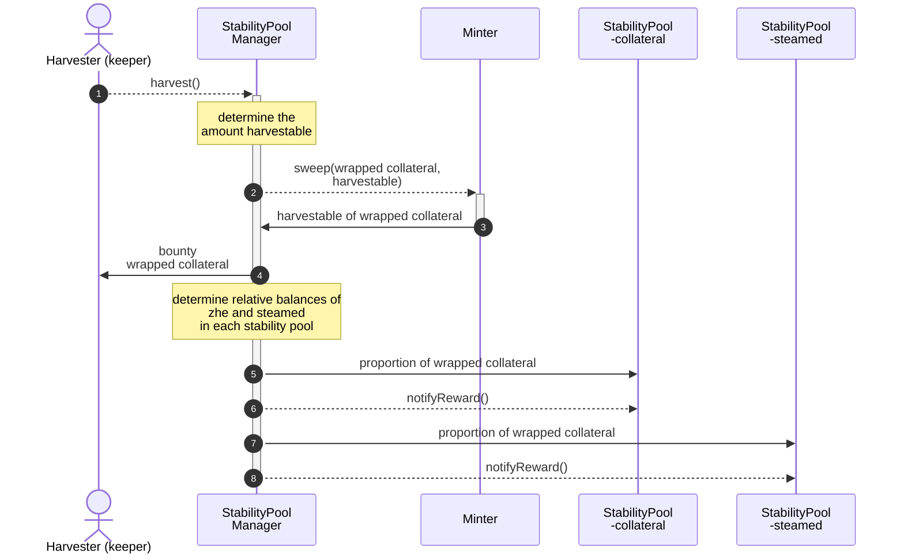

# Harvesting

Harvesting is the process of extractng the excess value from the held wrapped collateral tokens over the collateral tokens used to back the pegged tokens.

```mermaid
sequenceDiagram
    autonumber
    actor keeper as Harvester (keeper)
    participant spm as StabilityPool<br>Manager
    participant minter as Minter
    participant spc as StabilityPool<br>-collateral
    participant spl as StabilityPool<br>-steamed

    keeper-->>+spm: harvest()
    note over spm: determine the<br>amount harvestable
    spm-->>+minter: sweep(wrapped collateral,<br>harvestable)
    minter->>-spm: harvestable of wrapped collateral
    spm->>keeper: bounty<br>wrapped collateral
    note over spm: determine relative balances of<br>zhe and steamed<br>in each stability pool

    spm->>spc: proportion of wrapped collateral
    spm-->>spc: notifyReward()
    spm->>spl: proportion of wrapped collateral
    spm-->>-spl: notifyReward()
```
