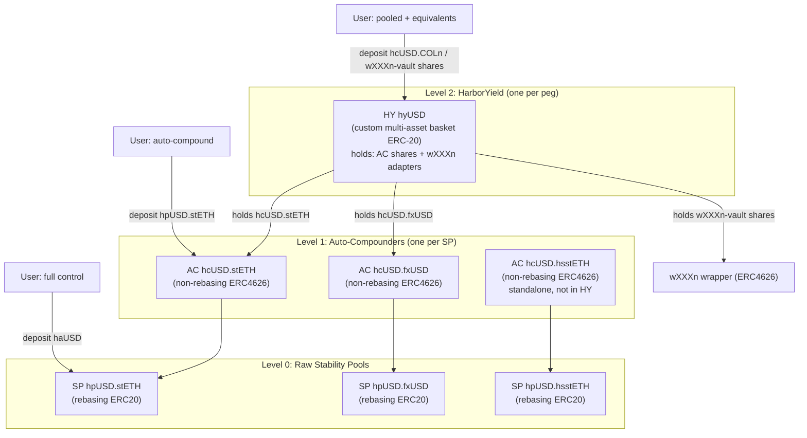
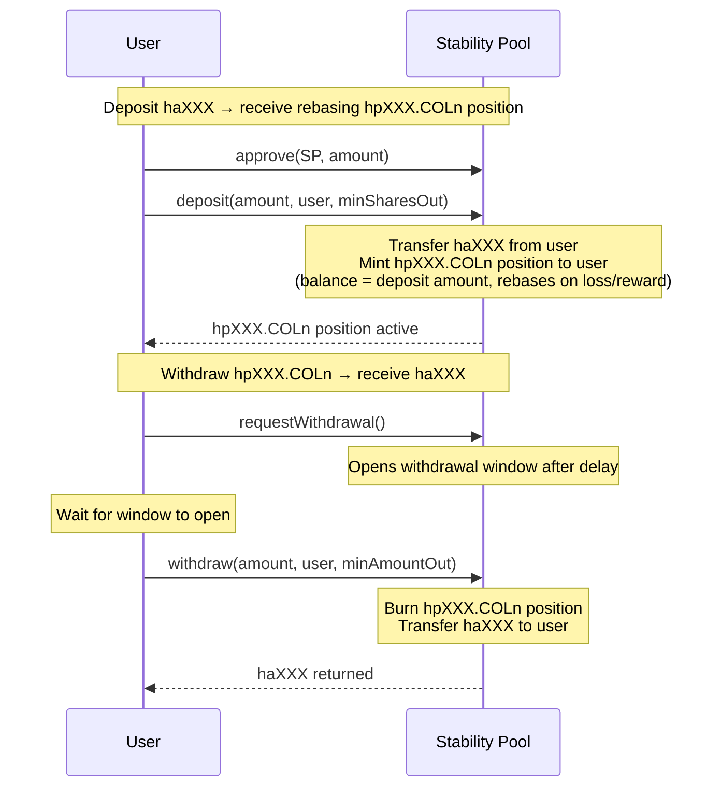
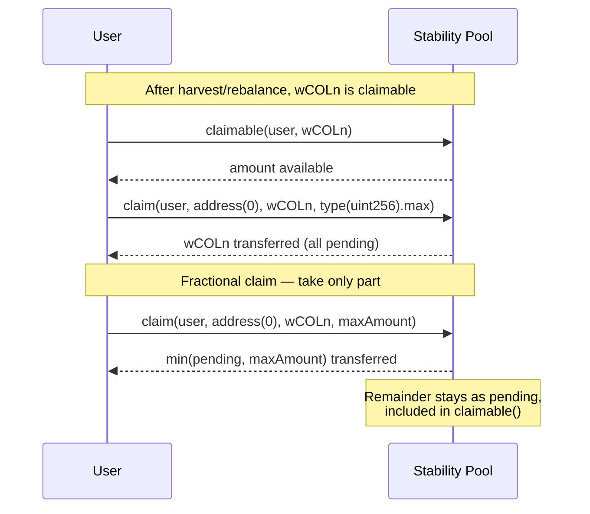
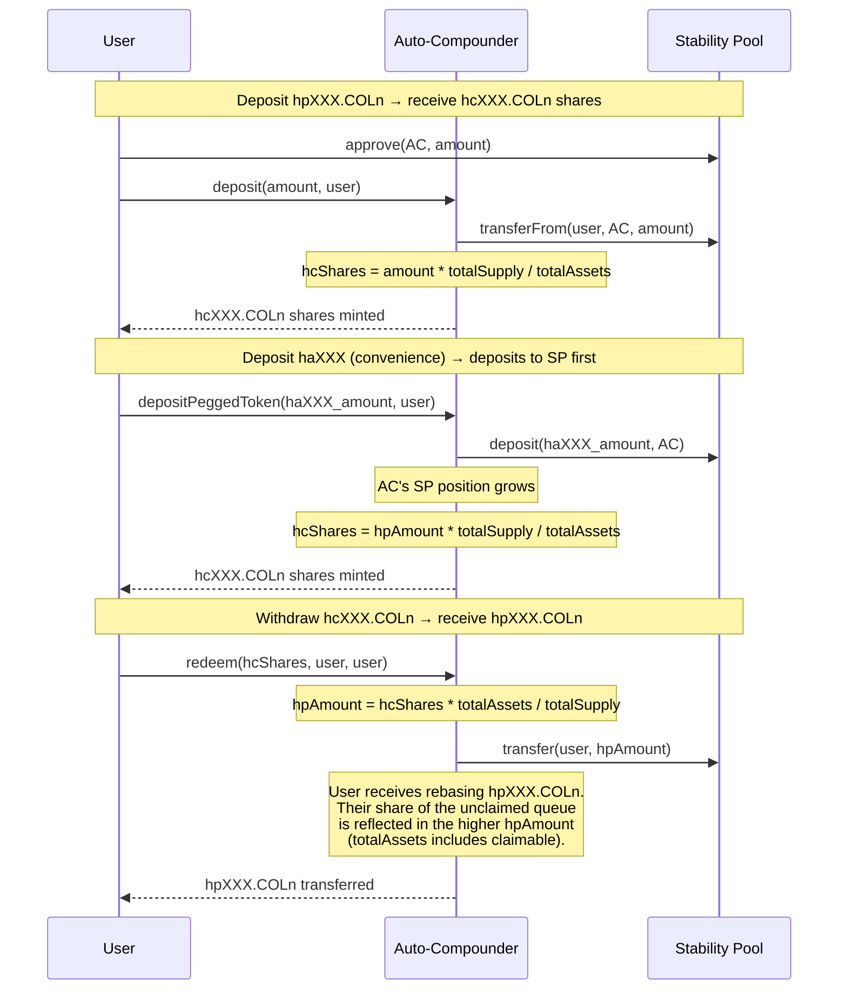
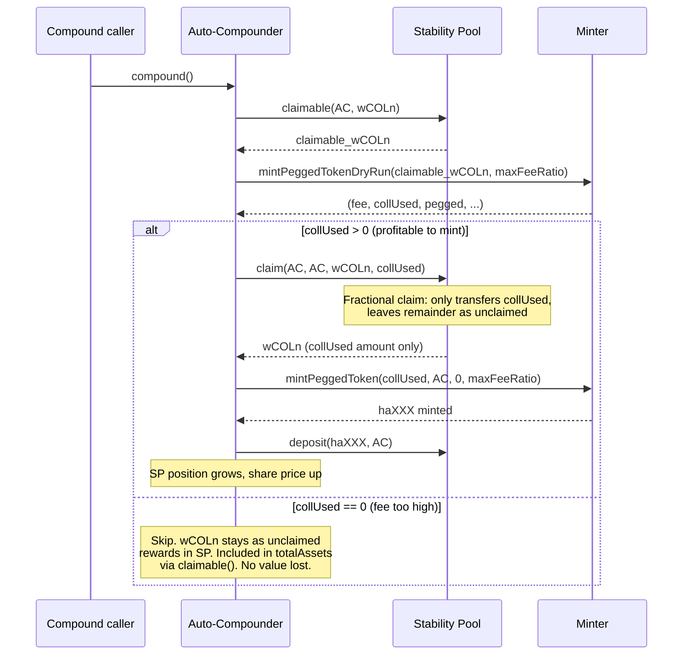
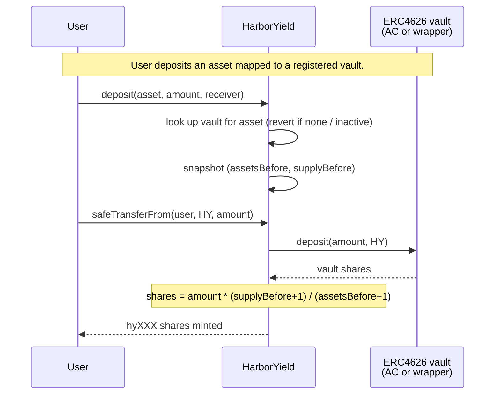
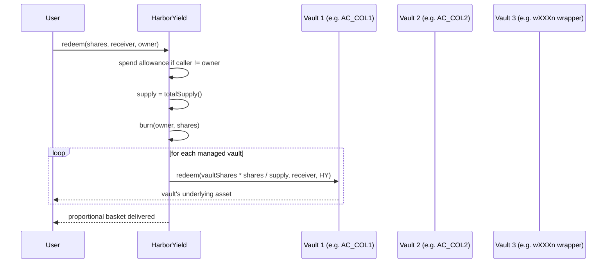
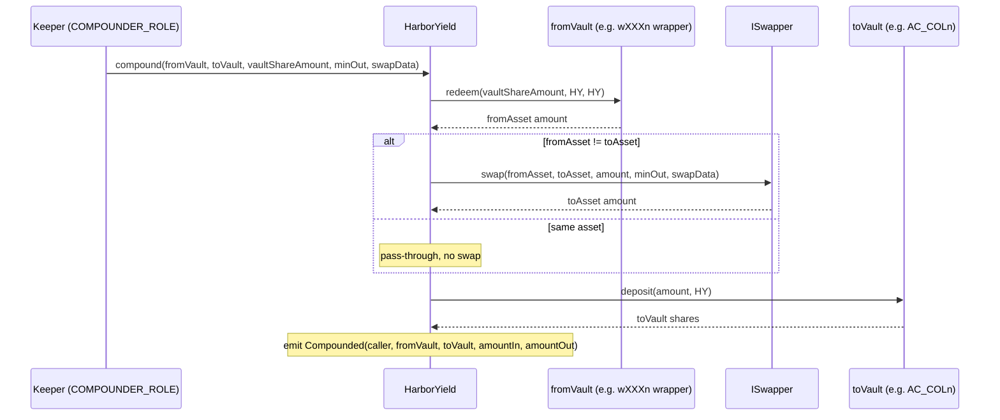
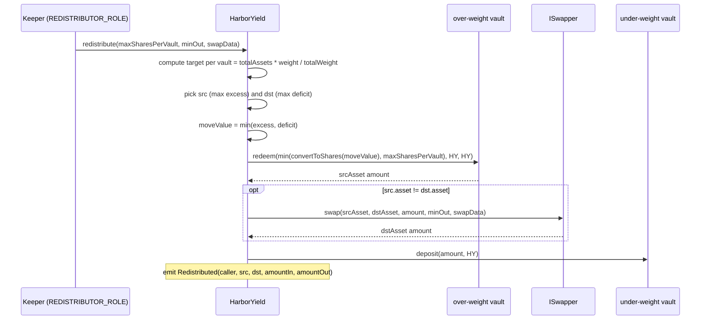

# Autocompounding Vault: Design & Requirements

## 1. Nomenclature

| Symbol | Meaning | Example (USD peg) |
|--------|---------|-------------------|
| **haXXX** | Pegged token for peg XXX | haUSD |
| **COLn** | Unwrapped collateral n | stETH (COL1), fxUSD (COL2) |
| **wCOLn** | Wrapped collateral n (interest-bearing) | wstETH (wCOL1), fxSAVE (wCOL2) |
| **hsXXX.COLn** | Leveraged (sail) token for collateral n | hsUSD.stETH |
| **hpXXX.COLn** | Rebasing SP token -- collateral pool | hpUSD.stETH |
| **hpXXX.hsCOLn** | Rebasing SP token -- leveraged pool | hpUSD.hsstETH |
| **hcXXX.COLn** | Auto-compounder share -- collateral pool | hcUSD.stETH |
| **hcXXX.hsCOLn** | Auto-compounder share -- leveraged pool | hcUSD.hsstETH |
| **hyXXX** | Peg Vault share (HarborYield) | hyUSD |
| **wXXXn** | Interest-bearing equivalent for peg XXX | fxSAVE (wUSD1) |
| **SP** | Stability Pool | |
| **AC** | Auto-Compounder (Level 1 ERC4626) | |
| **HY** | HarborYield — Peg Vault (Level 2 multi-asset ERC-20 basket) | |

## 2. Architecture Overview

Three layers offering escalating pooling. Each level gives up control in exchange for convenience:



**Level 0 -- Raw SP:** User chooses collateral type, manages claims manually. Rebasing ERC20. Full control.

**Level 1 -- Auto-Compounder (AC):** User chooses collateral type, gets autocompounding. Non-rebasing ERC4626 (fixed share count, moving price -- same as stETH/wstETH). Losses and rewards within one SP only. Available for both collateral and leveraged SPs.

**Level 2 -- HarborYield (HY):** User gives up collateral choice. Losses socialised across all managed vaults. One HY per peg. Holds one or more ERC4626 vault positions (ACs + equivalent-token wrappers). Custom multi-asset ERC-20 share (hyXXX) — *not* ERC-4626 and *not* ERC-7575 (both single-asset redeem semantics conflict with HY's proportional-redeem fairness invariant). Exposes ERC-4626-style *views* priced in peg units for interop. Leveraged SPs NOT included (rebalance into hsXXX.COLn which is not liquid).

## 3. Level 0: Raw Stability Pool

### Deposit / Withdraw



### Claim



---

## 4. Level 1: Auto-Compounder

### What it does

Wraps a rebasing hpXXX.COLn into a non-rebasing hcXXX.COLn share. Non-rebasing because the ERC4626 share count is fixed on deposit -- the share *price* changes, driven by `totalAssets() / totalSupply()`.

### Deposit / Withdraw



### Compound flow



### Share accounting

```
totalAssets() =
    SP.balanceOf(AC)                                        // SP position (haXXX terms, rebasing)
  + SP.claimable(AC, wCOLn) * price * rate / 1e36          // unclaimed wCOLn valued in haXXX
```

Price and rate obtained from `IMinter_v3(minter).mintPeggedTokenDryRun(claimable, type(uint256).max)` -- always in sync with the Minter, no direct oracle dependency.

### Rebalance impact

**Collateral SP rebalance:** haXXX burned, wCOLn received via `_accumulateReward`. wCOLn is liquid and valued in totalAssets via claimable. AC share price holds through rebalance -- lost haXXX position is offset by gained claimable wCOLn. The AC auto-compounds this back to haXXX when fees are acceptable.

**Leveraged SP rebalance:** haXXX burned, hsXXX.COLn received. hsXXX.COLn is NOT liquid. The AC's totalAssets() only values wrapped collateral (harvest rewards), not leveraged token rewards. This means AC share price drops on rebalance -- the lost haXXX position is not offset because leveraged tokens are not valued. The AC can only compound the harvest wCOLn; leveraged token rewards queue in the SP until manually claimed via sweep or direct claim.

### Fractional claim

`claim(account, receiver, token, maxAmount)` on SP_v3 -- claims up to maxAmount, leaves the rest as pending. Enables the AC to claim only what can be profitably minted. Remainder stays in SP reward accounting, included in `totalAssets()` via `claimable()`.

### Fairness

Standard ERC4626. `totalAssets()` includes all value (SP position + unclaimed queue at oracle price). Deposits buy at current `totalAssets/totalShares`. No dilution, no cross-subsidy regardless of queue size.

### No equivalents at AC level

The AC does NOT convert wCOLn to wXXXn. It either mints haXXX from wCOLn or leaves it unclaimed in the SP. No value transfers out of the AC. wXXXn equivalents exist only at the HY level (from direct user deposits of the wXXXn wrapper). This resolves the fairness concern from the earlier options analysis -- no cross-subsidy between layers.

### Deposit convenience

Core asset is hpXXX.COLn. Also accepts haXXX via `depositPeggedToken(amount, receiver)` which atomically deposits to SP then mints AC shares. Supports `type(uint256).max` for full balance.

## 5. Level 2: HarborYield (Peg Vault)

### What it does

One HarborYield per peg (e.g., hyUSD). Manages multiple ERC4626 vaults — one per asset — that share the same peg. Typical managed vaults for a single peg:

- `hcXXX.stETH` (AutoCompounder for stETH collateral SP)
- `hcXXX.fxUSD` (AutoCompounder for fxUSD collateral SP)
- `wXXXn` via a thin ERC4626 wrapper (e.g., fxSAVE adapter)

Users deposit the *vault's asset* (e.g., hpXXX.stETH, hpXXX.fxUSD, or the wXXXn wrapper's asset), mint hyXXX shares at the current exchange rate, and later redeem for a proportional mix of every managed vault's holdings. Losses and rewards are socialised across all hyXXX holders.

### Architecture invariants

- **One vault per asset** (enforced by an internal asset→vault index). Deposit routing is deterministic from the asset address.
- **Every managed vault is ERC-4626.** Non-ERC4626 yield sources are wrapped in thin 4626 adapters before being added.
- **No internal balance tracking.** HY reads `IERC20(vault).balanceOf(HY)` and `IERC4626(vault).convertToAssets(...)` each time; the vault is the source of truth.
- **No oracle.** All managed assets are assumed 1:1 pegged. The `ISwapper` and `IMinter_v3.mintPeggedTokenDryRun` serve as the only valuation primitives where needed.
- **Proportional redemption.** hyXXX redeem pays out a pro-rata slice of *every* managed vault — no single-asset redeem path. This is the central fairness invariant; it's why HY is not ERC-7575 (7575 per-asset redeem would let a user drain the best-performing component).
- **Upgradeable via UUPS**, HarborOwnableRoles, share-token name/symbol stored as constructor immutables via `StringPacking_v1`.

### Deposit flow



Convenience paths like "mint from haXXX" or "mint from wCOLn" are **not** exposed on HY. Users who want to enter from a raw asset call the Minter → SP → AC path off-chain (or via a router contract), then deposit the resulting AC shares' underlying asset (hpXXX.COLn) into HY.

### Redeem flow



### Compound (equivalent → AC via swapper)

HY's `compound()` is *not* a "compound each AC" loop — the ACs compound themselves (permissionless `AC.compound()`, also triggered by SPM harvest/rebalance). HY's `compound()` is a narrower operation: convert holdings from one managed vault into another, typically to route equivalent-token yield into the AC layer.



### Redistribute (rebalance toward target weights)

Each managed vault has an arbitrary-unit `weight`. HY caches `totalWeight = SUM(weight)`. `redistribute()` finds the most over-weight vault (largest `currentValue − targetValue`) and the most under-weight vault, then moves `min(excess, deficit)` from source to target.



Reverts with `NothingToRedistribute` when `totalAssets == 0`, `totalWeight == 0`, or the basket is already exactly on target.

### Share accounting

```
totalAssets() =
    SUM over managed vaults of IERC4626(vault).convertToAssets(IERC20(vault).balanceOf(HY))
```

No oracle. All components are assumed 1:1 pegged — see §6.13 (Peg Verification) for how that assumption is defended.

### Fairness

- **Proportional redeem** prevents single-asset cherry-picking.
- **Weight-driven rebalance** keeps the basket close to governance targets without ad-hoc moves.
- **No dilution on deposit:** shares are priced at the *pre-deposit* exchange rate (`shares = amount * (supply+1) / (totalAssets+1)`), so new depositors can't claim a slice of existing pending yield.
- **Collateral SP rebalances are absorbed at the AC layer** (wCOLn offsets lost haXXX). HY sees a roughly unchanged per-vault value through a rebalance.

### ERC-4626 compatibility (planned — view shim)

HY will expose ERC-4626-style *views* priced in peg units — `asset()` returning the peg token (haXXX), plus `totalAssets`, `convertToShares/Assets`, `previewDeposit/Redeem` — to give aggregators and portfolio tools enough to value hyXXX. The mutation surface remains HY's own (`deposit(asset,…)`, `redeem`, `compound`, `redistribute`). See plan §B.4.2.

## 6. Design Decisions

### 6.1 SP as Rebasing ERC20

`balanceOf()` returns compounded real value. `totalSupply()` returns `totalAssetSupply()`. Transfer/approve/allowance added in v3. Like stETH.

### 6.2 Non-rebasing AC shares

The AC is the non-rebasing wrapped version. Like wstETH wraps stETH. Share count fixed, price moves.

### 6.3 Collateral SP rebalance holds value

Unlike leveraged SPs, collateral SP rebalance returns liquid wCOLn. The AC's totalAssets stays roughly constant (lost haXXX offset by gained claimable wCOLn). The AC auto-compounds back to haXXX when fees are acceptable.

### 6.4 Leveraged SPs standalone

Leveraged SPs rebalance into hsXXX.COLn which is not liquid. Leveraged AC only compounds harvest wCOLn. Not included in HY (different risk profile).

### 6.5 Minting: maxFeeRatio

`mintPeggedToken(wCOLn, receiver, minPeggedOut, maxFeeRatio)` on Minter_v3. Stops when cumulative fee exceeds maxFeeRatio * collateralIn. Returns (0, 0) gracefully if fee too high.

### 6.6 Unified Claim with Fractional Support

`claim(account, receiver, token, maxAmount)` on SP_v3 (via `IMultipleRewardAccumulator_v3`). Claims up to maxAmount from the token, leaves rest as pending. `token == address(0)` claims all active tokens. Array overload `claim(account, receiver, tokens[], maxAmount)` for batch/historical claims.

### 6.7 Oracle Coupling

AC reads price and rate from `IMinter_v3(minter).mintPeggedTokenDryRun()` — always in sync with the Minter, no direct oracle dependency. HY has no oracle dependency at all (see §5 share accounting and §6.13 peg verification).

### 6.8 Equivalent Token Management

Equivalent yield sources (wXXXn) are held at the HY level only — never inside an AC (see §6.9). Each equivalent is registered as a managed ERC4626 vault; non-ERC4626 tokens are wrapped in a thin 4626 adapter first. There is no preference list and no internal bookkeeping: holdings are whatever `balanceOf(HY)` returns, and weights drive the rebalance target. Value can be routed back into AC positions via `HY.compound(fromVault, toVault, …)` which calls `ISwapper` to cross assets and deposits into the destination ERC4626.

### 6.9 No Equivalents in AC

The AC does NOT hold wXXXn. Unprofitable wCOLn stays as unclaimed rewards in the SP, valued in `totalAssets` via `claimable()`. This avoids the cross-subsidy fairness issue identified in the options analysis.

### 6.10 Compound Trigger

Two distinct "compound" operations live at different layers:

- **AC.compound()** — permissionless. Claims profitable wCOLn, mints haXXX via the Minter, redeposits to the SP. Also triggered by SPM during harvest/rebalance (B.5, pending).
- **HY.compound(fromVault, toVault, vaultShares, minOut, swapData)** — role-gated (`COMPOUNDER_ROLE | owner`). Redeems from one managed vault, swaps via `ISwapper`, deposits into another managed vault. Used to route equivalent-token yield into the AC layer when profitable.

### 6.11 Withdrawal

AC uses EXEMPT_WITHDRAWAL_FEE_ROLE initially. Dynamic fees (CR-based) replace withdrawal delay in future SP version, enabling standard ERC4626 `withdraw` (plan B.6b).

### 6.12 HarborYield is not ERC-4626 / ERC-7575

HY's mutation surface is intentionally non-standard:

- **ERC-4626** is single-asset (`asset()` returns one address, `deposit`/`redeem` transact in that asset). HY holds multiple assets by design.
- **ERC-7575** (multi-asset vaults with one share token) uses per-asset redeem semantics — each asset has its own ERC-4626 entry contract. That directly breaks HY's proportional-redeem fairness invariant: a user could redeem entirely through the highest-yielding component and leave the rest of hyXXX holders with a worse basket.

HY will instead expose ERC-4626-style *views* priced in peg units (`asset()`, `totalAssets`, `convertTo*`, `preview*`) for interop with aggregators, indexers, and price feeds. The mutation API stays HY-specific (`deposit(asset, amount, receiver)`, `redeem(shares, receiver, owner)`, `compound`, `redistribute`). See plan B.4.2 for the exact view surface.

### 6.13 Peg Verification

HY assumes every managed vault's asset is pegged to the same RWA. Two failure modes:

1. **Config error** — admin registers a vault whose asset is pegged to the wrong RWA (or not pegged at all). Catastrophic valuation error.
2. **Market depeg** — a component trades below peg transiently. New depositors are diluted and redeemers get a worse mix than market value would suggest.

Defense in depth (plan B.4.3):

- **Config-time pegId** — HY stores an immutable `bytes32 pegId` (e.g. `keccak256("USD")`); `addVault` requires the vault to declare the same pegId. Prevents misconfig, zero runtime cost.
- **Swapper drift check** — inside `compound`/`redistribute`, call `ISwapper.previewSwap(from, to, 1e18)` and revert if the result diverges from 1e18 by more than `maxPegDrift` (owner-tunable, default e.g. 2%). Reuses the existing dep; catches market depeg at the moment it would lock in a bad rate.
- **Watchtower + deactivateVault** — owner freezes new deposits to a vault during sustained depegs. Proportional redeems still work; users see the depeg reflected in their basket.
- **Oracle-valued totalAssets** — deferred. Only add if the above proves insufficient in production.

### 6.14 ERC-20 Permit (EIP-2612)

All new ERC-20 contracts shipped in this work will support `permit(owner, spender, value, deadline, v, r, s)` for approve-and-act in a single transaction:

- `HarborYield_v1` — freshly added via OZ `ERC20PermitUpgradeable`.
- `AutoCompounder_v1` — freshly added via OZ `ERC20PermitUpgradeable` (ERC4626Upgradeable's underlying ERC20).
- `StabilityPool_v4` — added alongside the accumulator cleanup (Campaign A2). Permit is orthogonal to rebasing: it only signs `approve()` authorizations, so a bespoke implementation that uses namespaced (ERC7201) storage for the `nonces` mapping and rebuilds the EIP-712 domain separator at runtime is straightforward.
- `PeggedToken` / `LeveragedToken` — audit first; migrate if not already using `PermittableERC20_v1` from bao-base.

OZ is chosen over Solady because all four contracts are UUPS upgradeable — Solady's ERC20 is built around immutables and direct storage and would require a hand-rolled upgradeable adapter (new audit surface) for a modest bytecode saving. See plan Campaign H for the full tradeoff.

## 7. Access Control

| Role | On Contract | Purpose |
|------|------------|---------|
| Owner | HY, AC | Add/weight/deactivate vaults; configure `maxFeeRatio`; UUPS upgrade; sweep |
| `COMPOUNDER_ROLE` | HY | Call `HY.compound(fromVault, toVault, …)` |
| `REDISTRIBUTOR_ROLE` | HY | Call `HY.redistribute(…)` |
| `EXEMPT_WITHDRAWAL_FEE_ROLE` | SP | AC withdraws without fee/delay |
| Anyone | SP, AC, HY (deposit/redeem), `AC.compound()` | Public entrypoints |

## 8. Contracts

| Contract | Status | Purpose |
|----------|--------|---------|
| StabilityPool_v3 | Done | Rebasing ERC20, unified claim, fractional claim, StringPacking_v1 |
| Minter_v3 | Done | `mintPeggedToken(maxFeeRatio)`, `mintPeggedTokenDryRun`, private→internal |
| AutoCompounder_v1 | Done | Non-rebasing ERC4626 wrapper per SP (Level 1) |
| HarborYield_v1 | Done (core) | Multi-asset ERC-20 basket per peg (Level 2). `compound`/`redistribute` role-gated |
| ISwapper / MockSwapper | Done | Generic swap interface; mock for tests |
| StabilityPoolManager_v2 | Pending (B.5) | SPM triggers `AC.compound()` during harvest/rebalance |
| StabilityPool_v4 | Pending (A2) | Accumulator cleanup, CR-based withdrawal fee (B.6b), ERC-20 permit (H) |

## 9. References

- [Aladdin fxSAVE analysis](../aladdin/fxSAVE.md) -- ERC4626 wrapping stability pool, proven pattern
- [SP dynamic fees](sp-dynamic-fees.md) -- CR-based fees replacing withdrawal delay
- [SP auto-compounding](sp-auto-compounding-harvests.md) -- deferred: two-product factor for SP-internal compounding
