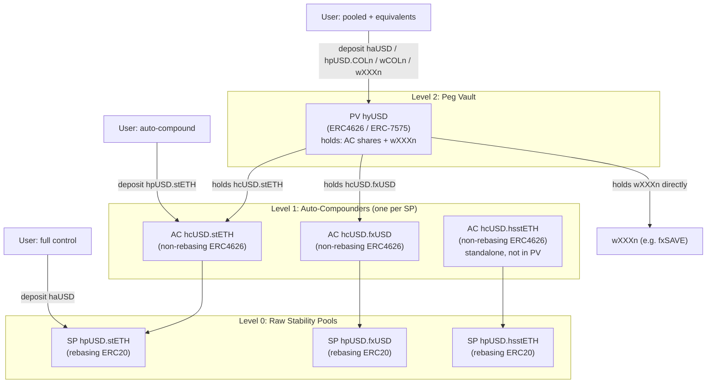
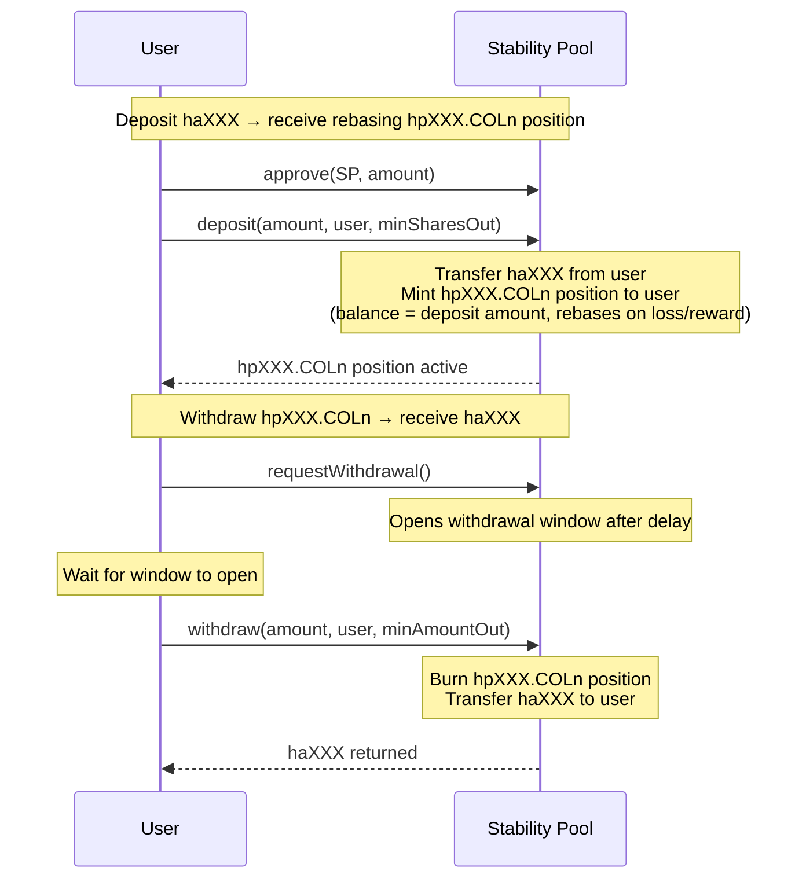
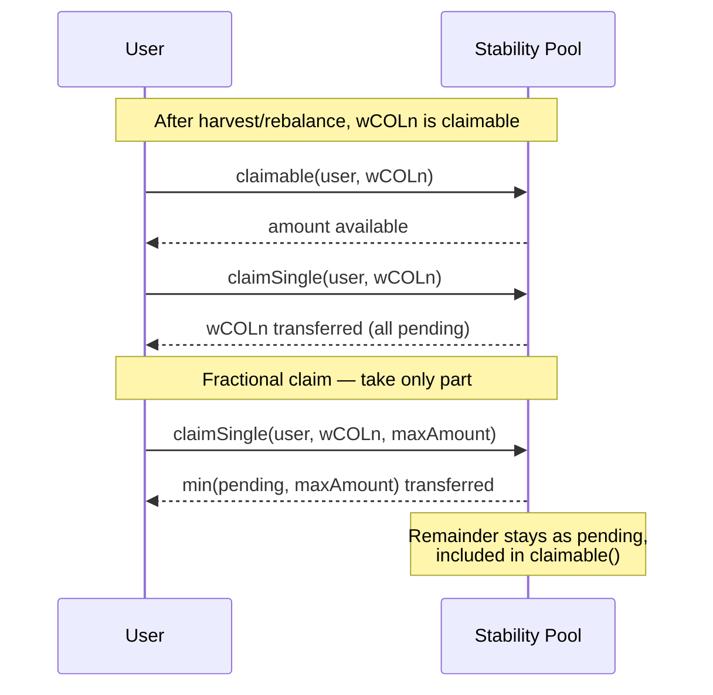
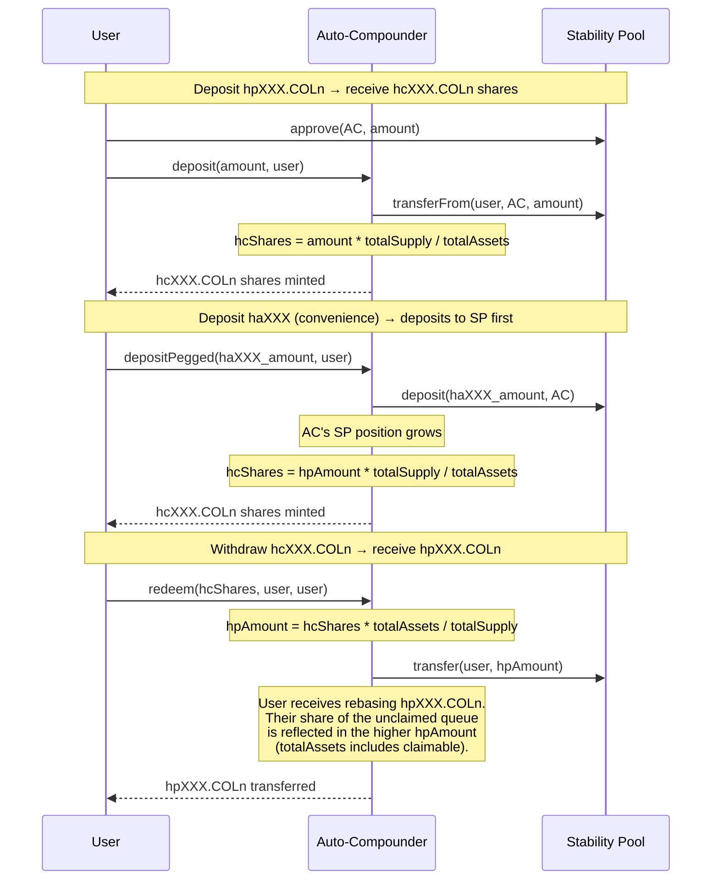
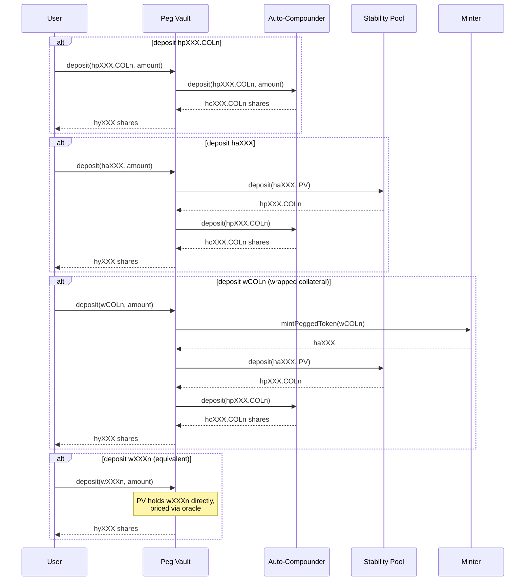
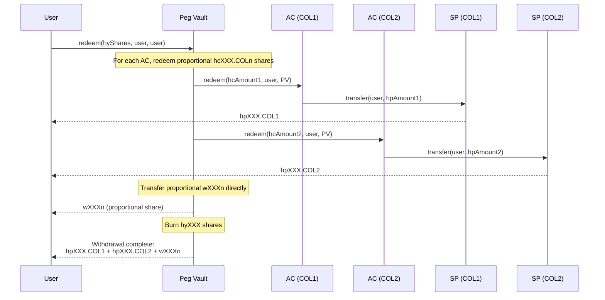
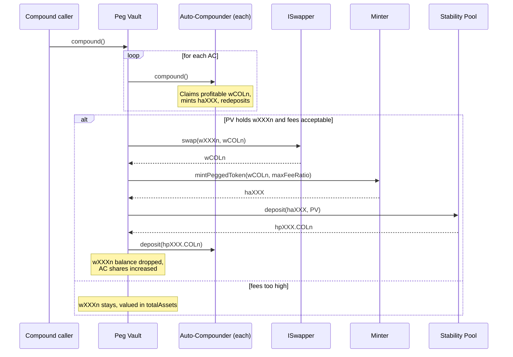

# Autocompounding Vault: Design & Requirements

## 1. Nomenclature

| Symbol | Meaning | Example (USD peg) |
|--------|---------|-------------------|
| **haXXX** | Pegged token for peg XXX | haUSD |
| **COLn** | Unwrapped collateral n | stETH (COL1), fxUSD (COL2) |
| **wCOLn** | Wrapped collateral n (interest-bearing) | wstETH (wCOL1), fxSAVE (wCOL2) |
| **hsXXX.COLn** | Leveraged (sail) token for collateral n | hsUSD.stETH |
| **hpXXX.COLn** | Rebasing SP token -- collateral pool | hpUSD.stETH |
| **hpXXX.hsCOLn** | Rebasing SP token -- leveraged pool | hpUSD.hsstETH |
| **hcXXX.COLn** | Auto-compounder share -- collateral pool | hcUSD.stETH |
| **hcXXX.hsCOLn** | Auto-compounder share -- leveraged pool | hcUSD.hsstETH |
| **hyXXX** | Peg Vault share | hyUSD |
| **wXXXn** | Interest-bearing equivalent for peg XXX | fxSAVE (wUSD1) |
| **SP** | Stability Pool | |
| **AC** | Auto-Compounder (Level 1 ERC4626) | |
| **PV** | Peg Vault (Level 2 ERC4626/ERC-7575) | |

## 2. Architecture Overview

Three layers offering escalating pooling. Each level gives up control in exchange for convenience:



**Level 0 -- Raw SP:** User chooses collateral type, manages claims manually. Rebasing ERC20. Full control.

**Level 1 -- Auto-Compounder (AC):** User chooses collateral type, gets autocompounding. Non-rebasing ERC4626 (fixed share count, moving price -- same as stETH/wstETH). Losses and rewards within one SP only. Available for both collateral and leveraged SPs.

**Level 2 -- Peg Vault (PV):** User gives up collateral choice. Losses socialised across all collateral SPs. Holds AC shares + equivalent tokens (wXXXn). ERC-7575 multi-asset entry. Leveraged SPs NOT included (rebalance into hsXXX.COLn which is not liquid).

## 3. Level 0: Raw Stability Pool

### Deposit / Withdraw



### Claim



---

## 4. Level 1: Auto-Compounder

### What it does

Wraps a rebasing hpXXX.COLn into a non-rebasing hcXXX.COLn share. Non-rebasing because the ERC4626 share count is fixed on deposit -- the share *price* changes, driven by `totalAssets() / totalSupply()`.

### Deposit / Withdraw



### Compound flow


### Share accounting

```
totalAssets() =
    SP.balanceOf(AC)                         // SP position (haXXX terms, rebasing)
  + SP.claimable(AC, wCOLn) * oraclePrice   // unclaimed wCOLn valued in haXXX
```

Oracle read from `IMinter(minter).priceOracle()` at runtime -- always in sync with the Minter.

### Rebalance impact

**Collateral SP rebalance:** haXXX burned, wCOLn received via `_accumulateReward`. wCOLn is liquid and valued in totalAssets via claimable. AC share price holds through rebalance -- lost haXXX position is offset by gained claimable wCOLn. The AC auto-compounds this back to haXXX when fees are acceptable.

**Leveraged SP rebalance:** haXXX burned, hsXXX.COLn received. hsXXX.COLn is NOT liquid. AC share price drops because leveraged tokens can't be easily converted back. The AC can only compound the harvest wCOLn; leveraged token rewards queue indefinitely until manually claimed. Included in totalAssets via `leveragedTokenPrice()`.

### Fractional claim

`claimSingle(account, token, maxAmount)` on SP_v3 -- claims up to maxAmount, leaves the rest as pending. Enables the AC to claim only what can be profitably minted. Remainder stays in SP reward accounting, included in `totalAssets()` via `claimable()`.

### Fairness

Standard ERC4626. `totalAssets()` includes all value (SP position + unclaimed queue at oracle price). Deposits buy at current `totalAssets/totalShares`. No dilution, no cross-subsidy regardless of queue size.

### No equivalents at AC level

The AC does NOT convert wCOLn to wXXXn. It either mints haXXX from wCOLn or leaves it unclaimed in the SP. No value transfers out of the AC. wXXXn equivalents exist only at the PV level (from direct user deposits). This resolves the fairness concern from the earlier options analysis -- no cross-subsidy between layers.

### Deposit convenience

Core asset is hpXXX.COLn. Also accepts haXXX via `depositPegged(haXXX, amount)` which atomically deposits to SP then mints AC shares.

## 5. Level 2: Peg Vault

### What it does

Combines all collateral AC shares for a peg + equivalent tokens (wXXXn) into a single hyXXX share. ERC-7575: multiple entry assets, one share token.

### Deposit flows



### Withdrawal

User receives proportional mix of all PV holdings: hpXXX.COLn (via AC redeem) for each collateral + wXXXn.



### Compound



### Share accounting

```
totalAssets() =
    SUM( AC.convertToAssets(PV's hcXXX.COLn shares) )   // includes unclaimed queue
  + SUM( wXXXn.balanceOf(PV) * oracle_price )            // direct equivalent holdings
```

### Fairness

Same ERC4626 accounting over a portfolio. Collateral SP rebalances don't cause loss (wCOLn offsets haXXX). wXXXn deposits priced at oracle value, socialised across all hyXXX holders.

## 6. Design Decisions

### 5.1 SP as Rebasing ERC20

`balanceOf()` returns compounded real value. `totalSupply()` returns `totalAssetSupply()`. Transfer/approve/allowance added in v3. Like stETH.

### 5.2 Non-rebasing AC shares

The AC is the non-rebasing wrapped version. Like wstETH wraps stETH. Share count fixed, price moves.

### 5.3 Collateral SP rebalance holds value

Unlike leveraged SPs, collateral SP rebalance returns liquid wCOLn. The AC's totalAssets stays roughly constant (lost haXXX offset by gained claimable wCOLn). The AC auto-compounds back to haXXX when fees are acceptable.

### 5.4 Leveraged SPs standalone

Leveraged SPs rebalance into hsXXX.COLn which is not liquid. Leveraged AC only compounds harvest wCOLn. Not included in PV (different risk profile).

### 5.5 Minting: maxFeeRatio

`mintPeggedToken(wCOLn, receiver, minPeggedOut, maxFeeRatio)` on Minter_v3. Stops when cumulative fee exceeds maxFeeRatio * collateralIn. Returns (0, 0) gracefully if fee too high.

### 5.6 Fractional Claim

`claimSingle(account, token, maxAmount)` on SP_v3. Claims up to maxAmount, leaves rest as pending. Enables AC to claim only what can be profitably minted.

### 5.7 Oracle Coupling

AC and PV read `IMinter(minter).priceOracle()` at runtime. Always in sync. No separate oracle config.

### 5.8 Equivalent Token Management

wXXXn held at PV level only (not in ACs). Preference-ordered list, updatable by keeper. PV converts wXXXn -> wCOLn (via ISwapper) -> haXXX (via Minter) -> SP when fees acceptable.

### 5.9 No Equivalents in AC

The AC does NOT hold wXXXn. Unprofitable wCOLn stays as unclaimed rewards in the SP, valued in totalAssets via claimable. This avoids the cross-subsidy fairness issue identified in the options analysis.

### 5.10 Compound Trigger

Permissionless. Also triggered by SPM during harvest/rebalance.

### 5.11 Withdrawal

AC uses EXEMPT_WITHDRAWAL_FEE_ROLE initially. Dynamic fees (CR-based) replace withdrawal delay in future SP version, enabling standard ERC4626 withdraw.

## 7. Access Control

| Role | On Contract | Purpose |
|------|------------|---------|
| `KEEPER_ROLE` | PV | Swap execution + equivalent list ordering |
| Owner | PV, AC | Configure maxFeeRatio, swapper, upgrade |
| `EXEMPT_WITHDRAWAL_FEE_ROLE` | SP | AC withdraws without delay |
| Anyone | All | deposit, withdraw, compound |

## 8. Contracts

| Contract | Status | Purpose |
|----------|--------|---------|
| StabilityPool_v3 | In progress | Rebasing ERC20 + claimSingle + fractional claim |
| Minter_v3 | Done | mintPeggedTokenCapped |
| AutoCompounder | To build | ERC4626 per SP (Level 1) |
| PegVault | To build | ERC4626/ERC-7575 per peg (Level 2) |
| ISwapper / MockSwapper | To build | wXXXn conversion interface |
| StabilityPoolManager_v2 | To build | Compound triggers |

## 9. References

- [Aladdin fxSAVE analysis](../aladdin/fxSAVE.md) -- ERC4626 wrapping stability pool, proven pattern
- [SP dynamic fees](sp-dynamic-fees.md) -- CR-based fees replacing withdrawal delay
- [SP auto-compounding](sp-auto-compounding-harvests.md) -- deferred: two-product factor for SP-internal compounding
