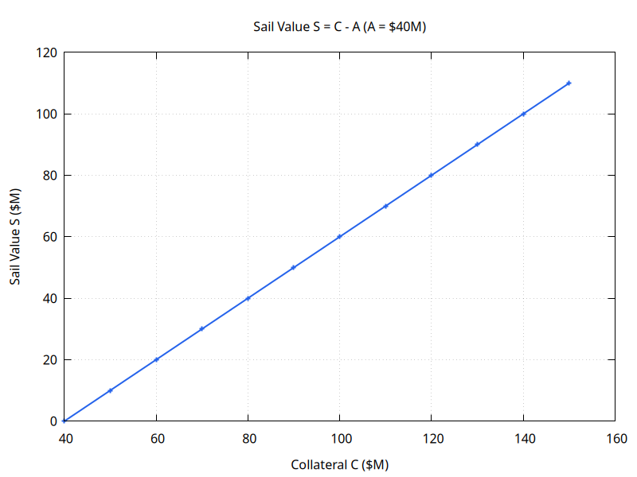
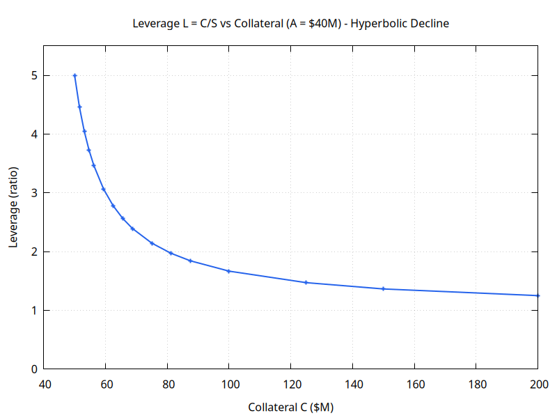
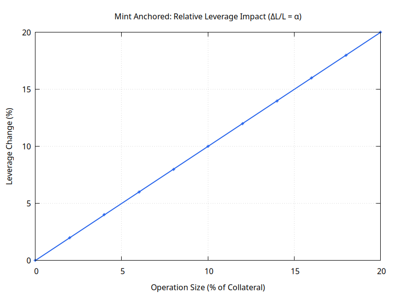
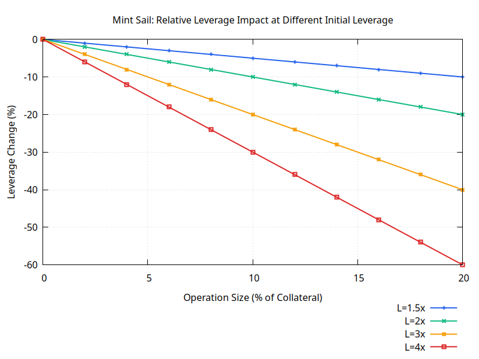
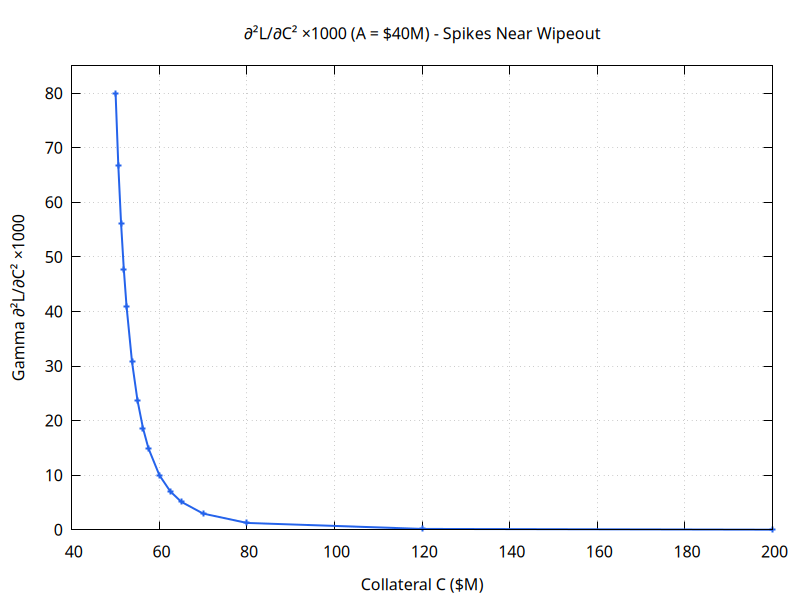

# Harbor Anchor-Sail Token Mathematics

**Date:** 2026-02-15
**Purpose:** Mathematical foundation for all Harbor token products

---

## 1. Core System Invariant

### 1.1 Fundamental Equation

```
C = A + S

Where:
C = Total collateral value (in peg terms, e.g., wstETH priced in USD)
A = Total anchored token value (always ≈ 1 USD per token × supply)
S = Total sail token value (residual)
```

**Invariant property:** This equation always holds. The total collateral backing the system equals the sum of anchored and sail token values.

**Proof:** By construction. Anchored tokens are minted 1:1 against collateral, sail tokens represent the residual claim.

---

### 1.2 Collateral Ratio

```
CR = C / A

Typical range: 1.3 to 3.0
- CR < 1.0: System insolvent (impossible by design)
- CR = 1.0: Sail tokens worthless (S = 0)
- CR < 1.3: Rebalancing triggered
- CR > 2.0: System well-collateralized
```

**Relationship to sail value:**

```
S = C - A = A(CR - 1)

∴ Sail value = Anchored value × (CR - 1)
```



---

## 2. Value Functions

### 2.1 Sail Token Value

**Total sail value:**

```
S(C, A) = C - A
```

**Per-token value:**

```
s(C, A, n) = (C - A) / n

Where n = sail token supply
```

**Properties:**

- Linear in C
- Linear in A (negative)
- Inversely proportional to n

---

### 2.2 Leverage Ratio

**Definition:** Effective leverage of sail tokens relative to collateral price movements.

```
L(C, A) = C / (C - A) = C / S = CR / (CR - 1)
```

**Properties:**

- L → ∞ as C → A (approaching wipeout)
- L decreases as C increases (de-leveraging when winning)
- L increases as C decreases (leveraging when losing)

**Typical values:**

| CR  | Leverage L |
| --- | ---------- |
| 1.3 | 4.33x      |
| 1.5 | 3.0x       |
| 2.0 | 2.0x       |
| 3.0 | 1.5x       |



_Note: Leverage decreases hyperbolically as collateral increases. Near wipeout (C→A), leverage→∞. This nonlinearity creates the "negative gamma" effect._

---

## 3. Delta Analysis (First-Order Sensitivities)

**Important:** C, A, and S are linked by the invariant C = A + S. You cannot change one independently - all changes occur through specific operations (minting/redeeming). The deltas below show mathematical relationships, but see Section 4 for how they combine in actual operations.

### 3.1 Fundamental Relationships

From the invariant S = C - A, we have:

**Sail value sensitivity to collateral (holding A constant):**

```
∂S/∂C = 1

Interpretation: If collateral increases by $1 and anchored supply stays fixed,
sail value increases by $1.
```

**Sail value sensitivity to anchored supply (holding C constant):**

```
∂S/∂A = -1

Interpretation: If anchored supply increases by $1 and collateral stays fixed,
sail value decreases by $1.
```

**Note:** These are partial derivatives showing mathematical relationships. In practice, you cannot change A without changing C (minting anchored requires depositing collateral). See Section 4 for actual operation effects.

---

## 4. Effects of Token Operations

**Key principle:** You cannot change C, A, or S independently. All changes occur through specific minting/redeeming operations that affect multiple variables simultaneously.

### 4.1 Minting Anchored Tokens

**User deposits ΔC collateral, receives ΔA = ΔC anchored tokens (1:1 backing):**

```
C_new = C + ΔC
A_new = A + ΔC  (since ΔA = ΔC for 1:1 backing)
S_new = C_new - A_new = (C + ΔC) - (A + ΔC) = C - A = S

∴ Sail value UNCHANGED by anchored minting
```

**But leverage changes:**

```
L_old = C / S
L_new = (C + ΔC) / S

ΔL = ΔC / S > 0

Leverage INCREASES!
```

**Intuition:** More collateral backing same sail value → higher effective leverage.

**Example:**

C = $100, A = $40, S = $60, L = 1.67x

User mints $10 anchored:

- C_new = $110, A_new = $50, S_new = $60 (unchanged)
- L_new = 110/60 = 1.83x (leverage increased from 1.67x to 1.83x)

**Sail holders benefit:** Their token value stays same, but effective leverage (and potential upside) increases.

---

### 4.2 Redeeming Anchored Tokens

**User burns ΔA anchored tokens, receives ΔC = ΔA collateral:**

```
C_new = C - ΔC
A_new = A - ΔC
S_new = C_new - A_new = (C - ΔC) - (A - ΔC) = C - A = S

∴ Sail value UNCHANGED
```

**Leverage changes:**

```
L_new = (C - ΔC) / S

ΔL = -ΔC / S < 0

Leverage DECREASES
```

**Example:**

C = $100, A = $40, S = $60, L = 1.67x

User redeems $10 anchored:

- C_new = $90, A_new = $30, S_new = $60 (unchanged)
- L_new = 90/60 = 1.5x (leverage decreased from 1.67x to 1.5x)

**Sail holders harmed:** Effective leverage (upside potential) decreases.

---

### 4.3 Minting Sail Tokens

**User deposits ΔC collateral, receives Δn sail tokens:**

The sail value increases by the deposited collateral:

```
S_new = S + ΔC
C_new = C + ΔC  (collateral added)
A_new = A  (no anchored tokens created)
```

**Fair pricing:** Δn should be set so existing holders' per-token value is preserved:

```
Value per existing token before: s_old = S / n
New shares: Δn = ΔC / s_old = ΔC × n / S

Total supply after: n_new = n + Δn = n + ΔC × n / S = n(S + ΔC)/S

Value per token after: s_new = S_new / n_new
                              = (S + ΔC) / (n(S + ΔC)/S)
                              = S / n
                              = s_old ✓

Fair minting preserves per-token value.
```

**Leverage effect:**

```
L_old = C / S
L_new = (C + ΔC) / (S + ΔC)

For small ΔC:
L_new ≈ L_old × (1 + ΔC/C) / (1 + ΔC/S)
     ≈ L_old × (1 + ΔC/C - ΔC/S)
     = L_old × (1 + ΔC(S - C)/(CS))
     = L_old × (1 - ΔC×A/(CS))

Since A > 0: L_new < L_old

∴ Sail minting DECREASES leverage
```

**Intuition:** Adding more sail value at current prices means less leverage per unit collateral.

---

### 4.4 Redeeming Sail Tokens

**User burns Δn sail tokens, receives ΔC collateral:**

The sail value decreases by the redeemed amount:

```
Fair redemption: ΔC = s_old × Δn = (S/n) × Δn

S_new = S - ΔC = S - S×Δn/n = S(1 - Δn/n)
C_new = C - ΔC  (collateral withdrawn)
A_new = A  (no anchored tokens affected)
n_new = n - Δn = n(1 - Δn/n)

s_new = S_new / n_new = S(1 - Δn/n) / (n(1 - Δn/n)) = S/n = s_old ✓

Fair redemption preserves per-token value.
```

**Leverage effect:**

```
L_old = C / S
L_new = (C - ΔC) / (S - ΔC)

Following similar analysis: L_new > L_old

∴ Sail redemption INCREASES leverage
```

**Intuition:** Removing sail value at current prices concentrates leverage among remaining holders.

---

### 4.5 Collateral Price Changes

**Price changes from P₀ to P₁ (holding physical amount V₀ constant):**

```
C₀ = V₀ × P₀
C₁ = V₀ × P₁
ΔC = V₀ × ΔP

A unchanged (anchored supply in tokens doesn't change with price)

S₁ = C₁ - A = V₀P₁ - A
S₀ = C₀ - A = V₀P₀ - A
ΔS = V₀ × ΔP = ΔC

∴ Sail value changes 1:1 with collateral value
```

**Sail return:**

```
ΔS/S₀ = V₀ΔP / (V₀P₀ - A)
      = V₀ΔP / S₀
      = (C₀ / S₀) × (ΔP/P₀)
      = L₀ × (ΔP/P₀)

∴ Sail return ≈ Initial Leverage × Collateral return
```

**Leverage changes:**

```
L₁ = C₁/S₁ = V₀P₁ / (V₀P₁ - A)
L₀ = C₀/S₀ = V₀P₀ / (V₀P₀ - A)

For small ΔP:
L₁ ≈ L₀(1 - A×ΔP / (S₀×P₀))

∴ Leverage DECREASES when price increases (ΔP > 0)
  Leverage INCREASES when price decreases (ΔP < 0)
```

**Example: Price increase (+10%)**

Initial: V₀ = 100 wstETH, P₀ = $3,000, C₀ = $300k, A = $180k, S₀ = $120k, L₀ = 2.5x

```
P₁ = $3,300
C₁ = $330k
S₁ = $150k
L₁ = 2.2x

ΔS/S₀ = $30k / $120k = +25% (≈ 2.5x × 10%)
ΔL = -0.3x (de-leveraging)
```

**Example: Price decrease (-10%)**

```
P₁ = $2,700
C₁ = $270k
S₁ = $90k
L₁ = 3.0x

ΔS/S₀ = -$30k / $120k = -25% (≈ 2.5x × -10%)
ΔL = +0.5x (re-leveraging - DANGER!)
```

---

### 4.6 Operations Summary Table

| Operation           | ΔC  | ΔA  | ΔS  | ΔL  | Notes                                                   |
| ------------------- | --- | --- | --- | --- | ------------------------------------------------------- |
| **Mint anchored**   | +ΔA | +ΔA | 0   | +   | Sail value unchanged, leverage increases                |
| **Redeem anchored** | -ΔA | -ΔA | 0   | -   | Sail value unchanged, leverage decreases                |
| **Mint sail**       | +ΔC | 0   | +ΔC | -   | Per-token value preserved (if fair), leverage decreases |
| **Redeem sail**     | -ΔC | 0   | -ΔC | +   | Per-token value preserved (if fair), leverage increases |
| **Price increase**  | +ΔC | 0   | +ΔC | -   | Sail gains, leverage decreases (de-leveraging)          |
| **Price decrease**  | -ΔC | 0   | -ΔC | +   | Sail loses, leverage increases (re-leveraging)          |

---

### 4.7 Relative Impact Analysis (TVL Scaling)

**Key insight:** Operation impact scales with size as % of TVL. Large protocols are more stable against individual operations.

#### 4.7.1 Relative Leverage Changes

For an operation of size α (as fraction of current collateral C):

**Mint anchored:**

```
ΔL/L = α

Example: 10% mint → 10% leverage increase
```

**Mint sail:**

```
ΔL/L = α(1 - L)

Example at L=2x: 10% mint → -10% leverage change
Example at L=3x: 10% mint → -20% leverage change
```

**Key finding:** Impact is **proportional to operation size**, independent of absolute TVL!

#### 4.7.2 Mint Anchored Impact vs Operation Size



_Note: Perfect linear relationship - a 10% mint increases leverage by 10% regardless of protocol size._

#### 4.7.3 Mint Sail Impact at Different Leverage Levels



_Note: Higher initial leverage → larger deleveraging effect. At L=4x, a 10% sail mint reduces leverage by 30%!_

#### 4.7.4 Practical Implications

**For small protocols (TVL < $10M):**

- Single $1M operation = 10%+ impact → significant leverage changes
- Protocol vulnerable to whale behavior
- Need careful monitoring of large operations

**For large protocols (TVL > $100M):**

- Single $1M operation = 1% impact → minimal leverage change
- More stable leverage ratios
- Individual users have negligible system-wide impact

**Design consideration:** Larger TVL provides natural stability against manipulation and extreme leverage swings from individual operations.

---

## 5. Gamma Analysis (Second-Order Sensitivities)

### 5.1 Sail Value Gammas

**Gamma with respect to collateral:**

```
∂²S/∂C² = 0

Interpretation: Sail value is LINEAR in collateral. No convexity.
```

**Gamma with respect to anchored supply:**

```
∂²S/∂A² = 0

Interpretation: Sail value is LINEAR in anchored supply. No convexity.
```

**Key insight:** Sail token VALUE has zero gamma. However, sail token LEVERAGE has non-zero gamma (see below).

---

### 5.2 Leverage Gammas

**Gamma with respect to collateral:**

```
∂²L/∂C² = 2A / (C - A)³ = 2A / S³

Sign: Positive (convex function)

Interpretation: Leverage ACCELERATION
- As C decreases, leverage increases at an increasing rate
- As C increases, leverage decreases at a decreasing rate
```

**Example calculation:**

C = $100, A = $40, S = $60

```
∂²L/∂C² = 2 × 40 / 60³ = 0.000370

Meaning: Second derivative is positive → leverage change accelerates as C declines
```

**Physical interpretation:**

When collateral drops:

1. First-order: Leverage increases (negative delta)
2. Second-order: Rate of increase accelerates (positive gamma)
3. Result: "Negative gamma" for sail holders (losses accelerate)

**Gamma with respect to anchored supply:**

```
∂²L/∂A² = 2C / (C - A)³ = 2C / S³

Sign: Positive

Interpretation: Leverage increase accelerates as anchored supply grows
```



_Note: Gamma is positive but extremely small at high C, growing rapidly as C→A. Values shown ×1000 for visibility. This acceleration means losses compound faster during drawdowns._

---

### 5.3 Effective Gamma for Returns

While sail value has zero gamma (∂²S/∂C² = 0), sail RETURNS have negative gamma due to leverage drift.

**Return as function of collateral change:**

```
dS/S = L × (dC/C) - (corrections)

Effective gamma = ∂²(dS/S) / ∂C²
```

**Derivation:**

```
S = C - A
dS = dC (assuming A constant)
dS/S = dC / (C - A)

Taking second derivative:
∂²(dS/S) / ∂C² = ∂/∂C [1/(C-A)] = -1/(C-A)² < 0

∴ Negative gamma
```

**Interpretation:** Sail token returns exhibit negative convexity:

- Gains decelerate when collateral rises (leverage decreases)
- Losses accelerate when collateral falls (leverage increases)

---

## 6. Chart Generation

All charts in this document are generated from the formulas above by [`charts/generate-all.py`](charts/generate-all.py). The script defines each formula as a plain Python function and uses adaptive sampling to produce smooth curves automatically. Run it from the `charts/` directory to regenerate all SVGs.

---

## 7. Closed-Form Solutions Summary

### 7.1 Value Functions

| Function         | Formula         | Type            |
| ---------------- | --------------- | --------------- |
| Sail value       | S = C - A       | Linear          |
| Per-token sail   | s = (C - A) / n | Hyperbolic in n |
| Leverage         | L = C / (C - A) | Rational        |
| Collateral ratio | CR = C / A      | Linear in C     |

### 7.2 First Derivatives (Deltas)

| Derivative | Formula | Sign     |
| ---------- | ------- | -------- |
| ∂S/∂C      | 1       | Positive |
| ∂S/∂A      | -1      | Negative |
| ∂L/∂C      | -A / S² | Negative |
| ∂L/∂A      | C / S²  | Positive |
| ∂s/∂n      | -s / n  | Negative |

### 7.3 Second Derivatives (Gammas)

| Derivative | Formula | Sign     |
| ---------- | ------- | -------- |
| ∂²S/∂C²    | 0       | Zero     |
| ∂²S/∂A²    | 0       | Zero     |
| ∂²L/∂C²    | 2A / S³ | Positive |
| ∂²L/∂A²    | 2C / S³ | Positive |

---

## 8. Key Insights

1. **Sail value is linear in collateral** (∂²S/∂C² = 0), but **leverage is nonlinear** (∂²L/∂C² > 0).

2. **Negative gamma effect** comes from leverage drift, not direct value convexity.

3. **Anchored token minting/redemption** does NOT affect sail value directly, but DOES affect leverage.

4. **Sail token minting/redemption** preserves per-token value (if fair pricing) but changes aggregate leverage.

5. **Price changes** affect sail value linearly (ΔS = V₀ΔP) but leverage nonlinearly.

6. **Wipeout occurs at C = A**, where leverage → ∞.

7. **All formulas are closed-form** - no need for numerical approximations or bumping (except for plotting).

---

## 9. Applications to Product Design

This mathematical foundation applies to:

1. **Variable leverage sail** (current Harbor): Uses S = C - A directly
2. **Fixed leverage sail**: Adjusts redemption formula to maintain constant L
3. **Tiered risk sail**: Splits S into senior/junior with loss priorities
4. **Short leverage**: Creates tokens with ∂S/∂C < 0
5. **Dual-harbor products**: Combines (C₁, A₁, S₁) with (C₂, A₂, S₂) for custom profiles
6. **Auto-compounding anchored token (hyUSD)**: Yield-bearing wrapper on haUSD — see Section 10

Each product document will reference these core equations and build specific variations.

---

## 10. Variant: Auto-Compounding Anchored Token (hyUSD)

### 10.1 Motivation

In the base system, haUSD in the stability pool sits idle between rebalancing events. It earns BAO emissions and receives collateral at a discount during rebalancing, but the haUSD principal itself is uninvested. The auto-compounding variant deploys that idle capital into external yield-bearing protocols (Aave, Compound, or similar), earning continuous yield on the deposited value.

The result is a second anchored token — hyUSD — whose price in haUSD terms increases over time. One hyUSD is always redeemable for more than one haUSD (after inception), because the underlying has been earning yield.

### 10.2 Architecture

The Harbor system continues to operate as described in Sections 1–8, issuing haUSD (non-rebasing, $1 peg) from the Minter. hyUSD is a wrapper contract external to the Minter:

```
[User] -- deposit haUSD --> [hyUSD contract]
                                    |
                          convert haUSD --> aUSDC (or equivalent)
                                    |
                           hold aUSDC, earn yield continuously
                                    |
[User] -- redeem hyUSD --> receive haUSD at current exchange rate R(t)
```

The Harbor Minter is unaware of hyUSD. It continues to record A as the total supply of haUSD tokens (wherever those tokens are held). The invariant C = A + S at the Minter level is unchanged.

The hyUSD contract accepts one or more yield-bearing equivalents:

```
haUSD  -->  aUSDC  (Aave USDC)
       -->  sDAI   (Spark/MakerDAO savings DAI)
       -->  ...    (any sufficiently liquid yield-bearing stablecoin)
```

The contract can hold a portfolio of these instruments, selecting allocations based on yield, liquidity, and counterparty risk.

### 10.3 Exchange Rate

Let R(t) denote the exchange rate between hyUSD and haUSD at time t:

```
1 hyUSD = R(t) haUSD

R(0) = 1  (at inception, 1:1)
R(t) ≥ 1  for all t ≥ 0  (rate only increases)
```

The rate evolves as the underlying yield accrues. For a portfolio earning blended yield y(t):

```
dR/dt = y(t) × R(t)

R(T) = exp( ∫₀ᵀ y(t) dt )

For constant yield y:  R(T) = e^(yT)
```

**Example.** A user deposits 1,000 haUSD at inception. At 5% annual yield after one year:

```
R(1) = e^(0.05 × 1) ≈ 1.05127

Redemption value = 1,000 / 1 × R(1) = 1,051.27 haUSD
```

The yield is sourced entirely from the external protocol (aUSDC interest, sDAI savings rate). No additional haUSD is minted — the gain comes from haUSD already in circulation being returned to the redeemer.

### 10.4 Rebalancing with hyUSD

When a rebalancing event is triggered (CR < threshold), the stability pool must absorb undercollateralisation by burning anchored tokens. If the stability pool holds hyUSD rather than haUSD, the mechanics are:

```
Standard rebalancing (haUSD):
  Burn X haUSD → absorb X USD of debt → receive wstETH at discount

Rebalancing with hyUSD:
  Burn Y hyUSD → convert to X = Y × R(t) haUSD → absorb X USD of debt → receive wstETH at discount
```

The debt absorption amount is identical (X USD). The hyUSD holder burns fewer tokens to achieve the same absorption, scaled by R(t). Their proportional gain from the collateral discount is unchanged.

The contract redeems the required aUSDC back to haUSD (or equivalent USD value) at the moment of rebalancing. This redemption must be executable within the same transaction or within a short window — aUSDC redemptions via Aave are generally instant on-chain.

**Liquidity constraint.** If the hyUSD contract holds a portfolio of yield-bearing tokens, some may have redemption delays (e.g. withdrawal queues on Lido, etc.). The contract must maintain a sufficient liquid buffer (e.g. a minimum fraction in instantly redeemable aUSDC) to cover a rebalancing event without delay. The maximum realistic rebalancing draw can be estimated from the system's CR distribution.

### 10.5 Effect on the Core Invariant

From the Minter's perspective, haUSD locked in the hyUSD contract is still haUSD: it counts fully towards A. The invariant is unchanged:

```
C = A + S

A = total haUSD supply (including haUSD held by hyUSD contract)
```

However, there is an indirect effect on S through a subtlety: the hyUSD contract is earning yield by deploying haUSD into Aave. The haUSD deposited does not leave circulation — it is lent out, and the lender (hyUSD contract) holds aUSDC as a receipt. If the haUSD is lent to a borrower who then redeems it from the Minter for collateral, A decreases and S increases. This is a normal user operation (redeeming haUSD for collateral) and is already covered by Section 4.2.

The hyUSD yield does not generate new haUSD — it represents interest paid by borrowers of the deployed haUSD (ultimately coming from DeFi lending demand). The total haUSD in circulation is unchanged by yield accrual. R(t) simply re-distributes who among the hyUSD holders has claim to which haUSD.

### 10.6 Effect on Sail Tokens

hyUSD has no direct mathematical effect on sail tokens. The quantities C, A, n (sail supply) in the sail value formula S = C − A / n are determined by the Minter, which is unaware of the hyUSD wrapper.

There is one indirect effect: if hyUSD becomes popular and many users hold it, the haUSD locked in the hyUSD contract is not being redeemed from the Minter. This is equivalent to haUSD being "sticky" — it reduces the rate of redemption pressure on the Minter. Reduced redemption pressure maintains higher C/A ratios for longer, which (all else equal) keeps sail leverage lower and the system more stable.

### 10.7 Multiple Yield-Bearing Equivalents

The hyUSD contract can hold a portfolio of yield-bearing instruments rather than a single one:

```
Portfolio:
  w₁ × aUSDC  (weight w₁, yield y₁, instant liquidity)
  w₂ × sDAI   (weight w₂, yield y₂, instant liquidity)
  w₃ × ...    (weight w₃, yield y₃, liquidity profile)

w₁ + w₂ + w₃ + ... = 1

Blended yield: y(t) = Σ wᵢ × yᵢ(t)
```

The weights can be fixed (governance-set) or dynamically adjusted (yield optimiser). Dynamic adjustment requires:

- A trusted yield source comparison oracle
- Rebalancing logic (with associated gas and slippage costs)
- Minimum liquidity constraint at all times (for rebalancing events)

The per-protocol allocation also introduces counterparty risk from each yield source. A failure of Aave (or a depeg of aUSDC) would reduce the value of the hyUSD contract's holdings. The haUSD-equivalent value of the portfolio could fall below the face value of haUSD owed — a loss that would be borne by hyUSD holders.

This is analogous to the stability pool already bearing counterparty risk on Harbor itself (their haUSD could be used in a rebalancing that receives less-than-expected collateral). The hyUSD adds a layer of external protocol risk in exchange for continuous yield.

### 10.8 Summary of Mathematical Additions

| Quantity | Symbol | Formula |
| --- | --- | --- |
| Exchange rate | R(t) | exp(∫₀ᵗ y(s) ds) |
| hyUSD NAV | v(t) | R(t) USD per hyUSD |
| haUSD equivalent of Y hyUSD | H | Y × R(t) |
| Rebalancing burn (hyUSD) | Y_burn | X_debt / R(t) |
| Portfolio yield | y(t) | Σ wᵢ × yᵢ(t) |

The Harbor core invariant C = A + S is unchanged. The hyUSD system is additive — it augments the stability pool's yield without altering the mathematics of the anchored or sail tokens themselves.

---

**Status:** Mathematical foundation complete.
**Next:** See individual product documents for implementations.
