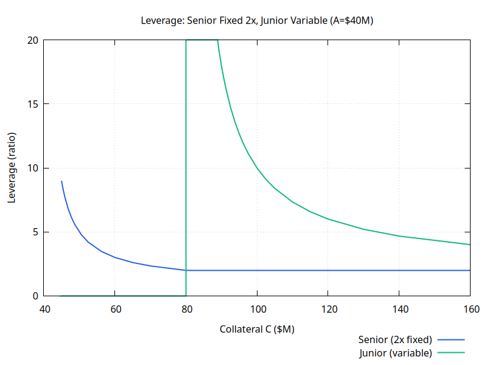
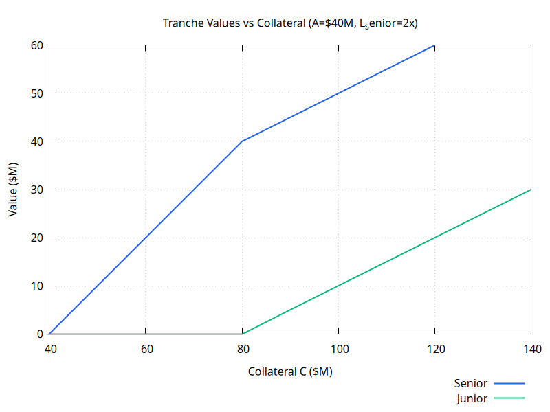
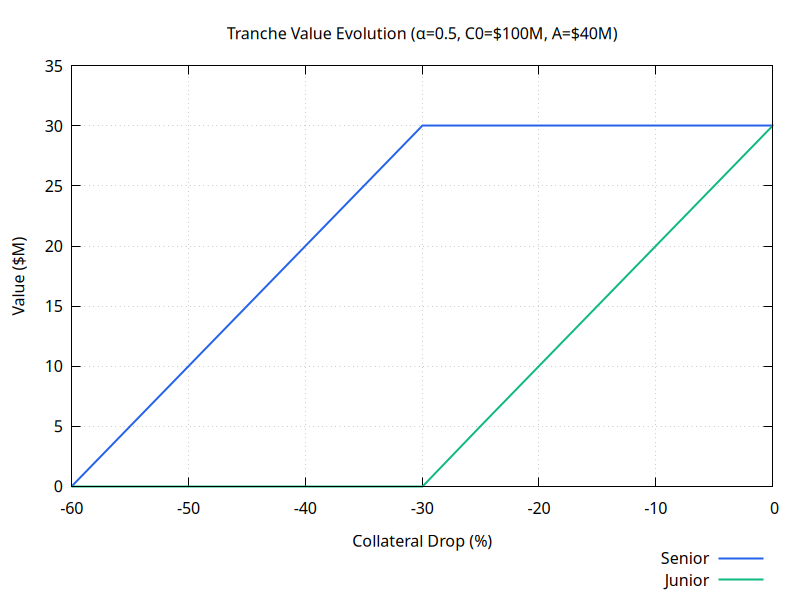
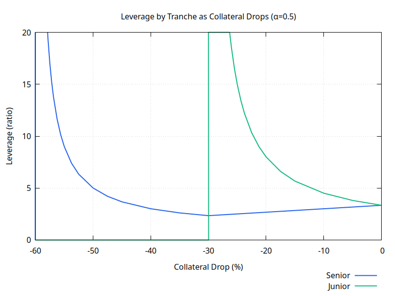
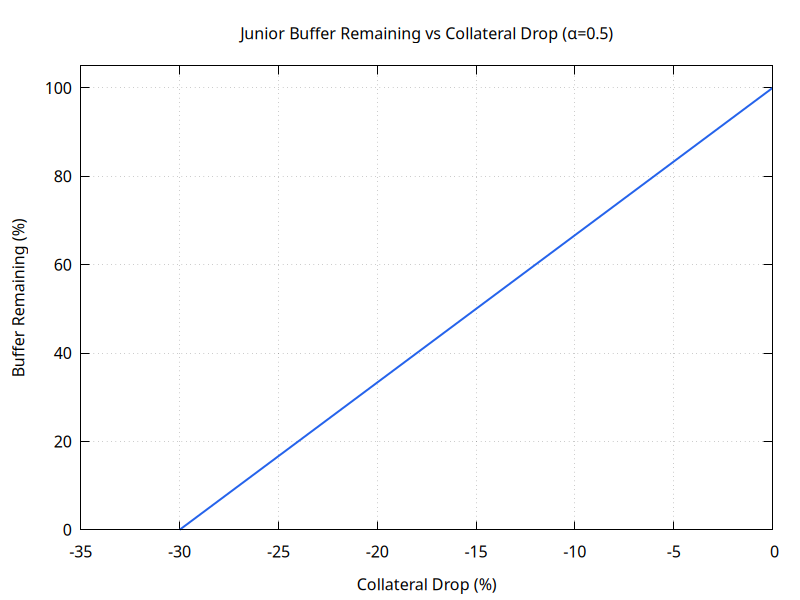
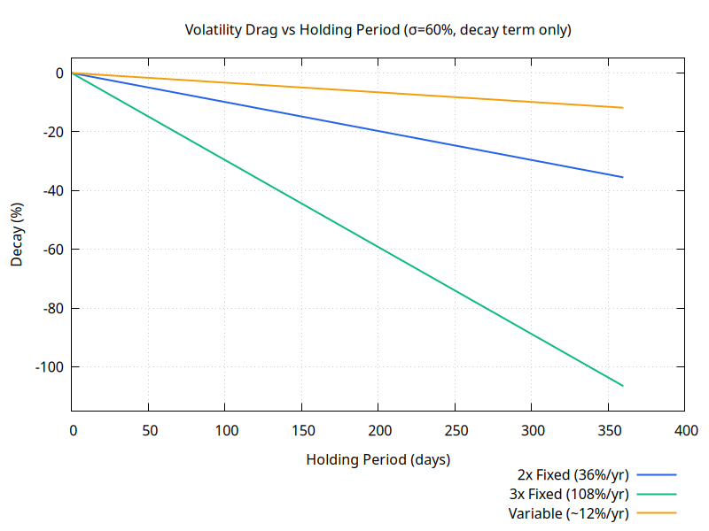
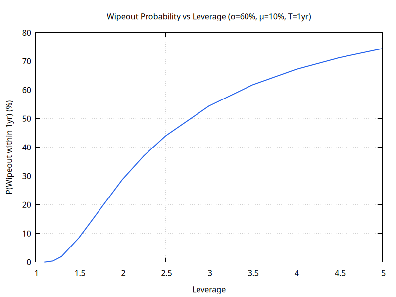
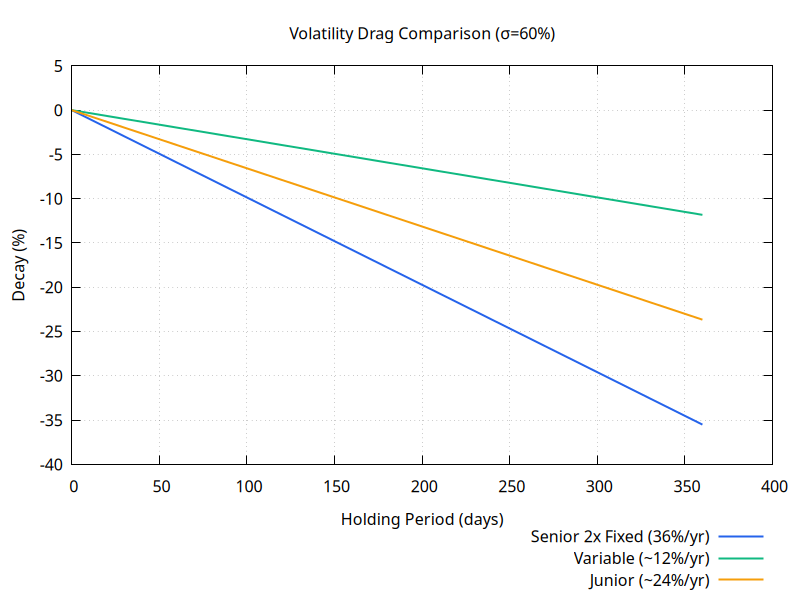
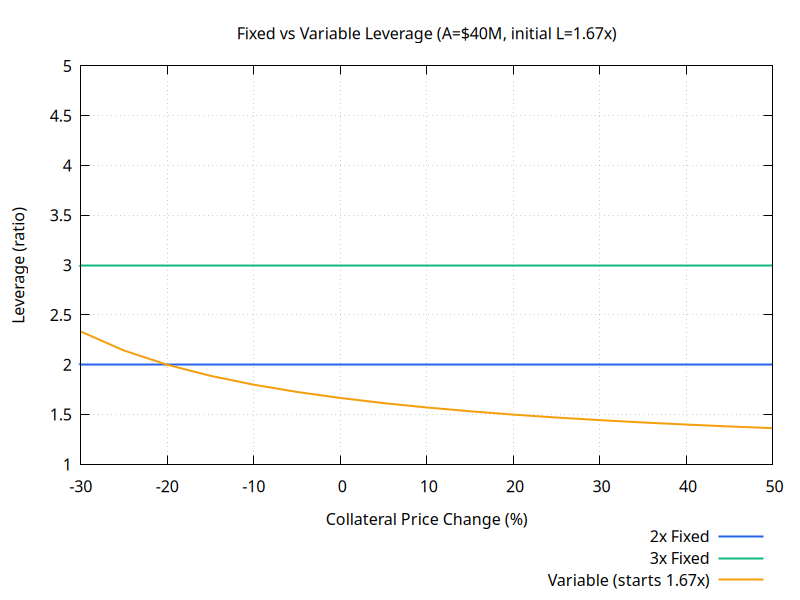

# Tiered Sail: Fixed and Variable Leverage via Tranching

**Description:** How to achieve fixed leverage within Harbor — and why tranching is the only self-contained mechanism
**Status:** Proposed
**Date:** 2026-02-15

---

## 1. The Goal: Predictable Leverage

Variable leverage sail [1-variable-leveraged-sail.md](1-variable-leveraged-sail.md) drifts with collateral price. When collateral rises, leverage falls; when it falls, leverage rises. For some users this is acceptable or even desirable — but others need predictable, constant leverage:

- Portfolio managers allocating a fixed beta
- Hedgers who need to offset a known exposure
- Users who find drift hard to track

**Goal:** A token that maintains a constant leverage ratio L₀ (e.g. 2x) regardless of what collateral does.

---

## 2. Three Approaches — and Why Two Fail

There are three conceivable ways to maintain fixed leverage in the Harbor system.

### 2.1 Daily Rebalancing

When collateral rises, leverage falls below L₀. To restore it, the protocol must increase A (mint more anchored tokens), which requires depositing more collateral. When collateral falls, leverage rises above L₀. To restore it, A must decrease (redeem anchored tokens), releasing collateral.

The upward rebalance — the one that happens in bull markets — **requires an external source of collateral**. Someone must deposit it. The protocol cannot conjure it from existing funds. This means fixed leverage via rebalancing requires either:

- An incentivised keeper who deposits capital when prices rise (expensive, trust-dependent), or
- A protocol reserve that shrinks over time (not self-sustaining).

This is how TradFi leveraged ETFs work (TQQQ etc.), and the daily transaction costs are what causes their well-documented volatility decay. On-chain, it also requires continuous gas.

**Verdict: not self-contained. Rejected.**

### 2.2 Reserve Pool

The protocol holds a buffer of collateral that absorbs the mismatch between the fixed-leverage redemption value and the actual sail value. When actual S > C/L₀, the excess is held in reserve; when S < C/L₀, the reserve tops up redemptions.

This works while the reserve lasts. In any sustained bull market, the reserve fills; in any sustained bear market, it drains. Who replenishes it? The same external capital problem as rebalancing.

**Verdict: not self-sustaining. Rejected.**

### 2.3 Tranching

Split the total sail value S = C − A into two token classes with a defined priority ordering:

- **Senior** gets first claim up to C/L₀
- **Junior** gets the residual: S − C/L₀ (if positive), or nothing (if wiped)

No external capital is needed. The two tranches are claims on the same pool. Junior provides the fixed-leverage guarantee to senior — not for free, but in exchange for higher leverage and a bigger share of upside when the market rises.

**This is the only mechanism that is self-contained and self-balancing.**

Fixed leverage is therefore not a separate product — it is the senior tranche of a tiered structure. You cannot have one without the other.

---

## 3. Tranche Mathematics

**Reference:** See [0-anchor-sail-mathematics.md](0-anchor-sail-mathematics.md) for the base equations.

### 3.1 Value Split

```
Total sail value:   S = C − A

Senior value:       V_senior = min(S, C / L_senior)
Junior value:       V_junior = S − V_senior = max(0, S − C / L_senior)
                             = max(0, (C − A) − C / L_senior)
```

For L_senior = 2x, A = $40M, C = $100M:

```
S       = $60M
V_senior = min(60, 100/2)  = $50M
V_junior = 60 − 50         = $10M
```

### 3.2 Leverage by Tranche

**Senior:**

```
L_senior = C / V_senior

When junior has value: V_senior = C / L_target → L_senior = L_target  (constant ✓)
When junior wiped:     V_senior = S           → L_senior = C / S       (variable)
```

**Junior:**

```
L_junior = C / V_junior  (highly variable, increases as C falls toward wipeout)
```

Senior leverage is constant at L_target so long as the junior tranche has positive value. Once junior is wiped, senior becomes ordinary variable leverage sail.

### 3.3 Wipeout Thresholds

**Junior wipeout** — when S = C / L_senior:

```
C − A = C / L_senior
A = C(1 − 1/L_senior)
C = A × L_senior / (L_senior − 1)

For L_senior = 2x, A = $40M:  C_junior_wipeout = 40 × 2 / 1 = $80M  (CR = 2.0)
```

**Senior wipeout** — the same as ordinary sail:

```
C = A  →  C = $40M  (CR = 1.0)
```

So for a 2x senior tranche with A = $40M:

| Collateral     | Junior    | Senior                 |
| -------------- | --------- | ---------------------- |
| $100M (CR 2.5) | Has value | Fixed at 2x            |
| $80M (CR 2.0)  | Wiped out | Fixed at 2x (boundary) |
| $60M (CR 1.5)  | Gone      | Variable (L = 3x)      |
| $40M (CR 1.0)  | Gone      | Wiped out              |

Junior holders absorb all losses above CR = 2.0. Below that, senior holders face the same variable leverage as ordinary sail.



_Note: For C < $80M (junior wiped), senior is ordinary variable leverage sail. For C ≥ $80M, senior is fixed at 2x. Junior leverage spikes near the $80M wipeout boundary (18x at C = $90M) and falls as collateral rises._



_Note: For C < $80M, all sail goes to senior (slope 1). For C ≥ $80M, senior = C/2 (slope 0.5) and junior = C/2 − A (slope 0.5). Junior has no value below C = 2A = $80M._

---

## 4. The Loss Waterfall

The same principle applies to any α-split (not just the fixed senior formula). In a symmetric split (α = 0.5, equal value to each tranche at inception), junior absorbs the first half of any loss before senior is touched.



_Note: Junior value drops linearly until wiped. Senior stays flat until junior is gone, then starts losing value. Both wipe at C = A._



_Note: Senior leverage falls as collateral drops (junior absorbs losses, keeping senior's value constant). After junior is wiped at −30%, senior becomes ordinary sail and leverage rises. Junior leverage increases rapidly toward infinity approaching the −30% wipeout threshold._



_Note: Junior buffer depletes linearly — each 1% collateral drop consumes ~3.3% of the initial buffer. Fully exhausted at −30% drop (C = $70M)._

---

## 5. Volatility Decay

Fixed leverage comes with a cost that variable leverage partially avoids: **geometric compounding losses** from holding a constant-leverage position through volatility.

**Expected value under GBM (μ = drift, σ = volatility):**

```
E[V(T)] = V(0) × exp(L × μ × T − L × (L−1)/2 × σ² × T)

Decay term per year:  −L × (L−1)/2 × σ²
```

For σ = 60%:

| Token                 | L    | Annual decay |
| --------------------- | ---- | ------------ |
| Variable (~1.67x avg) | 1.67 | ~12%         |
| Senior 2x fixed       | 2    | 36%          |
| Senior 3x fixed       | 3    | 108%         |

Variable leverage decays less because leverage falls when the position is winning and rises when losing — the averaging effect partially offsets compounding.

**Break-even:** For the 2x senior at σ = 60%, you need μ ≥ 18% annually just to expect zero net return.



_Note: 3x fixed loses ~108% of value annually from volatility drag alone (before drift). Variable leverage is materially better for long holds._



_Note: Wipeout probability rises steeply with leverage. 3x has roughly 55% annual wipeout risk at σ = 60%, μ = 10% (GBM first-passage formula)._



_Note: Senior 2x fixed (36%/yr) decays faster than junior (~24%/yr) and much faster than variable (~12%/yr). The ordering is counterintuitive: junior's leverage is variable and its decay is lower than the static senior formula._

---

## 6. Product Summary

Three tokens emerge from the tiered structure, each appealing to a different user:

| Token                 | Leverage        | Decay         | Wipeout  | Best for                                 |
| --------------------- | --------------- | ------------- | -------- | ---------------------------------------- |
| **Senior (fixed 2x)** | Constant 2x     | High (36%/yr) | CR ≤ 1.0 | Short holds, precise exposure, hedgers   |
| **Junior (variable)** | High, variable  | Very high     | CR ≤ 2.0 | Aggressive bulls, short-term speculators |
| **Variable sail**     | ~1.67x (drifts) | Low (~12%/yr) | CR ≤ 1.0 | Long holds, low-decay leverage           |

The fixed leverage comparison shows what senior gets:



_Note: Fixed leverage (2x, 3x) stays constant through collateral moves. Variable leverage drifts significantly — from ~2.3x at −30% to ~1.4x at +50%._

**Senior is the right choice when:** you need a known leverage ratio, for <3 months, in a trending market.

**Variable sail is the right choice when:** you intend to hold through cycles, want lower decay, and can tolerate drifting leverage.

**Junior is only appropriate for:** sophisticated speculators who treat it as an option-like position — limited downside (total loss) in exchange for amplified upside in a strong bull market.

---

## 7. User Risks

### 7.1 Senior Risks

**Volatility decay:** The dominant risk. At σ = 60%, a 2x senior loses 36% annually from geometric compounding alone. This makes senior unsuitable for holds longer than ~3 months unless drift is very high.

**Buffer exhaustion:** If collateral falls to CR = 2.0 (for 2x senior), the junior buffer is gone. Senior then becomes ordinary variable leverage sail, with no further fixed-leverage guarantee and no protection.

**Higher wipeout threshold than variable:** Variable sail wipes at CR = 1.0. Senior wipes at the same point, but the loss of fixed leverage begins much earlier (CR = 2.0). Users expecting "protection" must understand it is conditional on junior's survival.

### 7.2 Junior Risks

**Early wipeout:** Junior wipes at CR = 2.0 (for 2x senior) — a 50% collateral decline from CR = 4.0, or much less if system is already stressed. This is a materially higher CR than ordinary sail wipeout.

**Extreme negative gamma:** As C approaches 2A, junior leverage spikes toward infinity and losses compound very rapidly. A position that looks manageable at 5x can become catastrophic within a small further move.

**Decay amplification:** Junior absorbs all of the senior's volatility drag in addition to its own market exposure. Expected return is significantly negative except in strongly trending bull markets.

---

## 8. Implementation

Both senior and junior are implemented in a single tiered minter contract. The redemption logic splits the total sail pool between them on every redemption:

```
Senior redemption per token:
  R_senior = min(C − A, C / L_senior) / n_senior

Junior redemption per token:
  R_junior = max(0, (C − A) − C / L_senior) / n_junior
```

Minting is the reverse: deposit collateral, receive tokens priced at the current NAV of that tranche. The total collateral pool is shared; the split is purely accounting.

**Minting restriction:** Senior minting is blocked if the junior buffer is already exhausted (C / L_senior ≥ C − A), since there is no buffer to guarantee the fixed leverage claim.

**Rebalancing priority:** When the stability pool rebalances the system (CR < threshold), junior is redeemed first, consistent with its loss-absorbing role.

---

**Status:** Proposed for Phase 2
**Replaces:** docs 2 (fixed leverage), 3 (tiered risk), 5 (tiered fixed+variable)
**Complexity:** Medium (tranche redemption logic, buffer monitoring)
**Prerequisites:** Phase 1 variable leverage success
