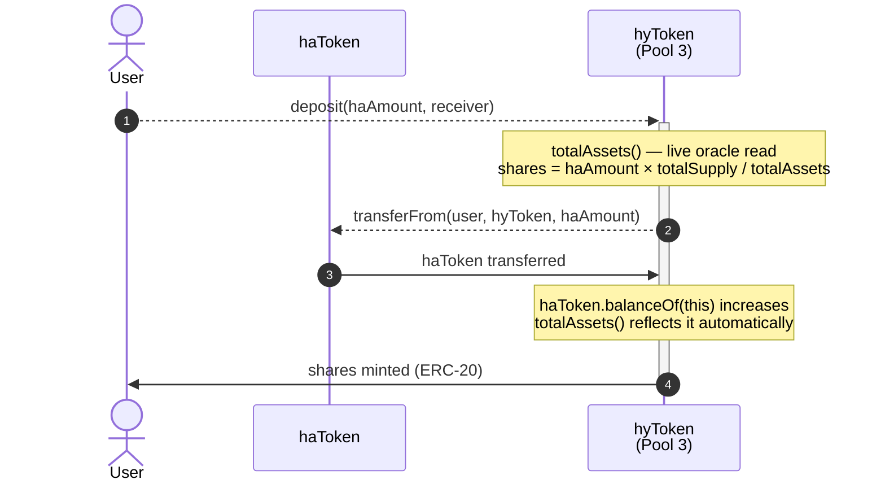
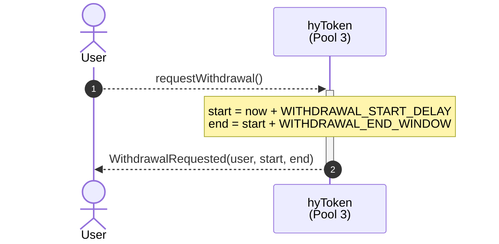
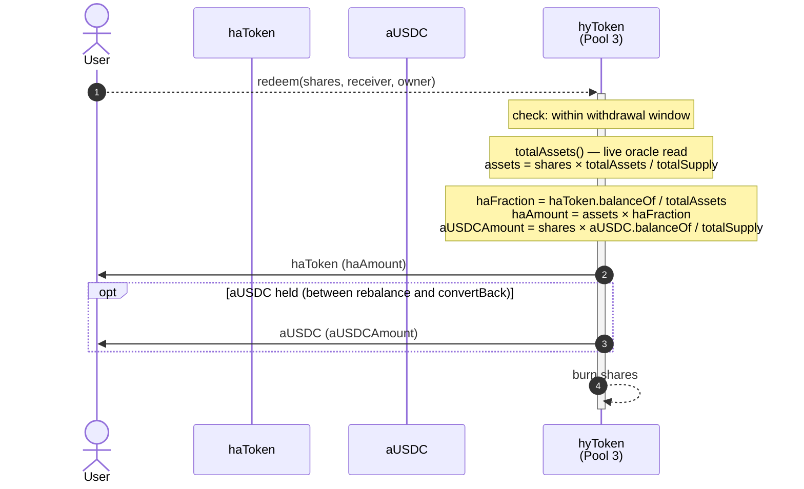
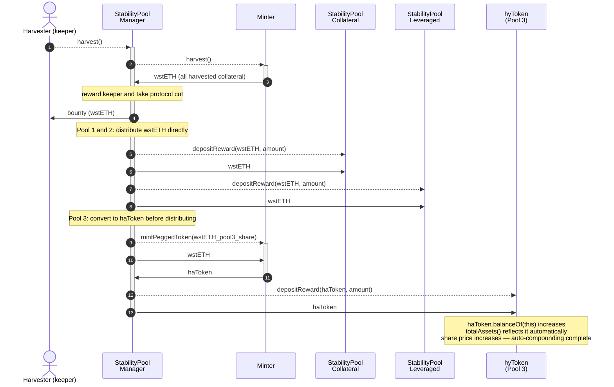
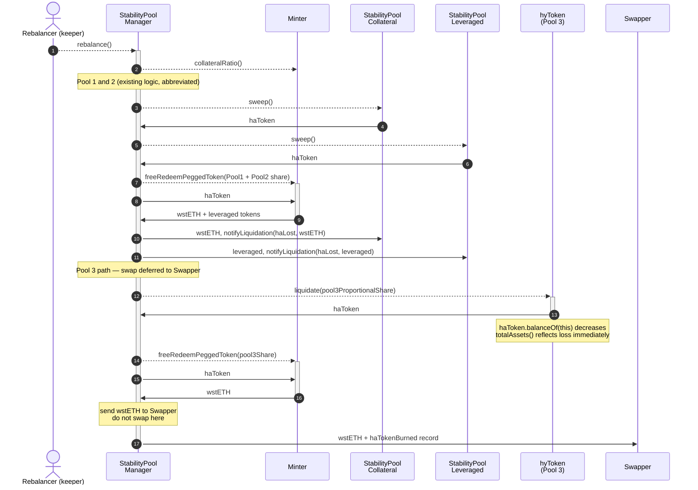
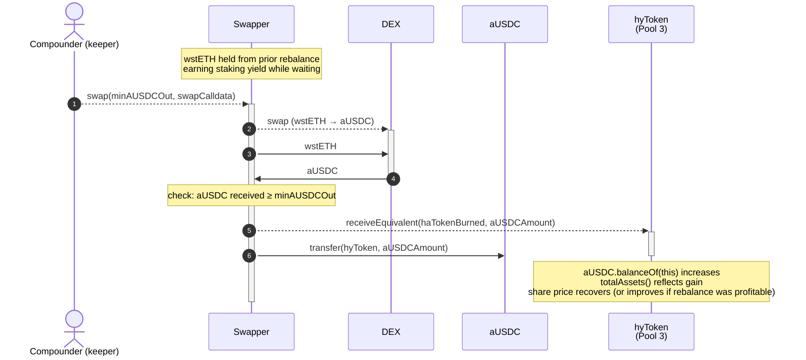
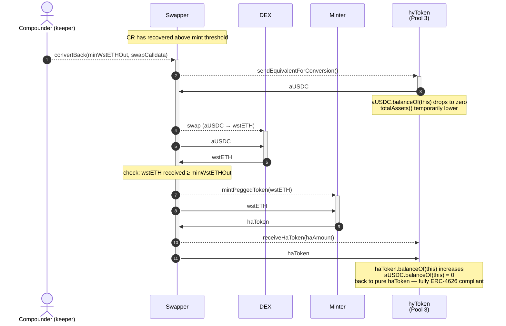

# hyToken Design

**Description:** Architecture for the auto-compounding anchored token, given the fixed three-pool structure and the StabilityPoolManager as orchestrator
**Status:** Design discussion
**Date:** 2026-02-26
**Related code:** `../harbor-yield.wip-hytoken/` and `src/minter/StabilityPoolManager_v1.sol`

---

## 1. The Actual System Architecture

Each Minter manages a fixed set of contracts:

```
                        ┌─────────────────────────────────┐
                        │         StabilityPoolManager     │
                        │  (keeper calls rebalance/harvest) │
                        └──────────────┬──────────────────┘
                                       │ orchestrates
                 ┌─────────────────────┼──────────────────┐
                 ▼                     ▼                    ▼
      ┌──────────────────┐  ┌──────────────────┐  ┌──────────────────┐
      │  StabilityPool   │  │  StabilityPool   │  │  StabilityPool   │
      │  (collateral)    │  │  (leveraged)     │  │  (equivalent)    │
      │  → wstETH        │  │  → sail tokens   │  │  → aUSDC / sDAI  │
      └──────────────────┘  └──────────────────┘  └──────────────────┘
               ▲                      ▲                      ▲
               │                      │                      │
            haToken deposits from users                 haToken deposits
                                                        (via hyToken only)
```

There are exactly **three** stability pools per Minter — not N arbitrary pools. The StabilityPoolManager (SPM) is the only contract that:

- calls `rebalance()` — knows how much haToken was burned and what collateral was returned to each pool
- calls `harvest()` — knows how much wstETH was distributed as reward to each pool

This makes the SPM the single point of truth for all events that change the value of a stability pool deposit.

### 1.1 What the Existing SPM Does

**`rebalance()`:**
1. Reads haToken balances in the two pools (Pool 1 and Pool 2) to compute weights
2. Sweeps haToken from each pool proportionally
3. Calls `Minter.freeRedeemPeggedToken()` to convert haToken → wstETH (for Pool 1) and → sail tokens (for Pool 2)
4. Transfers the respective tokens back to each pool
5. Calls `pool.notifyLiquidation()` to update pool accounting

**`harvest()`:**
1. Reads `Minter.harvestable()` — accumulated wstETH staking yield held by Minter
2. Sweeps wstETH from Minter
3. Deducts keeper bounty and protocol cut
4. Distributes remaining wstETH to Pool 1 and Pool 2 proportionally by haToken holdings
5. Calls `pool.depositReward(wstETH, amount)` on each

---

## 2. Two Proposed Changes

### 2.1 Add a Third Stability Pool (Equivalent Token Pool)

A third stability pool (Pool 3) is added to the Minter's system. Its liquidation token is an equivalent yield-bearing stable asset — aUSDC, sDAI, or a basket. This pool is intended exclusively for hyToken deposits. Users do not deposit into Pool 3 directly; only the hyToken contract does.

**On rebalance:** the SPM must handle Pool 3 differently from Pools 1 and 2. It cannot call `Minter.freeRedeemPeggedToken()` for Pool 3 and send the returned wstETH there — the pool's `LIQUIDATION_TOKEN` is aUSDC, not wstETH. The required flow:

```
1. Sweep haToken from Pool 3 (proportional to pool holdings)
2. Call Minter.freeRedeemPeggedToken() for Pool 3's share → receive wstETH
3. Convert wstETH → aUSDC via DEX swap (or accumulate and swap later)
4. Transfer aUSDC to Pool 3
5. Call pool3.notifyLiquidation(haTokenBurned, aUSDCReturned)
```

Step 3 (the DEX swap) introduces a new failure mode into the rebalance path. If the DEX swap fails or reverts, the entire rebalance transaction fails. To avoid this:

**Option: decouple the swap from the rebalance.** The SPM receives wstETH for Pool 3's share and holds it temporarily. A separate keeper-callable function `convertToEquivalent()` performs the swap and calls `pool3.notifyLiquidation()` later. This separates the critical path (keeping the system solvent) from the swap (optimising yields).

### 2.2 Convert Pool 3's Harvest Share to haToken

Currently `harvest()` distributes wstETH to all pools. For Pool 3, the wstETH reward is converted to haToken and deposited as reward — this is the auto-compounding step:

```
Pool 3's share of harvest:
  wstETH → Minter.mintPeggedToken(wstETH) → haToken
  hyToken.depositReward(haToken, amount)
```

This is mechanically sound and can happen atomically inside `harvest()`. The Minter is active whenever harvest is callable — the Minter is the source of harvestable wstETH, so it cannot be paused while harvest is in progress. Minting haToken from the harvested wstETH deposits collateral back into the Minter and increases A by the same amount — CR is unchanged, sail tokens are unaffected.

Rebalances are the system's maintenance mode. Harvest is normal operation; it always runs the same path: wstETH → haToken → deposit. No CR check or routing decision is needed during harvest.

The only operation requiring a deferred DEX swap is the post-rebalance path in Section 2.1, where Pool 3's wstETH must be converted to aUSDC. That conversion is handled by the Swapper contract (described in Section 5) and is decoupled from the rebalance critical path.

---

## 3. Rate Mathematics

### 3.1 The Rate

The hyToken rate R(t) is the haToken-equivalent value of one hyToken share:

```
R(t) = total_assets(t) / totalSupply_hyToken(t)

R(0) = 1  (1 hyToken = 1 haToken at inception)
```

In Option B, hyToken IS Pool 3 — there is no external pool to query. hyToken holds haToken and (transiently) aUSDC directly in its own balance. `total_assets` is computed live:

```
total_assets = IERC20(haToken).balanceOf(address(hyToken))
             + oracle.toHaToken(IERC20(aUSDC).balanceOf(address(hyToken)))
```

This is the ERC-4626 `totalAssets()` implementation. Reading live balances is accurate, always current, and requires no external synchronisation.

### 3.2 Rate Invariance Under Deposits and Withdrawals

A deposit of X haToken:

```
shares_minted = X / R
R_new = (total_assets + X) / (totalSupply + X / R)
      = (total_assets + X) × R / (total_assets + X)
      = R   ✓
```

A withdrawal of Y shares:

```
haToken_returned = Y × R
R_new = (total_assets - Y×R) / (totalSupply - Y)
      = R × (totalSupply - Y) / (totalSupply - Y)
      = R   ✓
```

Deposits and withdrawals at current NAV do not change R.

### 3.3 Rate Increases From Events

**Harvest (haToken reward deposited into Pool 3):**
```
total_assets += haTokenReward
R_new = R_old + haTokenReward / totalSupply   (R strictly increases)
```

**Rebalancing (haToken burned, aUSDC received):**

In a correctly functioning system, the aUSDC received from a rebalance is worth more than the haToken burned (the stability pool earns a discount). Let:
- `haLost` = haToken burned from Pool 3's deposits
- `aUSDCGained` = aUSDC received, in haToken terms (via oracle: `aUSDCGained × aUSDC_oracle`)

```
total_assets = total_assets - haLost + aUSDCGained_in_haToken
ΔR = (aUSDCGained_in_haToken - haLost) / totalSupply
```

If the rebalance is profitable (as designed): ΔR > 0, rate increases.
If the oracle price is stale or the swap was poor: ΔR could be ≤ 0. This is acceptable — the rebalance absorbed the system's undercollateralisation, which is Pool 3's purpose.

**aUSDC yield accrual:**

aUSDC earns yield passively. Its exchange rate to USDC increases over time. If the oracle reflects this (e.g. using the aToken rate), `total_assets` increases continuously without any explicit action.

### 3.4 The Stored Rate vs Live Computation

The rate must be a stored value, not computed live on each call, for two reasons:

1. **Gas.** Computing `total_assets` live requires reading pool balances and an oracle price. This is acceptable once per deposit/withdrawal but not inside `balanceOf()` or `convertToAssets()`.

2. **Consistency.** If the oracle price changes between two calls in the same block, the rate changes without any event. Stored rates change only when the SPM explicitly updates them — the update is auditable and deterministic.

With the live `totalAssets()` approach, no stored rate synchronisation is needed. The ERC-4626 mechanics call `totalAssets()` at the moment of each deposit and withdrawal — the oracle price is read exactly when it is needed, and never stale. aUSDC yield accrual, haToken transfers in and out, all reflect immediately.

**The alternative: stored `_totalAssets`.** Instead of reading live balances, the SPM could pass exact amounts to hyToken: `haTokenMinted` during harvest, `haTokenBurned` during rebalance. hyToken updates a stored integer with O(1) arithmetic and never calls the oracle inside `totalAssets()`. This costs one storage write per SPM event but eliminates oracle gas from hot paths. It is a viable v2 optimisation if oracle call gas becomes a concern; the live approach is simpler for v1.

---

## 4. Architecture Options

The SPM is the only contract that processes all value-affecting events. Three architectures follow from deciding how to connect the SPM, Pool 3, and the hyToken. DEX integration (wstETH → aUSDC swaps) is excluded from the SPM and Pool 3 in all options — it belongs in a dedicated Swapper contract to control contract size and isolate swap logic from the critical rebalance path.

### 4.1 Option A: SPM is the hyToken (Monolithic)

The StabilityPoolManager is extended to also be an ERC-20 (ERC-4626) token. Users deposit haToken into the SPM directly; the SPM deposits into Pool 3 on their behalf and issues hyToken shares. The rate R is stored in the SPM's own storage and updated inside `harvest()` and `rebalance()`.

```
User --haToken--> SPM.deposit() → SPM deposits into Pool 3 → issues hyToken shares
                  SPM.harvest() → distributes to Pool 1 & 2 (wstETH) + Pool 3 (haToken) → updates R
                  SPM.rebalance() → liquidates all pools → sends Pool 3's wstETH to Swapper → updates R
```

**Advantages:**
- No inter-contract trust or interface dependency between SPM and hyToken. Rate is always current because both are updated in the same function call.
- One fewer contract to audit, deploy, and upgrade.
- StabilityPoolManager_v1 is 11KB with 13KB of headroom. Adding ERC-20 + ERC-4626 is achievable without hitting the 24KB limit, especially with DEX logic in a separate Swapper.

**Disadvantages:**
- Asymmetric role. The SPM manages Pools 1 and 2 impartially; it is simultaneously *a participant* in Pool 3 (as the depositor) and *the manager* that controls how Pool 3 is treated during rebalance weighting. Governance of that asymmetry is harder.
- Testing complexity. The combined contract couples orchestrator logic with vault logic.

### 4.2 Option B: Pool 3 is the hyToken (Recommended)

Pool 3 and the hyToken are the same contract. The SPM treats it as Pool 3 (calling `notifyLiquidation` and `depositReward` via the standard IStabilityPool interface); users treat it as an ERC-4626 vault (calling `deposit`, `withdraw`, `convertToAssets`). The SPM and hyToken/Pool3 are fully separate contracts.

```
User --haToken--> hyToken.deposit() → mint shares, _totalAssets += haToken
SPM.harvest() → wstETH → Minter.mintPeggedToken() → haToken (atomic, same tx)
             → hyToken.depositReward(haToken, amount) → _totalAssets += amount  (auto-compounds)
SPM.rebalance() → Pool 3 haToken burned → Swapper receives wstETH
Swapper.swap() [keeper, deferred] → wstETH → DEX → aUSDC
             → hyToken.notifyLiquidation(haLost, aUSDCGained)  ← aUSDC held transiently
Swapper.convertBack() [keeper, when CR recovered] → aUSDC → wstETH (DEX) → mintPeggedToken → haToken
             → hyToken.burnEquivalent(aUSDC) + hyToken.depositReward(haToken)  ← back to pure haToken
User <--haToken-- hyToken.withdraw() [on request] → pure haToken (if convertBack run)
                                                  → or haToken+aUSDC mix (if convertBack pending)
```

The key insight is that a standard StabilityPool tracks multiple independent depositors using the reward accumulator. Pool 3 has exactly one logical depositor — the aggregate of all hyToken holders, treated as a single unit. Per-user accounting is replaced by the single stored `_totalAssets`. The hyToken/Pool3 contract is therefore **simpler and smaller than a regular StabilityPool**, despite implementing the IStabilityPool interface.

**SPM changes (minimal):** Add `_STABILITY_POOL_EQUIVALENT` (= hyToken) and `_SWAPPER` as immutables. In `harvest()`: convert Pool 3's wstETH share to haToken via `Minter.mintPeggedToken()` and call `hyToken.depositReward(haToken, amount)` — atomic, no deferral. In `rebalance()`: redeem Pool 3's haToken via Minter for wstETH, send to Swapper, record `haTokenBurned`.

**Swapper contract:** Separate keeper-callable contract. Single purpose: convert post-rebalance wstETH → aUSDC and call `hyToken.notifyLiquidation()`. No CR routing, no compound logic.

**hyToken/Pool3 contract:**
- Implements IStabilityPool: `notifyLiquidation`, `depositReward`
- Implements ERC-4626: `deposit`, `withdraw`, `totalAssets`, `convertToShares`, `convertToAssets`
- Stores `_totalAssets` (haToken-equivalent value); updates are O(1) arithmetic using amounts supplied by SPM/Swapper
- Holds actual haToken and aUSDC directly; no per-user accumulator needed
- Estimated size: ~6–8KB (ERC-20 + ERC-4626 + pool interface, without accumulator overhead)

**Advantages:**
- Clean separation: SPM orchestrates; hyToken manages user shares. Each is independently auditable and upgradeable.
- hyToken/Pool3 is smaller than a regular StabilityPool. No per-user accumulator. No withdrawal-window system (replaced by ERC-4626 mechanics). Well within 24KB.
- SPM changes are minimal — it gains one pool address and three lines of pool-3-specific logic in harvest and rebalance.
- Rate maintenance is O(1): SPM supplies exact amounts to hyToken; hyToken does arithmetic on `_totalAssets`. No pool reads needed.
- DEX complexity fully isolated in Swapper.

**Disadvantages:**
- Two contracts per Minter (SPM + hyToken/Pool3) instead of one.
- SPM must call `hyToken.depositReward` and Swapper must call `hyToken.notifyLiquidation`. Both are trusted calls that the hyToken must validate against authorised callers.
- hyToken is a new contract type rather than a reuse of StabilityPool_v1/v2.

### 4.3 Option C: Full Separation (SPM + Pool 3 + hyToken)

Three distinct contracts. Pool 3 is a restricted StabilityPool_v3 (only hyToken can deposit). The hyToken is a separate ERC-4626 that deposits into Pool 3. The SPM notifies the hyToken directly.

```
User --haToken--> hyToken.deposit() → hyToken deposits haToken into Pool 3 → issues shares
SPM.harvest() → Pool 3's share minted as haToken → Pool3.depositReward(haToken)
             → SPM calls hyToken.notifyHarvest(amount) → _totalAssets += amount
SPM.rebalance() → sends Pool 3 wstETH to Swapper → Swapper calls hyToken.notifyRebalance(haLost, aUSDCGained)
```

**Advantages:**
- Maximum separation of concerns. Each contract has one role.
- Pool 3 is independently testable and reuses StabilityPool code.

**Disadvantages:**
- Three contracts to deploy and maintain. Three upgrade paths to coordinate.
- Pool 3 is a full StabilityPool (21KB) but with a single depositor (the hyToken). Its complexity — per-user accumulator, withdrawal window, loss error tracking — is entirely wasted overhead.
- The SPM → hyToken notification and Pool 3 → hyToken notification create two trust relationships in addition to the normal SPM → Pool 3 relationship.

### 4.4 Comparison

| Dimension | A: SPM = hyToken | B: Pool 3 = hyToken | C: SPM + Pool 3 + hyToken |
| --- | --- | --- | --- |
| Contracts added | 1 (Pool 3 only) | 1 (hyToken/Pool3) | 2 (Pool 3 + hyToken) |
| SPM size pressure | Moderate (ERC-20/4626 added) | Minimal (3 lines) | Minimal (notify calls) |
| hyToken/Pool3 size | — | ~6–8KB (custom, lean) | 21KB Pool3 + ~5KB hyToken |
| Rate freshness | Always current | O(1) stored update | O(1) stored update |
| Governance clarity | Asymmetric (SPM is Pool 3 participant) | Clean separation | Clean separation |
| DEX isolation | Swapper contract | Swapper contract | Swapper contract |
| Trust relationships | 0 (same contract, SPM side) | 2 (SPM→hyToken, Swapper→hyToken) | 3 |
| Upgrade independence | None (SPM and hyToken coupled) | Full | Full |
| Testing | SPM tests cover vault too | Each contract independently testable | Each contract independently testable |

---

## 5. Recommended Design

**Use Option B** (Pool 3 is the hyToken). It achieves the cleanest separation of concerns while being the most efficient: the hyToken/Pool3 contract does not inherit StabilityPool's per-user complexity because there is only one logical depositor (the hyToken aggregate). The SPM changes are minimal. DEX logic is fully isolated in a Swapper contract. The rate update is O(1) arithmetic throughout.

**The changes required:**

**StabilityPoolManager_v2:**
- Add `_STABILITY_POOL_EQUIVALENT` as a third immutable (= hyToken address)
- Add `_SWAPPER` as an immutable address
- In `rebalance()`: sweep Pool 3's proportional haToken, call `Minter.freeRedeemPeggedToken()` for Pool 3's share → receive wstETH, send wstETH to Swapper (do not swap in the rebalance critical path; record `haTokenBurned` for later use by Swapper)
- In `harvest()`: for Pool 3's share, call `Minter.mintPeggedToken(wstETH_share)` → receive haToken, call `hyToken.depositReward(haToken, amount)` directly — no deferral needed since the Minter is active during harvest

**Swapper contract:**
- Immutably references SPM, Minter, and hyToken addresses
- Receives wstETH from SPM during rebalance; holds until keeper executes
- Keeper-callable `swap(uint256 minOut, bytes calldata swapData)`: converts wstETH → aUSDC via DEX aggregator, sends aUSDC to hyToken, calls `hyToken.notifyLiquidation(haTokenBurned, aUSDCGained)`
- Keeper-callable `convertBack(uint256 minOut, bytes calldata swapData)`: reverses accumulated equivalent tokens back to haToken when CR is sufficient:
  1. Pulls aUSDC from hyToken
  2. Swaps aUSDC → wstETH via DEX
  3. Calls `Minter.mintPeggedToken(wstETH)` → haToken
  4. Calls `hyToken.depositReward(haToken, amount)` and `hyToken.burnEquivalent(aUSDCAmount)` to update `_totalAssets`
- Slippage configurable per direction (e.g. 300 bps for DEX swaps)
- wstETH earns staking yield while held — no urgency to execute immediately

**hyToken_v1 (also Pool 3):**
- Implements IStabilityPool so SPM treats it as a pool
- Implements ERC-4626 (and ERC-20) for user deposits and withdrawals
- `initialize()`: mints a minimum number of dead shares to prevent ERC-4626 share inflation attacks (standard protection)
- `depositReward(address token, uint256 amount)`: haToken → `_totalAssets += amount` (callable by SPM only)
- `notifyLiquidation(uint256 haTokenLost, uint256 aUSDCGained)`: `_totalAssets = _totalAssets - haTokenLost + aUSDCGained × aUSDCOracle`, transfers aUSDC from caller (callable by Swapper only)
- `burnEquivalent(uint256 aUSDCAmount)`: sends aUSDC to Swapper and decreases `_totalAssets` by `aUSDCAmount × aUSDCOracle`; called as part of `convertBack()` (callable by Swapper only)
- `deposit(uint256 haToken, address receiver)`: `_totalAssets += haToken`, mint `haToken / R` shares
- `requestWithdrawal()`: creates a withdrawal request window (mirrors the stability pool withdrawal request pattern)
- `withdraw(uint256 shares, address receiver)`: returns haToken; if aUSDC is held, a `convertBack()` should be run first to return the vault to pure haToken — see Open Question #5; burns shares, `_totalAssets -= value`
- `convertToAssets(uint256 shares)` → `shares × _totalAssets / totalSupply` (uses stored `_totalAssets`, includes both haToken and aUSDC value)
- On deposit/withdrawal: lazy oracle update — recompute `_totalAssets` from current aUSDC rate before issuing/burning shares
- `rate()` → `_totalAssets / totalSupply` (view, gas-free for integrations)
- `emergencyWithdraw()`: owner-only, pauses the contract and makes assets available for recovery

---

## 6. Open Questions

**1. Should the hyToken/Pool3 accept direct deposits from non-hyToken users?**

In Option B, Pool 3 IS the hyToken — there is no distinction between "depositing into Pool 3" and "depositing into the hyToken". All depositors receive hyToken shares. No restriction is needed because the ERC-4626 interface already mediates access. The question only arises in Option C (separate Pool 3), which is not recommended.

**2. How should the wstETH → aUSDC swap be executed?**

The Swapper contract approach decouples the swap from the rebalance critical path:
- Pre-approved DEX aggregator (1inch, Paraswap) with keeper-supplied calldata
- Uniswap V3 direct path with on-chain slippage protection
- Minimum wstETH threshold before swap (e.g. 0.1 ETH) to avoid gas-inefficient micro-swaps

wstETH accumulates in the Swapper earning staking yield between rebalances and swaps. There is no urgency: the aUSDC is not credited to `_totalAssets` until the swap completes, but hyToken holders are not harmed because the value sits in wstETH.

**3. What is the equivalent asset or basket?**

Single asset (aUSDC): simpler to oracle, simpler to swap, single counterparty risk.
Basket (50% aUSDC, 50% sDAI): better risk distribution, but requires two swaps, two oracles, and a weighting policy.

For v1: single asset (aUSDC). Basket can be added in v2.

**4. Who calls the Swapper and on what schedule?**

Same keeper that calls `harvest()` and `rebalance()`. Recommended sequence: `rebalance()` then `Swapper.swap()` in the same or next transaction. A minimum wstETH threshold (e.g. 0.1 ETH) prevents gas-inefficient micro-calls. wstETH held in the Swapper earns staking yield, so there is no penalty for short delays.

**5. How is multi-asset withdrawal handled?**

The Swapper resolves this. The `convertBack()` function converts accumulated aUSDC back to haToken via the reverse path: aUSDC → wstETH (DEX swap) → `Minter.mintPeggedToken(wstETH)` → haToken → `hyToken.depositReward(haToken, amount)`. After `convertBack()` completes, the hyToken holds only haToken again and `withdraw()` is a standard single-asset ERC-4626 withdrawal.

The aUSDC holding is therefore transient: it exists from the moment Pool 3 is rebalanced until the keeper calls `convertBack()`. The conversion back to haToken is only feasible when CR is above the rebalance threshold (minting haToken requires sufficient collateralisation). The keeper should monitor CR and call `convertBack()` once the system has recovered.

If a user withdraws while aUSDC is still held (i.e. between rebalance and `convertBack()`), the vault returns a proportional mix of haToken and aUSDC. This should be documented as expected behaviour and surfaced via a `previewWithdrawalAssets(shares) → (haTokenAmount, aUSDCAmount)` view function. The economic value is the same either way since aUSDC ≈ $1 ≈ haToken.

EIP-7575 is a related standard (same shares, multiple entry assets) but does not address this case.

---

## 7. Yield-Bearing Equivalent Tokens

### 7.1 Rebasing vs Non-Rebasing Mechanisms

Two fundamentally different mechanisms exist for yield-bearing stablecoins:

**Rebasing tokens** (canonical example: Aave aUSDC)

The ERC-20 `balanceOf()` grows automatically over time. Aave tracks a global liquidity index; each holder's raw scaled balance is multiplied by this index at read time. From the contract's perspective, `IERC20(aUSDC).balanceOf(address(this))` returns more tokens each block without any action.

```
// Reading aUSDC value (always in USDC terms)
uint256 usdcValue = IERC20(aUSDC).balanceOf(holder);  // grows over time
```

**Non-rebasing ERC-4626 vaults** (canonical examples: MakerDAO sDAI, Compound cUSDCv3 wrapper)

The ERC-20 `balanceOf()` stays fixed. Yield accrues by increasing the exchange rate: each share represents more of the underlying over time. The value requires an extra call:

```
// Reading sDAI value in DAI
uint256 daiValue = IERC4626(sDAI).convertToAssets(sDAI.balanceOf(holder));  // grows
```

### 7.2 Implications for hyToken

When hyToken holds aUSDC or sDAI, its value drifts upward continuously. The live `totalAssets()` approach handles both uniformly with a single pattern:

```solidity
function totalAssets() public view override returns (uint256) {
    uint256 haBalance       = IERC20(haToken).balanceOf(address(this));
    uint256 eqShares        = IERC20(EQUIVALENT_TOKEN).balanceOf(address(this));
    // For rebasing (aUSDC): convertToAssets() is effectively 1:1 with face value
    // For non-rebasing ERC-4626 (sDAI): convertToAssets() grows over time
    uint256 eqUnderlying    = IERC4626(EQUIVALENT_TOKEN).convertToAssets(eqShares);
    return haBalance + IORACLE(ORACLE).toHaToken(eqUnderlying);
}
```

For aUSDC specifically (which does not implement ERC-4626), `balanceOf()` is used directly — the rebase is already encoded in the growing balance, so there is no separate share-to-asset conversion step. sDAI and any standard ERC-4626 vault use `convertToAssets()`.

| Property | Rebasing (aUSDC) | Non-rebasing ERC-4626 (sDAI) |
|---|---|---|
| `balanceOf(hyToken)` over time | Grows | Constant |
| Underlying value read | `balanceOf(this)` | `convertToAssets(balanceOf(this))` |
| ERC-4626 compliant | No (use `balanceOf` directly) | Yes |
| `totalAssets()` drift | Automatic | Automatic via `convertToAssets` |

**Consequence for swap timing.** Because the equivalent token earns yield passively, `convertBack()` does not need to be called immediately after a rebalance. The longer hyToken holds aUSDC, the more yield accrues before conversion. The keeper monitors CR; once the system recovers above the mint threshold, `convertBack()` is called. The transient equivalent-token holding is a feature: it earns yield during the recovery window.

---

## 8. Interaction Sequence Diagrams

### 8.1 User: Deposit



### 8.2 User: Request Withdrawal



### 8.3 User: Withdraw



*Note: returning a mix of haToken and aUSDC deviates from strict ERC-4626 (which expects only `asset()` to be returned). This deviation should be documented for integrators. After `convertBack()` completes the vault returns to pure haToken and is fully ERC-4626 compliant again.*

### 8.4 SPM: Harvest — Pool 3 Path



### 8.5 SPM: Rebalance — Pool 3 Path



### 8.6 Keeper: Swapper.swap()



### 8.7 Keeper: Swapper.convertBack()



---

## 9. hyToken / Pool 3 Contract Sketch

### 9.1 Relationship to Existing Abstractions

The existing reward infrastructure — `MultipleRewardCompoundingAccumulator` and `LinearMultipleRewardDistributor` — solves a problem Pool 3 does not have.

`MultipleRewardCompoundingAccumulator` distributes rewards to **many independent depositors** in a pool where total deposits decrease unexpectedly. It maintains a per-user running integral and floating-point product factor using the mathematics from the Liquity paper. The contract weight is roughly 15KB of complex logic.

Pool 3 has exactly **one logical depositor**: the aggregate of all hyToken holders. Per-user reward tracking is replaced by the single `totalAssets()` value. When `depositReward()` is called, `totalAssets()` increases and all outstanding hyToken shares appreciate proportionally — no loop, no integral, no product factor.

`LinearMultipleRewardDistributor` streams rewards over a period (1 week) to prevent front-running of individual reward deposits. For hyToken, this is unnecessary: the share price increase is visible to all holders simultaneously via `totalAssets()`. There is no per-user claim to front-run.

| Component | StabilityPool_v1 | hyToken_v1 | Reason |
|---|---|---|---|
| `MultipleRewardCompoundingAccumulator` | Yes | **No** | Single logical depositor; replaced by `totalAssets()` |
| `LinearMultipleRewardDistributor` | Yes | **No** | Reward credited immediately; streaming not needed |
| `ERC4626Upgradeable` (OZ) | No | **Yes** | Provides deposit/withdraw/shares math; asset() = haToken |
| `UUPSUpgradeable` (OZ) | Yes | **Yes** | Matches harbor upgrade pattern |
| `ReentrancyGuardTransientUpgradeable` (OZ) | Yes | **Yes** | Gas-efficient reentrancy protection |
| `BaoOwnableRoles` (bao) | Yes (via TokenHolder) | **Yes** | Role-based access matching existing harbor contracts |

### 9.2 Interface Design

hyToken does not fully implement `IStabilityPool`. The regular interface assumes `notifyLiquidation(liquidated, returned)` is called atomically (loss and gain in one transaction). For Pool 3 the return is deferred (to Swapper.swap()), so the interface is split:

**SPM-callable (Pool 3 side):**
- `depositReward(address token, uint256 amount)` — harvest path: SPM deposits haToken, share price increases
- `liquidate(uint256 amount) returns (uint256)` — rebalance path: haToken extracted, loss reflected in `totalAssets()` immediately

**Swapper-callable:**
- `receiveEquivalent(uint256 haTokenBurned, uint256 aUSDCAmount)` — swap completed: receives aUSDC, gain reflected in `totalAssets()`
- `sendEquivalentForConversion() returns (uint256)` — convertBack start: transfers aUSDC to Swapper
- `receiveHaToken(uint256 amount)` — convertBack end: receives haToken after full reverse conversion

**User-callable (standard ERC-4626):**
- `deposit(uint256 assets, address receiver)`, `redeem(uint256 shares, address receiver, address owner)`
- `requestWithdrawal()` — creates a withdrawal window (mirrors StabilityPool_v1 pattern)
- `totalAssets()` — live computation from balances and oracle

### 9.3 Contract Sketch

```solidity
// SPDX-License-Identifier: MIT
pragma solidity 0.8.30;

// hyToken_v1 is Pool 3 from the SPM's perspective
// and an ERC-4626 vault from users' perspective
contract hyToken_v1 is
    Initializable,
    UUPSUpgradeable,
    ReentrancyGuardTransientUpgradeable,
    BaoOwnableRoles,
    ERC4626Upgradeable    // asset() = haToken; provides deposit/withdraw/shares math
{
    // ─── Roles ──────────────────────────────────────────────────────────
    uint256 public constant SPM_ROLE     = _ROLE_0;  // StabilityPoolManager
    uint256 public constant SWAPPER_ROLE = _ROLE_1;  // Swapper contract

    // ─── Immutables (set in constructor) ────────────────────────────────
    address public immutable EQUIVALENT_TOKEN;        // aUSDC (or sDAI etc.)
    address public immutable ORACLE;                  // converts equivalentToken → haToken
    uint64  public immutable WITHDRAWAL_START_DELAY;
    uint64  public immutable WITHDRAWAL_END_WINDOW;
    uint256 public immutable MIN_DEAD_SHARES;         // inflation attack protection

    // ─── erc7201 namespaced storage ─────────────────────────────────────
    struct HyTokenStorage {
        mapping(address => WithdrawalRequest) withdrawalRequests;
    }
    struct WithdrawalRequest { uint64 start; uint64 end; }

    // ─── ERC-4626 core override ──────────────────────────────────────────
    // totalAssets() is the single source of truth for share price.
    // Reads live balances and oracle — no stored _totalAssets needed.
    function totalAssets() public view override returns (uint256) {
        uint256 haBalance      = IERC20(asset()).balanceOf(address(this));
        uint256 eqBalance      = IERC20(EQUIVALENT_TOKEN).balanceOf(address(this));
        // Rebasing (aUSDC): convertToAssets ≈ identity; use balanceOf directly
        // Non-rebasing ERC-4626 (sDAI): convertToAssets grows over time
        uint256 eqUnderlying   = IERC4626(EQUIVALENT_TOKEN).convertToAssets(eqBalance);
        return haBalance + IORACLE(ORACLE).toHaToken(eqUnderlying);
    }

    // ─── SPM interface ───────────────────────────────────────────────────

    // Harvest path: SPM converts wstETH → haToken via Minter and deposits here.
    // haToken balance increases; totalAssets() rises; share price increases.
    function depositReward(address token, uint256 amount)
        external nonReentrant onlyRoles(SPM_ROLE)
    {
        require(token == asset());
        IERC20(asset()).safeTransferFrom(msg.sender, address(this), amount);
        emit RewardDeposited(amount);
    }

    // Rebalance path: SPM extracts Pool 3's proportional haToken share.
    // haToken balance decreases; totalAssets() reflects loss immediately.
    function liquidate(uint256 amount)
        external nonReentrant onlyRoles(SPM_ROLE) returns (uint256 extracted)
    {
        extracted = Math.min(amount, IERC20(asset()).balanceOf(address(this)));
        IERC20(asset()).safeTransfer(msg.sender, extracted);
        emit Liquidated(extracted);
    }

    // ─── Swapper interface ────────────────────────────────────────────────

    // Called by Swapper after swap(): receive aUSDC; totalAssets() reflects gain.
    function receiveEquivalent(uint256 haTokenBurned, uint256 aUSDCAmount)
        external nonReentrant onlyRoles(SWAPPER_ROLE)
    {
        IERC20(EQUIVALENT_TOKEN).safeTransferFrom(msg.sender, address(this), aUSDCAmount);
        emit EquivalentReceived(haTokenBurned, aUSDCAmount);
    }

    // Called by Swapper at start of convertBack(): pull aUSDC for reverse swap.
    // totalAssets() drops temporarily; restored when receiveHaToken is called.
    function sendEquivalentForConversion()
        external nonReentrant onlyRoles(SWAPPER_ROLE) returns (uint256 amount)
    {
        amount = IERC20(EQUIVALENT_TOKEN).balanceOf(address(this));
        IERC20(EQUIVALENT_TOKEN).safeTransfer(msg.sender, amount);
    }

    // Called by Swapper at end of convertBack(): credit haToken after full conversion.
    function receiveHaToken(uint256 amount)
        external nonReentrant onlyRoles(SWAPPER_ROLE)
    {
        IERC20(asset()).safeTransferFrom(msg.sender, address(this), amount);
        emit ConvertBackComplete(amount);
    }

    // ─── Withdrawal window ────────────────────────────────────────────────
    function requestWithdrawal() external nonReentrant {
        uint64 start = uint64(block.timestamp + WITHDRAWAL_START_DELAY);
        uint64 end   = uint64(start + WITHDRAWAL_END_WINDOW);
        _getStorage().withdrawalRequests[msg.sender] = WithdrawalRequest(start, end);
        emit WithdrawalRequested(msg.sender, start, end);
    }

    // Override ERC-4626 _withdraw to enforce withdrawal window.
    // Also handles proportional mix of haToken and aUSDC if aUSDC is held.
    function _withdraw(
        address caller, address receiver, address owner,
        uint256 assets, uint256 shares
    ) internal override {
        _checkWithdrawalWindow(caller);
        // If aUSDC is held: transfer proportional haToken + aUSDC,
        // then call super._withdraw for the haToken portion only.
        // This deviates from strict ERC-4626 — documented for integrators.
        uint256 eqBalance = IERC20(EQUIVALENT_TOKEN).balanceOf(address(this));
        if (eqBalance > 0) {
            uint256 eqPortion = Math.mulDiv(eqBalance, shares, totalSupply());
            IERC20(EQUIVALENT_TOKEN).safeTransfer(receiver, eqPortion);
            assets -= IORACLE(ORACLE).toHaToken(eqPortion);  // reduce haToken portion
        }
        super._withdraw(caller, receiver, owner, assets, shares);
    }

    // ─── Initializer ─────────────────────────────────────────────────────
    function initialize(address owner_) external initializer {
        __UUPSUpgradeable_init();
        __ReentrancyGuardTransient_init();
        __ERC4626_init(IERC20(/* haToken address from constructor */0));
        _initializeOwner(owner_);
        // Mint dead shares to address(1) to prevent ERC-4626 share inflation attacks
        _mint(address(1), MIN_DEAD_SHARES);
    }

    function _authorizeUpgrade(address) internal override onlyOwner {}
}
```

### 9.4 Key Design Decisions

**Live `totalAssets()` avoids stored-state drift.** Any token transfer in or out (deposit, liquidate, receiveEquivalent, etc.) is immediately reflected by `totalAssets()` reading the current balance. No risk of the stored rate becoming stale between SPM events.

**`liquidate()` splits `IStabilityPool.notifyLiquidation()` into two steps.** The regular interface combines loss and gain in one call because both happen in the same transaction. The deferred swap makes this impossible for Pool 3. SPM calls `liquidate()` (loss, immediate) and Swapper calls `receiveEquivalent()` (gain, deferred). Between these two calls, `totalAssets()` reflects the loss but not yet the gain — this is the transient dip in share price that resolves when the swap completes.

**Multi-asset withdrawal deviates from strict ERC-4626.** During the transient window (after `liquidate()`, before `receiveHaToken()`), withdrawals return a proportional mix of haToken and aUSDC. This deviation should be clearly documented for integrators. The standard `previewRedeem(shares)` will overestimate haToken since it uses `totalAssets()` which includes the aUSDC value. A `previewRedeemAssets(shares) → (uint256 haTokenAmount, uint256 aUSDCAmount)` view function addresses this.

**No `IStabilityPool` implementation.** Pool 3 exposes a custom interface tailored to the deferred swap pattern. The SPM must contain explicit logic to handle Pool 3 differently from Pools 1 and 2 — which it already must, since the harvest path (wstETH → haToken via Minter) is also Pool 3-specific.
