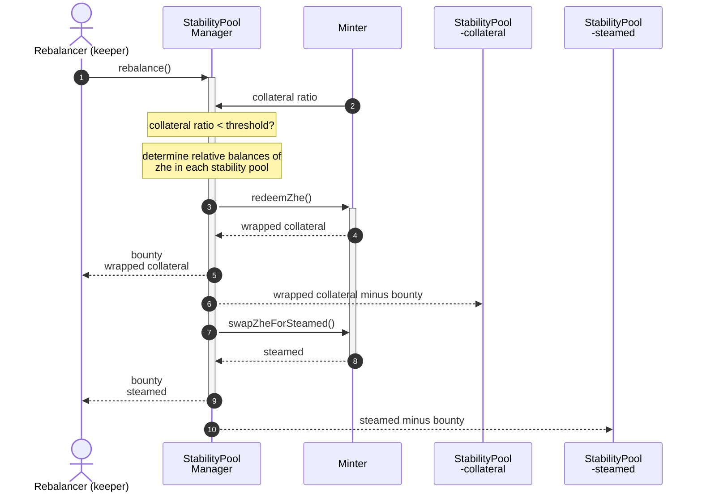

# Rebalancing

rebalancing is enabled when the collateral ratio of the system drops below a threashold set in the <code>StabilityPoolManager</code>

```mermaid
sequenceDiagram
    autonumber
    actor keeper as Rebalancer (keeper)
    participant spm as StabilityPool<br>Manager
    participant minter as Minter
    participant spc as StabilityPool<br>-collateral
    participant spl as StabilityPool<br>-steamed

    keeper->>+spm: rebalance()
    minter->>spm: collateral ratio
    note over spm: collateral ratio < threshold?
    note over spm: determine relative balances of<br>zhe in each stability pool
    spm->>+minter: redeemZhe()
    minter-->>spm: wrapped collateral
    spm-->>keeper: bounty<br>wrapped collateral
    spm-->>spc: wrapped collateral minus bounty
    spm->>minter: swapZheForSteamed()
    minter-->>-spm: steamed
    spm-->>-keeper: bounty<br>steamed
    spm-->>spl: steamed minus bounty
```
